["1.MySQL逻辑架构"](siyuan://blocks/20210325142846-8wke0o4)

> ## MySQL体系架构
>
> 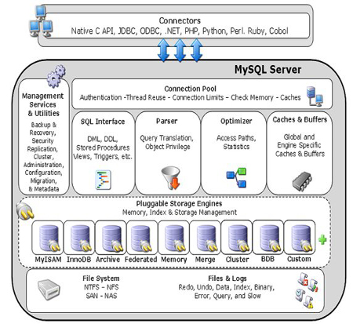
>
> 和其它数据库相比，MySQL有点与众不同，它的架构可以在多种不同场景中应用并发挥良好作用。主要体现在存储引擎的架构上，插件式的存储引擎架构将查询处理和其它的系统任务以及数据的存储提取相分离。这种架构可以根据业务的需求和实际需要选择合适的存储引擎。各层介绍：
>
> ### 连接层
>
> 客户端与各种语言进行对接的接口，支持各种协议，例如常见的 JDBC、Python等。
>
> ### 服务层
>
> MySQLServer层主要包括连接池、管理服务工具集、SQL接口、解析器、查询优化器和缓存。
>
> 1. 连接池：负责处理存储数据库与客户端创建的连接，线程池资源管理，一个线程负责管理一个连接。
> 2. 管理服务工具集：包括备份恢复、安全管理、集群管理服务和工具。
> 3. SQL接口：负责接收客户端发送的各种 SQL 语句，比如 DML、DDL 和存储过程等。
> 4. 解析器：对 SQL 语句进行语法解析生成解析树。
> 5. 查询优化器：会根据解析树生成执行计划，并选择合适的索引，然后按照执行计划执行 SQL 语言并与各个存储引擎交互。
> 6. 高速缓存与缓冲区：保存历史查询的缓存记录，比如：InnoDB存储的BufferPool。
>
> ### 引擎层
>
> 存储引擎层，存储引擎真正的负责了MySQL中数据的存储和提取，服务器通过API与存储引擎进行通信。不同的存储引擎具有的功能不同，这样我们可以根据自己的实际需要进行选取。
>
> 常见的引擎包括MyISAM、InnoDB，以及支持归档的Archive和内存的Memory等。MySQL是插件式的存储引擎，只要正确定义与MySQLServer交互的接口，任何引擎都可以访问MySQL。
>
> ### 存储层
>
> 存储层存储具体的物理文件，包括二进制日志、数据文件、错误日志、慢查询日志、全日志、redo/undo 日志等。
>
> ### 一条SQL SELECT语句的执行过程：
>
> 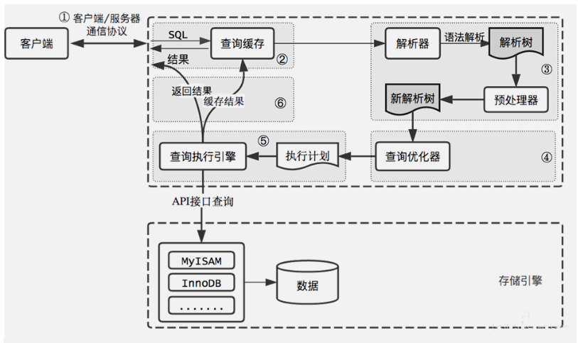
>
> ## MyISAM 和InnoDB
>
> ### InnoDB
>
> InnoDB是 MySQL 默认的事务型存储引擎，特点如下：
>
> - **四个隔离级别**，默认**可重复读**。可重复读+MVCC+ Next-Key Locking 防止幻读
> - 主索引是**聚簇索引**，底层B+树，叶结点保存全量数据。
> - 真正的**在线热备份**。其它存储引擎不支持在线热备份，要获取一致性视图需要停止对所有表的写入，而在读写混合场景中，停止写入可能也意味着停止读取。
> - 其他内部优化：从磁盘读取数据时采用的**可预测性读**、能够加快读操作并且自动创建的**自适应哈希**索引、能够加速插入操作的**插入缓冲区**等。
>
> ### MyISAM
>
> 不支持事务。
>
> 只支持表锁，不支持行锁，读取时会对需要读到的所有表加共享锁，写入时则对表加排它锁。
>
> 但在表有读取操作的同时，也可以往表中插入新的记录，这被称为并发插入（CONCURRENT INSERT）。
>
> 可以手工或者自动执行检查和修复操作，但是和事务恢复以及崩溃恢复不同，可能导致一些数据丢失，而且修复操作是非常慢的。
>
> 如果指定了 DELAY_KEY_WRITE 选项，在每次修改执行完成时，不会立即将修改的索引数据写入磁盘，而是会写到内存中的键缓冲区，只有在清理键缓冲区或者关闭表的时候才会将对应的索引块写入磁盘。这种方式可以极大的提升写入性能，但是在数据库或者主机崩溃时会造成索引损坏，需要执行修复操作。
>
> **对于只读数据，或者表比较小、可以容忍修复操作，依然可以使用它。**
>
> ### 比较
>
> |          | MyISAM                                                 | InnoDB                                   |
> | -------- | ------------------------------------------------------ | ---------------------------------------- |
> | 事务     | 不支持                                                 | 支持                                     |
> | 外键     | 不支持                                                 | 支持                                     |
> | 行表锁   | 只有表锁，即使操作一条记录也锁整张表，不适合高并发场景 | 支持行锁，操作时只锁一行，适合高并发场景 |
> | 缓存     | 只缓存索引，不缓存数据                                 | 既缓存索引，也缓存数据，占用内存较高     |
> | 热备     | 不支持                                                 | 支持在线热备份                           |
> | 适用场景 | 读取性能高，适合单机只读数据                           | 适合需要并发、事务的场景                 |
>
> show engines:查看所有的数据库引擎
>
> 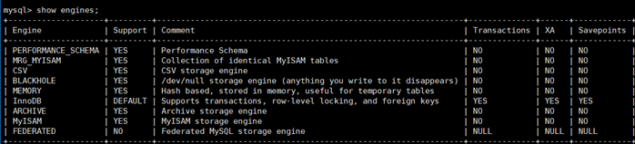
>
> show variables like '%storage_engine%' 查看默认的数据库引擎
>
> ```shell
> mysql> show variables like '%storage_engine%';
> +----------------------------+--------+
> | Variable_name              | Value  |
> +----------------------------+--------+
> | default_storage_engine     | InnoDB |
> | default_tmp_storage_engine | InnoDB |
> | storage_engine             | InnoDB |
> +----------------------------+--------+
> ```
>


["4.SQL语句"](siyuan://blocks/20210325142846-rpu6fcc)

> ## SQL语言概述
>
> SQL：Structure Query Language结构化查询语言，它是使用关系模型的数据库应用语言，由IBM上世纪70年代开发出来。后由美国国家标准局（ANSI）开始着手制定SQL标准，先后有SQL-86，SQL-89，SQL-92，SQL-99等标准。各个 DBMS 都有自己的实现，如 PL/SQL、Transact-SQL 等。
>
> ### SQL的语言规范
>
> mysql对于SQL语句不区分大小写，**SQL语句关键字尽量大写**
>
> 值，除了数值型，字符串型和日期时间类型使用单引号（’’）
>
> 别名，尽量使用双引号（“”)或反引号(``)，而且不建议省略as
>
> 所有标点符号使用英文状态下的半角输入方式
>
> 必须保证所有(),单引号，双引号是成对结束的
>
> MySQL支持三种注释：
>
> ```mysql
> # 单行注释
>
> -- 单行注释
>
> /* 多行
> 注释 */
> ```
>
> 命名规则：
>
> 数据库、表名不得超过30个字符，变量名限制为29个
>
> 必须只能包含 A–Z, a–z, 0–9, _共63个字符
>
> 必须不能和用户定义的其他对象重名
>
> 必须保证你的字段没有和保留字、数据库系统或常用方法冲突
>
> 保持字段名和类型的一致性,在命名字段并为其指定数据类型的时候一定要保证一致性。假如数据类型在一个表里是整数,那在另一个表里可就别变成字符型了
>
> ### SQL语言分类
>
> - DDL（Data Definition Languages)：数据定义语言，**schema元数据相关**。这些语句定义了不同的数据段、数据库、表、列、索引等数据库结构对象。主要的语句关键字包括create、drop、alter等。
> - DML（Data Manipulation Language）：数据操控语句，**增删改查**，并检查数据完整性。主要的语句关键字包括insert、delete、update、select等。
> - DCL（Data Control Language）：数据控制语句，**权限相关**。用于控制不同数据段直接的许可和访问级别的语句。这些语句定义了数据库、表、字段、用户的访问权限、事务和安全级别。主要的语句关键字包括grant、revoke等。
>
> ## DDL
>
> ### 操作数据库
>
> | 显示数据库     | show databases; -->显示所有数据库           |
> | -------------- | ------------------------------------------- |
> | 创建数据库     | create  database db [default charset=utf8]; |
> | 删除数据库     | drop  database db;                          |
> | 使用数据库     | use db;                                     |
> | 查看当前数据库 | select  database();                         |
>
> ### 操作表
>
> 显示表：
>
> ```mysql
> show tables; -->显示库中所有表
> show tables from database1; -->查看库database1中的表，可用于在一个库中查看其他库的表
> desc 表名; --> 查看表格属性
> show create table 表名; -->显示建表语句
> ```
>
> 创建表：
>
> ```mysql
> create table t1(
> 	id int, 
> 	name char(10)
> 	) [engine=InnoDB default charset=utf8]; -- 创建一个含有id和name两列的空表
> # 建表时可以添加约束，如：
> id int null/not null; 表示此列可/不可为空；
> id int null default 1;表示默认值为1
> id int null auto_increment [primary key];表示该列每行自增；
> # 早期版本的MySQL插入中文内容要设置编码为utf8，MySQL 8.0已经默认是utf8编码了。
> # engine主要有InnoDB和MyISAM。
> ```
>
> 修改表：
>
> ```mysql
> # 修改表名：
> alter table 表名 rename 新表名; 或rename table 表名 to 新表名;
>
> # 添加列：
> alter table 表名 add [column] 列名 类型 [default 默认值][not null]; # 默认添加在最后
> alter table 表名 add [column] 列名 类型 [default 默认值][not null] after 某列;
> alter table 表名 add [column] 列名 类型 [default 默认值][not null] first;
>
> # 删除列：
> alter table 表名 drop [column] 列名；
>
> # 修改列：
> # 修改数据类型
> alter table 表名 alter column 列名 类型；
> # 修改数据类型、默认值、是否非空
> alter table 表名 modify [column] 列名 类型 [default 默认值][not null];
> alter table 表名 modify [column] 列名 类型 [default 默认值][not null] after 某列;
> alter table 表名 modify [column] 列名 类型 [default 默认值][not null] first;
> # 修改列名，同时也可修改数据类型、默认值、是否非空
> alter table 表名 change [column] 原列名 新列名 类型[default 默认值][not null];
>
> # 添加主键：
> alter table 表名 add primary key(列名)；
> # 删除主键：
> alter table 表名 drop primary key;
> # 添加外键：
> alter table 从表 add [constraint 外键名称(形如：FK_从表_主表)] foreign key 从表(外键字段) references 主表(主键字段);
> # 删除外键：
> alter table 表名 drop foreign key 外键名称;
>
> #修改默认值：
> ALTER TABLE testalter_tbl ALTER i SET DEFAULT 1000;
> #删除默认值：
> ALTER TABLE testalter_tbl ALTER i DROP DEFAULT;
>
> # 修改当前自增值： 
> alter table 表名 auto_increment= 10；
> # 设置自增初始值：
> set session auto_increment_offset=1; #会话级别
> set global auto_increment_offset=1; #全局级别
> # 设置自增步长：
> set session auto_increment_increment=2； #会话级别
> set global auto_increment_increment=2; #全局级别，所有列表的自增步长默认都为2
> ```
>
> 删除表：
>
> ```mysql
> drop table 表名; # 数据和结构都被删除，所有正在运行的相关事务被提交，所有相关索引被删除，操作不能回滚
> ```
>
> ## DML
>
> ### 增：
>
> - 插入的值可以是常量、表达式、函数
> - 若插入的表存在外键，应保证插入外键列的值已经存在于主表中
>
> ```mysql
> # 向t1表中插入完整记录，字段要一一对应，每个字段都要显式给出
> insert into t1 values(1,'Jany',21); 
> ```
>
>> - InnoDB中的自增列：可以指定其他值，若指定为null或0，则视为自增长
>> - 默认值列：可以指定其他值，要用默认值填入default
>> - 可空列：可以指定其他非空值，也可填入null。
>>
>
> ```mysql
> # 向t1表中指定字段插入内容
> insert into t1(id, name)  values(1, 'kevin');
> insert into t1(id, name) values(v1,v1),(v2,v2),(v3,v3)…;# 一次插入多条数据
> ```
>
>> 指定字段必须显式赋值，未出现在指定字段中，则自增列自增长、默认值列取默认值、允许为空的值填NULL，其他值非空列取该数据类型的默认值：字符串取空串，int取0。
>>
>
> ### 删：
>
> ```mysql
> #清空表
> delete from 表名;
> truncate [table] 表名；
>
> # 删除满足条件的记录
> delete from 表名 where 条件;
> ```
>
>> delete from 和truncate的区别：
>>
>> - delete from可以和where语句配合，实现选择性删除；
>> - delete from 语句会返回受影响的行数，truncate不会；
>> - delete from不会删除索引，truncate将表完全更新，不保留索引和水平线；
>> - delete是一行一行的删除数据，truncate直接粉碎数据，truncate更快。
>> - 在事务方面，truncate是不可以rollback的，delete可以rollback；
>> - 在触发器方面：truncate 不能触发任何Delete触发器。
>>
>
> ### 改
>
> ```mysql
> update 表名 set 列1 = 值1, 列2 = 值2, ... [where 条件]; 
> ```
>
>> 1. 没有where条件时，会作用到指定列的所有数据
>> 2. 值可以是常量、表达式、函数
>> 3. 可以同时更新多张表
>> 4. 修改从表的外键列的值，要保证新值已存在于主表的参考字段中
>> 5. 修改主表的被参考列的值，注意旧值没有被从表依赖，若被依赖：
>>
>>    - 外键定义为on update restrict或on update no action：除非修改从表，否则无法修改主表该参考列值
>>    - 外键定义为on update cascade或on update set null：可以直接修改主表，并连带修改从表的值
>>
>
> ### 查
>
> ```mysql
> # 从表中查找满足条件的所有记录中指定列的内容，缺省where对所有记录生效
> select 列名 from 表名[where 条件];
> select * from 表名 [where 条件]；
> select id,name,gender as ctt from t1 where id > 1; # 选择多列并取别名。
>
> # 从database1的t1表中查找column列的内容，可用于在一个数据库中查看其他数据库中的表
> select column from database1.t1;
>
> # 完整语句：
> select [distinct] 列名1，列名2，… 
> from 表名或视图名
> [where 条件]
> [group by 字段名 [having 条件]]
> [order by 字段名 [asc|desc]]
> [limit m,n];
> ```
>
>> select后的查询列表，可以是表中的字段、常量、表达式、函数
>>
>> 查询结果是一个虚表
>>
>
> ### select后的5个子句：
>
> where：用于从表中筛选满足条件的行，**where后不能有分组函数**
>
> group by：用于将记录分组，常常与分组函数一起使用
>
> having：只能跟在group by后，用于筛选，**having后可以跟分组函数**
>
> order by：根据规则排序
>
> ```mysql
> order by 列1 [desc|asc], 列2 [desc|asc]; #先根据列1的值排序，若值相同再根据列2排序
> ```
>
>> 默认是升序排序
>>
>> 表达式、函数、别名等也可以用于排序，如：order by AVG(salary);
>>
>
> limit ：限制显示记录的行数，可用于分页.
>
> ```mysql
> # 每页显示m条，显示第n页的数据：
> select * from 表 limit (n - 1)*m, m;
>
> select * from 表 limit 5;            # 前5行
> select * from 表 limit 4,5;          # 从第4行开始的5行
> select * from 表 limit 5 offset 4;   # 从第4行开始的5行
> ```
>
> 注：
>
> 1. where、group by、having、order by、limit的顺序不能乱。
> 2. where和having的区别：
>
>    - where后面不能跟分组函数，having后可以跟分组函数
>    - where用于对原表中记录的筛选，having用于group by产生的分组结果的筛选。
>
> ### SQL的执行顺序
>
> 书写sql语句的顺序：
>
> 
>
> sql语句的执行顺序：
>
> 
>
> ### 分组函数
>
> ```mysql
> sum([distinct] expression)  : 该列所有值求和
> count([distinct] expression)：count(列)返回该列非空值的个数，count(*)/count(1)返回非空行的行数
> avg([distinct] expression)
> max([distinct] expression)
> min([distinct] expression)
> ```
>
>> expression可以是字段、常量、表达式、函数等
>>
>
> count(*)和count(1)的区别：
>
> - myisam表,没有区别的，这种引擎内部有一计数器在维护着行数.
> - InnoDB表，用count(*)直接读行数效率很低，因为innodb真的要去数一遍.
>
> ## DCL
>
> 见((20210325142846-uaryh04))
>
> ## 其他
>
> ### AS
>
> as用于给字段、表名、表达式等取别名，as可以省略，如：
>
> ```mysql
> select dept_id as d, dept_name as n ...
> select * from t1 as A, t1 as B where A.id = B.pid;
> ```
>
> 注：
>
> - 如果给字段取别名，如果别名中包含特殊字符，例如空格，建议给别名加上双引号或单引号。
> - 如果给表名取别名，不能加双引号或单引号，也不能用空格等特殊符号。
>
> ### DISTINCT
>
> distinct 用于去重
>
> ```mysql
> select distinct dept_id from employees;
> ```
>
> ### 着重号：``
>
> 当字段名或表名与关键字一样时，可以加着重号以示区分。
>
> ```mysql
> select `name` from employees;
> ```
>
> ### 输出到文件
>
> `select ... INTO OUTFILE '路径';`
>
> 若报错：`The MySQL server is running with the --secure-file-pri option so it cannot execute this.`
>
> 报错原因：mysql文件的导入和导出路径有默认的设置，即 secure-file-priv,当传入的csv文件路径与默认的路径冲突时就会报错。
>
> secure-file-priv的值有三种情况：
>
> secure_file_prive=null ––限制mysqld 不允许导入导出
>
> secure_file_priv=/path/ – --限制mysqld的导入导出只能发生在默认的/path/目录下
>
> secure_file_priv=’’ – --不对mysqld 的导入 导出做限制
>
> step1:查看你的secure-file-priv设置：show variables like ‘%secure%’;
>
> 输出默认值path
>
> step2:找到名为my的配置设置文件：
>
> 我这里的my文件在step3里查找的路径下：C:\ProgramData\MySQL\MySQL Server 8.0\my
>
> step3: 打开my文件，ctrl+f找到关键字secure,修改原路径：
>
> 把原路径用#注释掉，改为自定义路径，注意路径用的是斜杠，不是反斜杠
>
> 我将路径设置成空，意味着不对mysqld 的导入 导出做限制
>
> step4. 设置完了保存，关闭。
>
> step5. 重启mysql
>
> 重启方式：打开计算机管理>>服务与应用程序>>服务>>mysql>>右键重新启动>>完成重启
>
> step6:检验secure_file_priv是否设置成功
>
> ```sql
> show variables like ‘%secure%’;
> ```
>
> 是空的，和刚才设置的一样，表明设置成功！
>


["7.join关联查询"](siyuan://blocks/20210325142846-yy88k2s)

> 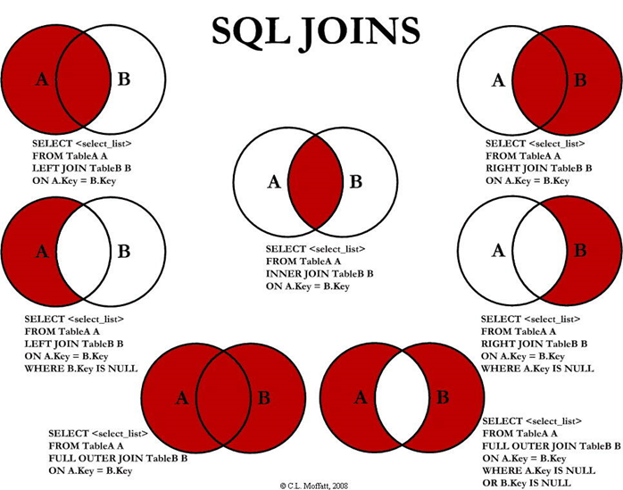
>
> 关联查询有以下几种情况：
>
> - 内连接：inner join(cross join)
> - 外连接：左外连接(left [outer] join)、右外连接(right [outer] join)、全外连接(full [outer] join)
> - 自连接：同一张表通过取别名，虚拟成两张表
>
>> 注：
>>
>> 1.连接N张表，至少需要N-1个连接条件
>>
>> 2.若两个关联表存在相同名字的列，在使用时需要加表名前缀来区分
>>
>
> ### 关联条件的形式
>
> - where：适用于所有关联查询
> - on：与 join连用，on后只能写关联条件，其他约束条件放在where中
> - using(列名)：与join连用，要求该列名在两个表中名称一样，且仅用于表示在两表中该关联字段值相等
>
>   ```mysql
>   #把关联条件写在where后面
>   SELECT ename,dname FROM t_employee,t_department 
>   WHERE t_employee.dept_id=t_department.did;
>
>   #把关联条件写在on后面，只能和JOIN一起使用
>   SELECT ename,dname FROM t_employee INNER JOIN t_department 
>   ON t_employee.dept_id=t_department.did;
>
>   #把关联字段写在using()中，只能和JOIN一起使用
>   #两个表中的关联字段必须名称相同，而且只能表示=
>   SELECT ename,basic_salary FROM t_employee INNER JOIN t_salary USING(eid);
>   ```
>
> ### 笛卡尔积
>
> 定义：将两（或多）个表的所有行进行组合，连接后的行数为两（或多）个表的乘积数.
>
> ```mysql
> #查询员工姓名和所在部门名称
> SELECT ename,dname FROM t_employee,t_department;
> SELECT ename,dname FROM t_employee JOIN t_department;
> ```
>
> 内连接若缺少关联条件，查询结果也为笛卡尔积：
>
> ```mysql
> SELECT ename,dname FROM t_employee INNER JOIN t_department;
> SELECT ename,dname FROM t_employee CROSS JOIN t_department;
> ```
>
> ## 关联查询的具体情况
>
> 以如下两表为例：
>
> 
>
> ### 内连接 A∩B
>
> 返回连接表中符合连接条件和查询条件的数据行
>
>> 如果不写关联条件，会导致笛卡尔积
>>
>
> 形式一：
>
> ```mysql
> select 列名1, 列名2, ...
> from A表 inner join B表
> on 关联条件 where [其他筛选条件]
> ```
>
> 形式二：
>
> ```mysql
> select 列名1, 列名2, ...
> from A表, B表
> where 关联条件
> ```
>
> 示例：
>
> ```mysql
> # 查询员工姓名、编号和所在部门名称，部门编号
> select emp_name,emp_id,dep_name,department.dep_id from department,employees 
> where department.dep_id = employees.dep_id;
> +----------+--------+----------+--------+
> | emp_name | emp_id | dep_name | dep_id |
> +----------+--------+----------+--------+
> | 张三     |   1001 | 教学部   |      1 |
> | 李四     |   1002 | 教学部   |      1 |
> | 王五     |   1003 | 咨询部   |      2 |
> +----------+--------+----------+--------+
> ```
>
> ### 左外连接
>
> 对于连接条件的属性列，返回左表中的所有行，如果左表中的行在右边没有出现，右表对应列补NULL。
>
> ```mysql
> select 列名1, 列名2, ...
> from A表 left join B表
> on 关联条件
> ```
>
> 示例：
>
> ```mysql
> #查询所有部门信息以及该部门员工信息
> select department.dep_id,dep_name,emp_id,emp_name
> from department left join employees
> using(dep_id);
> +--------+----------+--------+----------+
> | dep_id | dep_name | emp_id | emp_name |
> +--------+----------+--------+----------+
> |      1 | 教学部   |   1001 | 张三     |
> |      1 | 教学部   |   1002 | 李四     |
> |      2 | 咨询部   |   1003 | 王五     |
> |      3 | 就业部   |   NULL | NULL     |
> +--------+----------+--------+----------+
> ```
>
> #### A - A∩B
>
> 对于连接条件的属性列，返回只存在于左表中的记录，右表相应位置补NULL
>
> ```mysql
> select 列名1, 列名2, ...
> from A表 left join B表
> on 关联条件
> where A表关联字段在B表没有对应
> ```
>
> 示例：
>
> ```mysql
> # 查询没有员工的部门的信息
> select department.dep_id,dep_name,emp_id,emp_name
> from department left join employees
> on department.dep_id = employees.dep_id
> where employees.dep_id is null;
> +--------+----------+--------+----------+
> | dep_id | dep_name | emp_id | emp_name |
> +--------+----------+--------+----------+
> |      3 | 就业部   |   NULL | NULL     |
> +--------+----------+--------+----------+
> ```
>
> ### 右外连接
>
> ### 全连接 FULL JOIN
>
> MySQL不支持FULL JOIN，而是使用LEFT JOIN **UNION** RIGHT JOIN
>
> ### A∪B
>
> ```mysql
> select 列名1，列名2，...
> from A表 left join B表
> on 关联条件
> union
> select 列名1，列名2，...
> from A表 right join B表
> on 关联条件
> ```
>
> 示例：
>
> ```mysql
> # 查询所有部门信息和所有员工信息
> select department.dep_id,dep_name,emp_id,emp_name
> from department left join employees
> on department.dep_id = employees.dep_id
> union
> select department.dep_id,dep_name,emp_id,emp_name
> from department right join employees
> on department.dep_id =  employees.dep_id;
> +--------+----------+--------+----------+
> | dep_id | dep_name | emp_id | emp_name |
> +--------+----------+--------+----------+
> |      1 | 教学部   |   1001 | 张三     |
> |      1 | 教学部   |   1002 | 李四     |
> |      2 | 咨询部   |   1003 | 王五     |
> |      3 | 就业部   |   NULL | NULL     |
> |   NULL | NULL     |   1004 | 赵六     |
> +--------+----------+--------+----------+
> ```
>
> ### A∪B -  A∩B
>
> ```mysql
> select 列名1，列名2，...
> from A表 left join B表
> on 从表关联字段在主表没有对应
> union
> select 列名1，列名2，...
> from A表 right join B表
> on 从表关联字段在主表没有对应
> ```
>
> 示例：
>
> ```mysql
> # 查询所有没有员工的部门和没有分配部门的员工
> select department.dep_id,dep_name,emp_id,emp_name
> from department left join employees
> on department.dep_id = employees.dep_id
> where employees.dep_id is null
> union
> select department.dep_id,dep_name,emp_id,emp_name
> from department right join employees
> on department.dep_id =  employees.dep_id
> where employees.dep_id is null;
> +--------+----------+--------+----------+
> | dep_id | dep_name | emp_id | emp_name |
> +--------+----------+--------+----------+
> |      3 | 就业部   |   NULL | NULL     |
> |   NULL | NULL     |   1004 | 赵六     |
> +--------+----------+--------+----------+
> # null项一定以从表为准
> ```
>


["9.函数"](siyuan://blocks/20210325142846-d0h2sqd)

> MySQL数据库提供了很多函数包括：
>
> - 数学函数；
> - 字符串函数；
> - 日期和时间函数；
> - 条件判断函数；
> - 流程控制函数；
> - 系统信息函数；
> - 加密函数；
> - 格式化函数；
>
> ## 1、数学函数
>
> |               |                                      |
> | ------------- | ------------------------------------ |
> | ABS（x）      | 返回x的绝对值                        |
> | CEIL（x）     | 向上取整                             |
> | FLOOR（x）    | 向下取整                             |
> | MOD(x,y)      | 返回x/y的模                          |
> | RAND(x)       | 返回0~1的随机值                      |
> | ROUND(x,y)    | 返回参数x的四舍五入的有y位的小数的值 |
> | TRUNCATE(x,y) | 返回数字x截断为y位小数的结果         |
> | SQRT(x)       | 返回x的平方根                        |
> | POW(x,y)      | 返回x的y次方                         |
>
> ## 2、字符串函数
>
> |                                 |                                                                  |
> | ------------------------------- | ---------------------------------------------------------------- |
> | CONCAT(S1,S2,......,Sn)         | 连接S1,S2,......,Sn为一个字符串                                  |
> | CONCAT_WS(s, S1,S2,......,Sn)   | 同CONCAT(s1,s2,...)函数，但是每个字符串之间要加上s               |
> | CHAR_LENGTH(s)                  | 返回字符串s的字符数                                              |
> | LENGTH(s)                       | 返回字符串s的字节数，和字符集有关                                |
> | INSERT(str, index , len, instr) | 将字符串str从第index位置开始，len个字符长的子串替换为字符串instr |
> | UPPER(s) 或 UCASE(s)            | 将字符串s的所有字母转成大写字母                                  |
> | LOWER(s)   或LCASE(s)           | 将字符串s的所有字母转成小写字母                                  |
> | LEFT(s,n)                       | 返回字符串s最左边的n个字符                                       |
> | RIGHT(s,n)                      | 返回字符串s最右边的n个字符                                       |
> | LPAD(str, len, pad)             | 用字符串pad对str最左边进行填充，直到str的长度为len个字符         |
> | RPAD(str ,len, pad)             | 用字符串pad对str最右边进行填充，直到str的长度为len个字符         |
> | LTRIM(s)                        | 去掉字符串s左侧的空格                                            |
> | RTRIM(s)                        | 去掉字符串s右侧的空格                                            |
> | TRIM(s)                         | 去掉字符串s开始与结尾的空格                                      |
> | TRIM(【BOTH 】s1 FROM s)        | 去掉字符串s开始与结尾的s1                                        |
> | TRIM(【LEADING】s1 FROM s)      | 去掉字符串s开始处的s1                                            |
> | TRIM(【TRAILING】s1 FROM s)     | 去掉字符串s结尾处的s1                                            |
> | REPEAT(str, n)                  | 返回str重复n次的结果                                             |
> | REPLACE（str, a, b）            | 用字符串b替换字符串str中所有出现的字符串a                        |
> | STRCMP(s1,s2)                   | 比较字符串s1,s2                                                  |
> | SUBSTRING(s,index,len)          | 返回从字符串s的index位置其len个字符                              |
>
> ## 3、日期时间函数
>
> |                                                                            |                                                          |
> | -------------------------------------------------------------------------- | -------------------------------------------------------- |
> | CURDATE() 或 CURRENT_DATE()                                                | 返回当前日期                                             |
> | CURTIME() 或 CURRENT_TIME()                                                | 返回当前时间                                             |
> | NOW()     SYSDATE()  CURRENT_TIMESTAMP()  LOCALTIME()  LOCALTIMESTAMP()    | 返回当前系统日期时间                                     |
> | YEAR(date)  MONTH(date)  DAY(date)  HOUR(time)  MINUTE(time)  SECOND(time) | 返回具体的时间值                                         |
> | WEEK(date)  WEEKOFYEAR(date)                                               | 返回一年中的第几周                                       |
> | DAYOFWEEK()                                                                | 返回周几，注意：周日是1，周一是2，。。。周六是7          |
> | WEEKDAY(date)                                                              | 返回周几，注意，周1是0，周2是1，。。。周日是6            |
> | DAYNAME(date)                                                              | 返回星期：MONDAY,TUESDAY.....SUNDAY                      |
> | MONTHNAME(date)                                                            | 返回月份：January，。。。。。                            |
> | DATEDIFF(date1,date2)  TIMEDIFF(time1, time2)                              | 返回date1 - date2的日期间隔  返回time1 - time2的时间间隔 |
> | DATE_ADD(datetime, INTERVAL expr   type)                                   | 返回与给定日期时间相差INTERVAL时间段的日期时间           |
> | DATE_FORMAT(datetime ,fmt)                                                 | 按照字符串fmt格式化日期datetime值                        |
> | STR_TO_DATE(str, fmt)                                                      | 按照字符串fmt对str进行解析，解析为一个日期               |
>
> （1）DATE_ADD(datetime,INTERVAL expr type)
>
> SELECT DATE_ADD(NOW(), INTERVAL 1 YEAR);  SELECT DATE_ADD(NOW(), INTERVAL -1 YEAR);  可以是负数  SELECT DATE_ADD(NOW(), INTERVAL '1_1' YEAR_MONTH);   需要单引号
>
> | 表达式类型 | YEAR_MONTH    |
> | ---------- | ------------- |
> | YEAR       | DAY_HOUR      |
> | MONTH      | DAY_MINUTE    |
> | DAY        | DAY_SECOND    |
> | HOUR       | HOUR_MINUTE   |
> | MINUTE     | HOUR_SECOND   |
> | SECOND     | MINUTE_SECOND |
>
> （2）DATE_FORMAT(datetime ,fmt)和STR_TO_DATE(str, fmt)
>
> | 格式符 | 说明                                                        | 格式符 | 说明                                                        |
> | ------ | ----------------------------------------------------------- | ------ | ----------------------------------------------------------- |
> | %Y     | 4位数字表示年份                                             | %y     | 表示两位数字表示年份                                        |
> | %M     | 月名表示月份（January,....）                                | %m     | 两位数字表示月份（01,02,03。。。）                          |
> | %b     | 缩写的月名（Jan.，Feb.，....）                              | %c     | 数字表示月份（1,2,3,...）                                   |
> | %D     | 英文后缀表示月中的天数（1st,2nd,3rd,...）                   | %d     | 两位数字表示月中的天数(01,02...)                            |
> | %e     | 数字形式表示月中的天数（1,2,3,4,5.....）                    |        |                                                             |
> | %H     | 两位数字表示小数，24小时制（01,02..）                       | %h和%I | 两位数字表示小时，12小时制（01,02..）                       |
> | %k     | 数字形式的小时，24小时制(1,2,3)                             | %l     | 数字形式表示小时，12小时制（1,2,3,4....）                   |
> | %i     | 两位数字表示分钟（00,01,02）                                | %S和%s | 两位数字表示秒(00,01,02...)                                 |
> | %W     | 一周中的星期名称（Sunday...）                               | %a     | 一周中的星期缩写（Sun.，Mon.,Tues.，..）                    |
> | %w     | 以数字表示周中的天数(0=Sunday,1=Monday....)                 |        |                                                             |
> | %j     | 以3位数字表示年中的天数(001,002...)                         | %U     | 以数字表示年中的第几周，（1,2,3。。）其中Sunday为周中第一天 |
> | %u     | 以数字表示年中的第几周，（1,2,3。。）其中Monday为周中第一天 |        |                                                             |
> | %T     | 24小时制                                                    | %r     | 12小时制                                                    |
> | %p     | AM或PM                                                      | %%     | 表示%                                                       |
>
> ## 4、流程函数
>
> | IF(value,t ,f)                                                                     | 如果value是真，返回t，否则返回f                                                                                                                                   |
> | ---------------------------------------------------------------------------------- | ----------------------------------------------------------------------------------------------------------------------------------------------------------------- |
> | IFNULL(value1, value2)                                                             | 如果value1不为空，返回value1，否则返回value2                                                                                                                      |
> | CASE   WHEN 条件1 THEN result1  WHEN 条件2 THEN result2  ....  [ELSE resultn]  END | 相当于Java的if...else if...                                                                                                                                       |
> | CASE   expr   WHEN 常量值1 THEN 值1  WHEN 常量值1 THEN 值1  ....  [ELSE 值n]  END  | 相当于Java的switch                                                                                                                                                |
> |                                                                                    | SELECT ename ,CASE   WHEN salary>=15000 THEN '高薪'  WHEN salary>=10000 THEN '潜力股'  WHEN salary>=8000 THEN '屌丝'  ELSE '草根'  END  FROM t_employee;          |
> |                                                                                    | SELECT oid,`status`, CASE `status`  WHEN 1 THEN '未付款'  WHEN 2 THEN '已付款'  WHEN 3 THEN '已发货'  WHEN 4 THEN '确认收货'  ELSE '无效订单'  END  FROM t_order; |
>
> ## 5、其他函数
>
> | 函数          | 描述                                    |
> | ------------- | --------------------------------------- |
> | database()    | 返回当前数据库名                        |
> | version()     | 返回当前数据库版本                      |
> | user()        | 返回当前登录用户名                      |
> | password(str) | 返回字符串str的加密版本，41位长的字符串 |
> | md5(str)      | 返回字符串str的md5值，也是一种加密方式  |
>
> ## 6、自定义函数
>


["10.索引"](siyuan://blocks/20210325142846-ua3bq6y)

> ## B树和B+树
>
> ### 1. 数据结构
>
> B Tree 指的是 Balance Tree，又称**多路平衡查找树**，并且所有叶子结点位于同一层。B树的高度代表了磁盘读取的次数。
>
> B+ 树是应数据库所需而出现的一种B树的变种树，在 B+树中，一个结点包含n个关键字和n个指针，关键字从左到右升序排列，如果某个指针的左右相邻关键字分别是 key<sub>i</sub> 和 key<sub>i+1</sub>，且不为 null，则该指针指向结点的所有 key 大于等于 key<sub>i</sub> 且小于 key<sub>i+1</sub>。
>
> B树：
>
> 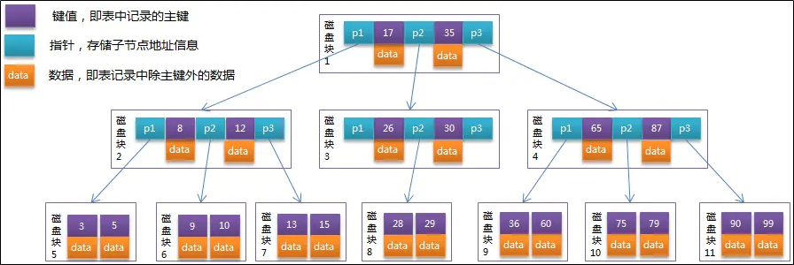
>
> B+树：
>
> 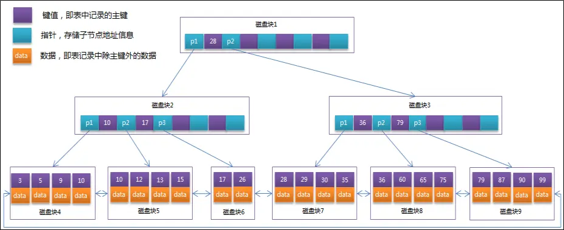
>
> ### 2. B+树与B树的区别
>
> - B树的结点存储了关键字、指针和数据记录；**B+树的非叶子节点中只有关键字和指针，全部数据记录保存在叶结点。**
> - B树中，越靠近根节点的记录查找速度越快；而B+树中每次查找，无论成功与否，**都是一条从根结点到叶结点的路径**。看起来B树的查找性能更好，但由于**B+树的非叶结点不存放实际数据，这样每个结点可容纳的关键字个数比B树多得多，同样量级的数据，B+树的高度比B树低，节省了磁盘读取的时间。**
> - B+树中，前一个叶结点含有**指向下一个叶结点的指针**，**方便区间查询**。
>
> 其他：
>
> - B树的每个关键字只出现一次，B+树采用**冗余索引**，关键字在查询的路径上多次出现，用于划分区间，**叶结点中包含了全部关键字**。
> - **B+树有两个头指针**：一个指向根结点，用于多路查找；一个指向关键字最小的叶结点，用于顺序查找。
>
> ### 3. 操作
>
> 进行查找操作时，首先在根节点进行二分查找，找到一个 key 所在的指针，然后递归地在指针所指向的节点进行查找。直到查找到叶子节点，然后在叶子节点上进行二分查找，找出 key 所对应的data。
>
> **插入删除操作会破坏平衡树的平衡性**，因此在插入删除操作之后，需要对树进行一个分裂、合并、旋转等操作来维护平衡性。
>
> ### 4. 与红黑树的比较
>
> 红黑树等平衡树也可以用来实现索引，但是文件系统及数据库系统普遍采用 B+ Tree 作为索引结构，主要原因：
>
> 平衡树查找操作的时间复杂度和树高 h 相关，O(h)=O(log<sub>d</sub>N)，其中 d 为每个节点的出度。
>
> 红黑树的出度为 2，而 B+ Tree 的出度一般都非常大，所以红黑树的树高 h 很明显比 B+ Tree 大非常多，查找的次数也就更多。
>
> ## 索引的概念
>
> 索引是数据库中用于**加速查找**的一种数据结构。相当于字典的目录。根据索引获取数据的存放地址，再到该地址获取数据即可。
>
> 索引的优缺点：
>
> - 索引加快了查询速度，降低了数据库的IO成本。
> - 但**降低了增删改的速度**，因为更新表时，不仅要更新数据文件，还要对相应的索引文件进行更新。对索引文件的保存需要占用额外存储空间。
>
> 索引是在引擎层实现的，而不是在服务器层实现的，所以不同引擎具有不同的索引类型和实现。
>
> ### 1. B+Tree 索引
>
> 是大多数 MySQL 存储引擎的默认索引类型。
>
> 因为**不再需要进行全表扫描，只需要对树进行搜索即可，所以查找速度快很多**。
>
> 因为 B+ Tree 的有序性，所以除了用于查找，还可以用于排序和分组。
>
> 可以指定多个列作为索引列，多个索引列共同组成键。
>
> 适用于全键值、键值范围和键前缀查找，其中键前缀查找只适用于最左前缀查找。如果不是按照索引列的顺序进行查找，则无法使用索引。
>
> InnoDB 的 B+Tree 索引分为主索引和辅助索引。主索引的叶子节点 data 域记录着完整的数据记录，这种索引方式被称为**聚簇索引**。因为无法把数据行存放在两个不同的地方，所以一个表只能有一个聚簇索引。
>
> 辅助索引的叶子节点的 data域记录着**主键的值**，因此在使用辅助索引进行查找时，需要先查找到主键值，然后再到主索引中进行查找。
>
> ### 2. 哈希索引
>
> 哈希索引能以 O(1) 时间进行查找，但是失去了有序性：
>
> - 无法用于排序与分组；
> - 只支持精确查找，无法用于部分查找和范围查找。
>
> InnoDB 存储引擎有一个特殊的功能叫“自适应哈希索引”，当某个索引值被使用的非常频繁时，会在 B+Tree 索引之上再创建一个哈希索引，这样就让 B+Tree 索引具有哈希索引的一些优点，比如快速的哈希查找。
>
> ### 3. 全文索引
>
> MyISAM 存储引擎支持全文索引，用于查找文本中的关键词，而不是直接比较是否相等。
>
> 查找条件使用 MATCH AGAINST，而不是普通的 WHERE。
>
> 全文索引使用倒排索引实现，它记录着关键词到其所在文档的映射。
>
> InnoDB 存储引擎在 MySQL 5.6.4 版本中也开始支持全文索引。
>
> ### 4. 空间数据索引
>
> MyISAM 存储引擎支持空间数据索引（R-Tree），可以用于地理数据存储。空间数据索引会从所有维度来索引数据，可以有效地使用任意维度来进行组合查询。
>
> 必须使用 GIS 相关的函数来维护数据。
>
> ## 索引的创建
>
> | 创建索引 | create [unique] index [index_name] on  table_name(column);                                                  |
> | -------- | ----------------------------------------------------------------------------------------------------------- |
> | 删除索引 | 删除非主键索引：drop  index index_name on table_name;  删除主键索引：ALTER TABLE customer drop PRIMARY KEY; |
> | 查看索引 | show index  from table_name;                                                                                |
> | 全文索引 | ALTER TABLE tbl_name ADD FULLTEXT index_name (column_list);                                                 |
>
> ## 索引的分类
>
> 主键索引：索引列值唯一且非空，设定主键后数据库会自动建立主键索引，innodb为聚簇索引
>
> ```sql
> --随表一起建立
> CREATE TABLE customer (id INT(10) UNSIGNED  AUTO_INCREMENT ,customer_no VARCHAR(200),customer_name VARCHAR(200),
>   PRIMARY KEY(id)
> );
> --单独建立主键索引
> ALTER TABLE customer add PRIMARY KEY customer(customer_no);
> --删除主键索引
> ALTER TABLE customer drop PRIMARY KEY ;
> --修改主键索引：必须先删除掉(drop)原索引，再新建(add)索引
> ```
>
> 唯一索引：索引列的值必须唯一，但允许有空值
>
> ```sql
> --随表一起创建
> CREATE TABLE customer(id INT(10) AUTO_INCREMENT, customer_no VARCHAR(20), customer_name VARCHAR(20),
> PRIMARY KEY(id),
> UNIQUE (customer_no)
> );
> --单独给表建立唯一索引
> CREATE UNIQUE [INDEX] idx_customer_no ON customer(customer_no);
> ```
>
> 单值索引：一个索引只包含单列，索引列值可重复，一个表可以有多个单值索引。
>
> ```sql
> --随表一起创建
> CREATE TABLE customer(id INT(10) AUTO_INCREMENT, customer_no VARCHAR(20), customer_name VARCHAR(20),
> PRIMARY KEY(id),
> INDEX|KEY (customer_name)
> );
> --单独给表建立单值索引
> CREATE  INDEX idx_customer_name ON customer(customer_name);
> ```
>
> 复合索引：一个索引包含多个列
>
> ```sql
> --随表一起建立
> CREATE TABLE customer (id INT(10) UNSIGNED  AUTO_INCREMENT ,customer_no VARCHAR(200),customer_name VARCHAR(200),
>   PRIMARY KEY(id),
>   KEY (customer_no,customer_name)
> );
> --单独建立复合索引
> CREATE INDEX idx_no_name ON customer(customer_no,customer_name);
> ```
>
>> 复合索引遵循**最左前缀匹配**：如创建t1(name, gender, email) 的索引，相当于创建了t1(name), t1(name, gender), t1(name, gender, email)三个索引，只查(name),或(name，gender)也会使用此索引加速查找，但只查(gender)，(email)或者(gender,email)都不会使用此索引。
>>
>
> ## 索引的创建时机
>
> **适合创建索引的情况**
>
> - **频繁**作为查询条件的字段应该创建索引
> - 查询中与其它表关联的字段，**外键**关系建立索引
> - 查询中排序的字段，排序字段若通过索引去访问将大大提高排序速度
> - 查询中**分组**或者**聚合**字段
>
> **不适合创建索引的情况**
>
> - 表记录太少
> - 该字段只有离散的几个值，如：性别，季节
> - 经常增删改的表或者字段
> - Where条件里用不到的字段不创建索引
> - 过滤性不好的不适合建索引
>
> ## 聚簇索引和非聚簇索引
>
> 聚簇索引并不是一种单独的索引类型，而是一种数据存储方式。术语”聚簇“表示数据行和相邻的键值聚簇的存储在一起。如下图，左侧的索引就是聚簇索引，因为数据行在磁盘的排列和索引排序保持一致。
>
> 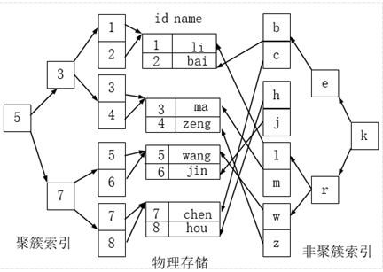
>
> 聚簇索引的好处：
>
> 按照聚簇索引排列顺序，查询显示一定范围数据的时候，由于数据都是紧密相连，数据库不用从多个数据块中提取数据，所以节省了大量的io操作。
>
> 聚簇索引的限制：
>
> 对于mysql数据库目前只有InnoDB数据引擎支持聚簇索引，而MyISAM并不支持聚簇索引。
>
> 由于数据物理存储排序方式只能有一种，所以每个Mysql的表只能有一个聚簇索引。一般情况下就是该表的主键索引。
>
> 为了充分利用聚簇索引的聚簇的特性，所以InnoDB表的主键列尽量选用有序的id，而不建议用无序的id，比如uuid这种。
>
> ## 索引失效
>
> ①最左前缀匹配
>
> 使用复合索引，需要遵循最左前缀法则，从左到右依次匹配，当无法匹配时，后续字段不走索引。
>
> ```sql
> CREATE INDEX idx_age_deptid_name ON emp(age,deptid,NAME);
> ```
>
> 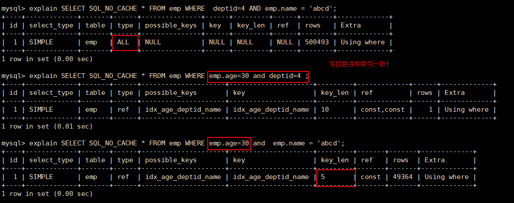
>
> 对于`explain select sql_no_cache * from emp where emp.name='abcd' and emp.age = 30;`优化器会自动优化顺序，使其对age字段也会走索引。
>
> 最左前缀匹配原理：索引的底层是一颗B+树，创建一个（a,b）的联合索引，联合索引的索引树为：
>
> 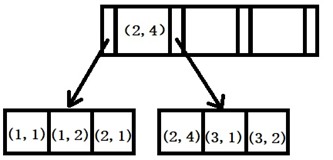
>
> 存储索引时，先根据第一个字段进行排序，第一个字段相同时再对第二个字段排序，以此类推。
>
> 所有a相同的数据，其索引相邻，但所有b相同的数据则分散在各处。因此根据b字段查找，无法走索引，只能全表扫描。
>
> ②对索引列使用了计算、函数、类型转换(显式或隐式)，都会导致索引失效而转向全表扫描。
>
> 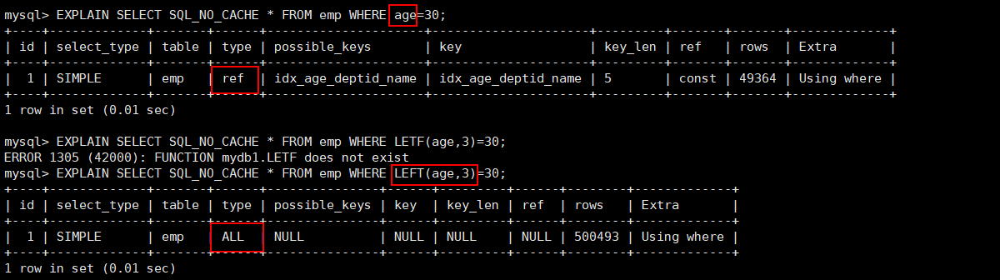
>
> ```sql
> create index idx_name on emp(name);
> ```
>
> 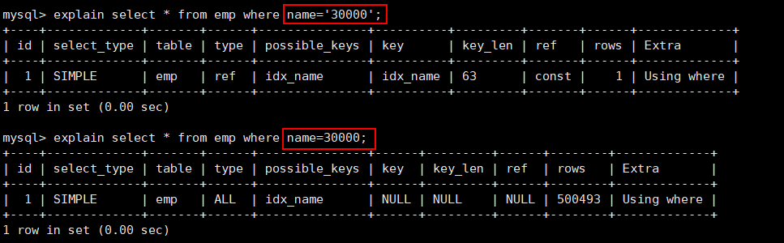
>
>> 字符串不加单引号，则会导致隐式转换。
>>
>
> ③范围查询之后的字段不走索引
>
> 范围查询字段本身是走索引的，但后续字段不走索引，建议将可能做范围查询的字段的索引顺序放在最后
>
> 
>
> ④使用不等于导致索引失效
>
> mysql 在使用不等于(!= 或者<>)时，有时会无法使用索引会导致全表扫描。
>
> 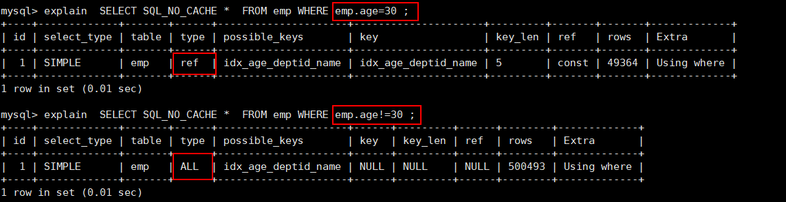
>
> ⑤带not导致索引失效
>
> 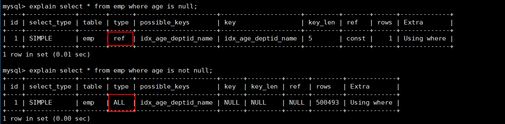
>
> ⑥like %开头不能走索引，%结尾可以走索引
>
> 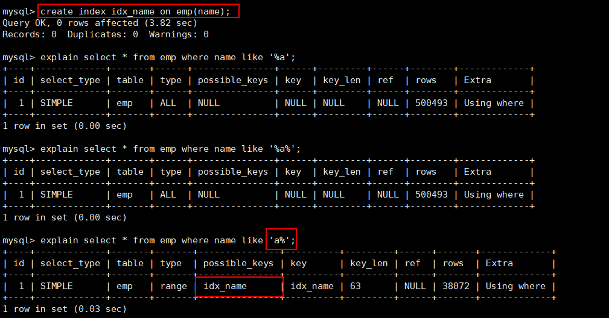
>
> ⑦使用or不走索引
>
> 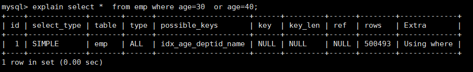
>
> 建议使用union all或union 代替or：
>
> 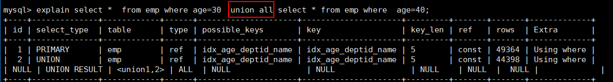
>
> 练习题：建立索引(a,b,c)，判断各字段是否走索引
>
> | Where语句                                               | 索引是否被使用                             |
> | ------------------------------------------------------- | ------------------------------------------ |
> | where a = 3                                             | Y,使用到a                                  |
> | where a = 3 and b = 5                                   | Y,使用到a，b                               |
> | where a = 3 and b = 5  and c = 4                        | Y,使用到a,b,c                              |
> | where b = 3 或者 where b = 3 and c = 4 或者 where c = 4 | N                                          |
> | where a = 3 and c = 5                                   | 使用到a， 但是c不可以，b中间断了           |
> | where a = 3 and b  > 4 and c = 5                        | 使用到a和b， c不能用在范围之后，b断了      |
> | where a is null and b  is not null                      | is not null 不走索引，所以 a 走索引，b不走 |
> | where a <>  3                                           | 不能使用索引                               |
> | where  abs(a) =3                                        | 不能使用 索引                              |
> | where a = 3 and b  like 'kk%' and c = 4                 | Y,使用到a,b,c                              |
> | where a = 3 and b  like '%kk' and c = 4                 | Y,只用到a                                  |
> | where a = 3 and b  like '%kk%' and c = 4                | Y,只用到a                                  |
> | where a = 3 and b  like 'k%kk%' and c = 4               | Y,使用到a,b,c                              |
>


["11.Explain性能分析"](siyuan://blocks/20210325142846-95d1thq)

> ## explain简介
>
> 使用EXPLAIN关键字可以模拟优化器执行SQL查询语句，从而知道MySQL是如何处理你的SQL语句的。分析你的查询语句或是表结构的性能瓶颈。
>
> 官网地址：https://dev.mysql.com/doc/refman/5.7/en/explain-output.html
>
> **本文以下测试使用mysql 5.6.24，后续版本对查询进行了优化，测试结果很可能不同。**
>
> 使用：Explain+SQL语句
>
> ```shell
> mysql> explain select * from t1;
> +--+-----------+-----+----+-------------+----+-------+----+----+-----+
> |id|select_type|table|type|possible_keys| key|key_len| ref|rows|Extra|
> +--+-----------+-----+----+-------------+----+-------+----+----+-----+
> | 1| SIMPLE    | t1  | ALL| NULL        |NULL| NULL  |NULL|  1 |NULL |
> +--+-----------+-----+----+-------------+----+-------+----+----+-----+
> ```
>
> 字段解释：
>
> id:  select 查询的序列号，表示查询中执行select子句或操作表的顺序。
>
> select_type: 主要用于区别普通查询、联合查询、子查询等的复杂查询。
>
> table: 这个数据是基于哪张表的。
>
> partitions: 查询数据匹配的分区
>
> **type: 是查询的访问类型，是较为重要的一个指标**
>
> possible_keys: 显示可能应用在这张表中的索引，一个或多个。
>
> key: 实际使用的索引。如果为NULL，则没有使用索引。
>
> key_len: 表示索引中使用的字节数
>
> ref: 显示索引的哪一列被使用了
>
> rows: 显示MySQL认为它执行查询时必须检查的行数，不精确。
>
> filtered: 返回结果的行占需要读到的行(rows列的值)的百分比
>
> Extra: 其他的额外重要的信息。
>
> ## 准备数据
>
> ### 建表
>
> ```sql
> CREATE TABLE `dept` (
>  `id` INT(11) NOT NULL AUTO_INCREMENT,
>  `deptName` VARCHAR(30) DEFAULT NULL,
>  `address` VARCHAR(40) DEFAULT NULL,
>   ceo INT NULL ,
>   PRIMARY KEY (`id`)
> ) ENGINE=INNODB AUTO_INCREMENT=1 DEFAULT CHARSET=utf8;
>
> CREATE TABLE `emp` (
>  `id` INT(11) NOT NULL AUTO_INCREMENT,
>  `empno` INT NOT NULL ,
>  `name` VARCHAR(20) DEFAULT NULL,
>  `age` INT(3) DEFAULT NULL,
>  `deptId` INT(11) DEFAULT NULL,
>   PRIMARY KEY (`id`)
>  #CONSTRAINT `fk_dept_id` FOREIGN KEY (`deptId`) REFERENCES `t_dept` (`id`)
> ) ENGINE=INNODB AUTO_INCREMENT=1 DEFAULT CHARSET=utf8;
> ```
>
> 开启 log_bin_trust_function_creators，它控制是否可以信任存储函数创建者
>
> ```sql
> mysql> show variables like 'log_bin_trust_function_creators'; //查询
> mysql> set global log_bin_trust_function_creators=1;  //开启
> ```
>
> 若需设置永久生效方式：修改/etc/my.cnf 文件
>
> ```shell
> [mysqld]
> log_bin_trust_function_creators=1
> ```
>
> ### 编写随机函数
>
> 1）生成随机字符串
>
> ```sql
> DELIMITER $$
> CREATE FUNCTION rand_string(n INT) RETURNS VARCHAR(255)
> BEGIN    
> DECLARE chars_str VARCHAR(100) DEFAULT 'abcdefghijklmnopqrstuvwxyzABCDEFJHIJKLMNOPQRSTUVWXYZ';
>  DECLARE return_str VARCHAR(255) DEFAULT '';
>  DECLARE i INT DEFAULT 0;
>  WHILE i < n DO  
>  SET return_str =CONCAT(return_str,SUBSTRING(chars_str,FLOOR(1+RAND()*52),1));  
>  SET i = i + 1;
>  END WHILE;
>  RETURN return_str;
> END $$
> ```
>
> 2）如果要删除函数，则执行：drop function rand_string
>
> 3）生成随机部门编号
>
> ```sql
> --用于随机产生多少到多少的编号
> DELIMITER $$
> CREATE FUNCTION  rand_num (from_num INT ,to_num INT) RETURNS INT(11)
> BEGIN   
>  DECLARE i INT DEFAULT 0;  
>  SET i = FLOOR(from_num +RAND()*(to_num -from_num+1))   ;
> RETURN i;  
> END$$
> ```
>
> 4）如果要删除函数：drop function rand_num
>
> ### 创建存储过程
>
> 1）创建往emp表中插入数据的存储过程
>
> ```sql
> DELIMITER $$
> CREATE PROCEDURE  insert_emp(  START INT ,  max_num INT )
> BEGIN  
> DECLARE i INT DEFAULT 0;   
> --set autocommit =0 把autocommit设置成0  
>  SET autocommit = 0;    
>  REPEAT  
>  SET i = i + 1;  
>  INSERT INTO emp (empno, NAME ,age ,deptid ) VALUES ((START+i) ,rand_string(6)   , rand_num(30,50),rand_num(1,10000));  
>  UNTIL i = max_num  
>  END REPEAT;  
>  COMMIT;  
>  END$$ 
>  
> --删除
> -- DELIMITER ;
> -- drop PROCEDURE insert_emp;
> ```
>
> 2）创建往dept表中插入数据的存储过程
>
> ```sql
> --执行存储过程，往dept表添加随机数据
> DELIMITER $$
> CREATE PROCEDURE `insert_dept`(  max_num INT )
> BEGIN  
> DECLARE i INT DEFAULT 0;   
>  SET autocommit = 0;    
>  REPEAT  
>  SET i = i + 1;  
>  INSERT INTO dept ( deptname,address,ceo ) VALUES (rand_string(8),rand_string(10),rand_num(1,500000));  
>  UNTIL i = max_num  
>  END REPEAT;  
>  COMMIT;  
>  END$$
>  
> --删除
> -- DELIMITER ;
> -- drop PROCEDURE insert_dept;
> ```
>
> ### 调用随机过程
>
> 1）添加数据到部门表
>
> ```sql
> --执行存储过程，往dept表添加1万条数据
> DELIMITER ;
> CALL insert_dept(10000);
> ```
>
> 2）添加数据到员工表
>
> ```sql
> --执行存储过程，往emp表添加50万条数据
> DELIMITER ;
> CALL insert_emp(100000,500000);
> ```
>
> ### 批量删除某个表上的所有索引
>
> 1）删除索引的存储过程
>
> ```sql
> DELIMITER $$
> CREATE  PROCEDURE `proc_drop_index`(dbname VARCHAR(200),tablename VARCHAR(200))
> BEGIN
>        DECLARE done INT DEFAULT 0;
>        DECLARE ct INT DEFAULT 0;
>        DECLARE _index VARCHAR(200) DEFAULT '';
>        DECLARE _cur CURSOR FOR  SELECT   index_name   FROM information_schema.STATISTICS   WHERE table_schema=dbname AND table_name=tablename AND seq_in_index=1 AND    index_name <>'PRIMARY'  ;
>        DECLARE  CONTINUE HANDLER FOR NOT FOUND set done=2 ;      
>         OPEN _cur;
>         FETCH   _cur INTO _index;
>         WHILE  _index<>'' DO 
>                SET @str = CONCAT("drop index ",_index," on ",tablename ); 
>                PREPARE sql_str FROM @str ;
>                EXECUTE  sql_str;
>                DEALLOCATE PREPARE sql_str;
>                SET _index=''; 
>                FETCH   _cur INTO _index; 
>         END WHILE;
> CLOSE _cur;
> END$$
> ```
>
> 2）执行存储过程
>
> ```sql
> CALL proc_drop_index("dbname","tablename");
> ```
>
> ## explain字段分析
>
> 创建测试数据：
>
> ```sql
> CREATE TABLE t1(id INT(10) AUTO_INCREMENT,content  VARCHAR(100) NULL ,  PRIMARY KEY (id));
> CREATE TABLE t2(id INT(10) AUTO_INCREMENT,content  VARCHAR(100) NULL ,  PRIMARY KEY (id));
> CREATE TABLE t3(id INT(10) AUTO_INCREMENT,content  VARCHAR(100) NULL ,  PRIMARY KEY (id));
> CREATE TABLE t4(id INT(10) AUTO_INCREMENT,content  VARCHAR(100) NULL ,  PRIMARY KEY (id));
>
> INSERT INTO t1(content) VALUES(CONCAT('t1_',FLOOR(1+RAND()*1000)));
> INSERT INTO t2(content) VALUES(CONCAT('t2_',FLOOR(1+RAND()*1000)));
> INSERT INTO t3(content) VALUES(CONCAT('t3_',FLOOR(1+RAND()*1000)));
> INSERT INTO t4(content) VALUES(CONCAT('t4_',FLOOR(1+RAND()*1000)));
> ```
>
> ### id(了解)
>
> id: select查询的序列号,包含一组数字，表示查询中执行select子句或操作表的顺序
>
> 1) id相同：执行顺序由上至下
>
> ```sql
> mysql>EXPLAIN select * from t1,t2,t3 where t1.id = t2.id and t2.id = t3.id ;
> +--+-----------+-----+------+-------------+-------+-------+----------+----+-----+
> |id|select_type|table|type  |possible_keys|key    |key_len|ref       |rows|Extra|
> +--+-----------+-----+------+-------------+-------+-------+----------+----+-----+
> | 1| SIMPLE    | t1  | ALL  | PRIMARY     | NULL  | NULL  | NULL     |  1 | NULL|
> | 1| SIMPLE    | t2  |eq_ref| PRIMARY     |PRIMARY| 4     |test.t1.id|  1 | NULL|
> | 1| SIMPLE    | t3  |eq_ref| PRIMARY     |PRIMARY| 4     |test.t1.id|  1 | NULL|
> +--+-----------+-----+------+-------------+-------+-------+----------+----+-----+
> ```
>
> 2)id不同：如果是子查询，id的序号会递增，id值越大优先级越高，越先被执行
>
> ```sql
> mysql> EXPLAIN select t1.id from t1 where t1.id in
> (select t2.id from t2 where t2.id in 
>  (select t3.id from t3 where t3.content = ''));
> --mysql 5.6及以后已经优化了，带子查询的仍然是一趟执行完成：
> +----+-------------+-------+--------+---------------+---------+---------+------------+------+-------------+
> | id | select_type | table | type   | possible_keys | key     | key_len | ref        | rows | Extra       |
> +----+-------------+-------+--------+---------------+---------+---------+------------+------+-------------+
> |  1 | SIMPLE      | t1    | index  | PRIMARY       | PRIMARY | 4       | NULL       |    1 | Using index |
> |  1 | SIMPLE      | t2    | eq_ref | PRIMARY       | PRIMARY | 4       | test.t1.id |    1 | Using index |
> |  1 | SIMPLE      | t3    | eq_ref | PRIMARY       | PRIMARY | 4       | test.t1.id |    1 | Using where |
> +----+-------------+-------+--------+---------------+---------+---------+------------+------+-------------+
> ```
>
> mysql 5.5的结果：
>
> 
>
> 3)有相同也有不同
>
> ```sql
> mysql> EXPLAIN select t2.* from t2 ,(select * from t3 where t3.content = '') s3 where 
>         s3.id = t2.id ;
>         
> +----+-------------+------------+------+---------------+-------------+---------+------------+------+-------------+
> | id | select_type | table      | type | possible_keys | key         | key_len | ref        | rows | Extra       |
> +----+-------------+------------+------+---------------+-------------+---------+------------+------+-------------+
> |  1 | PRIMARY     | t2         | ALL  | PRIMARY       | NULL        | NULL    | NULL       |    1 | NULL        |
> |  1 | PRIMARY     | <derived2> | ref  | <auto_key0>   | <auto_key0> | 4       | test.t2.id |    2 | NULL        |
> |  2 | DERIVED     | t3         | ALL  | NULL          | NULL        | NULL    | NULL       |    1 | Using where |
> +----+-------------+------------+------+---------------+-------------+---------+------------+------+-------------+
> ```
>
> 4)总结：
>
> id如果相同，可以认为是一组，从上往下顺序执行；
>
> 在所有组中，id值越大，优先级越高，越先执行 。
>
> id号每个号码，表示一趟独立的查询。一个sql 的查询趟数越少越好。
>
> ### select_type(了解)
>
> select_type : 主要用于区别普通查询、联合查询、子查询等的复杂查询。
>
> | 属性                 | 含义                                                                                                            |
> | -------------------- | --------------------------------------------------------------------------------------------------------------- |
> | SIMPLE               | 简单的 select 查询,查询中不包含子查询或者UNION                                                                  |
> | PRIMARY              | 查询中若包含任何复杂的子部分，最外层查询则被标记为Primary                                                       |
> | DERIVED              | 在FROM列表中包含的子查询被标记为DERIVED(衍生)  MySQL会递归执行这些子查询, 把结果放在临时表里。                  |
> | SUBQUERY             | 在SELECT或WHERE列表中包含了子查询                                                                               |
> | DEPEDENT SUBQUERY    | 在SELECT或WHERE列表中包含了子查询,子查询基于外层                                                                |
> | UNCACHEABLE SUBQUERY | 无法使用缓存的子查询                                                                                            |
> | UNION                | 若第二个SELECT出现在UNION之后，则被标记为UNION；  若UNION包含在FROM子句的子查询中,外层SELECT将被标记为：DERIVED |
> | UNION RESULT         | 从UNION表获取结果的SELECT                                                                                       |
>
> ### type(重点)
>
> type是查询的访问类型，是较为重要的一个指标结果值从最好到最坏依次是：
>
> system > const > **eq_ref** > **ref** > fulltext > ref_or_null > index_merge > unique_subquery > index_subquery > **range** > index > **ALL**
>
> 【只需要关注加粗的几个】
>
> **一般来说，得保证查询至少达到range级别，最好能达到ref。**
>
> 1)system
>
> 表只有一行记录（等于系统表），这是const类型的特列，平时不会出现，这个也可以忽略不计。
>
> 2)const
>
> 表示通过索引一次就找到了，const用于比较primary key或者unique索引。因为只匹配一行数据，所以很快。如将主键置于where列表中，MySQL就能将该查询转换为一个常量。
>
> ```sql
> mysql> EXPLAIN  select * from t1 where t1.id  = 1;
> +----+-------------+-------+-------+---------------+---------+---------+-------+------+-------+
> | id | select_type | table | type  | possible_keys | key     | key_len | ref   | rows | Extra |
> +----+-------------+-------+-------+---------------+---------+---------+-------+------+-------+
> |  1 | SIMPLE      | t1    | const | PRIMARY       | PRIMARY | 4       | const |    1 | NULL  |
> +----+-------------+-------+-------+---------------+---------+---------+-------+------+-------+
> ```
>
> 3)eq_ref
>
> 唯一性索引扫描，对于每个索引键，表中只有一条记录与之匹配。常见于主键或唯一索引扫描。
>
> ```sql
> mysql> EXPLAIN select * from t1 ,t2 where t1.id = t2.id ;
> +----+-------------+-------+--------+---------------+---------+---------+------------+------+-------+
> | id | select_type | table | type   | possible_keys | key     | key_len | ref        | rows | Extra |
> +----+-------------+-------+--------+---------------+---------+---------+------------+------+-------+
> |  1 | SIMPLE      | t1    | ALL    | PRIMARY       | NULL    | NULL    | NULL       |    1 | NULL  |
> |  1 | SIMPLE      | t2    | eq_ref | PRIMARY       | PRIMARY | 4       | test.t1.id |    1 | NULL  |
> +----+-------------+-------+--------+---------------+---------+---------+------------+------+-------+                       
> ```
>
> 4)ref
>
> 非唯一性索引扫描，返回匹配某个单独值的所有行。本质上也是一种索引访问，它返回所有匹配某个单独值的行，然而，它可能会找到多个符合条件的行，所以他应该**属于查找和扫描的混合体**。
>
> 没用索引前：
>
> ```sql
> mysql> EXPLAIN select * from t1 ,t2 where t1.content = t2.content;
> +----+-------------+-------+------+---------------+------+---------+------+------+----------------------------------------------------+
> | id | select_type | table | type | possible_keys | key  | key_len | ref  | rows | Extra                                              |
> +----+-------------+-------+------+---------------+------+---------+------+------+----------------------------------------------------+
> |  1 | SIMPLE      | t1    | ALL  | NULL          | NULL | NULL    | NULL |    1 | NULL                                               |
> |  1 | SIMPLE      | t2    | ALL  | NULL          | NULL | NULL    | NULL |    1 | Using where; Using join buffer (Block Nested Loop) |
> +----+-------------+-------+------+---------------+------+---------+------+------+----------------------------------------------------+
> ```
>
> 建立索引后：
>
> ```sql
> mysql> create index idx_t2_content on t2(content);
> mysql> EXPLAIN select * from t1 ,t2 where t1.content = t2.content;
> +----+-------------+-------+------+----------------+----------------+---------+-----------------+------+-------------+
> | id | select_type | table | type | possible_keys  | key            | key_len | ref             | rows | Extra       |
> +----+-------------+-------+------+----------------+----------------+---------+-----------------+------+-------------+
> |  1 | SIMPLE      | t1    | ALL  | NULL           | NULL           | NULL    | NULL            |    1 | Using where |
> |  1 | SIMPLE      | t2    | ref  | idx_t2_content | idx_t2_content | 103     | test.t1.content |    1 | Using index |
> +----+-------------+-------+------+----------------+----------------+---------+-----------------+------+-------------+
> ```
>
> 5) range
>
> 只检索给定范围的行,使用一个索引来选择行。key 列显示使用了哪个索引一般就是在你的where语句中出现了between、<、>、in等的查询这种范围扫描索引扫描比全表扫描要好，因为它只需要开始于索引的某一点，而结束语另一点，不用扫描全部索引。
>
> ```sql
> mysql> EXPLAIN select * from t1 where t1.id >10 ;
> +----+-------------+-------+-------+---------------+---------+---------+------+------+-------------+
> | id | select_type | table | type  | possible_keys | key     | key_len | ref  | rows | Extra       |
> +----+-------------+-------+-------+---------------+---------+---------+------+------+-------------+
> |  1 | SIMPLE      | t1    | range | PRIMARY       | PRIMARY | 4       | NULL |    1 | Using where |
> +----+-------------+-------+-------+---------------+---------+---------+------+------+-------------+
> ```
>
> ```sql
> mysql> EXPLAIN select * from t1 where t1.id between 1 and 3 ;
> +----+-------------+-------+-------+---------------+---------+---------+------+------+-------------+
> | id | select_type | table | type  | possible_keys | key     | key_len | ref  | rows | Extra       |
> +----+-------------+-------+-------+---------------+---------+---------+------+------+-------------+
> |  1 | SIMPLE      | t1    | range | PRIMARY       | PRIMARY | 4       | NULL |    1 | Using where |
> +----+-------------+-------+-------+---------------+---------+---------+------+------+-------------+
> ```
>
> ```sql
> mysql> EXPLAIN select * from t1 where t1.id in (1,2);
> +----+-------------+-------+-------+---------------+---------+---------+------+------+-------------+
> | id | select_type | table | type  | possible_keys | key     | key_len | ref  | rows | Extra       |
> +----+-------------+-------+-------+---------------+---------+---------+------+------+-------------+
> |  1 | SIMPLE      | t1    | range | PRIMARY       | PRIMARY | 4       | NULL |    2 | Using where |
> +----+-------------+-------+-------+---------------+---------+---------+------+------+-------------+
> ```
>
> 6)index
>
> 索引全表扫描，虽然使用了索引但是并没有起到过滤的作用，这个时候会遍历整个索引树
>
> ```sql
> mysql> EXPLAIN select * from t1;
> +----+-------------+-------+------+---------------+------+---------+------+------+-------+
> | id | select_type | table | type | possible_keys | key  | key_len | ref  | rows | Extra |
> +----+-------------+-------+------+---------------+------+---------+------+------+-------+
> |  1 | SIMPLE      | t1    | ALL  | NULL          | NULL | NULL    | NULL |    1 | NULL  |
> +----+-------------+-------+------+---------------+------+---------+------+------+-------+
> ```
>
> ```sql
> mysql> EXPLAIN select id from t1;
> +----+-------------+-------+-------+---------------+---------+---------+------+------+-------------+
> | id | select_type | table | type  | possible_keys | key     | key_len | ref  | rows | Extra       |
> +----+-------------+-------+-------+---------------+---------+---------+------+------+-------------+
> |  1 | SIMPLE      | t1    | index | NULL          | PRIMARY | 4       | NULL |    1 | Using index |
> +----+-------------+-------+-------+---------------+---------+---------+------+------+-------------+
> ```
>
> 7)all
>
> Full Table Scan，将遍历全表以找匹配的行。
>
> ```sql
> --当content字段不是索引时
> mysql> EXPLAIN select * from t1 ,t2 where t1.content = t2.content;
> +----+-------------+-------+------+---------------+------+---------+------+------+----------------------------------------------------+
> | id | select_type | table | type | possible_keys | key  | key_len | ref  | rows | Extra                                              |
> +----+-------------+-------+------+---------------+------+---------+------+------+----------------------------------------------------+
> |  1 | SIMPLE      | t1    | ALL  | NULL          | NULL | NULL    | NULL |    1 | NULL                                               |
> |  1 | SIMPLE      | t2    | ALL  | NULL          | NULL | NULL    | NULL |    1 | Using where; Using join buffer (Block Nested Loop) |
> +----+-------------+-------+------+---------------+------+---------+------+------+----------------------------------------------------+
> ```
>
> 8)index_merge
>
> 在查询过程中需要多个索引组合使用，通常出现在有 or 的关键字的sql中。
>
> MySQL5.5的结果:
>
> 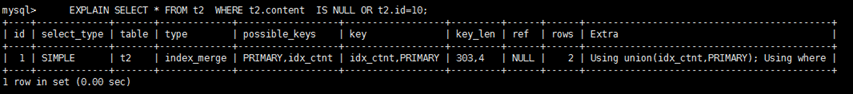
>
> 9)ref_or_null
>
> 对于某个字段既需要关联条件，也需要null值得情况下。查询优化器会选择用ref_or_null连接查询。
>
> ```sql
> mysql> EXPLAIN select * from t2 where t2.content is null or t2.content = 'abc';
> +----+-------------+-------+-------------+----------------+----------------+---------+-------+------+--------------------------+
> | id | select_type | table | type        | possible_keys  | key            | key_len | ref   | rows | Extra                    |
> +----+-------------+-------+-------------+----------------+----------------+---------+-------+------+--------------------------+
> |  1 | SIMPLE      | t2    | ref_or_null | idx_t2_content | idx_t2_content | 103     | const |    2 | Using where; Using index |
> +----+-------------+-------+-------------+----------------+----------------+---------+-------+------+--------------------------+
> ```
>
> 10)index_subquery
>
> 利用索引来关联子查询，不再全表扫描。
>
> ```sql
> mysql> create index idx_t3_content on t3(content);
> mysql> EXPLAIN select * from t2 where t2.content in (select t3.content from t3) ;
> +----+-------------+-------+-------+----------------+----------------+---------+-----------------+------+-----------------------------+
> | id | select_type | table | type  | possible_keys  | key            | key_len | ref             | rows | Extra                       |
> +----+-------------+-------+-------+----------------+----------------+---------+-----------------+------+-----------------------------+
> |  1 | SIMPLE      | t2    | index | idx_t2_content | idx_t2_content | 103     | NULL            |    1 | Using where; Using index    |
> |  1 | SIMPLE      | t3    | ref   | idx_t3_content | idx_t3_content | 103     | test.t2.content |    1 | Using index; FirstMatch(t2) |
> +----+-------------+-------+-------+----------------+----------------+---------+-----------------+------+-----------------------------+
> ```
>
> MySQL5.5的结果:
>
> 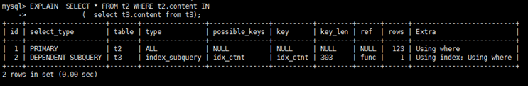
>
> 11)unique_subquery
>
> 该联接类型类似于index_subquery。 子查询中的唯一索引。
>
> ```sql
> mysql> EXPLAIN select * from t2 where t2.id in (select t3.id from t3 );
> +----+-------------+-------+--------+---------------+----------------+---------+------------+------+-------------+
> | id | select_type | table | type   | possible_keys | key            | key_len | ref        | rows | Extra       |
> +----+-------------+-------+--------+---------------+----------------+---------+------------+------+-------------+
> |  1 | SIMPLE      | t2    | index  | PRIMARY       | idx_t2_content | 103     | NULL       |    1 | Using index |
> |  1 | SIMPLE      | t3    | eq_ref | PRIMARY       | PRIMARY        | 4       | test.t2.id |    1 | Using index |
> +----+-------------+-------+--------+---------------+----------------+---------+------------+------+-------------+
> ```
>
> MySQL5.5的结果
>
> 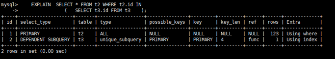
>
> ### possible_keys(重点)
>
> 显示可能应用在这张表中的索引，一个或多个。查询涉及到的字段上若存在索引，则该索引将被列出，**但不一定被查询实际使用。**
>
> ### key
>
> 实际使用的索引。如果为NULL，则没有使用索引。
>
> ### key_len
>
> 表示索引中使用的字节数，可通过该列计算查询中使用的索引的长度。 key_len字段能够帮你检查是否充分的利用上了索引。**ken_len越长，说明索引使用的越充分。**
>
> 示例如下
>
> 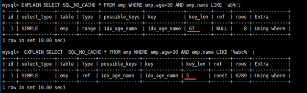
>
> 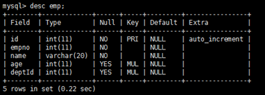
>
> **如何计算：**
>
> 1） 先看索引上字段的类型+长度比如 int=4 ; varchar(20) =20 ; char(20) =20
>
> 2） 如果是varchar或者char这种字符串字段，视字符集要乘不同的值，比如utf-8 要乘 3,GBK要乘2
>
> 3） varchar这种动态字符串要加2个字节
>
> 4） 允许为空的字段要加1个字节
>
> 第一组：key_len=age的字节长度：name的字节长度=4+1 + ( 20*3+2)=5+62=67
>
> 第二组：key_len=age的字节长度：4+1=5
>
> 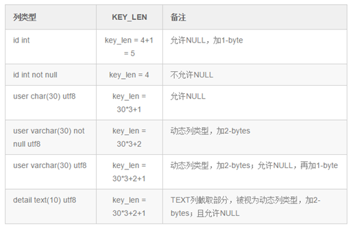
>
> ### ref
>
> 显示索引的哪一列被使用了，如果可能的话，是一个常数。哪些列或常量被用于查找索引列上的值。
>
> ```sql
> mysql> create index idx_name_t_emp on t_emp(name);
> mysql> EXPLAIN select * from t_emp emp ,t_dept dept  where emp.name = 'aaa' 
> and emp.deptId = dept.id ;
> ```
>
> 
>
> ### rows
>
> rows列显示MySQL认为它执行查询时必须检查的行数。**越少越好**
>
> ```sql
> mysql> create index idx_name_t_emp on t_emp(name);
> mysql> EXPLAIN select * from t_emp emp ,t_dept dept  where emp.name = 'aaa' 
> and emp.deptId = dept.id ;
> ```
>
> 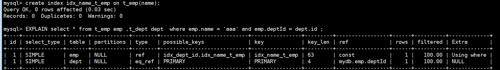
>
> ### Extra(重要)
>
> **1)Using filesort(重要)**
>
> 在使用order by关键字的时候，如果待排序的字段不是索引字段，那么mysql有可能进行文件排序。
>
> filesort是通过相应的排序算法，将取得的数据在内存中进行排序。using filesort不一定引起mysql的性能问题。但是如果查询次数非常多，那么每次在mysql中进行排序，还是会有影响的。
> 此时，可以进行的优化：
> 1、修改逻辑，不在mysql中使用order by而是在应用中自己进行排序。
> 2、使用mysql索引，将待排序的内容放到索引中，直接利用索引的排序。
>
> 优化前：
>
> ```sql
> mysql> explain select id ,empno ,name  from t_emp 
> where deptid = 100 order by name limit 10 ;
> ```
>
> 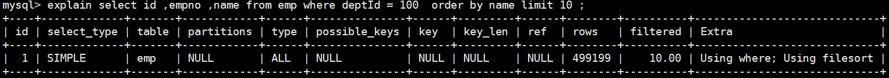
>
> 优化后：
>
> ```sql
> mysql> create index idx_name_emp_1 on emp(name);
> mysql> explain select id ,empno ,name from emp 
> where deptId = 100  order by name limit 10 ;
> ```
>
> 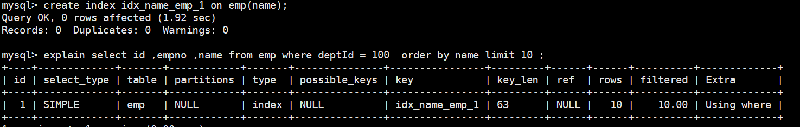
>
> 2)Using temporary
>
> 使用临时表保存中间结果，MySQL在对查询结果排序时使用临时表。常见于排序 order by 和分组查询 group by。
>
> 优化前：
>
> ```sql
> mysql> explain select  name, count(*) from emp where deptid = 100 group by name limit 10 ;
> ```
>
> 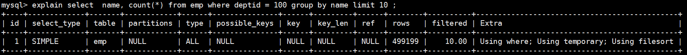
>
> 优化后：
>
> ```sql
> mysql> create index idx_name_emp_1 on emp(name);
> mysql> explain select  name, count(*) from emp where deptid = 100 group by name limit 10 ;
> ```
>
> 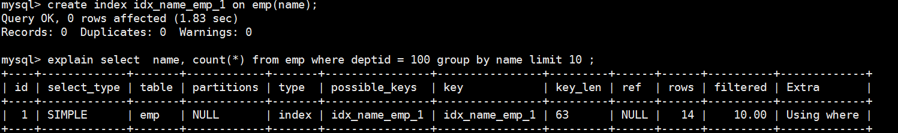
>
> 3)Using index
>
> Using index表示相应的select操作中使用了覆盖索引(Covering Index)，避免访问了表的数据行，效率不错！
>
> 如果同时出现using where，表明索引被用来执行索引键值的查找;如果没有同时出现using where，表明索引只是用来读取数据而非利用索引执行查找。
>
> ```sql
> mysql> explain select id from emp where id >1000 order by  id ;
> ```
>
> 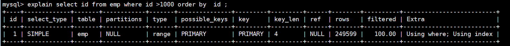
>
> 4)Using where
>
> 不用读取表里面的所有信息，只需要通过索引就可以拿到需要的数据，这个过程发生在对表的全部请求列都是同一个索引部分时。
>
> 5)Using join buffer：使用了连接缓存。
>
> ```sql
> mysql> explain select * from emp ,dept where emp.empno = dept.ceo ;
> ```
>
> 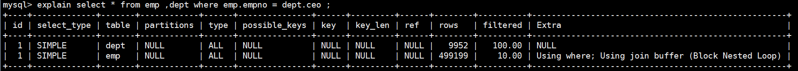
>
> 6)impossible where：【5.7后没有了】
>
> where子句的值总是false，不能用来获取任何元组。
>
> ```sql
> mysql> explain select empno, name from emp where empno >200000 and empno < 100000;
> ```
>
> 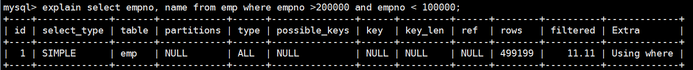
>
> MySQL5.5的结果:
>
> 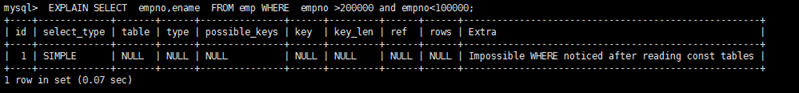
>
> 7)select tables optimized away
>
> 在没有GROUP BY子句的情况下，基于索引优化MIN/MAX操作或者对于MyISAM存储引擎优化COUNT(*)操作，不必等到执行阶段再进行计算，查询Explain生成的阶段即完成优化。
>
> 在InnoDB中：
>
> ```sql
> mysql> explain select max(id) from emp ;
> ```
>
> 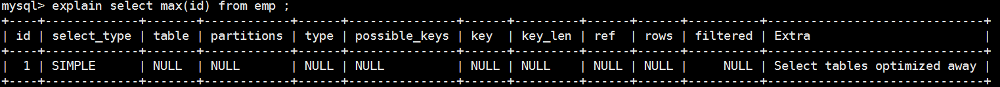
>
> 在MyISAM中：
>
> 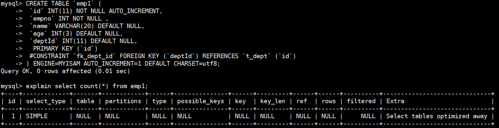
>


["12.查询优化"](siyuan://blocks/20210325142846-s7lsla1)

> ## 关联查询优化
>
> 建表：
>
> ```sql
> CREATE TABLE IF NOT EXISTS `class` (
> `id` INT(10) UNSIGNED NOT NULL AUTO_INCREMENT,
> `card` INT(10) UNSIGNED NOT NULL,
> PRIMARY KEY (`id`)
> );
> CREATE TABLE IF NOT EXISTS `book` (
> `bookid` INT(10) UNSIGNED NOT NULL AUTO_INCREMENT,
> `card` INT(10) UNSIGNED NOT NULL,
> PRIMARY KEY (`bookid`)
> );
>  
> INSERT INTO class(card) VALUES(FLOOR(1 + (RAND() * 20)));
> INSERT INTO class(card) VALUES(FLOOR(1 + (RAND() * 20)));
> INSERT INTO class(card) VALUES(FLOOR(1 + (RAND() * 20)));
> INSERT INTO class(card) VALUES(FLOOR(1 + (RAND() * 20)));
> INSERT INTO class(card) VALUES(FLOOR(1 + (RAND() * 20)));
> INSERT INTO class(card) VALUES(FLOOR(1 + (RAND() * 20)));
> INSERT INTO class(card) VALUES(FLOOR(1 + (RAND() * 20)));
> INSERT INTO class(card) VALUES(FLOOR(1 + (RAND() * 20)));
> INSERT INTO class(card) VALUES(FLOOR(1 + (RAND() * 20)));
> INSERT INTO class(card) VALUES(FLOOR(1 + (RAND() * 20)));
> INSERT INTO class(card) VALUES(FLOOR(1 + (RAND() * 20)));
> INSERT INTO class(card) VALUES(FLOOR(1 + (RAND() * 20)));
> INSERT INTO class(card) VALUES(FLOOR(1 + (RAND() * 20)));
> INSERT INTO class(card) VALUES(FLOOR(1 + (RAND() * 20)));
> INSERT INTO class(card) VALUES(FLOOR(1 + (RAND() * 20)));
> INSERT INTO class(card) VALUES(FLOOR(1 + (RAND() * 20)));
> INSERT INTO class(card) VALUES(FLOOR(1 + (RAND() * 20)));
> INSERT INTO class(card) VALUES(FLOOR(1 + (RAND() * 20)));
> INSERT INTO class(card) VALUES(FLOOR(1 + (RAND() * 20)));
> INSERT INTO class(card) VALUES(FLOOR(1 + (RAND() * 20)));
>  
> INSERT INTO book(card) VALUES(FLOOR(1 + (RAND() * 20)));
> INSERT INTO book(card) VALUES(FLOOR(1 + (RAND() * 20)));
> INSERT INTO book(card) VALUES(FLOOR(1 + (RAND() * 20)));
> INSERT INTO book(card) VALUES(FLOOR(1 + (RAND() * 20)));
> INSERT INTO book(card) VALUES(FLOOR(1 + (RAND() * 20)));
> INSERT INTO book(card) VALUES(FLOOR(1 + (RAND() * 20)));
> INSERT INTO book(card) VALUES(FLOOR(1 + (RAND() * 20)));
> INSERT INTO book(card) VALUES(FLOOR(1 + (RAND() * 20)));
> INSERT INTO book(card) VALUES(FLOOR(1 + (RAND() * 20)));
> INSERT INTO book(card) VALUES(FLOOR(1 + (RAND() * 20)));
> INSERT INTO book(card) VALUES(FLOOR(1 + (RAND() * 20)));
> INSERT INTO book(card) VALUES(FLOOR(1 + (RAND() * 20)));
> INSERT INTO book(card) VALUES(FLOOR(1 + (RAND() * 20)));
> INSERT INTO book(card) VALUES(FLOOR(1 + (RAND() * 20)));
> INSERT INTO book(card) VALUES(FLOOR(1 + (RAND() * 20)));
> INSERT INTO book(card) VALUES(FLOOR(1 + (RAND() * 20)));
> INSERT INTO book(card) VALUES(FLOOR(1 + (RAND() * 20)));
> INSERT INTO book(card) VALUES(FLOOR(1 + (RAND() * 20)));
> INSERT INTO book(card) VALUES(FLOOR(1 + (RAND() * 20)));
> INSERT INTO book(card) VALUES(FLOOR(1 + (RAND() * 20)));
> ```
>
> ### left join优化
>
> 查看explain
>
> ```sql
> EXPLAIN SELECT * FROM class LEFT JOIN book ON class.card = book.card;
> ```
>
> 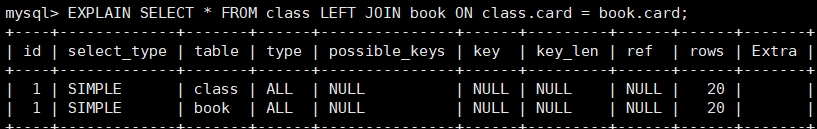
>
> 如何优化？在哪个表上建立索引？
>
> 方案一：在left join右表建索引
>
> ```sql
> ALTER TABLE `book` ADD INDEX  idx_card( `card`);
> ```
>
> 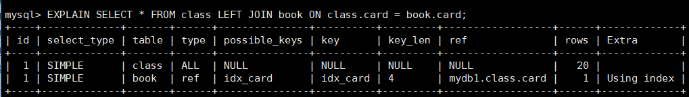
>
> 方案二：在left join左表建索引
>
> ```sql
> drop index idx_card on book;
> alter table class add index idx_card(card);
> ```
>
> 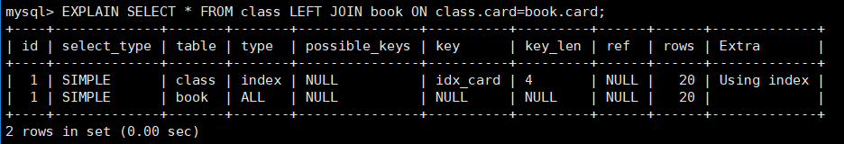
>
> 结论：
>
> - **在优化关联查询时，只有在被驱动表上建立索引才有效！**
> - left join时，左侧的为驱动表，**右侧为被驱动表**！
>
> ### inner join
>
> ```sql
> EXPLAIN SELECT * FROM book inner join class on class.card=book.card;
> ```
>
> 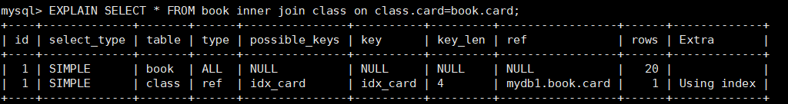
>
> 两个查询字段调换顺序，发现结果也是一样的！
>
> 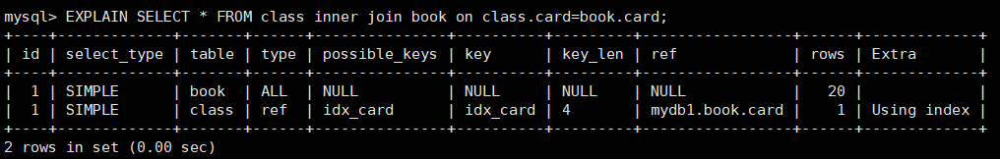
>
> 结论：**inner join 时，mysql会自己帮你把小结果集的表选为驱动表**。
>
>> straight_join: 效果和inner join一样，但是会强制将左侧作为驱动表！
>>
>
> ### 四个关联查询案例分析
>
> ```sql
> EXPLAIN SELECT ed.name '人物',c.name '掌门' FROM 
> (SELECT e.name,d.ceo from t_emp e LEFT JOIN t_dept d on e.deptid=d.id) ed
>  LEFT JOIN t_emp c on ed.ceo= c.id;
> ```
>
> 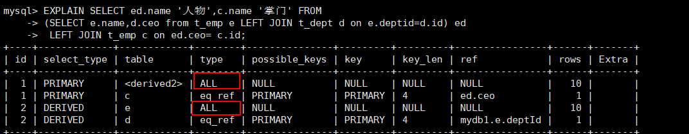
>
> ```sql
> EXPLAIN SELECT e.name '人物',tmp.name '掌门'
> FROM t_emp e LEFT JOIN (SELECT d.id did,e.name 
>                         FROM t_dept d LEFT JOIN t_emp e ON d.ceo=e.id)tmp 
> ON e.deptId=tmp.did;
> ```
>
> 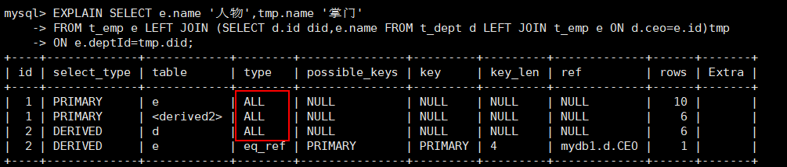
>
> 上述两个案例，第一个查询效率较高，且有优化的余地。第二个案例中，子查询作为被驱动表，由于子查询是虚表，无法建立索引，因此不能优化。
>
> 结论：
>
> - **子查询尽量不要放在被驱动表，有可能使用不到索引；**
> - left join时，尽量让实体表作为被驱动表。
>
> ```sql
> EXPLAIN SELECT e1.name '人物',e2.name '掌门' 
> FROM t_emp e1 
> LEFT JOIN t_dept d on e1.deptid = d.id
> LEFT JOIN t_emp e2 on d.ceo = e2.id ;
> ```
>
> 
>
> ```sql
> Explain SELECT e2.name '人物',
> (SELECT e1.name FROM t_emp e1 where e1.id= d.ceo) '掌门'
>  from t_emp e2 LEFT JOIN t_dept d on e2.deptid=d.id;
> ```
>
> 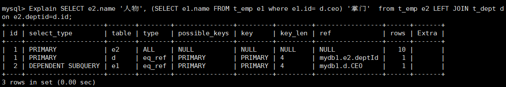
>
> 结论：能够直接多表关联的尽量直接关联，不用子查询！
>
> 建议：
>
> 1) 保证被驱动表的join字段已经被索引
> 2) Left Join 或者 right join时，选择小表作为驱动表，大表作为被驱动表
> 3) inner join 时，mysql会自己把小表选为驱动表
> 4) 子查询尽量不要放在被驱动表，有可能使用不到索引
> 5) 能直接多表关联就尽量直接关联，不用子查询
>
> ## 子查询优化
>
> 取所有不为掌门人的员工，按年龄分组！
>
> ```sql
> select age as '年龄', count(*) as '人数' from t_emp where id  not in 
> (select ceo from t_dept where ceo is not null) group by age;
> ```
>
> 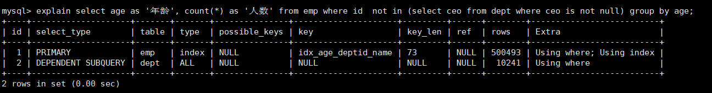
>
> 如何优化？
>
> ①解决dept表的全表扫描，建立ceo字段的索引：
>
> 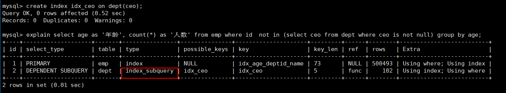
>
> 此时，再次查询：
>
> 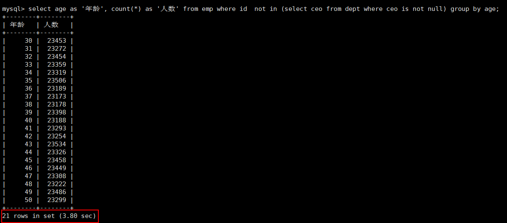
>
> ②进一步优化，替换not in。
>
> 上述SQL可以替换为：
>
> ```sql
> select age as '年龄',count(*) as '人数' 
> from emp e left join dept d on e.id=d.ceo 
> where d.id is null group by age;
> ```
>
> 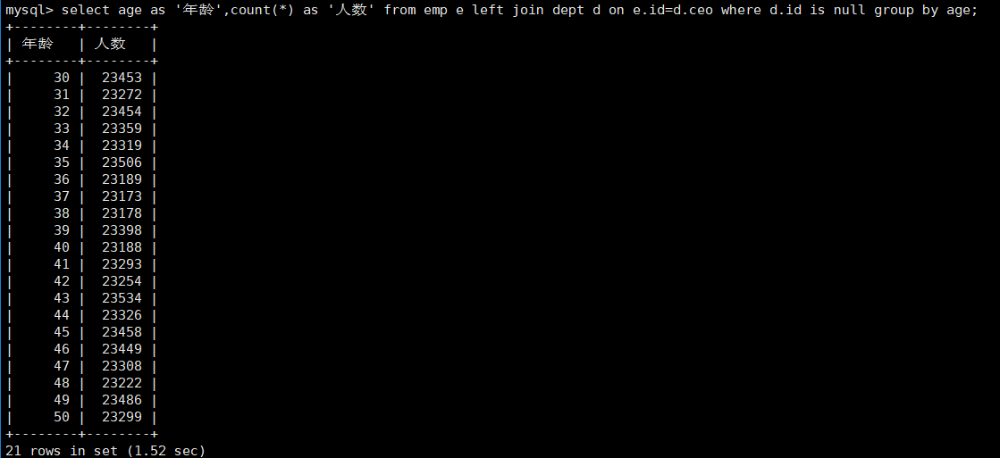
>
> 结论： 在范围判断时，尽量不要使用not in和not exists，使用 left join on xxx is null代替。
>
> ## 排序分组优化
>
> where 条件和 on的判断这些过滤条件，作为优先优化的部门，是要被先考虑的！其次，如果有分组和排序，那么也要考虑group by 和order by。
>
> ### 无过滤不索引
>
> ```sql
> create index idx_age_deptid_name on emp (age,deptid,name);
> explain select * from emp where age=40 order by deptid;
> explain  select * from emp order by age,deptid;
> explain  select * from emp order by age,deptid limit 10;
> ```
>
> 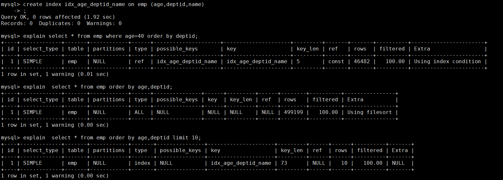
>
> 结论：using filesort说明进行了手工排序！原因在于没有where作为过滤条件。where，limit都相当于一种过滤条件，所以才能使用上索引。
>
> ### 顺序错，必排序
>
> ```sql
> explain  select * from emp where age=45 order by deptid,name;
> ```
>
> 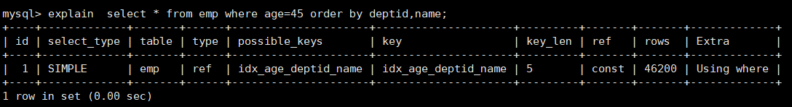
>
> ```sql
> explain  select * from emp where age=45 order by  deptid,empno;
> ```
>
> 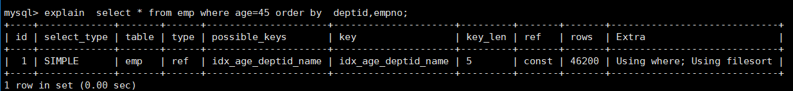
>
> empno字段并没有建立索引，因此也无法用到索引，此字段需要排序！
>
> ```sql
> explain  select * from emp where age=45 order by  name,deptid;
> ```
>
> 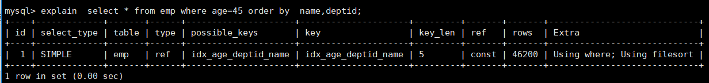
>
> where 两侧列的顺序可以变换，效果相同，但是order by列的顺序不能随便变换!
>
> ```sql
> explain select * from emp where deptid=45 order by age;
> ```
>
> 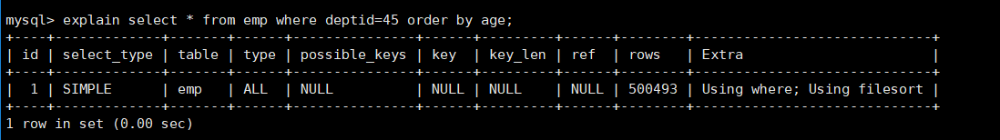
>
> deptid作为过滤条件的字段，无法使用索引，因此排序没法用上索引
>
> ### 方向反，必排序
>
> ```sql
> explain select * from emp where age=45 order by  deptid desc, name desc ;
> ```
>
> 
>
> 如果可以用上索引的字段都使用正序或者逆序，实际上是没有任何影响的，无非将结果集调换顺序。
>
> ```sql
> explain select * from emp where age=45 order by  deptid asc, name desc ;
> ```
>
> 
>
> 如果排序的字段，顺序有差异，就需要将差异的部分，进行一次倒置顺序，因此还是需要手动排序的！
>
> ### 索引的选择
>
> ①首先，清除emp上面的所有索引，只保留主键索引！
>
> ```sql
> drop index idx_age_deptid_name on emp;
> ```
>
> ②查询：年龄为30岁的，且员工编号小于101000的用户，按用户名称排序
>
> ```sql
> explain SELECT SQL_NO_CACHE * FROM emp WHERE age =30 AND empno <101000 ORDER BY NAME ;
> ```
>
> 
>
> ③全表扫描肯定是不被允许的，因此我们要考虑优化。
>
> 思路：首先需要让where的过滤条件，用上索引；
>
> 查询中，age.empno是查询的过滤条件，而name则是排序的字段，因此我们来创建一个此三个字段的复合索引：
>
> ```sql
> create index idx_age_empno_name on emp(age,empno,name);
> ```
>
> 
>
> 再次查询，发现using filesort依然存在。
>
> 原因： empno是范围查询，因此导致了索引失效，所以name字段无法使用索引排序。
>
> 所以，三个字段的符合索引，没有意义，因为empno和name字段只能选择其一！
>
> ④解决： 要么选择empno,要么选择name
>
> ```sql
> drop index idx_age_empno_name on emp;
> create index idx_age_name on emp(age,name);
> create index idx_age_empno on emp(age,empno);
> ```
>
> 两个索引同时存在，mysql会选择哪个？
>
> 
>
> ```sql
> explain SELECT SQL_NO_CACHE *  
> FROM emp use index(idx_age_name) 
> WHERE age =30 AND empno <101000 ORDER BY NAME ;
> ```
>
> 
>
> 原因：所有的排序都是在条件过滤之后才执行的，所以如果条件过滤了大部分数据的话，几百几千条数据进行排序其实并不是很消耗性能，即使索引优化了排序但实际提升性能很有限。 相对的 empno<101000 这个条件如果没有用到索引的话，要对几万条的数据进行扫描，这是非常消耗性能的，使用empno字段的范围查询，过滤性更好（empno从100000开始）！
>
> 结论： 当范围条件和group by 或者 order by 的字段出现二选一时 ，优先观察条件字段的过滤数量，如果过滤的数据足够多，而需要排序的数据并不多时，优先把索引放在范围字段上。反之，亦然。
>
> ### 使用覆盖索引
>
> 覆盖索引：SQL只需要通过索引树就可以查询所需要的数据，而不必通过查到主键之后回表查询数据。
>
> 
>
> ### group by
>
> group by 使用索引的原则几乎跟order by一致 ，唯一区别是groupby 即使没有过滤条件用到索引，也可以直接使2用索引。
>
> 
>


["13.事务"](siyuan://blocks/20210325142846-wlyeq1x)

> ## 事务的概念
>
> 事务（transaction）指将一步或多步操作看成一个整体，要么全部执行成功，要么全部回滚。
>
> 事务用于**解决数据库在并发情况下的并发一致性问题**。(阐述脏读 不可重复读 幻读)
>
> 基本术语：
>
> - 回滚（rollback）指撤销指定 SQL 语句的执行过程；
> - 提交（commit）指将未存储的 SQL 语句结果写入数据库表；
> - 保留点（savepoint）指事务处理中设置的临时占位符（placeholder），你可以对它发布回退（与回退整个事务处理不同）。
>
> 
>
> ## 事务的四大特性
>
> 原子性（Atomicity）、一致性（Consistency）、隔离性（Isolation）和持续性（Durability）。简称为ACID。
>
> **原子性**：事务的多个操作看作整体，即**不可再分**的最小执行单元。事务中的所有操作要么全部提交成功，要么全部回滚。
>
>> 原子性用`Undo Log`保证，undo log记录了数据的**逻辑修改**的反操作，在事务失败时会执行这些反向操作来回滚。
>>
>
> **一致性**：数据库总是从一个一致性状态转移到另一个一致性状态。
>
> **隔离性**：一个事务所做的修改，在最终提交前，对其它事务是不可见的。
>
> **持久性**：事务一旦提交，其所作的修改就会永久保存到数据库中。即使系统崩溃，修改的数据也不会丢失。
>
>> 持久性由`Redo log`保证，与undo log记录数据的逻辑修改不同，redo log记录的是数据页的**物理修改**。若系统宕机，可以用Redo Log进行恢复，从而实现持久性。
>>
>
> 事务的 ACID 特性概念简单，但不是很好理解，主要是因为这几个特性不是一种平级关系：
>
> - 只有满足一致性，事务的执行结果才是正确的。
> - 在无并发的情况下，事务串行执行，隔离性一定能够满足。此时只要能满足原子性，就一定能满足一致性。
> - 在并发的情况下，多个事务并行执行，事务不仅要满足原子性，还需要满足隔离性，才能满足一致性。
> - 事务满足持久化是为了能应对系统崩溃的情况。
>
> 
>
>> 只有Innodb引擎支持事务。事务只对DML语句有效，对DDL语句无效，因为DDL语句是不能回滚的。
>>
>
> ## 事务的隔离级别
>
> ### 并发一致性问题
>
> **事务安全问题本质上就是线程安全问题**。对于同时运行的多个事务，当这些事务访问数据库中相同的数据时，如果没有采取必要的隔离机制，就会导致各种线程不安全问题，也称为**并发一致性问题**：
>
> - **脏读**: 对于两个事务 T1, T2, T<sub>1</sub> 修改一个数据，T<sub>2</sub> 随后读取这个数据。如果 T<sub>1</sub> 撤销了这次修改，那么 T<sub>2</sub> 读取的数据是脏数据。
> - **不可重复读**: 对于两个事务 T1, T2, T<sub>2</sub> 读取**表中一行数据**，T<sub>1</sub> **对该行数据做了修改**。如果 T<sub>2</sub> 再次读取这行数据，此时读取的结果和第一次读取的结果不同。
> - **幻读:** 对于两个事务 T1, T2, T<sub>1</sub> 读取**表中某个范围的数据**，T<sub>2</sub> 在这个范围内**插入新的数据**，T<sub>1</sub> 再次读取这个范围的数据，此时读取的结果和和第一次读取的结果不同。
>
> 
>
>> 不可重复读和幻读：
>>
>> - 不可重复读是指在一个事务内，多次读同一行数据，数据发生了变化
>> - 幻读是指同一个事务内多次查询返回的结果集不一致。
>>
>
> ### MySQL的事务隔离级别
>
> 并发不一致性的主要原因是**破坏了事务的隔离性**，解决方法是通过**并发控制**来保证隔离性。并发控制可以通过锁来实现，但是锁需要用户自己控制，相当复杂。数据库管理系统提供了事务的隔离级别，让用户以一种更轻松的方式处理并发一致性问题。
>
> Mysql 支持4种事务隔离级别。**默认为: REPEATABLE-READ**
>
> (到底是三段锁的读已提交只加读锁，可重复读读的过程加写锁，读完释放写锁，可串行化事务整个过程加读写锁，还是可重复读才加行锁，可序列化加表锁)
>
> | 隔离级别         | 描述                                                                                                         |
> | ---------------- | ------------------------------------------------------------------------------------------------------------ |
> | READ-UNCOMMITTED | 允许事务读取其他事务未提交的数据，脏读、不可重复读、幻读的问题都会出现                                       |
> | READ-COMMITTED   | 只允许事务读取其他事务已经提交的数据，可以避免脏读，但是不可重复读、幻读的问题仍然会出现                     |
> | REPEATABLE-READ  | 对读取的表添加了**行锁**，保证了事务对一行数据的独占，可以避免脏读和不可重复读，但幻读的问题仍然存在。       |
> | SERIALIZABLE     | 对读取的表进行**锁表**，在事务对一个表进行操作时，禁止其他事务对该表执行读写，相当于串行执行，性能十分低下。 |
>
> 
>
>> 快照读的幻读：repeatable-read模式通过mvcc解决了快照读的问题，但不能解决当前读的幻读
>>
>> 当前读的幻读：gap 锁解决
>>
>
> 每启动一个 mysql 程序, 就会获得一个单独的数据库连接. 每个数据库连接都有一个变量 @@tx_isolation, 表示当前的事务隔离级别.
>
> 与隔离级别相关的操作：
>
> - 查看当前的隔离级别: SELECT @@tx_isolation;
> - 查看全局的隔离级别：select @@global.tx_isolation;
> - 设置当前 mySQL 连接的隔离级别: set tx_isolation ='repeatable-read';
> - 设置数据库系统的全局的隔离级别: set global tx_isolation ='read-committed';
>
> ### 事务的开启与关闭
>
> MySQL 的事务提交**默认是隐式提交**，每执行一条语句就把这条语句当成一个事务然后进行提交。
>
> 要想关闭自动提交，有两个方法：
>
> ①`set auto_commit = false;`
>
> 此后，每一组sql语句只有遇到commit才会将改动作用到数据库，或者rollback回滚操作。
>
> 这个语句的作用持续到这一整次连接：直到退出或set auto_commit = true;
>
> ②`start transaction;`
>
> 出现 START TRANSACTION 语句时，会关闭隐式提交；当 COMMIT 或 ROLLBACK 语句执行后，事务会自动关闭，重新恢复隐式提交。
>
> 不能回退 SELECT 语句，回退 SELECT 语句也没意义；也不能回退 CREATE 和 DROP 语句。
>
> 如果没有设置保留点，ROLLBACK 会回退到 START TRANSACTION 语句处；如果设置了保留点，并且在 ROLLBACK 中指定该保留点，则会回退到该保留点。
>
> ```mysql
> START TRANSACTION
> // ...
> SAVEPOINT delete1
> // ...
> ROLLBACK TO delete1
> // ...
> COMMIT
> ```
>


["14.锁"](siyuan://blocks/20210325142846-f9xp2z0)

> ## 封锁粒度
>
> MySQL 中提供了两种封锁粒度：行级锁以及表级锁。
>
> 应该尽量只锁定需要修改的那部分数据，而不是所有的资源。锁定的数据量越少，发生锁争用的可能就越小，系统的并发程度就越高。
>
> 但是加锁需要消耗资源，锁的各种操作（包括获取锁、释放锁、以及检查锁状态）都会增加系统开销。因此封锁粒度越小，系统开销就越大。
>
> 在选择封锁粒度时，需要在锁开销和并发程度之间做一个权衡。
>
> ## 封锁类型
>
> ### 1. 读写锁
>
> - 互斥锁（Exclusive），简写为 X 锁，又称写锁。
> - 共享锁（Shared），简写为 S 锁，又称读锁。
>
> 有以下两个规定：
>
> - 一个事务对数据对象 A 加了 X 锁，就可以对 A 进行读取和更新。加锁期间其它事务不能对 A 加任何锁。
> - 一个事务对数据对象 A 加了 S 锁，可以对 A 进行读取操作，但是不能进行更新操作。加锁期间其它事务能对 A 加 S 锁，但是不能加 X 锁。
>
> 锁的兼容关系如下：
>
> 
>
> ### 2. 意向锁
>
> （可扩充）
>
> 使用意向锁（Intention Locks）可以更容易地支持多粒度封锁。
>
> 在存在行级锁和表级锁的情况下，事务 T 想要对表 A 加 X 锁，就需要先检测是否有其它事务对表 A 或者表 A 中的任意一行加了锁，那么就需要对表 A 的每一行都检测一次，这是非常耗时的。
>
> 意向锁在原来的 X/S 锁之上引入了 IX/IS，IX/IS 都是**表锁**，用来表示一个事务想要在表中的**某行**上加 X 锁或 S 锁。有以下两个规定：
>
> - 一个事务在获得某行的 S 锁之前，必须先获得表的 IS 锁或者更强的锁；
> - 一个事务在获得某行的 X 锁之前，必须先获得表的 IX 锁。
>
> 通过引入意向锁，事务 T 想要对表 A 加 X 锁，只需要先检测是否有其它事务对表 A 加了 X/IX/S/IS 锁，如果加了就表示有其它事务正在使用这个表或者表中某一行的锁，因此事务 T 加 X 锁失败。
>
> 各种锁的兼容关系如下：
>
> 
>
> 解释如下：
>
> - 任意 IS/IX 锁之间都是兼容的，因为它们只表示想要对表加锁，而不是真正加锁；
> - 这里兼容关系针对的是表级锁，而表级的 IX 锁和行级的 X 锁兼容，两个事务可以对两个数据行加 X 锁。（事务 T<sub>1</sub> 想要对数据行 R<sub>1</sub> 加 X 锁，事务 T<sub>2</sub> 想要对同一个表的数据行 R<sub>2</sub> 加 X 锁，两个事务都需要对该表加 IX 锁，但是 IX 锁是兼容的，并且 IX 锁与行级的 X 锁也是兼容的，因此两个事务都能加锁成功，对同一个表中的两个数据行做修改。）
>
> ## 封锁协议
>
> ### 1. 三级封锁协议
>
> **一级封锁协议**
>
> 事务 T 要修改数据 A 时必须加 X 锁，直到 T 结束才释放锁。
>
> 可以解决丢失修改问题，因为不能同时有两个事务对同一个数据进行修改，那么事务的修改就不会被覆盖。
>
> 
>
> **二级封锁协议**
>
> 在一级的基础上，要求读取数据 A 时必须加 S 锁，读取完马上释放 S 锁。
>
> 可以解决读脏数据问题，因为如果一个事务在对数据 A 进行修改，根据 1 级封锁协议，会加 X 锁，那么就不能再加 S 锁了，也就是不会读入数据。
>
> 
>
> **三级封锁协议**
>
> 在二级的基础上，要求读取数据 A 时必须加 S 锁，直到事务结束了才能释放 S 锁。
>
> 可以解决不可重复读的问题，因为读 A 时，其它事务不能对 A 加 X 锁，从而避免了在读的期间数据发生改变。
>
> 
>
> 三级封锁协议在MySQL的具体实现是事务的隔离级别。
>
> ### 2. 两段锁协议
>
> (此处需补充，看不懂)
>
> 加锁和解锁分为两个阶段进行。
>
> 可串行化调度是指，通过并发控制，使得并发执行的事务结果与某个串行执行的事务结果相同。
>
> **事务遵循两段锁协议是保证可串行化调度的充分条件**。例如以下操作满足两段锁协议，它是可串行化调度。
>
> ```html
> lock-x(A)...lock-s(B)...lock-s(C)...unlock(A)...unlock(C)...unlock(B)
> ```
>
> **但不是必要条件**，例如以下操作不满足两段锁协议，但它还是可串行化调度。
>
> ```html
> lock-x(A)...unlock(A)...lock-s(B)...unlock(B)...lock-s(C)...unlock(C)
> ```
>
> ## MySQL 隐式与显示锁定
>
> MySQL 的 InnoDB 存储引擎采用两段锁协议，会根据隔离级别在需要的时候自动加锁，并且所有的锁都是在同一时刻被释放，这被称为隐式锁定。
>
> InnoDB 也可以使用特定的语句进行显示锁定：
>
> ```sql
> SELECT ... LOCK In SHARE MODE;
> SELECT ... FOR UPDATE;
> ```
>


["15.MVCC"](siyuan://blocks/20210325142846-j5vcdjf)

> 多版本并发控制（Multi-Version Concurrency Control, MVCC）是 MySQL 的 InnoDB 存储引擎实现隔离级别的一种具体方式，用于实现读已提交和可重复读这两种隔离级别。
>
> ## 基本思想
>
> **MVCC 利用了多版本的思想，写操作更新最新的版本快照，而读操作去读旧版本快照，没有互斥关系，这一点和 CopyOnWrite 类似。**
>
> 在 MVCC 中事务的修改操作（DELETE、INSERT、UPDATE）会为数据行新增一个版本快照。
>
> 在事务进行读取操作时，为了解决脏读和不可重复读问题，MVCC 规定只能读取已经提交的快照。当然一个事务可以读取自身未提交的快照，这不算是脏读。
>
> ## 版本号
>
> - 系统版本号 SYS_ID：是一个递增的数字，每开始一个新的事务，系统版本号就会自动递增。
> - 事务版本号 TRX_ID ：事务开始时的系统版本号。
>
> ## Undo 日志
>
> MVCC 的多版本指的是多个版本的快照，快照存储在 Undo 日志中，该日志通过回滚指针 ROLL_PTR 把一个数据行的所有快照连接起来。
>
> 例如在 MySQL 创建一个表 t，包含主键 id 和一个字段 x。我们先插入一个数据行，然后对该数据行执行两次更新操作。
>
> ```sql
> INSERT INTO t(id, x) VALUES(1, "a");
> UPDATE t SET x="b" WHERE id=1;
> UPDATE t SET x="c" WHERE id=1;
> ```
>
> 因为没有使用 `START TRANSACTION` 将上面的操作当成一个事务来执行，根据 MySQL 的 AUTOCOMMIT 机制，每个操作都会被当成一个事务来执行，所以上面的操作总共涉及到三个事务。快照中除了记录事务版本号 TRX_ID 和操作之外，还记录了一个 bit 的 DEL 字段，用于标记是否被删除。
>
> 
>
> INSERT、UPDATE、DELETE 操作会创建一个日志，并将事务版本号 TRX_ID  写入。DELETE 可以看成是一个特殊的 UPDATE，还会额外将 DEL 字段设置为 1。
>
> ## ReadView
>
> MVCC 维护了一个 ReadView 结构，主要包含了当前系统未提交的事务列表 TRX_IDs {TRX_ID_1, TRX_ID_2, ...}，还有该列表的最小值 TRX_ID_MIN 和 TRX_ID_MAX。
>
> 
>
> 在进行 SELECT 操作时，根据数据行快照的 TRX_ID 与 TRX_ID_MIN 和 TRX_ID_MAX 之间的关系，从而判断数据行快照是否可以使用：
>
> - TRX_ID < TRX_ID_MIN，表示该数据行快照时在当前所有未提交事务之前进行更改的，因此可以使用。
> - TRX_ID > TRX_ID_MAX，表示该数据行快照是在事务启动之后被更改的，因此不可使用。
> - TRX_ID_MIN <= TRX_ID <= TRX_ID_MAX，需要根据隔离级别再进行判断：
>
>   - 提交读：如果 TRX_ID  在 TRX_IDs  列表中，表示该数据行快照对应的事务还未提交，则该快照不可使用。否则表示已经提交，可以使用。
>   - 可重复读：都不可以使用。因为如果可以使用的话，那么其它事务也可以读到这个数据行快照并进行修改，那么当前事务再去读这个数据行得到的值就会发生改变，也就是出现了不可重复读问题。
>
> 在数据行快照不可使用的情况下，需要沿着 Undo Log 的回滚指针 ROLL_PTR  找到下一个快照，再进行上面的判断。
>
> ## 快照读与当前读
>
> ### 1. 快照读
>
> MVCC 的 SELECT 操作是快照中的数据，不需要进行加锁操作。
>
> ```sql
> SELECT * FROM table ...;
> ```
>
> ### 2. 当前读
>
> MVCC 其它会对数据库进行修改的操作（INSERT、UPDATE、DELETE）需要进行加锁操作，从而读取最新的数据。可以看到 MVCC 并不是完全不用加锁，而只是避免了 SELECT 的加锁操作。
>
> ```sql
> INSERT;
> UPDATE;
> DELETE;
> ```
>
> 在进行 SELECT 操作时，可以强制指定进行加锁操作。以下第一个语句需要加 S 锁，第二个需要加 X 锁。
>
> ```sql
> SELECT * FROM table WHERE ? lock in share mode;
> SELECT * FROM table WHERE ? for update;
> ```
>


["16.next-key locks"](siyuan://blocks/20210325142846-mmk5xiz)

> # 六、Next-Key Locks
>
> Next-Key Locks 是 MySQL 的 InnoDB 存储引擎的一种锁实现。
>
> MVCC 不能解决幻影读问题，Next-Key Locks 就是为了解决这个问题而存在的。在可重复读（REPEATABLE READ）隔离级别下，使用 MVCC + Next-Key Locks 可以解决幻读问题。
>
> ## Record Locks
>
> 锁定一个记录上的索引，而不是记录本身。
>
> 如果表没有设置索引，InnoDB 会自动在主键上创建隐藏的聚簇索引，因此 Record Locks 依然可以使用。
>
> ## Gap Locks
>
> 锁定索引之间的间隙，但是不包含索引本身。例如当一个事务执行以下语句，其它事务就不能在 t.c 中插入 15。
>
> ```sql
> SELECT c FROM t WHERE c BETWEEN 10 and 20 FOR UPDATE;
> ```
>
> ## Next-Key Locks
>
> 它是 Record Locks 和 Gap Locks 的结合，不仅锁定一个记录上的索引，也锁定索引之间的间隙。它锁定一个前开后闭区间，例如一个索引包含以下值：10, 11, 13, and 20，那么就需要锁定以下区间：
>
> ```mysql
> (-∞, 10]
> (10, 11]
> (11, 13]
> (13, 20]
> (20, +∞)
> ```
>


["101.主从复制与读写分离"](siyuan://blocks/20210325142846-uuakmec)

> # 主从复制
>
> ## 基本原理
>
> 
>
> 主要涉及三个线程：binlog 线程、I/O 线程和 SQL 线程。
>
> - **binlog 线程**  ：负责将主服务器上的数据更改写入二进制日志（Binary log）中。
> - **I/O 线程**  ：负责从主服务器上读取二进制日志，并写入从服务器的中继日志（Relay log）。
> - **SQL 线程**  ：负责读取中继日志，解析出主服务器已经执行的数据更改并在从服务器中重放（Replay）。
>
> 1)master将改变记录到二进制日志（binary log）。
>
> 这些记录过程叫做二进制日志事件，binary log events；
>
> 不管使用何种存储引擎，在server层都可以开启binlog日志功能。binlog会记录所有的逻辑操作，并且是采取追加写的形式，将写操作命令，记录在一个二进制文件中。因此binlog日志通常用于恢复数据，或者是主从复制。
>
> 2)slave将master的binary log events拷贝到它的中继日志（relay log）；
>
> 3)slave重做中继日志中的事件，将改变应用到自己的数据库中。MySQL复制是异步的且串行化的
>
> 复制的基本原则
>
> 1) 每个slave只有一个master
> 2) 每个slave只能有一个唯一的服务器ID
> 3) 每个master可以有多个salve
>
> 默认binlog文件会保存在/var/lib/mysql目录中，以mysql-bin.xxxx开头。可以使用工具mysqlbinlog进行查看。
>
> mysql的主从复制为设置一台mysql服务实例为主机，另一台为从机。主机的数据可以实时同步到从机。
>
> ## 一主一从配置步骤
>
> 主机：hadoop100
>
> 从机：hadoop101
>
> 步骤如下：
>
> ①修改主机的my.cnf配置文件
>
> ```
> [mysqld]
> server-id=1    #server实例的id
> log-bin=/var/lib/mysql/mysql-bin   #log-bin文件存储位置
> binlog_format=ROW  # 设置log-bin格式 STATEMENT   ROW  MIXED  
>
> #可选的配置
> binlog-ignore-db=mysql  # 设置不要复制的数据库
> binlog-do-db=xxx  # 设置需要复制的主数据库名字
> ```
>
> 编辑完配置文件后，mysql服务需要重启。
>
> ②修改从机的my.cnf配置文件
>
> ```
> [mysqld]
> server-id=2    #server实例的id
> relay-log=mysql-relay   #中继日志
> ```
>
> 编辑完配置文件后，mysql服务需要重启。
>
> ③在主机上建立账户并授权从机
>
> 使用root用户登录主机，在命令行执行如下命令。
>
> ```sql
> GRANT replication slave ON *.* TO 'slave'@'%' IDENTIFIED BY '123456';
> ```
>
> ③在主机执行show master status查看主机的binlog日志信息
>
> ```sql
> show master status ;
> ```
>
> 
>
> 记录binlog的file和position属性，不要再操作主机MySQL，防止主机的File和Position值发生变化。
>
> ④配置从机
>
> 使用mysql客户端连接从机服务，如果之前配置过主从，需要先执行stop slave停止主从关系。
>
> 之后输入以下命令：
>
> ```shell
> mysql> CHANGE MASTER TO MASTER_HOST='192.168.202.100',
>         MASTER_USER='slave',
>         MASTER_PASSWORD='123456',
>         MASTER_LOG_FILE='mysql-bin.000001',
>         MASTER_LOG_POS=154;
> ```
>
> 配置完成后，在从机的/var/lib/mysql目录下会产生一个名为master.info的主机配置信息文件。
>
> ⑤启动从机
>
> ```sql
> mysql> start slave;
> ```
>
> 查看主从复制状态
>
> ```sql
> mysql> show slave status\G;
> ```
>
> 主要查看两个参数:
>
> Slave_IO_Running: Yes
>
> Slave_SQL_Running: Yes
>
> 
>
> ⑥测试主从
>
> 在主机hadoop100上新建库、新建表、插入数据，查看从机是否复制
>
> ⑦在从机hadoop101停止主从
>
> ```sql
> mysql> stop slave ;
> ```
>
> # 读写分离
>
> 主服务器处理写操作以及实时性要求比较高的读操作，而从服务器处理读操作。
>
> 读写分离能提高性能的原因在于：
>
> - 主从服务器负责各自的读和写，极大程度缓解了锁的争用；
> - 从服务器可以使用 MyISAM，提升查询性能以及节约系统开销；
> - 增加冗余，提高可用性。
>
> 读写分离常用代理方式来实现，代理服务器接收应用层传来的读写请求，然后决定转发到哪个服务器。
>
> 
>


["104.其他"](siyuan://blocks/20210325142846-kqwqdua)

> 需要记住的语句：
>
> | delimiter  //                           | 修改终止符为//                            |
> | --------------------------------------- | ----------------------------------------- |
> | declare 变量 变量类型 [default 默认值]; | 在函数或存储过程中声明变量                |
> | set 变量 = 值;                          | 在函数或存储过程中赋值                    |
> | set @t1 = 值;                           | 在函数或存储过程外赋值变量，@相当于引用。 |
> | select  count(1) from t1;               | 查看t1表中有多少数据行                    |
> | desc  t1;                               | 查看t1 表表头信息                         |
>
> ## 加速查找常见小技巧
>
> 1.减少请求的数据量：只返回必要的列，避免使用select *；只返回必要的行，过滤或使用limit限制返回的行数。
>
> 2.缓存重复查询的数据，但MySQL8.0以后取消了，将缓存功能交由redis等其他工具。
>
> 2.用count(1)或count(列)代替count(*)
>
> 3.创建表时尽量用char代替varchar
>
> 4.表的字段顺序，固定长度的字段优先
>
> 5.经常使用多条件查询时，用组合索引代替多个单列索引
>
> 6.尽量使用短索引
>
> 7.使用连接(join)来代替select from select
>
> 8.散列值的列不适合建索引，如：性别
>
> 9.limit分页要得当，分页越大速度越慢
>
> ## SQL语句执行较慢的三个原因
>
> 1.没有建立索引，或者索引失效导致
>
> 索引失效：比如like %，不符合最左前缀匹配，使用了or
>
> 2.锁等待
>
> MyISAM 只支持表锁，而InnoDB虽然支持行锁，但行锁是基于索引加的锁，在执行更新操作时，条件索引失效了，那这个锁也会升级为表锁。即使索引没有失效，如果对一张表进行大量的更新操作， mysql认为这样会让事务的执行效率降低，到最后还是会导致性能下降，因此会升级为表锁。
>
> 3.不恰当的sql语句
>
> 比如只需要查询name,age，却使用了select *，或者order by 后面的字段并不是索引字段。
>
> 对分页查询的优化：
>
> ```sql
> EXPLAIN SELECT * FROM `te_paper_record` ORDER BY id LIMIT 10000, 20;
> EXPLAIN SELECT * FROM `te_paper_record` 
> WHERE id >= ( SELECT id FROM `te_paper_record` 
>              ORDER BY id LIMIT 10000, 1) LIMIT 20;
> ```
>
> 没有使用子查询执行了0.033s，使用了子查询优化后执行了0.007s。
>
> 当我们没有使用子查询时，查询到的10020行数据都返回回来了，接下来要对这 10020 行数据再进行过滤操作，而使用子查询则仅仅只返回我们需要的20行。
>
> ## 切分
>
> ### 水平切分
>
> 水平切分又称为 Sharding，它是将同一个表中的记录拆分到多个结构相同的表中。
>
> 当一个表的数据不断增多时，Sharding 是必然的选择，它可以将数据分布到集群的不同节点上，从而缓存单个数据库的压力。
>
> 
>
> ### 垂直切分
>
> 垂直切分是将一张表按列切分成多个表，通常是按照列的关系密集程度进行切分，也可以利用垂直切分将经常被使用的列和不经常被使用的列切分到不同的表中。
>
> 在数据库的层面使用垂直切分将按数据库中表的密集程度部署到不同的库中，例如将原来的电商数据库垂直切分成商品数据库、用户数据库等。
>
> 
>
> ### Sharding 策略
>
> - 哈希取模：hash(key) % N；
> - 范围：可以是 ID 范围也可以是时间范围；
> - 映射表：使用单独的一个数据库来存储映射关系。
>
> ### Sharding 存在的问题
>
> #### 1. 事务问题
>
> 使用分布式事务来解决，比如 XA 接口。
>
> #### 2. 连接
>
> 可以将原来的连接分解成多个单表查询，然后在用户程序中进行连接。
>
> #### 3. ID 唯一性
>
> - 使用全局唯一 ID（GUID）
> - 为每个分片指定一个 ID 范围
> - 分布式 ID 生成器 (如 Twitter 的 Snowflake 算法)****
>


["105.MySQL HA"](siyuan://blocks/20210325142846-neccsy0)

> ## 12.1 HA
>
> HA是High Available缩写，是双机集群系统简称，指高可用性集群，是保证业务连续性的有效解决方案，一般有两个或两个以上的节点，且分为活动节点及备用节点.
>
> 简单来说就是7*24小时不间断对外提供服务.
>
> ## 12.2 MySQL 主从复制
>
> MySQL的HA离不开其主从复制的技术。主从复制是指一台服务器充当主数据库服务器（master），另一台或多台服务器充当从数据库服务器（slave），从服务器（slave）自动向主服务器（master）同步数据。实现MySQL的HA，需使两台服务器互为主从关系。
>
> ## 12.3 Keepalived
>
> Keepalived是基于VRRP（Virtual Router Redundancy Protocol，虚拟路由器冗余协议）协议的一款高可用软件。Keepailived有一台主服务器（master）和多台备份服务器（backup），在主服务器和备份服务器上面部署相同的服务配置，使用一个虚拟IP地址对外提供服务，当主服务器出现故障时，虚拟IP地址会自动漂移到备份服务器。
>
> ## 12.4 互为主从
>
> 在第11章主从复制中的一主一从的基础之上，搭建互为主从.
>
> ### 12.4.1 配置主机hadoop101(原从)
>
> 1) ```
>    修改 /etc/my.cnf
>    ```
>
> ```shell
> [mysqld]
> #开启binlog
> log_bin = /var/lib/mysql/mysql-bin
> binlog_format=ROW  # 设置log-bin格式 STATEMENT   ROW  MIXED
> server-id=2    #server实例的id
> relay-log=mysql-relay   #中继日志
> ```
>
> 2) ```
>    重启hadoop101的MySQL服务
>    ```
> 3) ```
>    在主机hadoop101上建立账户并授权从机slave
>    ```
>
> ```sql
> mysql> GRANT REPLICATION SLAVE ON *.* TO 'slave'@'192.168.202.100' IDENTIFIED BY '123456';
> ```
>
> 4) ```
>    查看hadoop101 MySQL的master状态
>    ```
>
> ```sql
> mysql> show master status;
> ```
>
> 
>
> 注意:记录下File 和Position的值，切记不要再操作主机MySQL，防止主机的File和Position值发生变化
>
> ### 12.4.2 配置从机hadoop100(原主)
>
> 1) ```
>    修改hadoop100上 /etc/my.cnf
>    ```
>
> ```shell
> [mysqld]
> #MySQL服务器唯一id
> server_id = 1
>
> #开启binlog
> log_bin = mysql-bin
>
> #开启slave中继日志
> relay-log=mysql-relay
> ```
>
> 2) ```
>    重启 hadoop100上的MySQL服务
>    ```
> 3) ```
>    在从机hadoop100上配置需要复制的主机
>    ```
>
> ```sql
> CHANGE MASTER TO MASTER_HOST='主机IP',
> MASTER_USER='主机创建好的用户',
> MASTER_PASSWORD='密码',
> MASTER_LOG_FILE='File名1字',
> MASTER_LOG_POS=Position数字;
>
> mysql> CHANGE MASTER TO MASTER_HOST='192.168.202.101',
>         MASTER_USER='slave',
>         MASTER_PASSWORD='123456',
>         MASTER_LOG_FILE='mysql-bin.000001',
>         MASTER_LOG_POS=452
> ```
>
> 4) ```
>    在从机hadoop100上启动主从
>    ```
>
> ```sql
> mysql> start slave ;
> ```
>
> 5) ```
>    在从机hadoop100上查看slave状态
>    ```
>
> ```sql
> mysql> show slave status\G;
> ```
>
> 主要查看两个参数:
>
> Slave_IO_Running: Yes
>
> Slave_SQL_Running: Yes
>
> 6) ```
>    测试主从
>    ```
>
> 在主机hadoop101上创建库，创建表，插入数据,查看从机是否复制
>
> 7)在从机hadoop100上停止主从
>
> ```sql
> mysql> stop slave;
> ```
>
> ## 12.5 搭建MySQL HA
>
> ### 12.5.1 安装 Keepalived
>
> 1)分别在hadoop100 和 hadoop101上安装 keepalived
>
> ```shell
> [root@hadoop100 ~] yum install -y keepalived
> [root@hadoop101 ~] yum install -y keepalived
> ```
>
> 2)分别在hadoop100 和 hadoop101上配置 /etc/keepalived/keepalived.conf
>
> hadoop100
>
> ```shell
> ! Configuration File for keepalived
> global_defs {
>     router_id MySQL-HA
> }
> vrrp_instance VI_1 {
>     state master #初始状态
>     interface eth0 #网卡
>     virtual_router_id 51 #虚拟路由id
>     priority 100 #优先级
>     advert_int 1 #Keepalived心跳间隔
>     nopreempt #只在高优先级配置，原master恢复之后不重新上位
>     authentication {
>         auth_type PASS #认证相关
>         auth_pass 1111
>     }
>     virtual_ipaddress {
>         192.168.202.222 #虚拟ip
>     }
> } 
>
> #声明虚拟服务器
> virtual_server 192.168.202.222 3306 {
>     delay_loop 6
>     persistence_timeout 30
>     protocol TCP
>     #声明真实服务器
>     real_server 192.168.202.100 3306 {
>         notify_down /var/lib/mysql/killkeepalived.sh #真实服务故障后调用脚本
>         TCP_CHECK {
>             connect_timeout 3 #超时时间
>             nb_get_retry 1 #重试次数
>             delay_before_retry 1 #重试时间间隔
>         }
>     }
> }
> ```
>
> hadoop101
>
> ```shell
> ! Configuration File for keepalived
> global_defs {
>     router_id MySQL-HA
> }
> vrrp_instance VI_1 {
>     state master #初始状态
>     interface eth0 #网卡
>     virtual_router_id 51 #虚拟路由id
>     priority 100 #优先级
>     advert_int 1 #Keepalived心跳间隔
>     nopreempt #只在高优先级配置，原master恢复之后不重新上位
>     authentication {
>         auth_type PASS #认证相关
>         auth_pass 1111
>     }
>     virtual_ipaddress {
>         192.168.202.222 #虚拟ip
>     }
> } 
>
> #声明虚拟服务器
> virtual_server 192.168.202.222 3306 {
>     delay_loop 6
>     persistence_timeout 30
>     protocol TCP
>     #声明真实服务器
>     real_server 192.168.202.101 3306 {
>         notify_down /var/lib/mysql/killkeepalived.sh #真实服务故障后调用脚本
>         TCP_CHECK {
>             connect_timeout 3 #超时时间
>             nb_get_retry 1 #重试次数
>             delay_before_retry 1 #重试时间间隔
>         }
>     }
> }
> ```
>
> 3)分别在hadoop100和 hadoop101上编辑脚本文件 /var/lib/mysql/killkeepalived.sh
>
> ```sh
> #! /bin/bash
> service keepalived stop
> ```
>
> 赋予脚本执行权限
>
> ```shell
> chmod 777 /var/lib/mysql/killkeepalived.sh
> ```
>
> 4)分别在hadoop100 和 hadoop101上启动 Keepalived服务
>
> ```shell
> [root@hadoop100 ~] service keepalived start 
> [root@hadoop101 ~] service keepalived start 
> ```
>
> 5)测试MySQL HA
>


["106.慢查询日志"](siyuan://blocks/20210325142846-kmdh7do)

> ## 是什么
>
> MySQL的慢查询日志是MySQL提供的一种日志记录，它用来记录在MySQL中响应时间超过阈值的语句，具体指运行时间超过long_query_time(默认10s)值的SQL，则会被记录到慢查询日志中。
>
> ## 开启慢查询日志
>
> 默认情况下，MySQL数据库没有开启慢查询日志，需要我们手动来设置这个参数。
>
> 当然，如果不是调优需要的话，一般不建议启动该参数，因为开启慢查询日志会或多或少带来一定的性能影响。慢查询日志支持将日志记录写入文件
>
> 1)查看慢查询日志是否开启
>
> ```sql
> mysql> show variables like "%slow_query_log%";
> ```
>
> 
>
> 2)开启慢查询日志
>
> ```sql
> mysql> set global slow_query_log =1 ;
> ```
>
> 
>
> 因为slow_query_log是一个全局变量，因此需要加上 global关键字.
>
> 如果要永久生效,需要修改/etc/my.cnf配置文件
>
> ```shell
> [mysqld]
> slow_query_log =1   #开启慢查询
> slow_query_log_file=/var/lib/mysql/atguigu-slow.log  #慢查询日志位置
> ```
>
> 3)多久算慢查询
>
> 这个是由参数long_query_time控制，默认情况下long_query_time的值为10秒，MySQL会将执行时间大于 long_query_time的SQL记录到日志中。
>
> ```sql
> mysql> show variables like "%long_query_time%";
> ```
>
> ## 查看慢查询日志
>
> 1)跟随查询
>
> ```sql
> [root@hadoop205 ~]# tail -f /var/lib/mysql/xxxx.log
> ```
>
> 2)通过Mysql方式查看
>
> ```sql
> mysql> show status like '%slow_queries%';
> ```
>
> 
>
> 3)日志分析工具mysqldumpslow
>
> 参数介绍
>
> |    |                                        |
> | -- | -------------------------------------- |
> | -s | 按照何种方式排序                       |
> | c  | 访问次数                               |
> | l  | 锁定时间                               |
> | r  | 返回记录                               |
> | t  | 查询时间                               |
> | al | 平均锁定时间                           |
> | ar | 平均返回记录数                         |
> | at | 平均查询时间                           |
> | -t | 返回前面多少条的数据                   |
> | -g | 后边搭配一个正则表达式，大小写不敏感的 |
>
> 工作常用参考
>
> | 得到返回记录集最多的10个SQL                                      | mysqldumpslow -s r -t 10 日志文件                  |
> | ---------------------------------------------------------------- | -------------------------------------------------- |
> | 得到访问次数最多的10个SQL                                        | mysqldumpslow -s c -t 10 日志文件                  |
> | 得到按照时间排序的前10条里面含有左连接的查询语句                 | mysqldumpslow -s t -t 10 -g  "left join"  日志文件 |
> | 建议在使用这些命令时结合 \|  和more 使用 ，否则有可能出现爆屏情况 | mysqldumpslow -s r -t 10  日志文件 \| more          |
>
> ## 如何优化
>


["107.MySQL面试题"](siyuan://blocks/20210325142846-6hr7mys)

> # MySQL面试题
>
> ## 如何设计一个关系型数据库？
>
> 首先划分为两大部分，一个存储部分，类似文件系统将数据持久化到硬盘上，另一个是程序实例部分，创建模块：存储管理，缓存机制，SQL解析，日志管理，权限划分，容灾机制，索引管理，锁模块。
>
> ## 数据库的三范式是什么？
>
> - 第一范式：强调的是列的原子性，即数据库表的每一列都是不可分割的原子数据项。
> - 第二范式：确保表中的每列都完全依赖于主键。所谓完全依赖是指不能存在仅依赖主关键字一部分的属性，主要针对复合主键。
> - 第三范式：消除传递依赖，即每一列数据都和主键直接相关，而非间接相关。主要用于约束字段冗余性。，即任何字段不能由其他字段派生而来。
>
> ## 事务的基本要素 ACID⭐
>
> Atomicity（原子性）：事务是一个原子操作单元，其对数据的修改，要么全都执行，要么全都不执行
>
> Consistency（一致性）：在事务开始之前和事务结束以后，数据库的完整性没有被破坏。
>
> Isolation（隔离性）：同一时间，只允许一个事务操作同一数据，不同的事务之间彼此没有任何干扰。 事务隔离分为不同级别，包括读未提交（Read uncommitted）、读提交（read committed）、可重复读（repeatable read）和序列化（Serializable）。
>
> Durability（持久性）：事务处理结束后，对数据的修改是永久的。
>
> ## char 和 varchar 的区别是什么？
>
> char(n) ：固定长度类型，比如订阅 char(10)，当你输入"abc"三个字符的时候，它们占的空间还是 10 个字节，其他 7 个是空字节。
>
> char 优点：效率高；缺点：占用空间；适用场景：存储密码的 md5 值，固定长度的，使用 char 非常合适。
>
> varchar(n) ：可变长度，存储的值是每个值占用的字节再加上一个用来记录其长度的字节的长度。
>
> 所以，从空间上考虑 varcahr 比较合适；从效率上考虑 char 比较合适，二者使用需要权衡。
>
> ## where与having的区别
>
> * 用的地方不一样
>
>   where可以用于select、update、delete和insert into values(select * from table where ..)语句中。
>
>   having只能用于select语句中
> * 执行的顺序不一样
>
>   where的搜索条件是在执行语句进行分组之前应用
>
>   having的搜索条件是在分组条件后执行的
>
>   即如果where和having一起用时，where会先执行，having后执行
>
> ## 数据库的事务隔离/事务隔离级别⭐
>
> 可用的配置值：READ-UNCOMMITTED、READ-COMMITTED、REPEATABLE-READ、SERIALIZABLE。
>
> READ-UNCOMMITTED：未提交读，最低隔离级别、事务未提交前，就可被其他事务读取（会出现幻读、脏读、不可重复读）。
>
> READ-COMMITTED：提交读，一个事务提交后才能被其他事务读取到（会造成幻读、不可重复读）。
>
> REPEATABLE-READ：可重复读，mysql默认级别，保证多次读取同一个数据时，其值都和事务开始时候的内容是一致，禁止读取到别的事务未提交的数据（会造成幻读）。
>
> SERIALIZABLE：序列化，代价最高最可靠的隔离级别，该隔离级别能防止脏读、不可重复读、幻读。
>
> 在MySQL可重复读的隔离级别中并不是完全解决了幻读的问题，而是解决了读数据情况下的幻读问题。而对于修改的操作依旧存在幻读问题，就是说MVCC对于幻读的解决是不彻底的。 **通过next key lock解决了幻读的问题。**
>
> - Record lock：单个行记录上的锁
> - Gap lock：间隙锁，锁定一个范围，不包括记录本身
> - Next-key lock：record+gap 锁定一个范围，包含记录本身
>
> **补充：**
>
> 脏读 ：表示一个事务能够读取另一个事务中还未提交的数据。比如，某个事务尝试插入记录 A，此时该事务还未提交，然后另一个事务尝试读取到了记录 A。
>
> 不可重复读 ：是指在一个事务内，多次读同一数据数据发生了变化。
>
> 幻读 ：指同一个事务内多次查询返回的结果集不一样。比如同一个事务 A 第一次查询时候有 n 条记录，但是第二次同等条件下查询却有 n+1 条记录，这就好像产生了幻觉。发生幻读的原因也是另外一个事务新增或者删除或者修改了第一个事务结果集里面的数据，同一个记录的数据内容被修改了，所有数据行的记录就变多或者变少了。
>
> ### 如何解决事务的并发问题⭐
>
> **1. 版本检查**
>
> 在数据库中保留“版本”字段，跟随数据同时读写，以此判断数据版本。版本可能是时间戳或状态字段。
>
> 下例中的 WHERE 子句就实现了简单的版本检查：
>
> ```
> UPDATE table SET status = 1 WHERE id=1 AND status = 0;
> ```
>
> 版本检查能够作为“乐观锁”，解决更新丢失的问题。
>
> **2.1 共享锁与排它锁**
>
> 共享锁（Shared locks, S-locks）
>
> 基本锁类型之一。加共享锁的对象只允许被当前事务和其他事务读。也称读锁。
>
> 能给未加锁和添加了S锁的对象添加S锁。对象可以接受添加多把S锁。
>
> 排它锁（Exclusive locks, X-locks）
>
> 基本锁类型之一。加排它锁的对象只允许被当前事务读和写。也称独占锁，写锁。
>
> 只能给未加锁的对象添加X锁。对象只能接受一把X锁。加X锁的对象不能再加任何锁。
>
> 更新锁（Update locks, U-locks）
>
> 锁类型之一。引入它是因为多数数据库在实现加X锁时是执行了如下流程：先加S锁，添加成功后尝试更换为X锁。这时如果有两个事务同时加了S锁，尝试换X锁，就会发生死锁。因此增加U锁，**U锁代表有更新意向，只允许有一个事务拿到U锁，该事务在发生写后U锁变X锁，未写时看做S锁。**
>
> **悲观锁与乐观锁**
>
> 这两种锁的说法，主要是对“是否真正在数据库层面加锁”进行讨论。
>
> 悲观锁（Pessimistic Locking）
>
> 悲观锁假定当前事务操纵数据资源时，肯定还会有其他事务同时访问该数据资源，为了避免当前事务的操作受到干扰，先锁定资源。**悲观锁需使用数据库的锁机制实现**，如使用行级排他锁或表级排它锁。
>
> 乐观锁（Optimistic Locking）
>
> 乐观锁假定当前事务操纵数据资源时，不会有其他事务同时访问该数据资源，因此不在数据库层次上的锁定。**乐观锁使用由程序逻辑控制的技术**来避免可能出现的并发问题。
>
> 唯一能够同时保持高并发和高可伸缩性的方法就是使用带版本检查的乐观锁。
>
> 乐观锁不能解决脏读的问题，因此仍需要数据库至少启用“读已提交”的事务隔离级别。
>
> ## 说一下乐观锁和悲观锁？⭐
>
> 乐观锁：每次去拿数据的时候都认为别人不会修改，所以不会上锁，但是在提交更新的时候会判断一下在此期间别人有没有去更新这个数据。
>
> 数据库的乐观锁需要自己实现，在表里面添加一个 version 字段，每次修改成功值加 1，这样每次修改的时候先对比一下，自己拥有的 version 和数据库现在的 version 是否一致，如果不一致就不修改，这样就实现了乐观锁。
>
> （如SVN、GIT提交代码就是这样的）
>
> 悲观锁：每次去拿数据的时候都认为别人会修改，所以每次在拿数据的时候都会上锁，这样别人想拿这个数据就会阻止，直到这个锁被释放。
>
> 一般是 where id=XX for update 来实现 （一般银行转账、工单审批）
>
> **优缺点：**
>
> 乐观锁：性能高、重试失败成本不高建议乐观
>
> 悲观锁：性能低，但安全，失败成功高建议悲观，使用不当有死锁风险
>
> ## 多版本并发控制(MVCC)⭐
>
> ## 说一下 mysql 常用的引擎？
>
> **InnoDB 引擎**：MySQL 的5.5之后的默认引擎，InnoDB 引擎提供了对数据库事务的支持，并且还提供了行级锁和外键的约束，它的设计的目标就是处理大数据容量的数据库系统。MySQL 运行的时候，InnoDB 会在内存中建立缓冲池，用于缓冲数据和索引。由于锁的粒度小，写操作是不会锁定全表的,所以在并发度较高的场景下使用会提升效率的。
>
> **MyISAM 引擎**：不提供事务的支持，也不支持行级锁和外键。因此当执行插入和更新语句时，即执行写操作的时候需要锁定这个表，所以会导致效率会降低。不过和 InnoDB 不同的是，MyIASM 引擎是保存了表的行数，于是当进行 select count(*) from table 语句时，可以直接的读取已经保存的值而不需要进行扫描全表。所以，如果表的读操作远远多于写操作时，并且不需要事务的支持的，可以将 MyIASM 作为数据库引擎的首选。
>
> ## Myisam和InnoDB的区别⭐
>
> * **是否支持行级锁** : MyISAM 只有表级锁(table-level locking)，而InnoDB 支持行级锁(row-level locking)和表级锁,默认为行级锁，适合高并发操作。
> * **是否支持外键**： MyISAM不支持，而InnoDB支持
> * **是否支持事务**：MyISAM不支持，而InnoDB支持
> * **缓存**：MyISAM只缓存索引，InnoDB缓存索引和真实数据，所以对内存要求高
> * **崩溃恢复**：MyISAM 崩溃后发生损坏的概率比 InnoDB 高很多，而且恢复的速度也更慢。
>
> ## mysql 索引是怎么实现的？
>
> 索引是满足某种特定查找算法的数据结构，而这些数据结构会以某种方式指向数据，从而实现高效查找数据。 MySQL 中的索引，不同的数据引擎实现有所不同，但目前主流的数据库引擎的索引都是 B+ 树实现的 。
>
> ## B树和B+树的概念和区别
>
> 1）先说一下B-树是一种多路搜索树，关键字和记录是放在一起的，叶子节点可以看作外部节点，不包含任何信息；B+树的非叶子节点中只有关键字和指向下一个节点的索引，记录只放在叶子节点中。
> 2）在B-树中，越靠近根节点的记录查找时间越快，只要找到关键字即可确定记录的存在；而B+树中每个记录的查找时间基本是一样的，都需要从根节点走到叶子节点，而且在叶子节点中还要再比较关键字。从这个角度看B-树的性能好像要比B+树好，而**在实际应用中却是B+树的性能要好些**。
>
> ## 为什么选择B+树作为索引结构⭐
>
> * 因为B+树的非叶子节点不存放实际的数据，这样每个节点可容纳的元素个数比B-树多，树高比B-树小，这样带来的好处是减少磁盘访问次数。尽管B+树找到一个记录所需的比较次数要比B-树多，但是一次磁盘访问的时间相当于成百上千次内存比较的时间，因此实际中B+树的性能可能还会好些。
> * B+树的叶子节点使用指针连接在一起，方便顺序遍历和范围查询，这也是优于hash索引的地方。
> * B+树的查询效率更加稳定，每次查询的效率一样。
>
> **Hash索引底层是哈希表**，哈希表是一种以key-value存储数据的结构，所以多个数据在存储关系上是完全没有任何顺序关系的，所以，对于区间查询是无法直接通过索引查询的，就需要全表扫描。所以，**哈希索引只适用于等值查询的场景**。而B+ 树是一种多路平衡查询树，所以他的节点是天然有序的（左子节点小于父节点、父节点小于右子节点），所以对于范围查询的时候不需要做全表扫描
>
> - 二叉查找树：解决了排序的基本问题，但是由于无法保证平衡，可能退化为链表。
> - 平衡二叉树：通过旋转解决了平衡的问题，但是旋转操作效率太低。
> - 红黑树：通过舍弃严格的平衡和引入红黑节点，解决了 AVL旋转效率过低的问题，但是在磁盘等场景下，树仍然太高，IO次数太多。
>
> ## B+树的叶子节点都可以存哪些东西⭐
>
> 可能存储的是整行数据，也有可能是主键的值
>
> ## 什么样的信息能成为索引
>
> 主键，唯一键，普通键都可，只要能让数据有一定区分性的字段。
>
> ### 聚簇索引⭐
>
> 聚簇索引：将数据存储与索引放到了一块，找到索引也就找到了数据
>
> 非聚簇索引：将数据存储金和索引分开的结构，索引结构的叶子节点指向了数据的对应行
>
> **聚簇索引具有唯一性**， 一个表仅有一个聚簇索引 。
>
> **聚簇索引默认是主键**，如果表中没有定义主键，InnoDB 会选择一个**唯一的非空索引**代替。如果没有这样的索引，InnoDB 会**隐式定义一个主键**来作为聚簇索引。
>
> 聚簇索引和非聚簇索引类似查字典时直接根据经验查字的大概位置和先去查偏旁部首再去翻页查询类似。
>
> MyISAM没有聚簇索引，都是二级索引。
>
> #### 优点
>
> * 把相关数据保存在一起，减少了磁盘I/O。
> * 数据访问更快。
>
> ### 覆盖索引⭐
>
> 指一个查询语句的执行只用从索引中就能够取得，不必从数据表中读取。也可以称之为实现了索引覆盖。
>
> ## 最左前缀法则⭐
>
> 指的是查询从索引的最左前列开始并且不跳过索引中的列。
> 在创建索引的字段中第一个就是最左，每个左边的字段都是后面一个字段的一整个树，过滤条件要使用索引必须按照索引建立时的顺序，依次满足，一旦跳过某个字段，索引后面的字段都无法被使用。**要按照顺序命中索引**
>
> ## mysql 问题排查都有哪些手段？
>
> - 使用 show processlist 命令查看当前所有连接信息。
> - 使用 explain 命令查询 SQL 语句执行计划。
> - 开启慢查询日志，查看慢查询的 SQL。
>
> ## 性能分析的重点字段
>
> #### type
>
> type显示的是访问类型 system>const>eq_ref>ref>range>index>ALL,一般来说，得保证查询至少达到range级别，最好能达到ref。
>
> 三个较差情况：
> 1.range：
> 只检索给定范围的行,使用一个索引来选择行。key 列显示使用了哪个索引
> 一般就是在你的where语句中出现了between、<、>、in等的查询
> 这种范围扫描索引扫描比全表扫描要好，因为它只需要开始于索引的某一点，而结束语另一点，不用扫描全部索引。
>
> 2.index：
> 出现index是sql使用了索引但是没用**通过索引进行过滤**，一般是使用了**覆盖索引**或者是**利用索引进行了排序分组** ，一般是where后面没有优化索引
>
> 3.all（最差）：
> Full Table Scan，将遍历全表以找到匹配的行
>
> 备注：一般来说，得保证查询至少达到range级别，最好能达到ref。
>
> #### Extra
>
> 包含不适合在其他列中显示但十分重要的额外信息，主要用来检测
> order by，group by或者关联查询是否使用了索引。
> 有以下几种情况：
> 1.Using filesort 2.Using temporary 3.using join buffer都是很差的是使用方式。要建立索引。
> 4.impossible where：不可能出现的情况，一般为 逻辑出现错误。
> 5.USING index：
> 利用索引进行了排序或分组，
> 表示相应的select操作中使用了覆盖索引(Covering Index)，避免访问了表的数据行，效率不错！
> 如果同时出现using where，表明索引被用来执行索引键值的查找;
> 如果没有同时出现using where，表明索引只是用来读取数据而非利用索引执行查找。
>
> ## 
>
> 1. 模糊查询 %like
> 2. 索引列参与计算,使用了函数
> 3. 非最左前缀顺序
> 4. where对null判断
> 5. where不等于
> 6. or操作有至少一个字段没有索引
> 7. 需要回表的查询结果集过大（超过配置的范围）
>
> ## sql 优化可以从哪些方面考虑？⭐
>
> 主要是从怎么**合理创建索引 合理编写 SQL 语句和防止索引失效 合理创建表字段**这3个方面入手
>
> * **合理创建索引：**
> * **合理编写 SQL 语句：**
>
>   不使用 select *，使用 LIMIT 语句来限制返回的数据，IN包含的值不应过多等
> * **防止索引失效：**保证最左前缀法则，尽量不适用前缀模糊查询 %like，避免索引列参与计算或使用了函数，避免在where子句中对字段进行null值判断，看看表编码，表字段是否一样，联合索引中范围查询会让后面的索引字段失效，join查询时要用小表驱动大表
> * **合理创建表字段：** 最好不要给数据库留NULL，尽可能的使用 NOT NULL填充数据库
>
> ## 索引的使用经验
>
> 创建索引考虑几个因素：
>
> 覆盖索引：因为覆盖索引可以减少回表的次数，而且在MySQL5.6后增加了一个索引下推的功能，可以在让覆盖索引配合索引下推，尽量减少回表的次数。
>
> 可以explain命令查看执行计划时看到 extra 列的 using index condition 是说明用到了索引， Using filesort，Using temporary 都是不好的，看rows 列可以知道扫描的行数，可以根据这个判断是否需要优化。
>
> 我们可以考虑在读少写多的场景下（日志，账单），我们可以使用普通索引，因为innodb对普通索引做了优化，使用了 **Change buffer**，它可以把写操作缓存下来，在读的时候再去merge，这样可以减少io次数，提高语句执行速度，提高内存利用率。
>
> 还可以考虑索引统计信息是否有问题，analyze table重新统计信息，因为索引信息并不是一个准确值，是一个随机采样的过程。如果发现执行计划中的key列使用的索引不好时，应急预案可以考虑使用 force index 强制索引
>
> * 在经常需要搜索的列上创建索引，可以加快搜索的速度；
> * 在经常使用在WHERE子句中的列上面创建索引，加快条件的判断速度。
> * 在经常需要排序的列上创建索引，因为索引已经排序，这样查询可以利用索引的排序，加快排序查询时间；
> * 对于中到大型表索引都是非常有效的，但是特大型表的话维护开销会很大，不适合建索引
> * 在经常用在连接的列上，这些列主要是一些外键，可以加快连接的速度；
> * 避免 where 子句中对宇段施加函数，这会造成无法命中索引。
> * 在使用InnoDB时使用与业务无关的自增主键作为主键，即使用逻辑主键，而不要使用业务主键。
> * 将打算加索引的列设置为 NOT NULL ，否则将导致引擎放弃使用索引而进行全表扫描
> * 删除长期未使用的索引，不用的索引的存在会造成不必要的性能损耗
> * 在使用 limit offset 查询缓慢时，可以借助索引来提高性能
>
> ## 数据库调优经验
>
> 使用了索引却仍然不是很快，就使用  explain 分析了一下发现表中有多个索引，因为可能涉及回表，排序的操作，MySQL 优化器选用了错误的索引导致查询效率偏低，然后通过 SQL 语句中使用 useindex 来指定索引解决。
>
> ## 批量往mysql导入1000万数据有什么方法？
>
> * 减少IO次数
> * SQL写法优化，一条SQL语句插入多条数据
> * 合理设置批量大小
> * 尽量顺序插入， 减少索引的维护压力
>
> ### redolog,undolog,binlog
>
> - undoLog 也就是我们常说的回滚日志文件 主要用于事务中执行失败，进行回滚，以及MVCC中对于数据历史版本的查看。由引擎层的InnoDB引擎实现,是逻辑日志,记录数据修改被修改前的值,比如"把id='B' 修改为id = 'B2' ，那么undo日志就会用来存放id ='B'的记录”。当一条数据需要更新前,会先把修改前的记录存储在undolog中,如果这个修改出现异常,,则会使用undo日志来实现回滚操作,保证事务的一致性。当事务提交之后，undo log并不能立马被删除,而是会被放到待清理链表中,待判断没有事物用到该版本的信息时才可以清理相应undolog。它保存了事务发生之前的数据的一个版本，用于回滚，同时可以提供多版本并发控制下的读（MVCC），也即非锁定读。
> - redoLog 是重做日志文件是记录数据修改之后的值，用于持久化到磁盘中。redo log包括两部分：一是内存中的日志缓冲(redo log buffer)，该部分日志是易失性的；二是磁盘上的重做日志文件(redo log file)，该部分日志是持久的。由引擎层的InnoDB引擎实现,是物理日志,记录的是物理数据页修改的信息,比如“某个数据页上内容发生了哪些改动”。当一条数据需要更新时,InnoDB会先将数据更新，然后记录redoLog 在内存中，然后找个时间将redoLog的操作执行到磁盘上的文件上。不管是否提交成功我都记录，你要是回滚了，那我连回滚的修改也记录。它确保了事务的持久性。
> - binlog由Mysql的Server层实现,是逻辑日志,记录的是sql语句的原始逻辑，比如"把id='B' 修改为id = ‘B2’。binlog会写入指定大小的物理文件中,是追加写入的,当前文件写满则会创建新的文件写入。 产生:事务提交的时候,一次性将事务中的sql语句,按照一定的格式记录到binlog中。用于复制和恢复在主从复制中，从库利用主库上的binlog进行重播(执行日志中记录的修改逻辑),实现主从同步。业务数据不一致或者错了，用binlog恢复。
>
> ### binlog和redolog的区别
>
> 1. redolog是在InnoDB存储引擎层产生，而binlog是MySQL数据库的上层服务层产生的。
> 2. 两种日志记录的内容形式不同。MySQL的binlog是逻辑日志，其记录是对应的SQL语句。而innodb存储引擎层面的重做日志是物理日志。
> 3. 两种日志与记录写入磁盘的时间点不同，binlog日志只在事务提交完成后进行一次写入。而innodb存储引擎的重做日志在事务进行中不断地被写入，并日志不是随事务提交的顺序进行写入的。
> 4. binlog不是循环使用，在写满或者重启之后，会生成新的binlog文件，redolog是循环使用。
> 5. binlog可以作为恢复数据使用，主从复制搭建，redolog作为异常宕机或者介质故障后的数据恢复使用。
>
> ### 并发控制
>
> - **表级锁：** MySQL中锁定 **粒度最大** 的一种锁，对当前操作的整张表加锁，实现简单，资源消耗也比较少，加锁快，不会出现死锁。其锁定粒度最大，触发锁冲突的概率最高，并发度最低，MyISAM和 InnoDB引擎都支持表级锁。
> - **行级锁：** MySQL中锁定 **粒度最小** 的一种锁，只针对当前操作的行进行加锁。 行级锁能大大减少数据库操作的冲突。其加锁粒度最小，并发度高，但加锁的开销也最大，加锁慢，会出现死锁。
>
> ### 如何设计一个关系型数据库？
>
> 首先划分为两大部分，一个存储部分，类似文件系统将数据持久化到硬盘上， 另一个是程序实例部分，创建模块： 存储管理，缓存机制，SQL 解析，日志管理，权限划分，容灾机制 **，索引管理，锁模块 **。
>
> ## **为什么使用索引能提高效率**
>
> 1. 数据索引的存储是有序的
> 2. 在有序的情况下，通过索引查询一个数据是无需遍历索引记录的
> 3. 极端情况下，数据索引的查询效率为二分法查询效率，趋近于 log2(N)
> 4. 避免全表扫描
>
> ### 为什么要使用索引？
>
> * 通过创建唯一性索引，可以保证数据库表中每一行数据的唯一性。
> * 可以大大加快 数据的检索速度（大大减少的检索的数据量）,  这也是创建索引的最主要的原因。
> * 帮助服务器避免排序和临时表
> * 将随机IO变为顺序IO
>
> ## 索引的优点
>
> - 大大减少了服务器需要扫描的数据行数。
> - 帮助服务器避免进行排序和分组，以及避免创建临时表（B+Tree 索引是有序的，可以用于 ORDER BY 和 GROUP BY 操作。临时表主要是在排序和分组过程中创建，不需要排序和分组，也就不需要创建临时表）。
> - 将随机 I/O 变为顺序 I/O（B+Tree 索引是有序的，会将相邻的数据都存储在一起）。
>
> ## 什么情况下应不建或少建索引
>
> * 非常小的表
> * 非常大的表，建议使用分区技术
> * 经常插入、删除、修改的表
> * 数据重复且分布平均的表字段
>
> ## 索引优化
>
> ### 独立的列
>
> 在进行查询时，索引列不能是表达式的一部分，也不能是函数的参数，否则无法使用索引。
>
> 例如下面的查询不能使用 actor_id 列的索引：
>
> ```sql
> SELECT actor_id FROM sakila.actor WHERE actor_id + 1 = 5;
> ```
>
> ### 多列索引
>
> 在需要使用多个列作为条件进行查询时，使用多列索引比使用多个单列索引性能更好。例如下面的语句中，最好把 actor_id 和 film_id 设置为多列索引。
>
> ```sql
> SELECT film_id, actor_ id FROM sakila.film_actor
> WHERE actor_id = 1 AND film_id = 1;
> ```
>
> ### 前缀索引
>
> 对于 BLOB、TEXT 和 VARCHAR 类型的列，必须使用前缀索引，只索引开始的部分字符。
>
> 前缀长度的选取需要根据索引选择性来确定。
>
> ### 多列索引
>
> 在需要使用多个列作为条件进行查询时，使用多列索引比使用多个单列索引性能更好。例如下面的语句中，最好把 actor_id 和 film_id 设置为多列索引。
>
> ```sql
> SELECT film_id, actor_ id FROM sakila.film_actor
> WHERE actor_id = 1 AND film_id = 1;
> ```
>
> ### 索引列的顺序
>
> 让选择性最强的索引列放在前面。
>
> 索引的选择性是指：不重复的索引值和记录总数的比值。最大值为 1，此时每个记录都有唯一的索引与其对应。选择性越高，每个记录的区分度越高，查询效率也越高。
>
> ## 查询优化
>
> **单表查询优化**
> **常见索引失效：**
> 1 . 系统中经常出现的sql语句如下：
> EXPLAIN SELECT SQL_NO_CACHE * FROM emp WHERE emp.age=30
>
> EXPLAIN SELECT SQL_NO_CACHE * FROM emp WHERE emp.age=30 and deptid=4
>
> EXPLAIN SELECT SQL_NO_CACHE * FROM emp WHERE emp.age=30 and deptid=4 AND emp.name = ‘abcd’
>
> 解决：
> **where后筛选字段有多少就建立多少索引**
>
> CREATE INDEX idx_age_deptid_name ON emp(age,deptid,NAME)
>
> 1.**最佳左前缀法则**
>
> 2.不在索引列上做任何操作（计算、函数、(自动or手动)类型转换），会导致索引失效而转向全表扫描,**在where后使用计算、函数、(自动or手动)类型转换都会使索引失效**
>
> 3.存储引擎不能使用索引中范围条件右边的列，即在建立索引时，范围查询要放到最后
>
> 4.mysql 在使用不等于(!= 或者<>)的时候无法使用索引会导致全表扫描
>
> 5.is not null 也无法使用索引,但是is null是可以使用索引的
>
> 6.like以通配符开头(’%abc…’)mysql索引失效会变成全表扫描的操作
>
> 7.字符串不加单引号索引失效，javabean类型和mysql字段的字符类型要一致，不然所以会失效。
>
> **关联查询优化**
>
> 1、保证被驱动表的join字段已经被索引
>
> 2、left join 时，选择小表作为驱动表，大表作为被驱动表。
>
> 3、inner join 时，mysql会自己帮你把小结果集的表选为驱动表。
>
> 4、子查询尽量不要放在被驱动表，有可能使用不到索引。
>
> 5、能够直接多表关联的尽量直接关联，不用子查询。
>
> 子查询优化：
>
> 尽量不要使用not in 或者 not exists
>
> 用left outer join on xxx is null 替代
>
> **排序分组优化**：
>
> 普通order by不能使用索引
>
> **无过滤 不索引**，可加上过滤条件，使用索引
>
> **顺序错，必排序**排序的顺序要对应
>
> **方向反 必排序** desc asc要一样
>
> ORDER BY子句，尽量使用Index方式排序,避免使用FileSort方式排序
>
> group by 使用索引的原则几乎跟order by一致 ，唯一区别是groupby 即使没有过滤条件用到索引，也可以直接使用索引。
>
> `最后使用索引的手段：覆盖索引 即不要使用select * `
>


["108.数据库练习题"](siyuan://blocks/20210325142846-dds1z1g)

> ### 第一题
>
> 有如下数据：
>
> | userId | visitDate | visitCount |
> | ------ | --------- | ---------- |
> | u01    | 2017/1/21 | 5          |
> | u02    | 2017/1/23 | 6          |
> | u03    | 2017/1/22 | 8          |
> | u04    | 2017/1/20 | 3          |
> | u01    | 2017/1/23 | 6          |
> | u01    | 2017/2/21 | 8          |
> | u02    | 2017/1/23 | 6          |
> | u01    | 2017/2/22 | 4          |
>
> 要求使用SQL统计出每个用户的累积访问次数，如下表所示：
>
> | 用户id | 月份    | 小计 | 累积 |
> | ------ | ------- | ---- | ---- |
> | u01    | 2017-01 | 11   | 11   |
> | u01    | 2017-02 | 12   | 23   |
> | u02    | 2017-01 | 12   | 12   |
> | u03    | 2017-01 | 8    | 8    |
> | u04    | 2017-01 | 3    | 3    |
>
> 准备数据：
>
> ```sql
> create table first(userid string,visitDate String,visitCount string);
> insert into table first values('u01','2017/1/21','5');
> insert into table first values('u02','2017/1/23','6');
> insert into table first values('u03','2017/1/22','8');
> insert into table first values('u04','2017/1/20','3');
> insert into table first values('u01','2017/1/23','6');
> insert into table first values('u01','2017/2/21','8');
> insert into table first values('u02','2017/1/23','6');
> insert into table first values('u01','2017/2/22','4');
> ```
>
> 解答：
>
> ```mysql
> # 1）修改数据格式
> select
>      userId,
>      date_format(regexp_replace(visitDate,'/','-'),'yyyy-MM') mn,
>      visitCount
> from
>      action;t1
>
> # 2）计算每人单月访问量
> select
>     userId,
>     mn,
>     sum(visitCount) mn_count
> from
>     t1
> group by userId,mn;t2
>
> # 3）按月累计访问量
> select
>     userId,
>     mn,
>     mn_count,
>     sum(mn_count) over(partition by userId order by mn)
> from t2;
>
> # 最终SQL
> select
>     userId,
>     mn,
>     mn_count,
>     sum(mn_count) over(partition by userId order by mn)
> from 
> (   select
>         userId,
>         mn,
>         sum(visitCount) mn_count
>     from
>          (select
>              userId,
>              date_format(regexp_replace(visitDate,'/','-'),'yyyy-MM') mn,
>              visitCount
>          from
>              action)t1
> group by userId,mn)t2;
> ```
>
> ### 第二题
>
> 有50W个京东店铺，每个顾客访客访问任何一个店铺的任何一个商品时都会产生一条访问日志，访问日志存储的表名为Visit，访客的用户id为user_id，被访问的店铺名称为shop，请统计：
>
> 1）每个店铺的UV（访客数）
>
> 2）每个店铺访问次数top3的访客信息。输出店铺名称、访客id、访问次数
>
> ```
> u1	a
> u2	b
> u1	b
> u1	a
> u3	c
> u4	b
> u1	a
> u2	c
> u5	b
> u4	b
> u6	c
> u2	c
> u1	b
> u2	a
> u2	a
> u3	a
> u5	a
> u5	a
> u5	a
> ```
>
> 建表：
>
> ```sql
> create table visit(user_id string,shop string) 
> row format delimited fields terminated by '\t';
> --根据自己存储的位置将此表导入。
> ```
>
> 1）每个店铺的UV（访客数）
>
> ```sql
> select shop,count(distinct user_id) from visit group by shop;
> ```
>
> 2）每个店铺访问次数top3的访客信息。输出店铺名称、访客id、访问次数
>
> ```mysql
> #（1）查询每个店铺被每个用户访问次数
> select shop,user_id,count(*) ct
> from visit
> group by shop,user_id;t1
>
> #（2）计算每个店铺被用户访问次数排名
> select shop,user_id,ct,rank() over(partition by shop order by ct) rk
> from t1;t2
>
> #（3）取每个店铺排名前3的
> select shop,user_id,ct
> from t2
> where rk<=3;
>
> #（4）最终SQL
> select shop,user_id,ct
> from (select shop,user_id,ct,rank() over(partition by shop order by ct) rk
> 	from 
> 		(select shop,user_id,count(*) ct
> 			from visit
> 			group by shop,user_id
>         )t1
>      )t2
> where rk<=3;
> ```
>
> ### 第三题
>
> 已知一个表ORDER，有如下字段:Dt，Order_id，User_id，amount。请给出sql进行统计:数据样例:2017-01-01,10029028,1000003251,33.57。
>
> 建表：
>
> ```sql
> create table order_tab(
>     dt string,order_id string,user_id string,amount decimal(10,2)) 
> row format delimited fields terminated by '\t';
> ```
>
> 1）给出 2017年每个月的订单数、用户数、总成交金额。
>
> ```mysql
> select
>    date_format(dt,'yyyy-MM'),
>    count(order_id),
>    count(distinct user_id),
>    sum(amount)
> from order_tab
> where date_format(dt,'yyyy') = '2017'
> group by date_format(dt,'yyyy-MM');
> ```
>
> 2）给出2017年11月的新客数(指在11月才有第一笔订单)
>
> ```sql
> select
>    count(user_id)
> from
>    order_tab
>    group by user_id
> having date_format(min(dt),'yyyy-MM')='2017-11';
> ```
>
> ### 第四题
>
> 有日志如下，请求得所有用户和活跃用户的总数及平均年龄。（活跃用户指连续两天都有访问记录的用户）
>
> ```
> 日期 用户 年龄
> 2019-02-11,test_1,23
> 2019-02-11,test_2,19
> 2019-02-11,test_3,39
> 2019-02-11,test_1,23
> 2019-02-11,test_3,39
> 2019-02-11,test_1,23
> 2019-02-12,test_2,19
> 2019-02-13,test_1,23
> 2019-02-15,test_2,19
> 2019-02-16,test_2,19
> ```
>
> 建表：
>
> ```sql
> create table user_age(dt string,user_id string,age int)
> row format delimited fields terminated by ',';
> ```
>
> 1）按照日期以及用户分组，按照日期排序并给出排名
>
> ```sql
> --此版本会导致笛卡尔积
> select total,total_avg_age,active,active_avg_age 
> from(select count(*) total, avg(age) total_avg_age 
>      from (select distinct user_id,age from user_age)
>      t1)t2 
>      join 
>      (select count(distinct user_id) active,avg(age) active_avg_age
>      from (select dt,lead(dt,1,'2099-12-31') 
>            over(partition by user_id order by dt)next, user_id,age from user_age)t3 
>       where date_add(dt,1) = next)t4;
> --不会导致笛卡尔积的版本
> select sum(total) total, sum(total_avg_age) total_avg_age, 
> sum(active) active, sum(active_avg_age) active_avg_age from 
> (select count(*) total, avg(age) total_avg_age,0 active,0 active_avg_age 
>      from (select distinct user_id,age from user_age)
>      t1
>      union select 0 total, 0 total_avg_age, count(distinct user_id) active,avg(age) active_avg_age
>      from (select dt,lead(dt,1,'2099-12-31') 
>            over(partition by user_id order by dt)next, user_id,age from user_age)t2 
>       where date_add(dt,1) = next) t3;
> ```
>
> ### 第五题
>
> 订单改派，以下为ordertable表，orderid表示当前订单id，lastorderid表示改派之前的订单id，一个订单最多可以改派3次，如1->2->4->7，请求出订单的初始id。
>
> ```
> +---------+-------------+
> | orderid | lastorderid |
> +---------+-------------+
> |      10 |           9 |
> |       8 |           6 |
> |       9 |           5 |
> |       6 |           3 |
> |       7 |           4 |
> |       4 |           2 |
> |       2 |           1 |
> +---------+-------------+
> ```
>
> ```mysql
> -- 1.三个相同的表left join，连接条件是t1.lastorderid = t2.orderid,t2.lastorderid = t3.orderid
> select t1.orderid o1, t1.lastorderid l1, t2.orderid o2, t2.lastorderid l2, t3.orderid o3, t3.lastorderid l3 
> from ordertable t1 left 
> join  ordertable t2 on t1.lastorderid = t2.orderid left 
> join ordertable t3 on t2.lastorderid = t3.orderid;temp
> +------+------+------+------+------+------+
> | o1   | l1   | o2   | l2   | o3   | l3   |
> +------+------+------+------+------+------+
> |    7 |    4 |    4 |    2 |    2 |    1 |
> |   10 |    9 |    9 |    5 | NULL | NULL |
> |    8 |    6 |    6 |    3 | NULL | NULL |
> |    4 |    2 |    2 |    1 | NULL | NULL |
> |    9 |    5 | NULL | NULL | NULL | NULL |
> |    6 |    3 | NULL | NULL | NULL | NULL |
> |    2 |    1 | NULL | NULL | NULL | NULL |
> +------+------+------+------+------+------+
> -- 2.使用ifnull(l3,l2)实现：若没有改派3次则使用l2,若没有改派2次则使用l1
> select o1 currentOrderId, ifnull(ifnull(l3,l2),l1) originalOrderId
> from (
>     select t1.orderid o1,t1.lastorderid l1, t2.lastorderid l2, t3.lastorderid l3 
>     from ordertable t1 
>     left join ordertable t2 on t1.lastorderid = t2.orderid 
>     left join ordertable t3 on t2.lastorderid = t3.orderid) temp;
> +----------------+-----------------+
> | currentOrderId | originalOrderId |
> +----------------+-----------------+
> |              7 |               1 |
> |             10 |               5 |
> |              8 |               3 |
> |              4 |               1 |
> |              9 |               5 |
> |              6 |               3 |
> |              2 |               1 |
> +----------------+-----------------+
> ```
>


["300.关系数据库设计理论"](siyuan://blocks/20210325142846-meaen1c)

> ## 函数依赖
>
> 记 A->B 表示 A 函数决定 B，也可以说 B 函数依赖于 A。
>
> 如果 {A1，A2，... ，An} 是关系的一个或多个属性的集合，该集合函数决定了关系的其它所有属性并且是最小的，那么该集合就称为键码。
>
> 对于 A->B，如果能找到 A 的真子集 A'，使得 A'-> B，那么 A->B 就是部分函数依赖，否则就是完全函数依赖。
>
> 对于 A->B，B->C，则 A->C 是一个传递函数依赖。
>
> ## 异常
>
> 以下的学生课程关系的函数依赖为 {Sno, Cname} -> {Sname, Sdept, Mname, Grade}，键码为 {Sno, Cname}。也就是说，确定学生和课程之后，就能确定其它信息。
>
> | Sno | Sname | Sdept | Mname | Cname | Grade |
> | :-: | :----: | :----: | :----: | :----: | :---: |
> |  1  | 学生-1 | 学院-1 | 院长-1 | 课程-1 |  90  |
> |  2  | 学生-2 | 学院-2 | 院长-2 | 课程-2 |  80  |
> |  2  | 学生-2 | 学院-2 | 院长-2 | 课程-1 |  100  |
> |  3  | 学生-3 | 学院-2 | 院长-2 | 课程-2 |  95  |
>
> 不符合范式的关系，会产生很多异常，主要有以下四种异常：
>
> - 冗余数据：例如 `学生-2` 出现了两次。
> - 修改异常：修改了一个记录中的信息，但是另一个记录中相同的信息却没有被修改。
> - 删除异常：删除一个信息，那么也会丢失其它信息。例如删除了 `课程-1` 需要删除第一行和第三行，那么 `学生-1` 的信息就会丢失。
> - 插入异常：例如想要插入一个学生的信息，如果这个学生还没选课，那么就无法插入。
>
> ## 范式
>
> 范式理论是为了解决以上提到四种异常。
>
> 高级别范式的依赖于低级别的范式，1NF 是最低级别的范式。
>
> ### 1. 第一范式 (1NF)
>
> 属性不可分。
>
> ### 2. 第二范式 (2NF)
>
> 每个非主属性完全函数依赖于键码。
>
> 可以通过分解来满足。
>
> **分解前**  </font><br>
>
> | Sno | Sname | Sdept | Mname | Cname | Grade |
> | :-: | :----: | :----: | :----: | :----: | :---: |
> |  1  | 学生-1 | 学院-1 | 院长-1 | 课程-1 |  90  |
> |  2  | 学生-2 | 学院-2 | 院长-2 | 课程-2 |  80  |
> |  2  | 学生-2 | 学院-2 | 院长-2 | 课程-1 |  100  |
> |  3  | 学生-3 | 学院-2 | 院长-2 | 课程-2 |  95  |
>
> 以上学生课程关系中，{Sno, Cname} 为键码，有如下函数依赖：
>
> - Sno -> Sname, Sdept
> - Sdept -> Mname
> - Sno, Cname-> Grade
>
> Grade 完全函数依赖于键码，它没有任何冗余数据，每个学生的每门课都有特定的成绩。
>
> Sname, Sdept 和 Mname 都部分依赖于键码，当一个学生选修了多门课时，这些数据就会出现多次，造成大量冗余数据。
>
> **分解后**  </font><br>
>
> 关系-1
>
> | Sno | Sname | Sdept | Mname |
> | :-: | :----: | :----: | :----: |
> |  1  | 学生-1 | 学院-1 | 院长-1 |
> |  2  | 学生-2 | 学院-2 | 院长-2 |
> |  3  | 学生-3 | 学院-2 | 院长-2 |
>
> 有以下函数依赖：
>
> - Sno -> Sname, Sdept
> - Sdept -> Mname
>
> 关系-2
>
> | Sno | Cname | Grade |
> | :-: | :----: | :---: |
> |  1  | 课程-1 |  90  |
> |  2  | 课程-2 |  80  |
> |  2  | 课程-1 |  100  |
> |  3  | 课程-2 |  95  |
>
> 有以下函数依赖：
>
> - Sno, Cname ->  Grade
>
> ### 3. 第三范式 (3NF)
>
> 非主属性不传递函数依赖于键码。
>
> 上面的 关系-1 中存在以下传递函数依赖：
>
> - Sno -> Sdept -> Mname
>
> 可以进行以下分解：
>
> 关系-11
>
> | Sno | Sname | Sdept |
> | :-: | :----: | :----: |
> |  1  | 学生-1 | 学院-1 |
> |  2  | 学生-2 | 学院-2 |
> |  3  | 学生-3 | 学院-2 |
>
> 关系-12
>
> | Sdept | Mname |
> | :----: | :----: |
> | 学院-1 | 院长-1 |
> | 学院-2 | 院长-2 |
>
> ## ER 图
>
> Entity-Relationship，有三个组成部分：实体、属性、联系。
>
> 用来进行关系型数据库系统的概念设计。
>
> ### 实体的三种联系
>
> 包含一对一，一对多，多对多三种。
>
> - 如果 A 到 B 是一对多关系，那么画个带箭头的线段指向 B；
> - 如果是一对一，画两个带箭头的线段；
> - 如果是多对多，画两个不带箭头的线段。
>
> 下图的 Course 和 Student 是一对多的关系。
>
> 
>
> ### 表示出现多次的关系
>
> 一个实体在联系出现几次，就要用几条线连接。
>
> 下图表示一个课程的先修关系，先修关系出现两个 Course 实体，第一个是先修课程，后一个是后修课程，因此需要用两条线来表示这种关系。
>
> 
>
> ### 联系的多向性
>
> 虽然老师可以开设多门课，并且可以教授多名学生，但是对于特定的学生和课程，只有一个老师教授，这就构成了一个三元联系。
>
> 
>
> ### 表示子类
>
> 用一个三角形和两条线来连接类和子类，与子类有关的属性和联系都连到子类上，而与父类和子类都有关的连到父类上。
>
> 
>


["301.MySQL深入理解基础篇"](siyuan://blocks/20210325142846-giu10vz)

> # MySQL体系结构与存储引擎
>
> ## MySQL体系结构
>
> 先看 MySQL 数据库的体系结构，如下图所示。
>
> 
>
> MySQL体系结构由ClientConnectors层、MySQLServer层及存储引擎层组成。
>
> **ClientConnectors层**
>
> 负责处理客户端的连接请求，与客户端创建连接。目前 MySQL 几乎支持所有的连接类型，例如常见的 JDBC、Python、Go 等。
>
> **MySQL Server 层**
>
> MySQLServer层主要包括ConnectionPool、Service&utilities、SQLinterface、Parser解析器、Optimizer查询优化器、Caches缓存等模块。
>
> 1. ConnectionPool，负责处理和存储数据库与客户端创建的连接，线程池资源管理，一个线程负责管理一个连接。还包括了用户认证模块，就是用户登录身份的认证和鉴权及安全管理，也就是用户执行操作权限校验。
> 2. Service & utilities 是管理服务&工具集，包括备份恢复、安全管理、集群管理服务和工具。
> 3. SQL interface，负责接收客户端发送的各种 SQL 语句，比如 DML、DDL 和存储过程等。
> 4. Parser 解析器会对 SQL 语句进行语法解析生成解析树。
> 5. Optimizer 查询优化器会根据解析树生成执行计划，并选择合适的索引，然后按照执行计划执行 SQL 语言并与各个存储引擎交互。
> 6. Caches缓存包括各个存储引擎的缓存部分，比如：InnoDB存储的BufferPool，Caches中也会缓存一些权限，也包括一些 Session 级别的缓存。
>
> **存储引擎层**
>
> 存储引擎包括MyISAM、InnoDB，以及支持归档的Archive和内存的Memory等。MySQL是插件式的存储引擎，只要正确定义与MySQLServer交互的接口，任何引擎都可以访问MySQL。
>
> **物理存储层**
>
> 存储引擎底部是物理存储层，是文件的物理存储层，包括二进制日志、数据文件、错误日志、慢查询日志、全日志、redo/undo 日志等。
>
> 下面是一条SQL SELECT语句的执行过程：
>
> 
>
> ## 存储引擎
>
> 存储引擎是 MySQL 中具体与文件打交道的子系统，它是根据 MySQL AB 公司提供的文件访问层的抽象接口，定制的一种文件访问机制，这种机制就叫作存储引擎。
>
> InnoDB 存储引擎的具体架构如下图所示。上半部分是实例层（计算层），位于内存中，下半部分是物理层，位于文件系统中。
>
> 
>
> ### 实例层
>
> 实例层分为线程和内存。
>
> InnoDB 重要的线程有 Master Thread，Master Thread 是 InnoDB 的主线程，负责调度其他各线程。
>
> * MasterThread的优先级最高,其内部包含几个循环：主循环（loop）、后台循环（backgroundloop）、刷新循环（flushloop）、暂停循环（suspendloop）。Master Thread 会根据其内部运行的相关状态在各循环间进行切换。
>
>   大部分操作在主循环（loop）中完成，其包含 1s 和 10s 两种操作。
> * buf_dump_thread 负责将 buffer pool 中的内容 dump 到物理文件中，以便再次启动 MySQL 时，可以快速加热数据。
> * page_cleaner_thread负责将bufferpool中的脏页刷新到磁盘，在5.6版本之前没有这个线程，刷新操作都是由主线程完成的，所以在刷新脏页时会非常影响MySQL的处理能力，在5.7 版本之后可以通过参数设置开启多个 page_cleaner_thread。
> * purge_thread 负责将不再使用的 Undo 日志进行回收。
> * read_thread 处理用户的读请求，并负责将数据页从磁盘上读取出来，可以通过参数设置线程数量。
> * write_thread 负责将数据页从缓冲区写入磁盘，也可以通过参数设置线程数量，page_cleaner 线程发起刷脏页操作后 write_thread 就开始工作了。
> * redo_log_thread 负责把日志缓冲中的内容刷新到 Redo log 文件中。
> * insert_buffer_thread 负责把 Insert Buffer 中的内容刷新到磁盘。
>
> 实例层的内存部分主要包含InnoDBBufferPool，这里包含InnoDB最重要的缓存内容。数据和索引页、undo页、insertbuffer页、自适应Hash索引页、数据字典页和锁信息等。additionalmemorypool后续已不再使用。Redobuffer里存储数据修改所产生的Redolog。doublewritebuffer是 double write 所需的 buffer，主要解决由于宕机引起的物理写入操作中断，数据页不完整的问题。
>
> ### 物理层
>
> 物理层在逻辑上分为系统表空间、用户表空间和 Redo日志。
>
> 系统表空间里有 ibdata 文件和一些 Undo，ibdata 文件里有 insert buffer 段、double write段、回滚段、索引段、数据字典段和 Undo 信息段。
>
> 用户表空间是指以 .ibd 为后缀的文件，文件中包含 insert buffer 的 bitmap 页、叶子页（这里存储真正的用户数据）、非叶子页。
>
> Redo日志中包括多个Redo文件，这些文件循环使用，当达到一定存储阈值时会触发checkpoint刷脏页操作，同时也会在MySQL实例异常宕机后重启，InnoDB表数据自动还原恢复过程中使用。
>
> ### 内存和物理结构
>
> 内存和物理结构，如下图所示。
>
> 
>
> **BufferPool**
>
> 用户读取或者写入的最新数据都存储在BufferPool中，如果BufferPool中没有找到则会读取物理文件进行查找，之后存储到BufferPool中并返回给MySQLServe。Buffer Pool 采用LRU 机制。
>
> BufferPool决定了一个SQL执行的速度快慢，如果查询结果页都在内存中则返回结果速度很快，否则会产生物理读（磁盘读），返回结果时间变长。但我们又不能将所有数据页都存储到BufferPool中。在单机单实例情况下，我们可以配置BufferPool为物理内存的60%~80%，剩余内存用于session产生的sort和join等，以及运维管理使用。如果是单机多实例，所有实例的bufferpool总量也不要超过物理内存的80%。开始时我们可以根据经验设置一个BufferPool的经验值，比如16GB，之后业务在MySQL运行一段时间后可以根据show global status like'%buffer_pool_wait%' 的值来看是否需要调整 Buffer Pool 的大小。
>
> **Redolog**
>
> Redolog是一个循环复用的文件集，**负责记录InnoDB中所有对BufferPool的物理修改日志**，当Redolog文件空间中，检查点位置的LSN和最新写入的LSN差值（checkpoint_age）达到Redolog文件总空间的75%后，InnoDB会进行异步刷新操作，直到降至75%以下，并释放Redolog的空间；当checkpoint_age达到文件总量大小的 90% 后，会触发同步刷新，此时 InnoDB 处于挂起状态无法操作。
>
> 补充：
>
> * 日志序号 (LSN:Log sequence number) 标识特定日志文件记录在日志文件中的位置。
> * checkpoint_age：检查点，将缓冲池中的脏页刷回到磁盘。当缓冲池不够用时，根据LRU算法溢出的页，若此页为脏页，那么需要强制执行Checkpoint，将脏页也就是页的新版本刷回磁盘。
>
> 每个页有LSN，重做日志中也有LSN，Checkpoint也有LSN。可以通过命令SHOW ENGINE INNODB STATUS来观察 。
>
> 这样我们就看到**Redolog的大小直接影响了数据库的处理能力**，如果设置太小会导致强行checkpoint操作频繁刷新脏页，那我们就需要将Redolog设置的大一些，5.6版本之前Redo log 设置的大一些，5.6 版本之前 Redo log 总大小不能超过 3.8GB，5.7 版本之后放开了这个限制。
>
> 事务提交时 log buffer 会刷新到 Redo log 文件中，具体刷新机制由参数控制。
>
> ### Myisam和InnoDB的区别
>
> * **是否支持行级锁** : MyISAM 只有表级锁，而InnoDB 支持行级锁和表级锁,默认为行级锁，适合高并发操作。
> * **是否支持外键**： MyISAM不支持，而InnoDB支持
> * **是否支持事务**：MyISAM不支持，而InnoDB支持
> * **缓存**：MyISAM只缓存索引，InnoDB缓存索引和真实数据，所以对内存要求高
> * **崩溃恢复**：MyISAM 崩溃后发生损坏的概率比 InnoDB 高很多，而且恢复的速度也更慢。
> * InnoDB 支持 MVCC，MyISAM 不支持；
>
> InnoDB 表最大还可以支持 64TB，支持聚簇索引、支持压缩数据存储，支持数据加密，支持查询/索引/数据高速缓存，支持自适应hash索引、空间索引，支持热备份和恢复等
>
> ## InnoDB 核心要点
>
> 
>
> ARIES 三原则
>
> WriteAheadLogging（WAL）。
>
> * 先写日志后写磁盘，日志成功写入后事务就不会丢失，后续由checkpoint机制来保证磁盘物理文件与Redo日志达到一致性；
> * 利用Redo 记录变更后的数据，即 Redo 记录事务数据变更后的值；
> * 利用 Undo 记录变更前的数据，即 Undo 记录事务数据变更前的值，用于回滚和其他事务多版本读。
>
> show engine innodb status\G 的结果里面有详细的 InnoDB 运行态信息，分段记录的，包括内存、线程、信号、锁、事务。
>
> # 深入理解事务与锁机制
>
> ## 事务及其特性
>
> 一个逻辑工作单元要成为事务，在关系型数据库管理系统中，必须满足 4 个特性，即所谓的 ACID：原子性、一致性、隔离性和持久性。
>
> Atomicity（原子性）：事务是一个原子操作单元，其对数据的修改，要么全都执行，要么全都不执行
>
> Consistency（一致性）：在事务开始之前和事务结束以后，数据库的完整性没有被破坏。
>
> Isolation（隔离性）：同一时间，只允许一个事务操作同一数据，不同的事务之间彼此没有任何干扰。
>
> Durability（持久性）：事务处理结束后，对数据的修改是永久的。
>
> ### 一致性
>
> 一致性其实包括两部分内容，分别是约束一致性和数据一致性。
>
> * 约束一致性：数据库创建表结构时所制定的外键，唯一索引等约束。
> * 数据一致性：是一个综合性的规定，或者说是一个把握全局的规定。因为它是由原子性、持久性、隔离性共同保证的结果，而不是单单依赖于某一种技术。
>
> ### 原子性
>
> 原子性就是前面提到的两个“要么”，即要么改了，要么没改。也就是说用户感受不到一个正在改的状态。MySQL 是通过 WAL（Write Ahead Log）技术来实现这种效果的。
>
> 举例来讲，如果事务提交了，那改了的数据就生效了，如果此时BufferPool的脏页没有刷盘，如何来保证改了的数据生效呢？就需要使用Redo日志恢复出来的数据就需要使用Redo日志恢复出来的数据。而如果事务没有提交，且BufferPool的脏页被刷盘了，那这个本不应该存在的数据如何消失呢？就需要通过 Undo 来实现了，Undo 又是通过 Redo 来保证的，所以最终原子性的保证还是靠 Redo 的 WAL 机制实现的。
>
> ### 持久性
>
> 所谓持久性，就是指一个事务一旦提交，它对数据库中数据的改变就应该是永久性的，接下来的操作或故障不应该对其有任何影响。持久性是如何保证的呢？一旦事务提交，通过原子性，即便是遇到宕机，也可以从逻辑上将数据找回来后再次写入物理存储空间，这样就从逻辑和物理两个方面保证了数据不会丢失，即保证了数据不会丢失，即保证了数据库的持久性。
>
> ### 隔离性
>
> 所谓隔离性，指的是一个事务的执行不能被其他事务干扰，即一个事务内部的操作及使用的数据对其他的并发事务是隔离的。锁和多版本控制就符合隔离性。
>
> ## 并发事务控制
>
> ### 单版本控制-锁
>
> 锁用独占的方式来保证在只有一个版本的情况下事务之间相互隔离，所以锁可以理解为单版本控制。在MySQL事务中，锁的实现与隔离级别有关系，在RR（RepeatableRead）隔离级别下，MySQL为了解决幻读的问题，以牺牲并行度为代价，通过Gap锁来防止数据的写入，而这种锁，因为其并行度不够，冲突很多，经常会引起死锁。现在流行的Row模式可以避免很多冲突甚至死锁问题，所以推荐默认使用 Row + RC（Read Committed）模式的隔离级别，可以很大程度上提高数据库的读写并行度。
>
> 补充： 在row level模式下，bin-log中可以不记录执行的sql语句的上下文相关的信息，仅仅只需要记录那一条被修改。
>
> ### 多版本控制-MVCC
>
> MVCC，是指在数据库中，为了实现高并发的数据访问，对数据进行多版本处理，并通过事务的可见性来保证事务能看到自己应该看到的数据版本。
>
> 那个多版本是如何生成的呢？每一次对数据库的修改，都会在Undo日志中记录当前修改记录的事务号及修改前数据状态的存储地址（即ROLL_PTR），以便在必要的时候可以回滚到老的数据版本。例如，一个读事务查询到当前记录，而最新的事务还未提交，根据原子性，读事务看不到最新数据，但可以去回滚段中找到老版本的数据，这样就生成了多个版本。多版本控制很巧妙地将稀缺资源的独占互斥转换为并发，大大提高了数据库的吞吐量及读写性能。
>
> ## 技术原理
>
> ### 原子性技术原理
>
> 每一个写事务，都会修改BufferPool，从而产生相应的Redo日志，这些日志信息会被记录到ib_logfiles文件中。因为Redo日志是遵循WriteAheadLog的方式写的，所以事务是顺序被记录的。在MySQL中，任何BufferPool中的页被刷到磁盘之前，都会先写入到日志文件中，这样做有两方面的保证。如果BufferPool中的这个页没有刷成功，此时数据库挂了，那在数据库再次启动之后，可以通过 Redo 日志将其恢复出来，以保证脏页写下去的数据不会丢失，所以必须要保证 Redo 先写。
>
> 为 Buffer Pool 的空间是有限的，要载入新页时，需要从 LRU 链表中淘汰一些页，而这些页必须要刷盘之后，才可以重新使用，那这时的刷盘，就需要保证对应的 LSN 的日志也要提前写到 ib_logfiles 中，如果没有写的话，恰巧这个事务又没有提交，数据库挂了，在数据库启动之后，这个事务就没法回滚了。所以如果不写日志的话，这些数据对应的回滚日志可能就不存在，导致未提交的事务回滚不了，从而不能保证原子性，所以原子性就是通过 WAL 来保证的。
>
> ### 持久性技术原理
>
> 通过原子性可以保证逻辑上的持久性，通过存储引擎的数据刷盘可以保证物理上的持久性。这个过程与前面提到的Redo日志、事务状态、数据库恢复、参数innodb_flush_log_at_trx_commit 有关，还与 binlog 有关。
>
> ### 隔离性技术原理
>
> InnoDB 支持的隔离性有 4 种，隔离性从低到高分别为：读未提交、读提交、可重复读、可串行化。
>
> 具体说到隔离性的实现方式，我们通常用ReadView表示一个事务的可见性。RC级别的事务可见性比较高，它可以看到已提交的事务的所有修改。而RR级别的事务，则没有这个功能，一个读事务中，不管其他事务对这些数据做了什么修改，以及是否提交，只要自己不提交，查询的数据结果就不会变。
>
> 随着时间的推移，读提交每一条读操作语句都会获取一次 Read View，每次更新之后，都会获取数据库中最新的事务提交状态，也就可以看到最新提交的事务了，即每条语句执行都会更新其可见性视图。
>
> 而反观可重复读，这个可见性视图，只有在自己当前事务提交之后，才去更新，所以与其他事务是没有关系的。
>
> **在 RR 级别下，长时间未提交的事务会影响数据库的 PURGE 操作，从而影响数据库的性能，所以可以对这样的事务添加一个监控**。
>
> ### 一致性技术原理
>
> 数据的完整性是通过其他三个特性来保证的，为了保证数据的完整性，提出来三个特性，这三个特性又是由同一个技术来实现的，所以理解 Redo/Undo 才能理解数据库的本质。
>
> ### MVCC 实现原理
>
> MVCC最大的好处是读不加锁，读写不冲突。在读多写少的OLTP（On-LineTransactionProcessing）应用中，读写不冲突是非常重要的，极大的提高了系统的并发性能。
>
> 在 MVCC 并发控制中，读操作可以分为两类: 快照读（Snapshot Read）与当前读 （Current Read）。
>
> * 快照读：读取的是记录的可见版本（有可能是历史版本），不用加锁。
> * 当前读：读取的是记录的最新版本，并且当前读返回的记录，都会加锁，保证其他事务不会再并发修改这条记录。
>
> 如何区分快照读和当前读呢？ 可以简单的理解为：
>
> * 快照读：简单的 select 操作，属于快照读，不需要加锁。
> * 当前读：特殊的读操作，插入/更新/删除操作，属于当前读，需要加锁。
>
> 下面用一个事务对某行记录更新的过程来说明MVCC中多版本的实现。
>
> 假设 F1～F6 是表中字段的名字，1～6 是其对应的数据。后面三个隐含字段分别对应该行的隐含ID、事务号和回滚指针，如下图所示。
>
> 
>
> * 隐含ID（DB_ROW_ID），6个字节，当由InnoDB自动产生聚集索引时，聚集索引包括这个DB_ROW_ID的值。
> * 事务号（DB_TRX_ID），6个字节，标记了最新更新这条行记录的TransactionID，每处理一个事务，其值自动+1。
> * 回滚指针（DB_ROLL_PT），7个字节，指向当前记录项的RollbackSegment的Undolog记录，通过这个指针才能查找之前版本的数据。
>
> 首先，假如这条数据是刚 INSERT 的，可以认为 ID 为 1，其他两个字段为空。
>
> 然后，当事务 1 更改该行的数据值时，会进行如下操作，如下图所示。
>
> 
>
> * 用排他锁锁定该行；记录 Redo log
> * 把该行修改前的值复制到 Undo log，即图中下面的行
> * 修改当前行的值，填写事务编号，使回滚指针指向 Undo log 中修改前的行
>
> 如果数据继续执行，此时Undolog中有两行记录，并且通过回滚指针连在一起。因此，如果Undolog一直不删除，则会通过当前记录的回滚指针回溯到该行创建时的初始内容，所幸的是在InnoDB中存在purge 线程，它会查询那些比现在最老的活动事务还早的 Undo log，并删除它们，从而保证 Undo log 文件不会无限增长，如下图所示。
>
> 
>
> ## 并发事务问题及解决方案
>
> 脏读 ：表示一个事务能够读取另一个事务中还未提交的数据。比如，某个事务尝试插入记录 A，此时该事务还未提交，然后另一个事务尝试读取到了记录 A。
>
> 不可重复读 ：是指在一个事务内，多次读同一数据数据发生了变化。
>
> 幻读 ：指同一个事务内多次查询返回的结果集不一样。比如同一个事务 A 第一次查询时候有 n 条记录，但是第二次同等条件下查询却有 n+1 条记录，这就好像产生了幻觉。发生幻读的原因也是另外一个事务新增或者删除或者修改了第一个事务结果集里面的数据，同一个记录的数据内容被修改了，所有数据行的记录就变多或者变少了。
>
> 产生的这些问题，MySQL 数据库是通过事务隔离级别来解决的。值得一提的是，InnoDB通过Gap锁解决了幻读的问题。
>
> 不可重复读重点在于 UPDATE 和 DELETE，而幻读的重点在于 INSERT。它们之间最大的区别是如何通过锁机制来解决它们产生的问题。
>
> ## InnoDB 的锁
>
> InnoDB 的锁分为行锁和表锁。
>
> 其中行锁包括两种：
>
> * 共享锁（S）：允许一个事务去读一行，阻止其他事务获得相同数据集的排他锁。
> * 排他锁（X）：允许获得排他锁的事务更新数据，阻止其他事务取得相同数据集的共享读锁和排他写锁。
>
> 为了允许行锁和表锁共存，实现多粒度锁机制，InnoDB 还有两种内部使用的意向锁（Intention Locks），这两种意向锁都是表锁。表锁又分为三种。
>
> * 意向共享锁（IS）：事务计划给数据行加行共享锁，事务在给一个数据行加共享锁前必须先取得该表的IS锁
> * 意向排他锁（IX）：事务打算给数据行加行排他锁，事务在给一个数据行加排他锁前必须先取得该表的的 IX 锁。
> * 自增锁（AUTO-INC Locks）：特殊表锁，自增长计数器通过该“锁”来获得子增长计数器最大的计数值。
>
> 在加行锁之前必须先获得表级意向锁，否则等待 innodb_lock_wait_timeout 超时后根据innodb_rollback_on_timeout 决定是否回滚事务。
>
> ### InnoDB自增锁
>
> 在MySQLInnoDB存储引擎中，我们在设计表结构的时候，通常会建议添加一列作为自增主键。这里就会涉及一个特殊的锁：自增锁（即：AUTO-INCLocks），它属于表锁的一种，在 INSERT 结束后立即释放。我们可以执行 **show engine innodb status\G** 来查看自增锁的状态信息。
>
> InnoDB 锁关系矩阵如下图，其中：+ 表示兼容，- 表示不兼容。
>
> 
>
> ### InnoDB 行锁
>
> InnoDB 行锁是通过对索引数据页上的记录（record）加锁实现的。主要实现算法有 3 种：Record Lock、Gap Lock 和 Next-key Lock。
>
> * RecordLock锁：单个行记录的锁（锁数据，不锁Gap）。
> * GapLock锁：间隙锁，锁定一个范围，不包括记录本身（不锁数据，仅仅锁数据前面的Gap）。
> * Next-keyLock 锁：同时锁住数据，并且锁住数据前面的 Gap。
>
> **排查 InnoDB 锁问题**
>
> 排查InnoDB锁问题通常有2种方法。打开innodb_lock_monitor表，注意使用后记得关闭，否则会影响性能。在MySQL5.5版本之后，可以通过查看information_schema 库下面的 innodb_locks、innodb_lock_waits、innodb_trx 三个视图排查 InnoDB 的锁问题。
>
> ### InnoDB死锁
>
> 在MySQL中死锁不会发生在MyISAM存储引擎中，但会发生在InnoDB存储引擎中，因为InnoDB是逐行加锁的，极容易产生死锁。那么死锁产生的四个条件是什么呢？
>
> * 互斥条件：一个资源每次只能被一个进程使用；
> * 请求与保持条件：一个进程因请求资源而阻塞时，对已获得的资源保持不放；
> * 不剥夺条件：进程已获得的资源，在没使用完之前，不能强行剥夺；
> * 循环等待条件：多个进程之间形成的一种互相循环等待资源的关系。
>
> 在发生死锁时，InnoDB存储引擎会自动检测，并且会自动回滚代价较小的事务来解决死锁问题。但很多时候一旦发生死锁，InnoDB存储引擎的处理的效率是很低下的或者有时候根本解决不了问题，需要人为手动去解决。
>
> 既然死锁问题会导致严重的后果，那么在开发或者使用数据库的过程中，如何避免死锁的产生呢？这里给出一些建议：
>
> * 加锁顺序一致；
> * 尽量基于primary或uniquekey更新数据。
> * 单次操作数据量不宜过多，涉及表尽量少。
> * 减少表上索引，减少锁定资源。
> * 相关工具：pt-deadlock-logger
>
> 查看MySQL数据库中死锁的相关信息，可以执行showengineinnodbstatus\G来进行查看，重点关注“LATESTDETECTEDDEADLOCK”部分。
>
> 一些开发建议来避免线上业务因死锁造成的不必要的影响。
>
> * 更新SQL的where条件时尽量用索引；
> * 加锁索引准确，缩小锁定范围；
> * 减少范围更新，尤其非主键/非唯一索引上的范围更新。
> * 控制事务大小，减少锁定数据量和锁定时间长度 （innodb_row_lock_time_avg）。
> * 加锁顺序一致，尽可能一次性锁定所有所需的数据行。
>


["302.MySQL深入理解高性能"](siyuan://blocks/20210325142846-x96rbd4)

> # 高性能库表设计
>
> ### 范式和反范式
>
> #### 范式
>
> 范式是关系数据库理论的基础，也是我们在设计数据库结构过程中所要遵循的规则和指导方法。数据库的设计范式是数据库设计所需要满足的规范。只有理解数据库的设计范式，才能设计出高效率、优雅的数据库，否则可能会设计出低效的库表结构。目前关系数据库有六种范式：第一范式（1NF）、第二范式（2NF）、第三范式（3NF）、巴斯-科德范式（BCNF）、第四范式（4NF）和第五范式（5NF，还又称完美范式。
>
> 满足最低要求的叫第一范式，简称1NF。在第一范式基础上进一步满足一些要求的为第二范式，简称2NF。其余依此类推。各种范式呈递次规范，越高的范式数据库冗余越小。通常所用到的只是前三个范式，即：第一范式（1NF），第二范式（2NF），第三范式（3NF）。
>
> **第一范式**
>
> 第一范式无重复的列，表中的每一列都是拆分的基本数据项，即列不能够再拆分成其他几列，强调的是列的原子性。
>
> 如果在实际场景中，一个联系人有家庭电话和公司电话，那么以“姓名、性别、电话”为表头的表结构就没有达到1NF。要符合1NF我们只需把电话列拆分，让表头变为姓名、性别、家庭电话、公司电话即可。
>
> **第二范式**
>
> 属性完全依赖于主键，首先要满足它符合1NF，另外还需要包含两部分内容：
>
> * 表必须有一个主键；
> * 没有包含在主键中的列必须完全依赖于主键，而不能只依赖于主键的一部分。即要求实体的属性完全依赖于主关键字。所谓完全依赖是指不能存在仅依赖主关键字一部分的属性。
>
> **第三范式**
>
> 第三范式属性不传递依赖于其他非主属性，首先需要满足 2NF，另外非主键列必须直接依赖于主键，不能存在传递依赖。即不能存在：非主键列 A 依赖于非主键列 B，非主键列 B 依赖于主键的情况。
>
> **第二范式和第三范式的区别第二范式：**
>
> * 非主键列是否依赖主键（包括一列通过某一列间接依赖主键），要是有依赖关系就是第二范式；
> * 第三范式：非主键列是否直接依赖主键，不能是那种通过传递关系的依赖。要是符合这种依赖关系就是第三范式。通过对前三个范式的了解，我们知道 3NF 是 2NF 的子集，2NF 是 1NF 的子集。
>
> **范式优缺点**
>
> 优点：
>
> * 避免数据冗余，减少维护数据完整性的麻烦；
> * 减少数据库的空间；
> * 数据变更速度快。
>
> 缺点：
>
> * 按照范式的规范设计的表，等级越高的范式设计出来的表数量越多。
> * 获取数据时，表关联过多，性能较差。
>
> 表的数量越多，查询所需要的时间越多。也就是说所用的范式越高，对数据操作的性能越低。
>
> #### 反范式
>
> 范式是普适的规则，满足大多数的业务场景的需求。对于一些特殊的业务场景，范式设计的表，无法满足性能的需求。此时，就需要根据业务场景，在范式的基础之上进行灵活设计，也就是反范式设计。
>
> 反范式设计主要从三方面考虑：
>
> **业务场景，相应时间，字段冗余。**
>
> 反范式设计就是用空间来换取时间，提高业务场景的响应时间，减少多表关联。主要的优点如下：
>
> 允许适当的数据冗余，业务场景中需要的数据几乎都可以在一张表上显示，避免关联；
>
> 可以设计有效的索引。
>
> #### 范式与反范式异同
>
> **范式化模型**：数据没有冗余，更新容易；当表的数量比较多，查询数据需要多表关联时，会导致查询性能低下。
>
> **反范式化模型**：冗余将带来很好的读取性能，因为不需要join很多很多表；虽然需要维护冗余数据，但是对磁盘空间的消耗是可以接受的。
>
> ## MySQL 使用原则和设计规范
>
> ### 概述
>
> MySQL虽然具有很多特性并提供了很多功能，但是有些特性会严重影响它的性能，比如，在数据库里进行计算，写大事务、大SQL、存储大字段等。想要发挥MySQL的最佳性能，需要遵循3个基本使用原则。
>
> * 首先是需要让MySQL回归存储的基本职能：MySQL数据库只用于数据的存储，不进行数据的复杂计算，不承载业务逻辑，确保存储和计算分离；
> * 其次是查询数据时，尽量单表查询，减少跨库查询和多表关联；
> * 还有就是要杜绝大事务、大 SQL、大批量、大字段等一系列性能杀手。
>
> 补充：
>
> 大事务，运行步骤较多，涉及的表和字段较多，容易造成资源的争抢，甚至形成死锁。一旦事务回滚，会导致资源占用时间过长。
>
> 大SQL，复杂的SQL意味着过多的表的关联，MySQL数据库处理关联超过3张表以上的SQL时，占用资源多，性能低下。
>
> 大批量，意味着多条SQL一次性执行完成，必须确保进行充分的测试，并且在业务低峰时段或者非业务时段执行。大字段，blob、text等大字段，尽量少用。必须要用时，尽量与主业务表分离，减少对这类字段的检索和更新。
>
> 下面具体讲解数据库的基本设置规则：
>
> 1. 必须指定默认存储引擎为InnoDB，并且禁用MyISAM存储引擎，随着MySQL8.0版本的发布，所有的数据字典表都已经转换成了InnoDB，MyISAM存储引擎已成为了历史。
> 2. 默认字符集UTF8mb4，以前版本的UTF8是UTF8mb3，未包含个别特殊字符，新版本的UTF8mb4包含所有字符，官方强烈建议使用此字符集。
> 3. 关闭区分大小写功能。设置lower_case_tables_name=1，即可关闭区分大小写功能，即大写字母 T 和小写字母 t 一样。
>
> MySQL数据库提供的功能很全面，但并不是所有的功能性能都高效。
>
> 1. 存储过程、触发器、视图、event。为了存储计算分离，这类功能尽量在程序中实现。这些功能非常不完整，调试、排错、监控都非常困难，相关数据字典也不完善，存在潜在的风险。一般在生产数据库中，禁止使用。
> 2. lob、text、enum、set。这些字段类型，在MySQL数据库的检索性能不高，很难使用索引进行优化。如果必须使用这些功能，一般采取特殊的结构设计，或者与程序结合使用其他的字段类型替代。比如：set 可以使用整型（0，1，2，3）、注释功能和程序的检查功能集合替代。
>
> ### 规范命名
>
> 统一的规范命名，可以增加可读性，减少隐式转换。
>
> 命名时的字符取值范围为：a~z，0~9 和 _（下画线）。
>
> 1. 所有表名小写，不允许驼峰式命名；
> 2. 允许使用 -（横线）和 （空格）；如下图所示，当使用 -（横线），后台默认会转化成 @002d；
> 3. 不允许使用其他特殊字符作为名称，减少潜在风险。
>
> 数据库库名的命名规则必须遵循“见名知意”的原则，即库名规则为“数据库类型代码 + 项目简称 + 识别代码 + 序号”。
>
> **表名的命名规则分为：**
>
> 单表仅使用 a~z、_；
>
> 分表名称为“表名_编号”；
>
> 业务表名代表用途、内容：子系统简称\_业务含义_后缀。
>
> 常见业务表类型有：临时表，tmp；备份表，bak；字典表，dic；日志表，log。
>
> **字段名精确**，遵循“见名知意”的原则，格式：名称_后缀。
>
> * 避免普遍简单、有歧义的名称。用户表中，用户名的字段为 UserName 比 Name 更好。
> * 布尔型的字段，以助动词（has/is）开头。用户是否有留言 hasmessage，用户是否通过检查 ischecked 等。
>
> **索引命名格式**，主要为了区分哪些对象是索引：
>
> 前缀\_表名（或缩写）_字段名（或缩写）；主键必须使用前缀“pk\_”；UNIQUE约束必须使用前缀“uk\_”；普通索引必须使用前缀“idx\_”。
>
> ### 表创建的注意事项
>
> 1. 主键列，UNSIGNED整数，使用auto_increment；禁止手动更新auto_increment，可以删除。
> 2. 必须添加comment注释。
> 3. 必须显示指定的engine。
> 4. 表必备三字段：id、xxx_create、xxx_modified。
>    * id为主键，类型为unsignedbigint等数字类型；
>    * xxx_create、xxx_modified的类型均为 datetime 类型，分别记录该条数据的创建时间、修改时间。
>
> #### 备份表/临时表等常见表的设计规范
>
> 1. 备份表，表名必须添加bak和日期，主要用于系统版本上线时，存储原始数据，上线完成后，必须及时删除。
> 2. 临时表，用于存储中间业务数据，定期优化，及时降低表碎片。
> 3. 日志类表，首先考虑不入库，保存成文件，其次如果入库，明确其生命周期，保留业务需求的数据，定期清理。
> 4. 大字段表，把主键字段和大字段，单独拆分成表，并且保持与主表主键同步，尽量减少大字段的检索和更新。
> 5. 大表，根据业务需求，从垂直和水平两个维度进行拆分。
>
> ### 字段设计要求
>
> 1. 根据业务场景需求，选择合适的类型，最短的长度；确保字段的宽度足够用，但也不要过宽。所有字段必须为NOTNULL，空值则指定default值，空值难以优化，查询效率低。比如：人的年龄用unsignedtinyint（范围0~255，人的寿命不会超过255岁）；海龟就必须是smallint，但如果是太阳的年龄，就必须是int；如果是所有恒星的年龄都加起来，那么就必须使用bigint。
> 2. 表字段数少而精，尽量不加冗余列。
> 3. 单实例表个数必须控制在 2000 个以内。
> 4. 单表分表个数必须控制在 1024 个以内。
> 5. 单表字段数上限控制在 20~50 个。
>
> **禁用ENUM、SET类型。**兼容性不好，性能差。
>
> 解决方案：使用TINYINT，在COMMENT信息中标明被枚举的含义。\`is_disable` TINYINT UNSIGNED DEFAULT'0'COMMENT '0:启用1:禁用2:异常’。
>
> **禁用列为NULL。**MySQL难以优化NULL列；NULL列加索引，需要额外空间；含NULL复合索引无效。
>
> 解决方案：在列上添加 NOT NULL DEFAULT 缺省值。
>
> **禁止 VARBINARY、BLOB 存储图片、文件等。**禁止在数据库中存储大文件，例如照片，可以将大文件存储在对象存储系统中，数据库中存储路径。
>
> 不建议使用TEXT/BLOB：处理性能差；行长度变长；全表扫描代价大。
>
> 解决方案：拆分成单独的表。
>
> 存储字节越小，占用空间越小。尽量选择合适的整型，如下图所示。
>
> 
> 建议：
>
> * 主键列，无负数，建议使用INTUNSIGNED或者BIGINTUNSIGNED；预估字段数字取值会超过42亿，使用BIGINT类型。
> * 短数据使用TINYINT或SMALLINT，比如：人类年龄，城市代码。
> * 使用 UNSIGNED 存储非负数值，扩大正数的范围。
>
> 推荐字符集都为 UTF8mb4，中文存储占三个字节，而数据或字母，则只占一个字节。
>
> CHAR(N) 和 VARCHAR(N) 的长度 N，不是字节数，是**字符数**。
>
> 例：username VARCHAR(40)：username 最多能存储 40 个字符，占用 120 个字节。
>
> **Char 与 Varchar 类型**
>
> 存储字符串长度相同的全部使用 Char 类型；字符长度不相同的使用 Varchar 类型，不预先分配存储空间，长度不要超过 255。
>
> ## 案例处理
>
> ### IP处理
>
> 一般使用Char(15)进行存储，但是当进行查找和统计时，字符类型不是很高效。MySQL数据库内置了两个IP相关的函数INET_ATON()、INET_NTOA()，可以以实现 IP 地址和整数的项目转换。
>
> 因此，我们使用 INT UNSIGNED（占用 4 个字节）存储 IP。
>
> 将 IP 的存储从字符型转换成整形，转化后数字是连续的，提高了查询性能，使查询更快，占用空间更小。
>
> ### TIMESTAMP处理
>
> 同样的方法，我们使用MySQL内置的函数(FROM_UNIXTIME()，UNIX_TIMESTAMP())，可以将日期转化为数字，用INTUNSIGNED存储日期和时间。
>
> # 高性能索引设计
>
> ## 索引概述
>
> 数据库索引是一种数据结构，它以额外的写入和存储空间为代价来提高数据库表上数据检索操作的速度。通俗来说，索引类似于书的目录，根据其中记录的页码可以快速找到所需的内容。
>
> MySQL官方对索引（Index）的定义是存储引擎用于快速查找记录的一种数据结构。
>
> * 索引是物理数据页，数据库页大小（PageSize）决定了一个页可以存储多少个索引行，以及需要多少页来存储指定大小的索引。
> * 索引可以加快检索速度，但同时也降低索引列插入、删除、更新的速度，索引维护需要代价。
>
> ## 索引原理
>
> 二分查找是索引实现的理论基础。在数据库中大部分索引都是通过 B+Tree 来实现的。当然也涉及其他数据结构，在 MySQL 中除了 B+Tree 索引外我们还需要关注下 Hash 索引。
>
> ### Hash 索引
>
> 哈希表是数据库中哈希索引的基础，是根据键值<key,value>存储数据的结构。简单说，哈希表是使用哈希函数将索引列计算到桶或槽的数组，实际存储是根据哈希函数将key换算成确定的存储位置，并将 value 存放到该数组位置上。访问时，只需要输入待查找的 key，即可通过哈希函数计算得出确定的存储位置并读取数据。
>
> #### Hash 索引的实现
>
> 数据库中哈希索引是基于哈希表实现的，对于哈希索引列的数据通过Hash算法计算，得到对应索引列的哈希码形成哈希表，由哈希码及哈希码指向的真实数据行的指针组成了哈希索引。哈希索引的应用场景是只在对哈希索引列的等值查询才有效。
>
> 因为哈希索引只存储哈希值和行指针，不存储实际字段值，所以其结构紧凑，查询速度也非常快，在无哈希冲突的场景下访问哈希索引一次即可命中。但是哈希索引只适用于等值查询，包括=、IN()、<=>（安全等于，selectnull<=>null和selectnull=null是不一样的结果)，不支持范围查询。
>
> #### Hash碰撞的处理
>
> Hash碰撞是指不同索引列值计算出相同的哈希码，表中字段为A和B两个不同值根据Hash算法计算出来的哈希码都一样就是出现了哈希碰撞。对于 Hash 碰撞通用的处理方法是使用链表，将 Hash 冲突碰撞的元素形成一个链表，发生冲突时在链表上进行二次遍历找到数据。
>
> #### MySQL 中如何使用 Hash 索引？
>
> 在 MySQL 中主要是分为 Memory 存储引擎原生支持的 Hash 索引 、InnoDB 自适应哈希索引及 NDB 集群的哈希索引3类。
>
> InnoDB自适应哈希索引是为了提升查询效率，InnoDB存储引擎会监控表上各个索引页的查询，当InnoDB注意到某些索引值访问非常频繁时，会在内存中基于B+Tree索引再创建一个哈希索引，使得内存中的 B+Tree 索引具备哈希索引的功能，即能够快速定值访问频繁访问的索引页。
>
> 为什么要为B+Tree索引页二次创建自适应哈希索引呢？这是因为B+Tree索引的查询效率取决于B+Tree的高度，在数据库系统中通常B+Tree的高度为3～4层，所以访问数据需要做 3～4 次的查询。而 Hash 索引访问通常一次查找就能定位数据（无 Hash 碰撞的情况），其等值查询场景 Hash 索引的查询效率要优于 B+Tree。
>
> 自适应哈希索引的建立使得InnoDB存储引擎能自动根据索引页访问的频率和模式自动地为某些热点页建立哈希索引来加速访问。另外InnoDB自适应哈希索引的功能，用户只能选择开启或关闭功能，无法进行人工干涉。功能开启后可以通过 Show Engine Innodb Status 看到当前自适应哈希索引的使用情况。
>
> ### B+Tree 索引
>
> 如下图所示为一个简单的、标准的 B+tree，每个节点有 K 个键值和 K+1 个指针。
>
> 
> B+Tree索引能够快速访问数据，就是因为存储引擎可以不再需要通过全表扫描来获取数据，而是从索引的根结点（通常在内存中）开始进行二分查找，根节点的槽中都存放了指向子节点的指针，存储引擎根据这些指针能快速遍历数据。
>
> 叶子节点存放的 <key+data> ，对于真正要存放哪些数据还得取决于该 B+Tree 是聚簇索引（Clustered Index）还是辅助索引（Secondary Index）。
>
> #### 聚簇索引和辅助索引
>
> 聚簇索引是一种数据存储方式，它表示表中的数据按照主键顺序存储，是索引组织表。InnoDB的聚簇索引就是按照主键顺序构建B+Tree，B+Tree的叶子节点就是行记录，数据行和主键值紧凑地存储在一起。这也意味着InnoDB的主键索引就是数据表本身，它按主键顺序存放了整张表的数据。而InnoDB辅助索引（也叫作二级索引）只是根据索引列构建B+Tree，但在B+Tree的每一行都存了主键信息，加速回表操作。
>
> 聚簇索引占用的空间就是整个表数据量的大小，而二级索引会比聚簇索引小很多， 通常创建辅助索引就是为了提升查询效率。
>
> 在MySQLInnoDB中索引通常可以分为两大类：主键索引（即聚簇索引）和辅助索引（非聚簇索引）。对于没有指定主键的表，InnoDB会自己选择合适字段为主键，其选择顺序如下：
>
> * 显式主键；
> * 第一个唯一索引（要求唯一索引所有列都非 NULL）；
> * 内置的 6 字节 ROWID。
>
> 建议使⽤ UNSIGNED 自增列显示创建主键。
>
> #### 联合索引和覆盖索引
>
> 根据索引列个数和功能描述不同索引也可以分为：联合索引和覆盖索引。
>
> * 联合索引是指在多个字段联合组建索引的。
> * 当通过索引即可查询到所有记录，不需要回表到聚簇索引时，这类索引也叫作覆盖索引。
> * 主键查询是天然的覆盖索引，联合索引可以是覆盖索引。
>
> 那么如何看SQL语句是否使用到覆盖索引了呢？通常在查看执行计划时，Extra列为Usingindex则表示优化器使用了覆盖索引。
>
> 我们通常建议优先考虑使用覆盖索引，这是因为如果SQL需要查询辅助索引中不包含的数据列时，就需要先通过辅助索引查找到主键值，然后再回表通过主键查询到其他数据列（即回表查询），需要查询两次。而覆盖索引能从索引中直接获取查询需要的所有数据，从⽽避免回表进行二次查找，节省IO，效率较⾼。
>
> ## 索引使用技巧
>
> 接下来聊一聊索引使用技巧的基础知识，这些知识可以帮助你建立高效索引，主要有谓词、过滤因子、基数（Cardinality）、选择率和回表。
>
> #### 谓词和过滤因子
>
> 谓词本身就是条件表达式，通俗讲就是过滤字段。如下图中这句SQL语句，可以拆解为下面所示：
>
> `select * from city where city ='BeiJing' and last_updata = '2019-09-01'`
>
> 简单谓词：city和last_updata。组合谓词：cityandlast_updata。
>
> 知道谓词后就可以计算谓词的过滤因子了，过滤因子直接描述了谓词的选择性，表示满足谓词条件的记录行数所占比例，过滤因子越小意味着能过滤越多数据，你需要在这类谓词字段上创建索引。
>
> 过滤因子的计算算法，就是满足谓词条件的记录行数除以表总行数。
>
> * 简单谓词的过滤因子 = 谓词结果集的数量 / 表总行数
> * 组合谓词的过滤因子 = 谓词 1 的过滤因子 × 谓词 2 的过滤因子
>
> 下面用一个例子来看下，如何快速根据SQL语句计算谓词、过滤因子。
>
> 1. 根据SQL语句可以快速得到谓词信息：简单谓词 city 和 last_update，组合谓词 city and last_update。
> 2. 计算每个谓词信息的过滤因子，过滤因子越小表示选择性越强，字段越适合创建索引。例如：
>    * city 的过滤因子=谓词 city 结果集的数量/表总行数=select count(\*)  from city where city = ‘BeiJing’ / select countt(\*) from city = 20%；
>    * \*last_update 的过滤因子 = 谓词 last_update 结果集的数量 / 表总行数 = select count(\*) from  city where last_update = ‘2019-08-01’ / select count(\*) from city = 10%；
>    * 组合谓词 = city 过滤因子 * last_update 过滤因子 = 20% × 10% = 2%，组合谓词的过滤因子为 2%，即只有表总行数的 2% 匹配过滤条件，可以考虑创建组合索引  (city，last_update)。
>
> #### 基数和选择率
>
> 基数（Cardinality ）是某个键值去重后的行数，索引列不重复记录数量的预估值，MySQL优化器会依赖于它。选择率是count (distinct city) / count(*)，选择率越接近1则越适合创建索引，例如主键和唯一键的选择率都是 1。回表是指无法通过索引扫描访问所有数据，需要回到主表进行数据扫描并返回。
>
> Cardinality 能快速告知字段的选择性，高选择性字段有利于创建索引。优化器在选择执行计划时会依赖该信息，通常这类信息也叫作统计信息，数据库中对于统计信息的采集是在存储引擎层进行的。
>
> 执行 show index from table_name会看到 Cardinality，同时也会触发 MySQL 数据库对 Cardinaltiy 值的统计。除此之外，还有三种更新策略。
>
> * 触发统计：Cardinality 统计信息更新发生在 INSERT 和 UPDATE 时，InnoDB 存储引擎内部更新的 Cardinality 信息的策略为：1.表中超过1/16的数据发生变化；2.stat_modified_counter > 2000 000 000 （20亿）。
> * 采样统计（sample）：为了减少统计信息更新造成的资源消耗，数据库对 Cardinality 通过采样来完成统计信息更新，每次随机获取 innodb_stats_persistent_sample_pages 页的数量进行 Cardinality 统计。
> * 手动统计：alter table table_name engine=innodb或 analyze table table_name，当发现优化器选择错误的执行计划或没有走理想的索引时，执行 SQL 语句来手动统计信息有时是一种有效的方法。
>
> 由于采样统计的信息是随机获取8个（8是由innodb_stats_transient_sample_pages参数指定）页面数进行分析，这就意味着下一次随机的8个页面可能是其他页面，其采集页面的 Carinality 也不同。因此当表数据无变化时也会出现 Cardinality 发生变化的情况。
>
> ## 索引使用细节
>
> 创建索引后如何确认SQL语句是否走索引了呢？创建索引后通过查看执行SQL语句的执行计划即可知道SQL语句是否走索引。执行计划重点关注跟索引相关的关键项，有type、possible_keys、key、key_len、ref、Extra 等。
>
> 其中，**possible_keys** 表示查询可能使用的索引，**key**表示真正实际使用的索引，**key_len** 表示使用索引字段的长度。另外执行计划中Extra选项也值得关注，例如**Extra**显示use index时就表示该索引是覆盖索引，通常性能排序的结果是use index>use where>use filsort
>
> 当索引选择组合索引时，通过计算key_len来了解有效索引长度对索引优化也是非常重要的，接下来重点讲解key_len计算规则。key_len表示得到结果集所使用的选择索引的长度[字节数]，不包括orderby，也就是说如果orderby也使用了索引则key_len不计算在内。key_len计算规则从两个方面考虑，一方面是索引字段的数据类型，另一方面是表、字段所使用的字符集。
>
> 索引字段的数据类型，根据索引字段的定义可以分为变长和定长两种数据类型：
>
> 1. 索引字段为定长数据类型，比如char、int、datetime，需要有是否为空的标记，这个标记需要占用1个字节；
> 2. 对于变长数据类型，比如Varchar，除了是否为空的标记外，还需要有长度信息，需要占用两个字节。
>
> 表所使用的字符集，不同的字符集计算的 key_len 不一样，例如，GBK 编码的是一个占用 2 个字节大小的字符，UTF8 编码的是一个占用 3 个字节大小的字符。
>
> 通过key_len计算也帮助我们了解索引的**最左前缀匹配原则**。最左前缀匹配原则是指在使用B+Tree联合索引进行数据检索时，MySQL优化器会读取谓词（过滤条件）并按照联合索引字段创建顺序一直向右匹配直到遇到范围查询或非等值查询后停止匹配，此字段之后的索引列不会被使用，这时计算 key_len 可以分析出联合索引实际使用了哪些索引列。
>
> ## 设计高性能索引
>
> 1. **定位由于索引不合适或缺少索引而导致的慢查询。**通常在业务建库建表时就需要提交业务运行相关的SQL给DBA审核，也可以借助ArkcontrolArkit来自动化审核。比如，慢查询日志分析，抓出运行慢的SQL进行分析，也可以借助第三方工具例如Arkcontrol慢查询分析系统进行慢查询采集和分析。在分析慢查询时进行参数最差输入，同时，对SQL语句的谓词进行过滤因子、基数、选择率和SQL查询回表情况的分析。
> 2. **设计索引**的目标是让查询语句运行得足够快，同时让表、索引维护也足够快，例如，使用业务不相关自增字段为主键，减缓页分裂、页合并等索引维护成本，加速性能。也可以使用第三方工具进行索引设计，例如Arkcontrol SQL 优化助手，会给出设计索引的建议。
> 3. **创建索引策略：**优先为搜索列、排序列、分组列创建索引，必要时加入查询列创建覆盖索引；计算字段列基数和选择率，选择率越接近于1越适合创建索引；索引选用较小的数据类型（整型优于字符型），字符串可以考虑前缀索引；不要建立过多索引，优先基于现有索引调整顺序；参与比较的字段类型保持匹配并创建索引。
> 4. **调优索引：**分析执行计划；更新统计信息（AnalyzeTable）；Hint优化，方便调优（FORCEINDEX、USEINDEX、IGNOREINDEX、STRAIGHT_JOIN）；检查连接字段数据类型、字符集；避免使用类型转换；关注 optimizer_switch，重点关注索引优化特性 MRR（Multi-Range Read）和 ICP（Index Condition Pushdown）。
>    * MRR优化是为了减少磁盘随机访问，将随机IO转化为顺序IO的数据访问，其方式是将查询得到辅助索引的键值放到内存中进行排序，通常是按照主键或RowID进行排序，当需要回表时直接根据主键或 RowID 排序顺序访问实际的数据文件，加速 SQL 查询。
>    * ICP优化同样也是对索引查询的优化特性，MySQL根据索引查询到数据后会优先应用where条件进行数据过滤，即无法使用索引过滤的where子句，其过滤由之前Server层的数据过滤下推到了存储引擎层，可以减少上层对记录的检索，提高数据库的整体性能。
>
> ## 创建索引规范
>
> * 命名规范，各个公司内部统一。
> * 考虑到索引维护的成本，单张表的索引数量不超过5个，单个索引中的字段数不超过5个。
> * 表必需有主键，推荐使⽤UNSIGNED自增列作为主键。表不设置主键时InnoDB会默认设置隐藏的主键列，不便于表定位数据同时也会增大MySQL运维成本（例如主从复制效率严重受损、pt工具无法使用或正确使用）。
> * 唯一键由3个以下字段组成，并且在字段都是整形时，可使用唯一键作为主键。其他情况下，建议使用自增列或发号器作主键。
> * 禁止冗余索引、禁止重复索引，索引维护需要成本，新增索引时优先考虑基于现有索引进行rebuild，例如(a,b,c)和(a,b)，后者为冗余索引可以考虑删除。重复索引也是如此，例如索引(a)和索引(a,主键ID) 两者重复，增加运维成本并占用磁盘空间，按需删除冗余索引。
> * 联表查询时，JOIN 列的数据类型必须相同，并且要建⽴索引。
> * 不在低基数列上建⽴索引，例如“性别”。 在低基数列上创建的索引查询相比全表扫描不一定有性能优势，特别是当存在回表成本时。
> * 选择区分度（选择率）大的列建立索引。组合索引中，区分度（选择率）大的字段放在最前面。
> * 对过长的Varchar段建立索引。建议优先考虑前缀索引，或添加CRC32或MD5伪列并建⽴索引。
> * 合理创建联合索引，(a,b,c) 相当于 (a) 、(a,b) 、(a,b,c)。
> * 合理使用覆盖索引减少IO，避免排序。
>
> # 查询优化
>
> MySQL采用基于开销的优化器，以确定处理查询的最佳方式，也就是说执行查询之前，都会先选择一条自以为最优的方案。在很多情况下，MySQL能够计算最佳的可能查询计划，但在某些情况下，MySQL没有关于数据的足够信息，或者是提供太多的相关数据信息，它所采用的可能并非就是事实上的最优方案。这里举了两个例子来说明。
>
> ### 案例一
>
> **Range Query Optimizer的流程**
>
> 1. 根据查询条件计算所有的 possible keys。
> 2. 计算全表扫描代价（cost_all）。
> 3. 计算最小的索引范围访问代价（这一步很关键，直接决定了 Range 的查询效率），它有三步：
>    1. 对于每一个possible keys（可选索引），调用records_in_ranges函数计算范围中的rows；
>    2. 根据rows，计算二级索引访问代价；
>    3. 获取cost最小的二级索引访问（cost_range）。
> 4. 选择执行最小化访问代价的执行计划。如果 cost_all <= cost_range，则全表扫描，否则索引范围扫描。
>
> Range使用了records_in_range函数估算每个值范围的rows，结果依赖于possible_keys；possible_keys越多，随机IO代价越大，Range查询效率。所以，索引不是越多越好，相反，我们应该尽量减少possible_keys，减少records_in_range从而减少IO的消耗。这里给大家推荐两个工具，用pt-index-usage工具来删除冗余索引，用 pt-duplicate-key-checker 工具来删除重复索引。
>
> ### 案例二
>
> 优化前有一个索引idx_global_id。图中的这条SQL语句的where条件包括一个sub_id的等值查询和一个global_id的范围查询。执行一次需要2.37秒。从下一页的执行计划中，我们可以看到虽然查询优化器使用了唯一索引uniq_subid_globalid，但是由于idx_global_id的干扰，实际只使用了前面的4个长度就access，剩余8个长度都被filter了。
> 
> 从优化后的执行计划中可以看到，使用了forceindex来强制使用唯一索引。正如上文列举的，相似的命令还有ignoreindex忽略索引，straght_join强制优化器按特定的顺序使强制优化器按特定的顺序使用数据表，high_priority 或 low_priority 两个命令来控制 SQL 的执行优先权。
>
> ### ICP,MRR,BKA
>
> 1.ICPICP是IndexConditionPushdown的简称，是MySQL使用索引从表中检索行数据的一种优化方式。目的是减少从基表中全记录读取操作的数量，从而降低IO操作。
>
> 在没有开启ICP之前，存储引擎会通过遍历索引查找基表中的行，然后返回给MySQLServer层，再去为这些数据行进行where后的条件过滤。开启ICP之后，如果部分where条件能使用索引中的字段，MySQLServer会把这部分下推到存储引擎层，存储引擎通过索引过滤，把满足的行从表中读取出来。ICP能减少引擎层访问基表的次数和MySQLServer访问存储引擎的次数。对于 InnoDB 表来说，ICP 只适用于辅助索引.
>
> 2.MRR
>
> MRR 是 Multi-Range Read 的简称，是 MySQL 优化器将随机 IO转化为顺序IO以降低查询过程中IO开销的一种手段。MRR的适用场景是辅助索引，如INDEX(key1)，查询key1在n到m范围内的数据。使用限制就是MRR，MR适用于range、ref、eq_ref的查询。
>
> 3.BKA和BNLBKA是BatchedKeyAccess的简称，是MySQL优化器提高表join性能的一种手段，它是一种算法。而BNL是BlockNestedLoop的简称，它是默认的处理表join的方式和算法。那么二者有什么区别呢？
>
> •BNL比BKA出现的早，BKA直到MySQL 5.6 版本才出现，而 BNL 至少在 MySQL 5.1 版本中就存在了；
>
> • BNL 主要用于被 join 的表上无索引时；
>
> • BKA 只在被 join 表上有索引时可以使用，那么就在行提交给被 join 的表之前，对这些行按照索引字段进行排序，因此减少了随机 IO，排序才是两者最大的区别，但如果被 join 的表没有索引呢？那么就只能使用 BNL 了。
>
> 使用BKA需要注意一些问题，比如：BKA的适用场景支持inner join、outer join、semi-join operations、including nested outer joins等；
>
> BKA 有两个使用限制，一个是使用 BKA 特性，必须启用 MRR 特性；二是 BKA 主要适用于 join 的表上有索引可使用的情况，否则只能使用 BNL。
>
> ## MySQL执行计划分析三部曲
>
> 当有慢查询或者执行 SQL 遇到瓶颈时，我们分析这类问题时可以参考 MySQL 执行计划分析“三步曲”。
>
> 1.查看 SQL 执行计划：
>
> * explain SQL；
> * desc 表名；
> * show create table 表名。
>
> 2.通过 Profile 定位 QUERY 代价消耗：
>
> * setprofiling=1；
> * 执行SQL；
> * show profiles;获取Query_ID。
> * show profile for query Query_ID;查看详细的profile信息
>
> 示例：
>
> ```sql
> show profiles;
> +----------+------------+---------------------------------------------------------------+
> | Query_ID | Duration   | Query                                                         |
> +----------+------------+---------------------------------------------------------------+
> |        1 | 0.00259675 | select sql_no_cache * from emp where emp.name='abcd';         |
> |        2 | 0.00023025 | explain select sql_no_cache * from emp where emp.name='abcd'; |
> +----------+------------+---------------------------------------------------------------+
>
> SHOW PROFILE FOR QUERY 1;
> +----------------------+----------+
> | Status               | Duration |
> +----------------------+----------+
> | starting             | 0.000040 |
> | checking permissions | 0.000004 |
> | Opening tables       | 0.000011 |
> | init                 | 0.000015 |
> | System lock          | 0.000005 |
> | optimizing           | 0.000008 |
> | statistics           | 0.000035 |
> | preparing            | 0.000008 |
> | executing            | 0.000002 |
> | Sending data         | 0.002424 |
> | end                  | 0.000003 |
> | query end            | 0.000003 |
> | closing tables       | 0.000004 |
> | freeing items        | 0.000029 |
> | cleaning up          | 0.000008 |
> +----------------------+----------+
> ```
>
> 可以看到，在结果中， Sending data 耗时是最长的，这是因为此时 mysql 线程开始读取数据并且把这些数据返回到客户端，在这个过程中会有大量磁盘 I/O 操作
>
> 通过这样的分析，我们就能知道， SQL 语句在查询过程中，到底是 磁盘 I/O 影响了查询速度，还是 System lock 影响了查询速度，知道了病症所在，接下来对症下药就容易多了
>
> 3.通过Optimizer Trace表查看SQL执行计划树：
>
> ```sql
> --1.查看优化器状态
> show variable like 'optimizer_trace';
> --2.会话级别临时开启
> set session optimizer_trace = 'enabled = on',end_markers_in_json=on;
> --3.设置最大内存大小(不设置可能导致优化器返回的结果不全)
> set optimizer_trace_max_mem_size=1000000;
> --4.执行SQL
> select ...;
> --5.查询information_schema.optimizer_trace 表，获取 SQL 查询计划树；
> select trace FROM information_schema.optimizer_trace;
> --导出到一个命名为xx.trace的文件，使用json阅读器来查看(没有控制台权限需要找运维帮忙)
> select trace into dumpfile "E:\\test.trace" from information_schema.optimizer_trace;
> ```
>
> ## 查询相关参数和分析工具
>
> MySQL 可以通过设置一些参数，将运行时间长或者非索引查找的 SQL 记录到慢查询文件中。可以分析慢查询文件中的 SQL，有针对性的进行优化。
>
> * 参数slow_query_log，表示是否开启慢查询日志，ON或者1表示开启，OFF或者0表示关闭。
> * 参数long_query_time，设置慢查询的阈值，MySQL5.7版本支持微秒级。
> * 参数slow_query_log_file，慢查询文件的存放路径。
> * 参数log_queries_not_using_indexes，表示是否将非索引查找的SQL也记录到慢查询文件中未使用索引的 SQL 语句上限，0 表示没限制。
> * 参数 log_throttle_queries_not_using_indexes，表示每分钟记录到慢查询文件中未使用索引的 SQL 语句上限，0 表示没限制。
> * 参数 max_execution_time，用来控制 SELECT 语句的最大执行时间，单位毫秒，超过此值MySQL 自动 kill 掉该查询。
>
> 
> 如上图所示是一个慢查询的例子，通过这个例子你可以看到慢查询文件中记录了哪些信息。包括了慢SQL产生的时间，SQL源自的IP和对应的数据库用户名，以及访问的数据库名称；查询的总耗时，被lock 的时间，结果集行数，扫描的行数，以及字节数等。当然还有具体的 SQL 语句。
>
> 分析慢查询常用的工具有：
>
> explain；
>
> Mysql dump slow，官方慢查询分析工具；
>
> pt-query-digest，Percona公司开源的慢查询分析工具；
>
> vc-mysql-sniffer，第三方的慢查询抓取工具；
>
> pt-kill，Percona公司开源的慢查询kill工具，常用于生产环境的过载保护。
>
> 这里重点介绍pt-query-digest，它是用于分析MySQL慢查询的一个常用工具，先对查询语句的条件进行参数化，然后对参数化以后的查询进行分组统计，统计出各查询的执行时间、次数、占比等，同时把分析结果输出到文件中。也可以结合 Anemometer 工具将慢查询平台化展示。
>
> ## 如何优化SQL
>
> 1. 全表扫描还是索引扫描。对于小表来说，二者IO调用次数和返回时间相差不大；但对于大表，如果全表扫描，那么查询返回的时间就会很长，就需要使用索引扫描加快查询速度。但并不是要求DBA根据每一种查询条件组合都要创建索引，索引过多也会降低写入和修改的速度，而且如果导致表数据和索引数据比例失调，也不利于后期的正常维护。
> 2. 如何创建索引，在哪些列上建立索引适合业务需求？一般情况下，你可以在选择度高的列上创建索引，也可以在status列上创建索引。创建索引时，要注意避免冗余索引，除非一些特殊情况外。如index(a,b,c)和index(a)，其中a的单列索引就是冗余索引。
> 3. 创建索引以后，尽量不要过频修改。业务可以根据现有的索引情况合理使用索引，而不是每次都去修改索引。能在索引中完成的查找，就不要回表查询。比如SELECT某个具体字段，就有助于实现覆盖索引从而降低IO次数，达到优化SQL的目的。
> 4. 多表关联的SQL，在关联列上要有索引且字段类型一致，这样MySQL在进行嵌套循环连接查找时可以使用索引，且不会因为字段类型不一致或者传入的参数类型与字段类型不匹配的情况，这样就会导致无法使用索引，在优化SQL时需要重点排查这种情况。另外索引列上使用函数也不会涉及索引。多表关联时，尽量让结果集小的表作为驱动表，注意是结果集小的表，不是小表。
> 5. 在日常中你会发现全模糊匹配的查询，由于MySQL的索引是B+树结构，所以当查询条件为全模糊时，例如‘%**%’，索引无法使用，这时需要通过添加其他选择度高的列或者条件作为一种补充，从而加快查询速度。当然也可以通过强制SQL进行全索引扫描，但这种方式不好，尽量不要在SQL中添加hints。对于这种全模糊匹配的场景，可以放到ES或者solr中解决。尽量不要使用子查询，对子查询产生的临时表再扫描时将无索引可查询，只能进行全表扫描，并且MySQL对于出现在from中的表无所谓顺序，对于where中也无所谓顺序，这也是可以优化SQL的地方。
> 6. 另外orderby/groupby的SQL涉及排序，尽量在索引中包含排序字段，并让排序字段的排序顺序与索引列中的顺序相同，这样可以避免排序或减少排序次数。
> 7. 除此之外，复杂查询还是简单查询？貌似总会面临这样的疑问和选择。不要总想着用一个SQL解决所有事情，可以分步骤来进行，MySQL也十分擅长处理短而简单的SQL，总体耗时会更短，而且也不会产生臃肿的 SQL，让人难以理解和优化。
>
> 常用的SQL编写规范如下所示。
>
> * SELECT只获取必要的字段，禁止使用SELECT*。这样能减少网络带宽消耗，有效利用覆盖索引，表结构变更对程序基本无影响。
> * 用IN代替OR。SQL语句中IN包含的值不宜过多，应少于1000个。过多会使随机IO增大，影响性能。
> * 禁止使用orderbyrand()。orderbyrand()会为表增加几个伪列，然后用rand() 函数为每一行数据计算 rand() 值，最后基于该行排序，这通常都会生成磁盘上的临时表，因此效率非常低。建议先使用 rand() 函数获得随机的主键值，然后通过主键获取数据。
> * SQL中避免出现now()、rand()、sysdate()、current_user()等不确定结果的函数。在语句级复制场景下，引起主从数据不一致；不确定值的函数，产生的SQL语句无法使用QUERY CACHE。
>


["题"](siyuan://blocks/20210325142846-5i4f8ma)

> ### 用一条SQL语句查询出每门课都大于80分的学生姓名。
>
> 创建表并初始化数据
>
> ```
> create table Grade
> (
>    Name nvarchar(20),
>    Course nvarchar(10),
>    Score int
> );
>
> insert Grade values('张三','语文',80);
> insert Grade values('张三','数学',75);
> insert Grade values('李四','语文',66);
> insert Grade values('李四','数学',91);
> insert Grade values('王五','语文',84);
> insert Grade values('王五','数学',100);
> insert Grade values('王五','英语',97);
> insert Grade values('杨六','英语',86);
> insert Grade values('杨六','数学',93);
> ```
>
> 期望的结果为：王五和杨六。
>
> **方法一  not in +子查询 :**
>
> **思路：**采用逆向思维。求三门成绩都大于80的人，也可以是先查出有成绩小于80 的人，再除去这些人不就是每门成绩都大于80的人了么？
>
> **具体办法：**先扫描表，查出有成绩小于80的人的姓名，然后再次扫描表，用not in 或not exists 方法。
>
> **点评：**此方法采用逆向思维，能快速写出高效且简单的 SQL语句。
>
> ```mysql
> select distinct Name from Grade  where Name not in (select distinct Name from Grade where Score<=80);
> ```
>
> 或
>
> ```sql
> select distinct Name from Grade a where not exists (select Name from Grade b where b.Score<=80 and b.Name=a.Name);
> /*exists 详解
> 取出 外表第一条数据 ，然后与内表  根据连接条件 ，
> 形成一条或多条数据，判断这些生成的数据中是否存在
> 或者是不存在符合where条件的 。结果为true的那条外表
> 记录旧被查询出来！
>
> 实例过程： 取出外表的第一条记录， 
> 和内表通过姓名条件连接，这时候产生2两记录，
> 根据 not exists是判断不存在。 条件是 score<80 .
> 而这两条记录存在一条记录小于80，所以于not exists 不符合，
> 该条记录不被查出。
> */
> ```
>
> **方法二 group by +聚合函数：**
>
> ```sql
> select Name from Grade group by Name having min(score)>80;
> ```
>
> 　  或另外一种方法适合学生所考的科目都相同的情况，但是此方法在这里无效。
>
> ```sql
> select Name from Grade where Score>80 group by Name having count(Score)=3;
> ```
>
> 　下面的几种方法也可以解题，但是不怎么好。
>
> 方法三：
>
> **思路：**如果能获得一张表，由学生姓名，语文成绩，数学成绩，英语成绩的表，剩下的就是在WHERE条件中筛选及可以获得想要的结果。
>
> **具体办法：**通过自连接的办法，以“姓名”为连接条件，自连接三次，便可以获得包含又姓名和三门课程成绩的数据行。虽然可以得到想要的数据列。但会有很多冗余重复列！
>
> **点评：**此方法是根据题目，依题解题，中规中矩！ 不过多张表连接非常耗费时间。而且SQL语句也比较复杂，需要注意事项很多。倒是可以用于查询某几门课成绩大于80的学生。
>
> ```sql
> SELECT  D.name  FROM (
> SELECT  S.name,S.score AS ITEM1,S1.score AS ITEM2,S2.score AS ITEM3
> FROM Student S 
> inner join Student S1 on S.name = S1.name and S.course <> S1.course
> inner join Student S2 on S.name = S2.name and S.course <> S2.course
> WHERE S.score>=80 and S1.score>=80 and S2.score>=80
> ) D 
> GROUP BY D.name ;
> ```
>
> **易错点：**内表的 score字段必须要取别名，否则会报错 。
>
> 方法四：
>
> ```mysql
> select distinct a.Name from Grade a left join Grade b on a.Name=b.Name and b.Score<=80 where b.Name is null;
> ```
>
> ### 第2题
>
> 有表A，结构如下：
>
> ```
> p_ID  p_Num  s_id 
>    1   10   01 
>    1   12   02 
>    2   8   01 
>    3   11   01 
>    3   8   03
> ```
>
> 其中：p_ID为产品ID，p_Num为产品库存量，s_id为仓库ID。请用SQL语句实现将上表中的数据合并，合并后的数据为：
>
> ```
>  p_ID s1_id s2_id  s3_id 
>  1   10  12   0 
>  2   8   0   0 
>  3   11   0   8
> ```
>
> 其中：s1_id为仓库1的库存量，s2_id为仓库2的库存量，s3_id为仓库3的库存量。如果该产品在某仓库中无库存量，那么就是0代替。
>
> ```sql
> select
>    p_ID, 
>    sum(if(s_id = '01', p_Num, 0)) as s1_id, 
>    sum(if(s_id = '02', p_Num, 0)) as s2_id, 
>    sum(if(s_id = '03', p_Num, 0)) as s3_id
> from A
> group by p_ID;
> ```
>