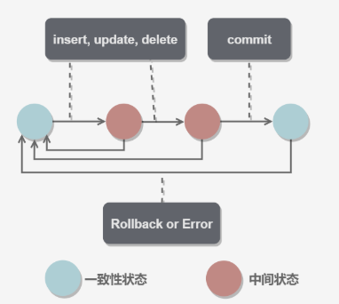
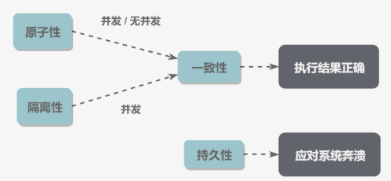
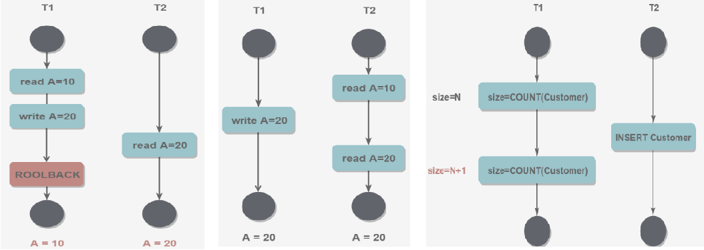
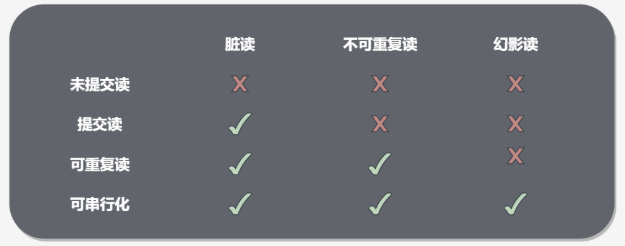

## 事务的概念

事务（transaction）指将一步或多步操作看成一个整体，要么全部执行成功，要么全部回滚。

事务用于**解决数据库在并发情况下的并发一致性问题**。(阐述脏读 不可重复读 幻读)

基本术语：

- 回滚（rollback）指撤销指定 SQL 语句的执行过程；
- 提交（commit）指将未存储的 SQL 语句结果写入数据库表；
- 保留点（savepoint）指事务处理中设置的临时占位符（placeholder），你可以对它发布回退（与回退整个事务处理不同）。



## 事务的四大特性

原子性（Atomicity）、一致性（Consistency）、隔离性（Isolation）和持续性（Durability）。简称为ACID。

**原子性**：事务的多个操作看作整体，即**不可再分**的最小执行单元。事务中的所有操作要么全部提交成功，要么全部回滚。

> 原子性用`Undo Log`保证，undo log记录了数据的**逻辑修改**的反操作，在事务失败时会执行这些反向操作来回滚。
>

**一致性**：数据库总是从一个一致性状态转移到另一个一致性状态。

**隔离性**：一个事务所做的修改，在最终提交前，对其它事务是不可见的。

**持久性**：事务一旦提交，其所作的修改就会永久保存到数据库中。即使系统崩溃，修改的数据也不会丢失。

> 持久性由`Redo log`保证，与undo log记录数据的逻辑修改不同，redo log记录的是数据页的**物理修改**。若系统宕机，可以用Redo Log进行恢复，从而实现持久性。
>

事务的 ACID 特性概念简单，但不是很好理解，主要是因为这几个特性不是一种平级关系：

- 只有满足一致性，事务的执行结果才是正确的。
- 在无并发的情况下，事务串行执行，隔离性一定能够满足。此时只要能满足原子性，就一定能满足一致性。
- 在并发的情况下，多个事务并行执行，事务不仅要满足原子性，还需要满足隔离性，才能满足一致性。
- 事务满足持久化是为了能应对系统崩溃的情况。



> 只有Innodb引擎支持事务。事务只对DML语句有效，对DDL语句无效，因为DDL语句是不能回滚的。
>

## 事务的隔离级别

### 并发一致性问题

**事务安全问题本质上就是线程安全问题**。对于同时运行的多个事务，当这些事务访问数据库中相同的数据时，如果没有采取必要的隔离机制，就会导致各种线程不安全问题，也称为**并发一致性问题**：

- **脏读**: 对于两个事务 T1, T2, T<sub>1</sub> 修改一个数据，T<sub>2</sub> 随后读取这个数据。如果 T<sub>1</sub> 撤销了这次修改，那么 T<sub>2</sub> 读取的数据是脏数据。
- **不可重复读**: 对于两个事务 T1, T2, T<sub>2</sub> 读取**表中一行数据**，T<sub>1</sub> **对该行数据做了修改**。如果 T<sub>2</sub> 再次读取这行数据，此时读取的结果和第一次读取的结果不同。
- **幻读:** 对于两个事务 T1, T2, T<sub>1</sub> 读取**表中某个范围的数据**，T<sub>2</sub> 在这个范围内**插入新的数据**，T<sub>1</sub> 再次读取这个范围的数据，此时读取的结果和和第一次读取的结果不同。



> 不可重复读和幻读：
>
> - 不可重复读是指在一个事务内，多次读同一行数据，数据发生了变化
> - 幻读是指同一个事务内多次查询返回的结果集不一致。
>

### MySQL的事务隔离级别

并发不一致性的主要原因是**破坏了事务的隔离性**，解决方法是通过**并发控制**来保证隔离性。并发控制可以通过锁来实现，但是锁需要用户自己控制，相当复杂。数据库管理系统提供了事务的隔离级别，让用户以一种更轻松的方式处理并发一致性问题。

Mysql 支持4种事务隔离级别。**默认为: REPEATABLE-READ**

(到底是三段锁的读已提交只加读锁，可重复读读的过程加写锁，读完释放写锁，可串行化事务整个过程加读写锁，还是可重复读才加行锁，可序列化加表锁)

| 隔离级别         | 描述                                                                                                         |
| ---------------- | ------------------------------------------------------------------------------------------------------------ |
| READ-UNCOMMITTED | 允许事务读取其他事务未提交的数据，脏读、不可重复读、幻读的问题都会出现                                       |
| READ-COMMITTED   | 只允许事务读取其他事务已经提交的数据，可以避免脏读，但是不可重复读、幻读的问题仍然会出现                     |
| REPEATABLE-READ  | 对读取的表添加了**行锁**，保证了事务对一行数据的独占，可以避免脏读和不可重复读，但幻读的问题仍然存在。       |
| SERIALIZABLE     | 对读取的表进行**锁表**，在事务对一个表进行操作时，禁止其他事务对该表执行读写，相当于串行执行，性能十分低下。 |



> 快照读的幻读：repeatable-read模式通过mvcc解决了快照读的问题，但不能解决当前读的幻读
>
> 当前读的幻读：gap 锁解决
>

每启动一个 mysql 程序, 就会获得一个单独的数据库连接. 每个数据库连接都有一个变量 @@tx_isolation, 表示当前的事务隔离级别.

与隔离级别相关的操作：

- 查看当前的隔离级别: SELECT @@tx_isolation;
- 查看全局的隔离级别：select @@global.tx_isolation;
- 设置当前 mySQL 连接的隔离级别: set tx_isolation ='repeatable-read';
- 设置数据库系统的全局的隔离级别: set global tx_isolation ='read-committed';

### 事务的开启与关闭

MySQL 的事务提交**默认是隐式提交**，每执行一条语句就把这条语句当成一个事务然后进行提交。

要想关闭自动提交，有两个方法：

①`set auto_commit = false;`

此后，每一组sql语句只有遇到commit才会将改动作用到数据库，或者rollback回滚操作。

这个语句的作用持续到这一整次连接：直到退出或set auto_commit = true;

②`start transaction;`

出现 START TRANSACTION 语句时，会关闭隐式提交；当 COMMIT 或 ROLLBACK 语句执行后，事务会自动关闭，重新恢复隐式提交。

不能回退 SELECT 语句，回退 SELECT 语句也没意义；也不能回退 CREATE 和 DROP 语句。

如果没有设置保留点，ROLLBACK 会回退到 START TRANSACTION 语句处；如果设置了保留点，并且在 ROLLBACK 中指定该保留点，则会回退到该保留点。

```mysql
START TRANSACTION
// ...
SAVEPOINT delete1
// ...
ROLLBACK TO delete1
// ...
COMMIT
```