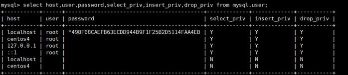

## 登录

`mysql -h 主机名 -P 端口号 -u 用户名 -p密码`

例如：mysql -h localhost -P 3306 -u root -p123456

注意：

（1）**-p与密码之间不能有空格**，其他参数名与参数值之间可以有空格也可以没有空格

```
mysql -hlocalhost -P3306 -uroot -proot
```

（2）密码建议在下一行输入

```
mysql -h localhost -P 3306 -u root -p
```

```
Enter password:****
```

（3）如果是连本机：-hlocalhost就可以省略，如果端口号没有修改：-P3306也可以省略

```shell
[atguigu@hadoop102 ~]$mysql -u root -p
Enter password:****

Welcome to the MySQL monitor.  Commands end with ; or \g.
Your MySQL connection id is 2
Server version: 5.6.24 MySQL Community Server (GPL)

Copyright (c) 2000, 2015, Oracle and/or its affiliates. All rights reserved.

Oracle is a registered trademark of Oracle Corporation and/or its
affiliates. Other names may be trademarks of their respective
owners.

Type 'help;' or '\h' for help. Type '\c' to clear the current input statement.

mysql>
```

连接成功后，有关于MySQL Server服务版本的信息，还有第几次连接的id标识。

也可以在命令行通过以下方式获取MySQL Server服务版本的信息

```shell
[atguigu@hadoop102 ~]$ mysql -V
mysql  Ver 14.14 Distrib 5.6.24, for Linux (x86_64) using  EditLine wrapper
```

或**登录**后，通过以下方式查看当前版本信息：

```shell
mysql> select version();
+-----------+
| version() |
+-----------+
| 5.6.24    |
+-----------+
```

使用远程工具连接Linux MySQL：

1）关闭Linux的防火墙

2）授权远程连接的用户和密码

3）使用授权的账户和密码通过SQLyog或Navicat连接

## 权限系统的工作原理

MySQL的权限系统通过两个阶段进行认证：

- 身份认证：判断用户身份是否合法
- 权限认证：每个合法用户拥有不同的权限，只能在权限允许范围内操作数据库

### 身份认证

MySQL通过IP地址和用户名联合进行确认：同一个用户名若来自不同的IP，则视为不同用户

```mysql
root@localhost：用户root只能从本机进行连接，才能通过认证，从其他任何主机对数据库进行访问都会被拒绝
root@%：用户root可以通过任意主机访问数据库【创建用户时设置了Enable root access from remote machines】
```

### 权限表的存取

在权限存取的两个过程中，系统会用到”mysql”数据库中user和db、host这三个最重要的权限表。

user表中的权限是针对所有数据库的，db表存储了某个用户对一个数据库的权限，host表中存储了某个主机对数据库的操作权限，配合db表对给定主机上数据库级操作权限做更细致的控制；但是很少用，新版本已经取消了host表。

当用户进行连接时，权限表的存取过程有一些两个阶段：

- 先从user表中的host、user和password这3个字段中判断连接的IP、用户名和密码是否存在与表中，如果存在，则通过身份验证，否则拒绝连接。
- 如果通过身份验证，则按照一些权限表的顺序得到数据库权限：user->db->tables_priv->columns_priv。在这几个权限表中，权限范围依次递减，全局权限覆盖局部权限。
- 当用户通过权限认证，进行权限分配是时先检查全局权限表user，如果user中对应权限为Y，则此用户对所有数据库的权限都为Y，将不再检查db、tables_priv和columns_priv；如果为N，则到db表中检查此用户对应的具体数据库，并得到db中为Y的权限，如果db中相应权限为N，则检查tables_priv中此数据库对应的具体表，取得表中为Y的权限，如果tables_priv中相应的权限为N，则检查columns_priv中此表对应的具体列，取得列中为Y的权限。

## 用户管理和授权管理

### 1.用户管理：

| 创建用户   | create  user 'username' @ 'IP' [identified by 'password'];     |
| ---------- | -------------------------------------------------------------- |
| 删除用户   | drop  user 'username' @ 'IP';                                  |
| 修改用户名 | rename  user 'username' @ 'IP' to 'username1' @ 'IP1';         |
| 修改密码   | set  password for 'username' @ 'IP' =Password('new password'); |

关于IP：

| 用户名@IP地址      | 用户只能在该IP下才能访问                    |
| ------------------ | ------------------------------------------- |
| 用户名@192.168.1.% | 用户只能在该IP段下才能访问(通配符%表示任意) |
| 用户名@%           | 用户可以在任意IP下访问(默认IP地址为%)       |

PS:用户权限相关数据保存在mysql.user表中，可以直接对其进行操作，但不推荐。

| 命令                                                                          | 描述                                     | 备注                                                                          |
| ----------------------------------------------------------------------------- | ---------------------------------------- | ----------------------------------------------------------------------------- |
| create user zhang3 identified by '123123';                                    | 创建名称为zhang3的用户，密码设为123123； |                                                                               |
| select host,user,password,select_priv,insert_priv,drop_priv  from mysql.user; | 查看用户和权限的相关信息                 |                                                                               |
| set  password =password('123456')                                             | 修改当前用户的密码                       |                                                                               |
| update  mysql.user set password=password('123456') where user='li4';          | 修改其他用户的密码                       | 所有通过user表的修改，必须用flush privileges;命令才能生效                     |
| update  mysql.user set user='li4' where user='wang5';                         | 修改用户名                               | 所有通过user表的修改，必须用flush privileges;命令才能生效                     |
| drop user  li4                                                                | 删除用户                                 | 不要通过delete from user  u where user='li4' 进行删除，系统会有残留信息保留。 |

示例：

**host** :表示连接类型

```
% 表示所有远程通过 TCP方式的连接
```

```
IP 地址 如 (192.168.1.2,127.0.0.1) 通过制定ip地址进行的TCP方式的连接
```

```
机器名  通过制定i网络中的机器名进行的TCP方式的连接
```

```
::1  IPv6的本地ip地址 等同于IPv4的 127.0.0.1
```

```
localhost 本地方式通过命令行方式的连接 ，比如mysql -u xxx -p 123xxx 方式的连接。
```

**user**:表示用户名

```
同一用户通过不同方式链接的权限是不一样的。
```

**password**:密码

```
所有密码串通过password(明文字符串) 生成的密文字符串。加密算法为MYSQLSHA1，不可逆 。
```

```
mysql 5.7 的密码保存到 authentication_string字段中不再使用password字段。
```

**select_priv , insert_priv**等：为该用户所拥有的权限。

**忘记密码怎么办**

```
启动免授权服务端：mysqld --skip-grant-tables
再登录：mysql -u root -p
```

修改用户名密码：

```
update mysql.user set authentication_string=password('666') where user='root';
flush privileges;
```

### 2.授权管理：

| 查看权限 | show  grants for 'username' @ 'IP';                              |
| -------- | ---------------------------------------------------------------- |
| 授权     | grant 权限 on db.t1 to 'username' @ 'IP' [identified by '密码']; |
| 撤销授权 | revoke 权限 on db.t1 from 'username' @ 'IP';                     |

示例：

```shell
# 给li4用户用本地命令行方式下，授予atguigudb这个库下的所有表的插删改查的权限。
grant select,insert,delete,drop on atguigudb.* to li4@localhost;
# 授予通过网络方式登录的的joe用户 ，对所有库所有表的全部权限，密码设为123.
grant all privileges on *.* to joe@'%'  identified by '123';
```

常用权限：

| all privileges           | 除grant外的所有权限                                                                 |
| ------------------------ | ----------------------------------------------------------------------------------- |
| select                   | 仅查权限                                                                            |
| select,insert            | 查和插入权限                                                                        |
| usage                    | 无访问权限                                                                          |
| alter                    | 使用alter table                                                                     |
| alter routine            | 使用alter procedure和drop procedure                                                 |
| create                   | 使用create table                                                                    |
| create routine           | 使用create procedure                                                                |
| create temporary  tables | 使用create temporary tables                                                         |
| create user              | 使用create user、drop user、rename user和revoke all  privileges                     |
| create view              | 使用create view                                                                     |
| delete                   | 使用delete                                                                          |
| drop                     | 使用drop table                                                                      |
| execute                  | 使用call和存储过程                                                                  |
| file                     | 使用select into outfile 和  load data infile                                        |
| grant option             | 使用grant 和 revoke                                                                 |
| index                    | 使用index                                                                           |
| insert                   | 使用insert                                                                          |
| lock tables              | 使用lock table                                                                      |
| process                  | 使用show full processlist                                                           |
| select                   | 使用select                                                                          |
| show databases           | 使用show databases                                                                  |
| show view                | 使用show view                                                                       |
| update                   | 使用update                                                                          |
| reload                   | 使用flush                                                                           |
| shutdown                 | 使用mysqladmin shutdown(关闭MySQL)                                                  |
| super                    | 使用change  master、kill、logs、purge、master和set global。还允许mysqladmin调试登陆 |
| replication client       | 服务器位置的访问                                                                    |
| replication slave        | 由复制从属使用                                                                      |