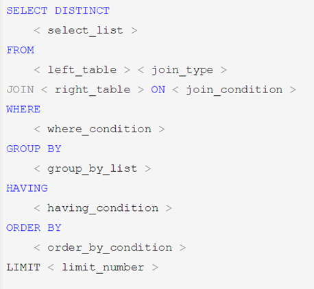
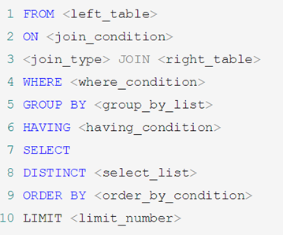

## SQL语言概述

SQL：Structure Query Language结构化查询语言，它是使用关系模型的数据库应用语言，由IBM上世纪70年代开发出来。后由美国国家标准局（ANSI）开始着手制定SQL标准，先后有SQL-86，SQL-89，SQL-92，SQL-99等标准。各个 DBMS 都有自己的实现，如 PL/SQL、Transact-SQL 等。

### SQL的语言规范

mysql对于SQL语句不区分大小写，**SQL语句关键字尽量大写**

值，除了数值型，字符串型和日期时间类型使用单引号（’’）

别名，尽量使用双引号（“”)或反引号(``)，而且不建议省略as

所有标点符号使用英文状态下的半角输入方式

必须保证所有(),单引号，双引号是成对结束的

MySQL支持三种注释：

```mysql
# 单行注释

-- 单行注释

/* 多行
注释 */
```

命名规则：

数据库、表名不得超过30个字符，变量名限制为29个

必须只能包含 A–Z, a–z, 0–9, _共63个字符

必须不能和用户定义的其他对象重名

必须保证你的字段没有和保留字、数据库系统或常用方法冲突

保持字段名和类型的一致性,在命名字段并为其指定数据类型的时候一定要保证一致性。假如数据类型在一个表里是整数,那在另一个表里可就别变成字符型了

### SQL语言分类

- DDL（Data Definition Languages)：数据定义语言，**schema元数据相关**。这些语句定义了不同的数据段、数据库、表、列、索引等数据库结构对象。主要的语句关键字包括create、drop、alter等。
- DML（Data Manipulation Language）：数据操控语句，**增删改查**，并检查数据完整性。主要的语句关键字包括insert、delete、update、select等。
- DCL（Data Control Language）：数据控制语句，**权限相关**。用于控制不同数据段直接的许可和访问级别的语句。这些语句定义了数据库、表、字段、用户的访问权限、事务和安全级别。主要的语句关键字包括grant、revoke等。

## DDL

### 操作数据库

| 显示数据库     | show databases; -->显示所有数据库           |
| -------------- | ------------------------------------------- |
| 创建数据库     | create  database db [default charset=utf8]; |
| 删除数据库     | drop  database db;                          |
| 使用数据库     | use db;                                     |
| 查看当前数据库 | select  database();                         |

### 操作表

显示表：

```mysql
show tables; -->显示库中所有表
show tables from database1; -->查看库database1中的表，可用于在一个库中查看其他库的表
desc 表名; --> 查看表格属性
show create table 表名; -->显示建表语句
```

创建表：

```mysql
create table t1(
	id int, 
	name char(10)
	) [engine=InnoDB default charset=utf8]; -- 创建一个含有id和name两列的空表
# 建表时可以添加约束，如：
id int null/not null; 表示此列可/不可为空；
id int null default 1;表示默认值为1
id int null auto_increment [primary key];表示该列每行自增；
# 早期版本的MySQL插入中文内容要设置编码为utf8，MySQL 8.0已经默认是utf8编码了。
# engine主要有InnoDB和MyISAM。
```

修改表：

```mysql
# 修改表名：
alter table 表名 rename 新表名; 或rename table 表名 to 新表名;

# 添加列：
alter table 表名 add [column] 列名 类型 [default 默认值][not null]; # 默认添加在最后
alter table 表名 add [column] 列名 类型 [default 默认值][not null] after 某列;
alter table 表名 add [column] 列名 类型 [default 默认值][not null] first;

# 删除列：
alter table 表名 drop [column] 列名；

# 修改列：
# 修改数据类型
alter table 表名 alter column 列名 类型；
# 修改数据类型、默认值、是否非空
alter table 表名 modify [column] 列名 类型 [default 默认值][not null];
alter table 表名 modify [column] 列名 类型 [default 默认值][not null] after 某列;
alter table 表名 modify [column] 列名 类型 [default 默认值][not null] first;
# 修改列名，同时也可修改数据类型、默认值、是否非空
alter table 表名 change [column] 原列名 新列名 类型[default 默认值][not null];

# 添加主键：
alter table 表名 add primary key(列名)；
# 删除主键：
alter table 表名 drop primary key;
# 添加外键：
alter table 从表 add [constraint 外键名称(形如：FK_从表_主表)] foreign key 从表(外键字段) references 主表(主键字段);
# 删除外键：
alter table 表名 drop foreign key 外键名称;

#修改默认值：
ALTER TABLE testalter_tbl ALTER i SET DEFAULT 1000;
#删除默认值：
ALTER TABLE testalter_tbl ALTER i DROP DEFAULT;

# 修改当前自增值： 
alter table 表名 auto_increment= 10；
# 设置自增初始值：
set session auto_increment_offset=1; #会话级别
set global auto_increment_offset=1; #全局级别
# 设置自增步长：
set session auto_increment_increment=2； #会话级别
set global auto_increment_increment=2; #全局级别，所有列表的自增步长默认都为2
```

删除表：

```mysql
drop table 表名; # 数据和结构都被删除，所有正在运行的相关事务被提交，所有相关索引被删除，操作不能回滚
```

## DML

### 增：

- 插入的值可以是常量、表达式、函数
- 若插入的表存在外键，应保证插入外键列的值已经存在于主表中

```mysql
# 向t1表中插入完整记录，字段要一一对应，每个字段都要显式给出
insert into t1 values(1,'Jany',21); 
```

> - InnoDB中的自增列：可以指定其他值，若指定为null或0，则视为自增长
> - 默认值列：可以指定其他值，要用默认值填入default
> - 可空列：可以指定其他非空值，也可填入null。
>

```mysql
# 向t1表中指定字段插入内容
insert into t1(id, name)  values(1, 'kevin');
insert into t1(id, name) values(v1,v1),(v2,v2),(v3,v3)…;# 一次插入多条数据
```

> 指定字段必须显式赋值，未出现在指定字段中，则自增列自增长、默认值列取默认值、允许为空的值填NULL，其他值非空列取该数据类型的默认值：字符串取空串，int取0。
>

### 删：

```mysql
#清空表
delete from 表名;
truncate [table] 表名；

# 删除满足条件的记录
delete from 表名 where 条件;
```

> delete from 和truncate的区别：
>
> - delete from可以和where语句配合，实现选择性删除；
> - delete from 语句会返回受影响的行数，truncate不会；
> - delete from不会删除索引，truncate将表完全更新，不保留索引和水平线；
> - delete是一行一行的删除数据，truncate直接粉碎数据，truncate更快。
> - 在事务方面，truncate是不可以rollback的，delete可以rollback；
> - 在触发器方面：truncate 不能触发任何Delete触发器。
>

### 改

```mysql
update 表名 set 列1 = 值1, 列2 = 值2, ... [where 条件]; 
```

> 1. 没有where条件时，会作用到指定列的所有数据
> 2. 值可以是常量、表达式、函数
> 3. 可以同时更新多张表
> 4. 修改从表的外键列的值，要保证新值已存在于主表的参考字段中
> 5. 修改主表的被参考列的值，注意旧值没有被从表依赖，若被依赖：
>    - 外键定义为on update restrict或on update no action：除非修改从表，否则无法修改主表该参考列值
>    - 外键定义为on update cascade或on update set null：可以直接修改主表，并连带修改从表的值
>

### 查

```mysql
# 从表中查找满足条件的所有记录中指定列的内容，缺省where对所有记录生效
select 列名 from 表名[where 条件];
select * from 表名 [where 条件]；
select id,name,gender as ctt from t1 where id > 1; # 选择多列并取别名。

# 从database1的t1表中查找column列的内容，可用于在一个数据库中查看其他数据库中的表
select column from database1.t1;

# 完整语句：
select [distinct] 列名1，列名2，… 
from 表名或视图名
[where 条件]
[group by 字段名 [having 条件]]
[order by 字段名 [asc|desc]]
[limit m,n];
```

> select后的查询列表，可以是表中的字段、常量、表达式、函数
>
> 查询结果是一个虚表
>

### select后的5个子句：

where：用于从表中筛选满足条件的行，**where后不能有分组函数**

group by：用于将记录分组，常常与分组函数一起使用

having：只能跟在group by后，用于筛选，**having后可以跟分组函数**

order by：根据规则排序

```mysql
order by 列1 [desc|asc], 列2 [desc|asc]; #先根据列1的值排序，若值相同再根据列2排序
```

> 默认是升序排序
>
> 表达式、函数、别名等也可以用于排序，如：order by AVG(salary);
>

limit ：限制显示记录的行数，可用于分页.

```mysql
# 每页显示m条，显示第n页的数据：
select * from 表 limit (n - 1)*m, m;

select * from 表 limit 5;            # 前5行
select * from 表 limit 4,5;          # 从第4行开始的5行
select * from 表 limit 5 offset 4;   # 从第4行开始的5行
```

注：

1. where、group by、having、order by、limit的顺序不能乱。
2. where和having的区别：
   -    - where后面不能跟分组函数，having后可以跟分组函数
   -    - where用于对原表中记录的筛选，having用于group by产生的分组结果的筛选。

### SQL的执行顺序

书写sql语句的顺序：



sql语句的执行顺序：



### 分组函数

```mysql
sum([distinct] expression)  : 该列所有值求和
count([distinct] expression)：count(列)返回该列非空值的个数，count(*)/count(1)返回非空行的行数
avg([distinct] expression)
max([distinct] expression)
min([distinct] expression)
```

> expression可以是字段、常量、表达式、函数等
>

count(*)和count(1)的区别：

- myisam表,没有区别的，这种引擎内部有一计数器在维护着行数.
- InnoDB表，用count(*)直接读行数效率很低，因为innodb真的要去数一遍.

## DCL

见["2.MySQL权限与用户"](siyuan://blocks/20210325142846-uaryh04)

> ## 登录
>
> `mysql -h 主机名 -P 端口号 -u 用户名 -p密码`
>
> 例如：mysql -h localhost -P 3306 -u root -p123456
>
> 注意：
>
> （1）**-p与密码之间不能有空格**，其他参数名与参数值之间可以有空格也可以没有空格
>
> ```
> mysql -hlocalhost -P3306 -uroot -proot
> ```
>
> （2）密码建议在下一行输入
>
> ```
> mysql -h localhost -P 3306 -u root -p
> ```
>
> ```
> Enter password:****
> ```
>
> （3）如果是连本机：-hlocalhost就可以省略，如果端口号没有修改：-P3306也可以省略
>
> ```shell
> [atguigu@hadoop102 ~]$mysql -u root -p
> Enter password:****
>
> Welcome to the MySQL monitor.  Commands end with ; or \g.
> Your MySQL connection id is 2
> Server version: 5.6.24 MySQL Community Server (GPL)
>
> Copyright (c) 2000, 2015, Oracle and/or its affiliates. All rights reserved.
>
> Oracle is a registered trademark of Oracle Corporation and/or its
> affiliates. Other names may be trademarks of their respective
> owners.
>
> Type 'help;' or '\h' for help. Type '\c' to clear the current input statement.
>
> mysql>
> ```
>
> 连接成功后，有关于MySQL Server服务版本的信息，还有第几次连接的id标识。
>
> 也可以在命令行通过以下方式获取MySQL Server服务版本的信息
>
> ```shell
> [atguigu@hadoop102 ~]$ mysql -V
> mysql  Ver 14.14 Distrib 5.6.24, for Linux (x86_64) using  EditLine wrapper
> ```
>
> 或**登录**后，通过以下方式查看当前版本信息：
>
> ```shell
> mysql> select version();
> +-----------+
> | version() |
> +-----------+
> | 5.6.24    |
> +-----------+
> ```
>
> 使用远程工具连接Linux MySQL：
>
> 1）关闭Linux的防火墙
>
> 2）授权远程连接的用户和密码
>
> 3）使用授权的账户和密码通过SQLyog或Navicat连接
>
> ## 权限系统的工作原理
>
> MySQL的权限系统通过两个阶段进行认证：
>
> - 身份认证：判断用户身份是否合法
> - 权限认证：每个合法用户拥有不同的权限，只能在权限允许范围内操作数据库
>
> ### 身份认证
>
> MySQL通过IP地址和用户名联合进行确认：同一个用户名若来自不同的IP，则视为不同用户
>
> ```mysql
> root@localhost：用户root只能从本机进行连接，才能通过认证，从其他任何主机对数据库进行访问都会被拒绝
> root@%：用户root可以通过任意主机访问数据库【创建用户时设置了Enable root access from remote machines】
> ```
>
> ### 权限表的存取
>
> 在权限存取的两个过程中，系统会用到”mysql”数据库中user和db、host这三个最重要的权限表。
>
> user表中的权限是针对所有数据库的，db表存储了某个用户对一个数据库的权限，host表中存储了某个主机对数据库的操作权限，配合db表对给定主机上数据库级操作权限做更细致的控制；但是很少用，新版本已经取消了host表。
>
> 当用户进行连接时，权限表的存取过程有一些两个阶段：
>
> - 先从user表中的host、user和password这3个字段中判断连接的IP、用户名和密码是否存在与表中，如果存在，则通过身份验证，否则拒绝连接。
> - 如果通过身份验证，则按照一些权限表的顺序得到数据库权限：user->db->tables_priv->columns_priv。在这几个权限表中，权限范围依次递减，全局权限覆盖局部权限。
> - 当用户通过权限认证，进行权限分配是时先检查全局权限表user，如果user中对应权限为Y，则此用户对所有数据库的权限都为Y，将不再检查db、tables_priv和columns_priv；如果为N，则到db表中检查此用户对应的具体数据库，并得到db中为Y的权限，如果db中相应权限为N，则检查tables_priv中此数据库对应的具体表，取得表中为Y的权限，如果tables_priv中相应的权限为N，则检查columns_priv中此表对应的具体列，取得列中为Y的权限。
>
> ## 用户管理和授权管理
>
> ### 1.用户管理：
>
> | 创建用户   | create  user 'username' @ 'IP' [identified by 'password'];     |
> | ---------- | -------------------------------------------------------------- |
> | 删除用户   | drop  user 'username' @ 'IP';                                  |
> | 修改用户名 | rename  user 'username' @ 'IP' to 'username1' @ 'IP1';         |
> | 修改密码   | set  password for 'username' @ 'IP' =Password('new password'); |
>
> 关于IP：
>
> | 用户名@IP地址      | 用户只能在该IP下才能访问                    |
> | ------------------ | ------------------------------------------- |
> | 用户名@192.168.1.% | 用户只能在该IP段下才能访问(通配符%表示任意) |
> | 用户名@%           | 用户可以在任意IP下访问(默认IP地址为%)       |
>
> PS:用户权限相关数据保存在mysql.user表中，可以直接对其进行操作，但不推荐。
>
> | 命令                                                                          | 描述                                     | 备注                                                                          |
> | ----------------------------------------------------------------------------- | ---------------------------------------- | ----------------------------------------------------------------------------- |
> | create user zhang3 identified by '123123';                                    | 创建名称为zhang3的用户，密码设为123123； |                                                                               |
> | select host,user,password,select_priv,insert_priv,drop_priv  from mysql.user; | 查看用户和权限的相关信息                 |                                                                               |
> | set  password =password('123456')                                             | 修改当前用户的密码                       |                                                                               |
> | update  mysql.user set password=password('123456') where user='li4';          | 修改其他用户的密码                       | 所有通过user表的修改，必须用flush privileges;命令才能生效                     |
> | update  mysql.user set user='li4' where user='wang5';                         | 修改用户名                               | 所有通过user表的修改，必须用flush privileges;命令才能生效                     |
> | drop user  li4                                                                | 删除用户                                 | 不要通过delete from user  u where user='li4' 进行删除，系统会有残留信息保留。 |
>
> 示例：
>
> **host** :表示连接类型
>
> ```
> % 表示所有远程通过 TCP方式的连接
> ```
>
> ```
> IP 地址 如 (192.168.1.2,127.0.0.1) 通过制定ip地址进行的TCP方式的连接
> ```
>
> ```
> 机器名  通过制定i网络中的机器名进行的TCP方式的连接
> ```
>
> ```
> ::1  IPv6的本地ip地址 等同于IPv4的 127.0.0.1
> ```
>
> ```
> localhost 本地方式通过命令行方式的连接 ，比如mysql -u xxx -p 123xxx 方式的连接。
> ```
>
> **user**:表示用户名
>
> ```
> 同一用户通过不同方式链接的权限是不一样的。
> ```
>
> **password**:密码
>
> ```
> 所有密码串通过password(明文字符串) 生成的密文字符串。加密算法为MYSQLSHA1，不可逆 。
> ```
>
> ```
> mysql 5.7 的密码保存到 authentication_string字段中不再使用password字段。
> ```
>
> **select_priv , insert_priv**等：为该用户所拥有的权限。
>
> **忘记密码怎么办**
>
> ```
> 启动免授权服务端：mysqld --skip-grant-tables
> 再登录：mysql -u root -p
> ```
>
> 修改用户名密码：
>
> ```
> update mysql.user set authentication_string=password('666') where user='root';
> flush privileges;
> ```
>
> ### 2.授权管理：
>
> | 查看权限 | show  grants for 'username' @ 'IP';                              |
> | -------- | ---------------------------------------------------------------- |
> | 授权     | grant 权限 on db.t1 to 'username' @ 'IP' [identified by '密码']; |
> | 撤销授权 | revoke 权限 on db.t1 from 'username' @ 'IP';                     |
>
> 示例：
>
> ```shell
> # 给li4用户用本地命令行方式下，授予atguigudb这个库下的所有表的插删改查的权限。
> grant select,insert,delete,drop on atguigudb.* to li4@localhost;
> # 授予通过网络方式登录的的joe用户 ，对所有库所有表的全部权限，密码设为123.
> grant all privileges on *.* to joe@'%'  identified by '123';
> ```
>
> 常用权限：
>
> | all privileges           | 除grant外的所有权限                                                                 |
> | ------------------------ | ----------------------------------------------------------------------------------- |
> | select                   | 仅查权限                                                                            |
> | select,insert            | 查和插入权限                                                                        |
> | usage                    | 无访问权限                                                                          |
> | alter                    | 使用alter table                                                                     |
> | alter routine            | 使用alter procedure和drop procedure                                                 |
> | create                   | 使用create table                                                                    |
> | create routine           | 使用create procedure                                                                |
> | create temporary  tables | 使用create temporary tables                                                         |
> | create user              | 使用create user、drop user、rename user和revoke all  privileges                     |
> | create view              | 使用create view                                                                     |
> | delete                   | 使用delete                                                                          |
> | drop                     | 使用drop table                                                                      |
> | execute                  | 使用call和存储过程                                                                  |
> | file                     | 使用select into outfile 和  load data infile                                        |
> | grant option             | 使用grant 和 revoke                                                                 |
> | index                    | 使用index                                                                           |
> | insert                   | 使用insert                                                                          |
> | lock tables              | 使用lock table                                                                      |
> | process                  | 使用show full processlist                                                           |
> | select                   | 使用select                                                                          |
> | show databases           | 使用show databases                                                                  |
> | show view                | 使用show view                                                                       |
> | update                   | 使用update                                                                          |
> | reload                   | 使用flush                                                                           |
> | shutdown                 | 使用mysqladmin shutdown(关闭MySQL)                                                  |
> | super                    | 使用change  master、kill、logs、purge、master和set global。还允许mysqladmin调试登陆 |
> | replication client       | 服务器位置的访问                                                                    |
> | replication slave        | 由复制从属使用                                                                      |
>


## 其他

### AS

as用于给字段、表名、表达式等取别名，as可以省略，如：

```mysql
select dept_id as d, dept_name as n ...
select * from t1 as A, t1 as B where A.id = B.pid;
```

注：

- 如果给字段取别名，如果别名中包含特殊字符，例如空格，建议给别名加上双引号或单引号。
- 如果给表名取别名，不能加双引号或单引号，也不能用空格等特殊符号。

### DISTINCT

distinct 用于去重

```mysql
select distinct dept_id from employees;
```

### 着重号：``

当字段名或表名与关键字一样时，可以加着重号以示区分。

```mysql
select `name` from employees;
```

### 输出到文件

`select ... INTO OUTFILE '路径';`

若报错：`The MySQL server is running with the --secure-file-pri option so it cannot execute this.`

报错原因：mysql文件的导入和导出路径有默认的设置，即 secure-file-priv,当传入的csv文件路径与默认的路径冲突时就会报错。

secure-file-priv的值有三种情况：

secure_file_prive=null ––限制mysqld 不允许导入导出

secure_file_priv=/path/ – --限制mysqld的导入导出只能发生在默认的/path/目录下

secure_file_priv=’’ – --不对mysqld 的导入 导出做限制

step1:查看你的secure-file-priv设置：show variables like ‘%secure%’;

输出默认值path

step2:找到名为my的配置设置文件：

我这里的my文件在step3里查找的路径下：C:\ProgramData\MySQL\MySQL Server 8.0\my

step3: 打开my文件，ctrl+f找到关键字secure,修改原路径：

把原路径用#注释掉，改为自定义路径，注意路径用的是斜杠，不是反斜杠

我将路径设置成空，意味着不对mysqld 的导入 导出做限制

step4. 设置完了保存，关闭。

step5. 重启mysql

重启方式：打开计算机管理>>服务与应用程序>>服务>>mysql>>右键重新启动>>完成重启

step6:检验secure_file_priv是否设置成功

```sql
show variables like ‘%secure%’;
```

是空的，和刚才设置的一样，表明设置成功！