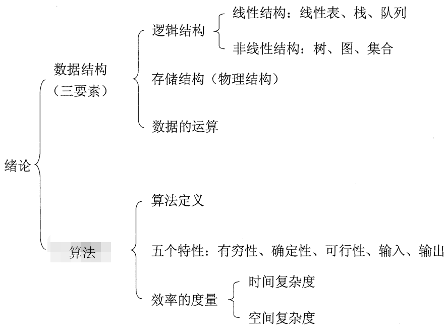
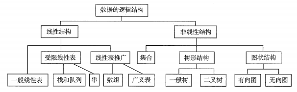
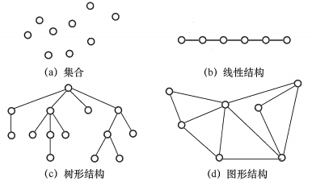

数据结构：相互之间存在一种或多种特定关系的数据元素的集合。

## 数据结构三要素

数据结构的三要素为：逻辑结构、存储结构和数据的运算。

一个算法的设计取决于所选定的逻辑结构，而算法的实现依赖于所采用的存储结构。

### 逻辑结构

逻辑结构是元素之间的逻辑关系，与数据的存储无关，独立于计算机。分为线性结构和非线性结构。

- 集合：结构中的数据元素之间除”同属于一个集合“外，无其他关系。
- 线性结构：结构中的数据元素只存在一对一的关系。
- 树形结构：结构中的数据元素之间存在一对多的关系。
- 图(或网)：结构中的数据元素之间存在多对多的关系。

### 存储结构

存储结构是数据结构在计算机中的表示，也称物理结构。包括数据元素的表示和关系的表示。存储结构是用逻辑结构在特定计算机语言上的实现，它依赖于计算机语言。分为：

- 顺序存储：逻辑上相邻的元素在物理位置上也相邻。
  -   - 优点：随机存取，占用空间少。
  -   - 缺点：只能使用相邻的一整块空间，产生较多外部碎片。
- 链式存储：不要求逻辑上相邻的元素在物理位置上也相邻。
  -   - 优点：不会出现碎片现象，充分利用所有空间。
  -   - 缺点：每个元素因存储指针而占用额外的存储空间，只能实现顺序存取。
- 索引存储：存储元素信息的同时，还建立附加的索引表。索引表中的每项成为索引项，一般形式为(关键字, 地址)。
  -   - 优点：检索速度快
  -   - 缺点：附加的索引表需要额外占用空间。增删数据因修改索引表而花费更多时间。
- 散列存储：根据元素的关键字直接计算出该元素的存储地址，又称哈希(Hash)存储。
  -   - 优点：增删查快
  -   - 缺点：散列函数选择不好可能导致元素存储单元的冲突，解决冲突回增加时间和空间开销。

### 数据的运算

包括运算的定义和实现。运算的定义是针对逻辑结构的，指出运算的功能；运算的实现是针对存储结构的，指出运算的具体操作步骤。

## 算法

算法(Algorithm)是对特定问题求解步骤的一种描述，它是指令的有限序列，其中每条指令表示一个或多个操作。

### 算法的五大特性

- 有穷性：一个算法必须总在执行有穷步之后结束，且每一步都可在有穷时间内完成。
- 确定性：算法中每条治理那个必须有确切的含义，对于相同的输入总是得到相同的输出。
- 可行性：算法中描述的操作都可以通过已经实现的基本运算执行有限次来实现。
- 输入：一个算法可以有零个或多个输入，这些输入取自于某个特定的对象的集合。
- 输出：一个算法可以有一个或多个输出，这些输出是与输入有着某种特定关系的量。

### 一个好的算法的应具有的特点

- 正确性：算法应能够正确地解决求解问题。
- 可读性：算法应具有良好的可读性，以帮助人们理解。
- 健壮性：输入非法数据时，算法能适当地作出反应或进行处理，而不是产生莫名其妙的输出结果。
- 效率与低存储需求：良好的时间复杂度和空间复杂度，两者都与问题的规模有关。

### 算法效率的度量

算法效率通过**时间复杂度**和**空间复杂度**来度量。时间复杂度和空间复杂度都是问题规模n的函数。

时间复杂度：$T(n) = O(f((n)))$

$n$一般指数组元素的个数，基本操作所执行的次数一般为$n$的一个函数$f(n)$，$O$的含义是$T(n)$的数量级。**一般将基本操作的执行次数作为算法时间复杂度的度量**，即取$f(n)$的最高次项并将系数置为1，即为$T(n)$。

严格的数学定义为：若$T(n)$和$f(n)$是定义在正整数集合上的两个函数，则存在正整数$C$和$n_0$，使得当$n≥n_0$时，都满足$0≤T(n)≤Cf(n)$。

当$f(n)$与 $n$无关时，$T(n)=O(1)$，当$f(n)$与$n$是线性关系时，$T(n)=O(n)$，当$f(n)$与$n$是二次方关系时，$T(n)=O(n^2)$，以此类推。

常用的时间复杂度比较：$O(1)≤O(log_2(n)≤O(n)≤O(nlog_2(n))≤O(n^2))≤O(n^3)≤...≤O(n^k)≤O(2^n)$

> 一个算法的时间复杂度为$T(n)=O(n^2)$，表明该算法的执行时间与$n^2$成正比。
>
> 有的算法的时间复杂度不仅与初始输入的数据规模有关，还和数据本身有关。如：一些排序算法，同样有n个带输入数据，但数据初始有序性不同，则基本操作的执行次数也不同。**一般按照使得基本操作执行次数最多的输入来计算时间复杂度，即把最坏情况作为算法时间复杂度的度量。**
>

空间复杂度：$S(n) = O(g(n))$

算法的空间复杂度一般指的是算法在运行时所需的存储空间的度量，**主要考虑在算法运行过程中所占用的临时空间**。

算法所需辅助空间为常数时，称为算法原地工作，即$S(n)=O(1)$。