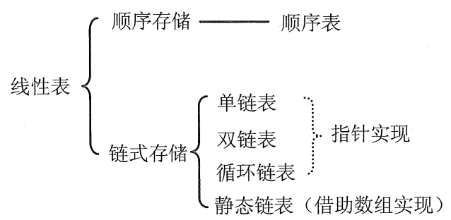

## 线性表的定义与基本操作

### 线性表的定义

线性表是具有**相同数据类型**的n个数据元素的**有限序列**。n为表长，n=0时为空表。除表头元素外，每个元素有且仅有一个直接前驱，除表尾元素外，每个元素有且仅有一个直接后继。

> 线性表是指逻辑结构，表示元素之间一对一的相邻关系。顺序表和链表是线性表这一逻辑结构对应的不同存储结构。
>

### 线性表的基本操作

```java
public class LinearList<T>{
    //1.初始化表：创建一个空的线性表
    public LinearList(int maxSize){}
    //2.求表长
    public int getLength(){}
    //3.按值查找索引
    public int getIndex(T value){}
    //4.按索引查找值
    public T getElement(int index){}
    //5.插入元素：在指定位置上插入元素
    public boolean insert(int index, T value){}
    //6.删除元素：删除指定位置上的元素，并返回该删除值
    public T delete(int index){}
    //7.输出所有元素
    public void printAll(){}
    //8.判空
    public boolean isEmpty(){}
}
```

## 顺序表

顺序表是线性表的顺序存储，用数组实现。

顺序表使用一组地址连续的存储单元存储线性表中的元素。

顺序表的优点是随机访问，即通过首地址和元素序号可在时间O(1)内找到指定元素。

顺序表的存储密度高，每个结点只存储数据元素，没有其他附加信息。

顺序表逻辑上相邻的元素在物理上也相邻，在插入和删除操作时需要移动大量元素。

顺序表的Java实现：

```java
public class AList<T> {
    private T[] items;
    private int size;

    //1.初始化表：创建一个空的线性表
    public AList(int maxSize) {
        items = (T[]) new Object[maxSize];
        size = 0;
    }

    //2.求表长
    public int getLength() {
        return size;
    }

    //3.按值查找索引
    public int getIndex(T value) {
        for (int i = 0; i < items.length; i++) {
            if (items[i] == value) return i; //存在该元素则返回其索引
        }
        return -1; //不存在该元素，返回-1
    }

    //4.按索引查找值
    public T getElement(int index) {
        return items[index];
    }

    //5.添加元素
    public void add(T value){
        if(size==items.length) System.out.println("the list is full, add failed.");
        items[size++] = value;
    }

    //6.插入元素：在指定位置上插入元素
    public boolean insert(int index, T value) {
        //判断索引是否合法
        if (index < 0 || index > items.length) {
            System.out.println("index is invalid");
            return false;
        }
        //判断顺序表是否已满
        if (size == items.length) {
            System.out.println("the list is full");
            return false;
        }
        //从后往前逐个将元素后移一位
        for (int i = items.length - 1; i > index; i--) {
            items[i] = items[i - 1];
        }
        items[index] = value;
        size++;
        return true;
    }

    //7.删除元素：删除指定位置上的元素，并返回该删除值
    public T delete(int index) {
        //判断索引是否合法
        if (index < 0 || index > items.length) {
            System.out.println("index is invalid");
            return null;
        }
        T deleted = items[index];
        //逐个将元素前移一位
        for (int i = index; i < items.length - 1; i++) {
            items[i] = items[i + 1];
        }
        size--;
        return deleted;
    }

    //8.输出所有元素
    public void printAll() {
        for (int i = 0; i < size; i++) {
            System.out.println(items[i]);
        }
    }

    //9.判空
    public boolean isEmpty() {
        return size == 0;
    }
}
```

## 链表

链表以结点的方式存储，每个结点包含 data 域和next 域。

链表的不需要使用地址连续的存储单元，逻辑上相邻的元素在物理位置是不一定相邻。

链表的优点是插入和删除操作不需要移动元素，只需要修改指针。缺点是不能随机存取，且占用额外空间。

链表常常引入一个头结点：指向第一个数据结点，使得链表的第一个数据结点上的操作和其他节点一致。特别是空表和非空表的表示得到了统一。

### 单链表

单链表是线性表的链式存储形式。

单链表(带头结点) 逻辑结构示意图如下

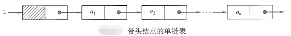

头插法建立单链表：

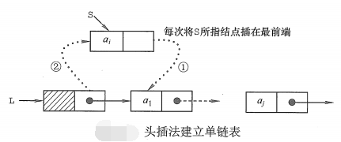

尾插法建立单链表：

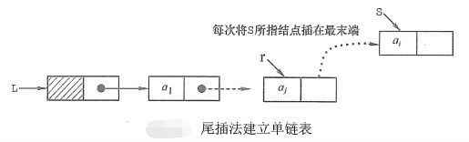

实现代码：单链表元素的增删改查

```java
/**
 * 注意点：
 * 1.内部声明了结点内部类
 * 2.使用头结点作为哨兵sentinel，方便了后续操作
 * 3.链式结构加入元素不用判满，删除元素仍需判空
 * 4.与索引相关的操作都要先判断该索引是否合法
 * 5.删除索引所在的元素，应停留在前一个元素p，删除操作：p.next = p.next.next
 * 6.被删除的节点，若没有被其他引用指向，会被系统回收
 */
public class SLList<T> {
    private class StuffNode {
        public T item;
        public StuffNode next;

        public StuffNode(T item, StuffNode next) {
            this.item = item;
            this.next = next;
        }
    }

    private StuffNode Sentinel;
    private int size;

    public SLList() {
        Sentinel = new StuffNode(null, null);
        size = 0;
    }

    //插入元素
    //头插法：Adds x to the front of the list.
    public void addFront(T x) {
        Sentinel.next = new StuffNode(x, Sentinel.next);
        size += 1;
    }

    //尾插法：Adds x to the end of the list.
    public void addRear(T x) {
        StuffNode p = Sentinel;
        while (p.next != null) {
            p = p.next;
        }
        p.next = new StuffNode(x, null);
        size += 1;
    }

    //删除元素
    public T deleteElement(int i) {
        StuffNode previousNode = seekNode(i);
        T item = previousNode.next.item;
        previousNode.next = previousNode.next.next;
        return item;
    }

    //更改元素
    public void setElement(int i, T value) {
        StuffNode previousNode = seekNode(i);
        previousNode.next.item = value;
    }

    //查找元素
    public T getElement(int i) {
        StuffNode wanted = seekNode(i);
        return wanted.next.item;
    }

    //helper function:判断该索引是否存在，不存在报异常，存在则返回该节点前一个指针
    private StuffNode seekNode(int i) {
        if (i < 0 || i > size - 1) {
            throw new RuntimeException("超出索引范围");
        }
        StuffNode wanted = Sentinel;
        while (i > 0) {
            wanted = wanted.next;
            i--;
        }
        return wanted;
    }


    //get the size of the list.
    public int getSize() {
        return size;
    }

    //Returns the first item in the list.
    public T getFirst() {
        return Sentinel.next.item;
    }

    public void printAllElements() {
        StuffNode p = Sentinel.next;
        while (p != null) {
            System.out.println(p.item);
            p = p.next;
        }
        System.out.println("------------------------------");
    }
}
```

#### 单链表的面试题

##### 1.求单链表中有效节点的个数

```java
public int getLength(){
    int length = 0;
    StuffNode p = Sentinel;
    while(p.next!=null){
        length++;
        p = p.next;
    }
    return length;
}
```

> 可以直接在单链表中设置一个size变量，记录所有节点的长度。
>

##### 2.查找单链表中倒数第k个节点

思路：

1. 遍历整个链表，获取链表长度【若内置一个size变量记录所有节点长度，可以省略此步】
2. 判断索引合法性
3. 倒数第一的索引为size-1，倒数第k的索引为size-k
4. 找到该节点则返回，没找到则返回null

```java
public StuffNode getLastIndexNode(int k) {
        int size = getLength();
        StuffNode p = Sentinel;
        if (k <= 0 || k > size) return null;
        for (int i = 0; i <= size - k; i++) {
            p = p.next;
        }
        return p;
    }
```

##### 3.单链表的反转

思路：创建一个新的单链表n，从头遍历原单链表o，每遍历一个节点，将其头插法到n中。

注意点：p节点一定要将所指节点传给temp并下移，再将节点头插。

```java
public void reversed() {
    //特殊情况：若当前链表为空或只有一个节点，无需反转，直接返回
    // 【本例不需要判断，代码已满足特殊情况】
    StuffNode newHead = new StuffNode(null, null);
    StuffNode p = Sentinel.next;
    StuffNode temp;
    while(p!=null){
        temp = p;
        p = p.next;
        //头插法
        temp.next = newHead.next;
        newHead.next = temp;
    }
    Sentinel.next = newHead.next;
}
```

测试：

```java
public class SLListLauncher {
    public static void main(String[] args) {
        SLList<Integer> arr = new SLList<>();
        arr.addRear(3);
        arr.addRear(4);
        arr.addRear(5);
        arr.addRear(6);
        arr.addRear(7);
        arr.addRear(8);
        arr.printAllElements();
        arr.reversed();
        arr.printAllElements();
    }
}
```

结果:

```java
3
4
5
6
7
8
------------------------------
8
7
6
5
4
3
------------------------------
```

##### 4.从尾到头打印单链表

思路：遍历单链表，将数据保存在栈中，然后输出栈中元素，就实现了从尾到头的遍历

```java
public void reversePrint() {
    Stack<T> stack = new Stack<>();
    StuffNode p = Sentinel.next;
    while (p != null) {
        stack.push(p.item);
        p = p.next;
    }
    while (stack.size() > 0) {  //stack.size()一直在变化，不要用for循环
        System.out.println(stack.pop());
    }
}
```

### 双链表

单链表结点只有一个指向其后继的指针，使得单链表只能从头结点向后遍历。当要对结点p进行插入或删除操作时，必须借助其前驱节点，只能从头开始遍历，非常不方便。而双链表的结点有两个指针：prior和next，以额外空间为代价克服了单链表的这个缺点：将寻找前驱结点的时间复杂度从$O(n)$缩短为$O(1)$。

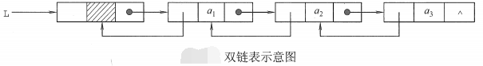

双链表的按值查找和按位查找操作与单链表相同。插入和删除操作的实现上与单链表有较大差别。

双链表的插入操作：在结点p之后插入结点s

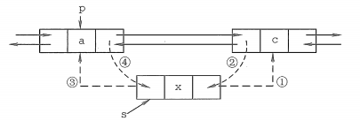

①：s.next = p.next;

②：p.next.prior = s;

③：s.prior = p;

④：p.next = s;

> 顺序不唯一，但①和②必须在④之前，遵循先连后断的原则。
>

双链表的删除操作：删除结点q

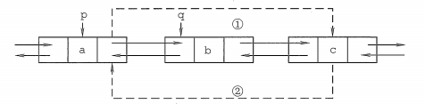

①：q.prior.next = q.next;

②：q.next.prior = q.prior;

③：free(q);或q = null;

双链表的Java实现：

```java
public class DLList<T> {
    private class Node {
        public T item;
        public Node prior;
        public Node next;

        public Node(T item, Node prior, Node next) {
            this.item = item;
            this.prior = prior;
            this.next = next;
        }
    }

    private Node Sentinel;
    private int size;

    public DLList() {
        Sentinel = new Node(null, null, null);
        size = 0;
    }

    //Adds x to the front of the list.
    public void addFront(T x) {
        Node s = new Node(x, Sentinel, Sentinel.next);
        if (size != 0) Sentinel.next.prior = s;  //空表插入不执行
        Sentinel.next = s;
        size += 1;
    }

    //Adds x to the end of the list.
    public void addRear(T x) {
        Node p = Sentinel;
        while (p.next != null) {
            p = p.next;
        }
        p.next = new Node(x, p, null);
        size += 1;
    }

    //删除元素
    public T deleteElement(int i) {
        Node deleted = seekNode(i);
        T item = deleted.item;
        deleted.prior.next = deleted.next;
        deleted.next.prior = deleted.prior;
        size--;
        return item;
    }

    //在第i个结点之后插入元素
    public void insert(int i, T value) {
        Node p = seekNode(i);
        Node temp = new Node(value, p, p.next);
        p.next.prior = temp;
        p.next = temp;
        size++;
    }

    //更改元素
    public void setElement(int i, T value) {
        Node changed = seekNode(i);
        changed.item = value;
    }

    //查找元素
    public T getElement(int i) {
        Node wanted = seekNode(i);
        return wanted.item;
    }

    //helper function:判断该索引是否存在，不存在报异常，存在返回该节点
    private Node seekNode(int i) {
        if (i < 0 || i > size - 1) {
            throw new RuntimeException("超出索引范围");
        }
        Node wanted = Sentinel;
        while (i >= 0) {
            wanted = wanted.next;
            i--;
        }
        return wanted;
    }

    public int getLength() {
        int length = 0;
        Node p = Sentinel;
        while (p.next != null) {
            length++;
            p = p.next;
        }
        return length;
    }


    public void printAllElements() {
        Node p = Sentinel.next;
        while (p != null) {
            System.out.println(p.item);
            p = p.next;
        }
        System.out.println("------------------------------");
    }
}
```

### 循环链表

#### 循环单链表

将单链表最后一个结点的指针从`null`改为头结点，使整个链表形成一个环。

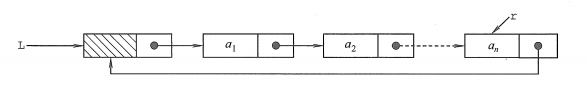

循环单链表的判空条件不再是头结点指针是否为空，而是头结点指针是否指向自己。

循环单链表不存在表尾，在任何一个位置上的插入和删除操作是一致的。

循环单链表可以从表中的任意一个结点开始遍历整个链表。

##### 应用：约瑟夫环(剑指Offer62)

> N个人围成一圈，第一个人从1开始报数，报M的将被杀掉，下一个人接着从1开始报。如此反复，最后剩下一个，求最后的胜利者。
>

既然约塞夫问题就是用人来举例的，那我们也给每个人一个编号（索引值），每个人用字母代替

下面这个例子是N=8 m=3的例子

我们定义F(n,m)表示最后剩下那个人的索引号，因此我们只关系最后剩下来这个人的索引号的变化情况即可


从8个人开始，每次杀掉一个人，去掉被杀的人，然后把杀掉那个人之后的第一个人作为开头重新编号

第一次C被杀掉，人数变成7，D作为开头，（最终活下来的G的编号从6变成3）
第二次F被杀掉，人数变成6，G作为开头，（最终活下来的G的编号从3变成0）
第三次A被杀掉，人数变成5，B作为开头，（最终活下来的G的编号从0变成3）
以此类推，当只剩一个人时，他的编号必定为0！（重点！）

从N=8到N=7，其实是所有活着的人向左移动了M次，则从N=7还原到N=8(杀掉的除外)，只需将活着的右移M位。则有$f(8,3)=[f(7,3)+3] \% 8$。即：$f(n,m)=[f(n−1,m)+m]\% n$。

再考虑上$n=1$的情况，则有递推公式：

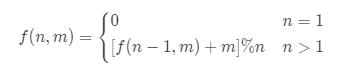

代码实现：

```java
//递归：时间复杂度O(n)，空间复杂度O(n)
int getLast(int n, int m){
    if (n==1)return 0;
    return (getLast(n-1,m)+m)%n; 
}
//递推：时间复杂度O(n)，空间复杂度O(1)
int getLast(int n, int m){
    int pos = 0;
    for(int i=2; i<=n; i++){
        pos = (pos+m)%i;
    }
    return pos;
}
```

#### 循环双链表

将双链表的尾结点的next指针指向头结点，头结点的prior指针指向尾结点，就构成了循环双链表。

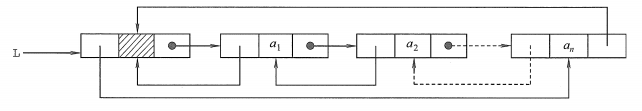

循环双链表的判空条件：头结点的prior指针和next指针都指向头结点自己。

### 静态链表

静态链表是借助二维数组来描述线性表的链式存储结构。静态链表的结点也有data数据域和next指针域。指针域是下一个结点在数组中的下标，也称游标，尾结点的指针域为-1。

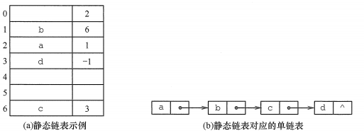

由于是由数组实现，静态链表和顺序表一样，要预先分配一块连续的内存空间。

静态链表在不支持指针的高级语言(如Basic)中有所应用，其他时候，都不如单链表来得方便。

## 链表与顺序表的比较

- 存取方式：根据索引访问元素，顺序表支持随机存取，链表要从头开始遍历
- 物理结构：逻辑上相邻的元素，在顺序表中物理位置也相邻，在链表中一般不相邻。
- 查找、插入和删除操作：
  -   - 按值查找：无序顺序表的时间复杂度为$O(n)$，有序顺序表使用折半查找的时间复杂度为$O(log_2(n))$，链表无论是否有序，时间复杂度都为$O(n)$。
  -   - 按索引查找：顺序表为$O(1)$，链表为$O(n)$。
  -   - 插入和删除：顺序表平均要移动半个表长的元素，链表只需修改相关结点的指针域。
- 空间分配：顺序表一旦分配好空间，不能扩充。链表需要时才申请分配空间，更灵活、高效。