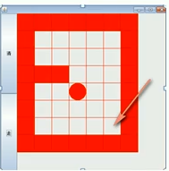

## 栈的应用

### 中缀表达式的计算

```java
public class Calculator {
    public static void main(String[] args) {
        //创建数栈和符号栈
        ArrayStack numStack = new ArrayStack(10);
        ArrayStack opStack = new ArrayStack(10);

        int x;//左操作数
        int y;//右操作数
        char op; //操作符
        String num = ""; //缓存数字

        String expression = "70+2*6-2";
        char[] exp = expression.toCharArray();

        //循环扫描表达式，执行相应逻辑
        int i = 0;
        while (i < exp.length) {
            char c = exp[i];
            if (isOperator(c)) {
                if (!opStack.isEmpty() && priority(c) <= priority((char) opStack.getTopElement())) {
                    op = (char) opStack.pop();
                    y = numStack.pop();  //注意先出栈的是右操作数
                    x = numStack.pop();
                    numStack.push(calculate(x, y, op));
                }
                opStack.push(c);

            } else {//如果是数字，缓存到num中，直到遇到操作符为止
                num += c;
                if (i == exp.length - 1) numStack.push(Integer.parseInt(num));//遍历到最后一个字符，直接入数栈
                else {
                    if (isOperator(exp[i + 1])) {
                        numStack.push(Integer.parseInt(num));
                        num = "";
                    }
                }
            }
            i++;
        }

        //若符号栈非空，循环执行
        while (!opStack.isEmpty()) {
            op = (char) opStack.pop();
            y = numStack.pop();
            x = numStack.pop();
            numStack.push(calculate(x, y, op));
        }

        System.out.println(expression + " = " + numStack.pop()); //最后栈中剩下的数即为表达式的结果

    }

    /**
     * 判断运算符的优先级
     */
    public static int priority(char op) {//假设只有加减乘除
        if (op == '+' || op == '-') return 0;
        else if (op == '*' || op == '/') return 1;
        else return -1;
    }

    /**
     * 判断是否是操作符
     */
    public static boolean isOperator(char val) {
        return (val == '+' || val == '-' || val == '*' || val == '/');
    }

    /**
     * 计算x op y
     */
    public static int calculate(int x, int y, char op) {
        switch (op) {
            case '+':
                return x + y;
            case '-':
                return x - y;
            case '*':
                return x * y;
            case '/':
                return x / y;
            default:
                return 0;
        }
    }
}
```

### 后缀表达式的计算

```java
public class Calculator {
    public static void main(String[] args) {
        String s = "30 4 + 5 * 6 -";
        int res = calculate(s);
        System.out.println(s + " = " + res);
    }

    public static int calculate(String postfixExpression) {
        ArrayStack stack = new ArrayStack(10);
        int x;
        int y;
        String[] split = postfixExpression.split(" ");
        for (String s : split) {
            if (s.matches("\\d+")) { //数字
                stack.push(Integer.parseInt(s));
            } else {
                y = stack.pop();  //注意第一个出栈的是右操作数
                x = stack.pop();
                switch (s) {
                    case "+":
                        stack.push(x + y);
                        break;
                    case "-":
                        stack.push(x - y);
                        break;
                    case "*":
                        stack.push(x * y);
                        break;
                    case "/":
                        stack.push(x / y);
                        break;
                    default:
                        throw new RuntimeException("操作符有误");
                }
            }
        }
        return stack.pop();
    }
}
```

## 稀疏矩阵

### 稀疏矩阵保存棋盘格

```java
public class SparseArray {
    public static void main(String[] args) {
        //1.创建原始稀疏数组
        int[][] chessBoard = new int[11][11];
        chessBoard[1][2] = 1;
        chessBoard[2][3] = 2;
        System.out.println("原始稀疏数组：");
        trav2DArray(chessBoard);
        //遍历原始数组，获得稀疏数组
        System.out.println("稀疏数组：");
        int count = 0;
        for (int[] row : chessBoard) {
            for (int elem : row) {
                if (elem != 0) count++;
            }
        }
        int start = 1;
        int[][] sparseArray = new int[count + 1][3];
        sparseArray[0][0] = chessBoard.length;
        sparseArray[0][1] = chessBoard[0].length;
        sparseArray[0][2] = count;

        for (int i = 0; i < chessBoard.length; i++) {
            for (int j = 0; j < chessBoard[i].length; j++) {
                if (chessBoard[i][j] != 0) {
                    sparseArray[start][0] = i;
                    sparseArray[start][1] = j;
                    sparseArray[start][2] = chessBoard[i][j];
                    start++;
                }
            }
        }

        //打印稀疏数组
        trav2DArray(sparseArray);
//
//        //将稀疏数组还原为原始数组
//        int[][] newBoard = new int[sparseArray[0][0]][sparseArray[0][1]];
//        for (int i = 1; i < sparseArray.length; i++) {
//            newBoard[sparseArray[i][0]][sparseArray[i][1]] = sparseArray[i][2];
//        }
//
//        //print newBoard
//        System.out.println("还原的稀疏数组");
//        trav2DArray(newBoard);
//
//
        //将稀疏数组保存在磁盘上
        File f = new File("sparseArray.data");
        FileWriter fw = null;
        try {
            fw = new FileWriter(f);
            for (int[] row : sparseArray) {
                fw.write(row[0] + "," + row[1] + "," + row[2] + "\n");
            }
        } catch (IOException e) {
            e.printStackTrace();
        } finally {
            try {
                fw.close();
            } catch (IOException e) {
                e.printStackTrace();
            }
        }
    }


    public static void trav2DArray(int[][] array) {
        for (int[] row : array) {
            for (int elem : row) {
                System.out.printf("%d\t", elem);
            }
            System.out.println();
        }
    }
}
```

## 递归的应用

### 迷宫数组



如上图所示，小球从迷宫中的左上角开始每次走一格，走到右下角表示走出迷宫。红色表示墙。

思路：用二维数组表示迷宫，并用不同数字表示格子状态：

- 0表示格子为空，小球未走过
- 1表示墙
- 2表示小球已走过的地方
- 3表示已走过且是死路(小球可到该格子，但该格子的4领域皆非零)

小球每到一个格子，尝试以下、右、左、上的顺序访问相邻的四个格子。直到到达右下角。

代码实现：

```java
public class Maze {
    public static void main(String[] args) {
        int[][] maze = new int[8][7];

        //迷宫数组初始化
        for (int i = 0; i < 8; i++) {
            maze[i][0] = 1;
            maze[i][6] = 1;
        }
        for (int i = 0; i < 7; i++) {
            maze[0][i] = 1;
            maze[7][i] = 1;
        }
        maze[3][1] = 1;
        maze[3][2] = 1;

        //尝试遍历
        getPath(maze,1,1);
        //输出最后的迷宫
        for (int i = 0; i < 8; i++) {
            for (int j = 0; j < 7; j++) {
                System.out.print(maze[i][j] + " ");
            }
            System.out.println();
        }
    }

    public static boolean getPath(int[][] maze, int i, int j) {
        if (maze[6][5] == 2) return true;//通路已找到

        if (maze[i][j] == 0) {
            maze[i][j] = 2;  //假设成功，标记为已走过
            if (getPath(maze, i + 1, j)) return true;//向下
            else if (getPath(maze, i, j + 1)) return true;//向右
            else if (getPath(maze, i, j - 1)) return true;//向左
            else if (getPath(maze, i - 1, j)) return true;//向上
            else {
                maze[i][j] = 3; //走不通，标记为3
                return false;
            }
        } else { //maze[i][j]不等于0，可能为1，2，3，都意味着此单元格不需要遍历
            return false;
        }
    }
}
```

### 八皇后

八皇后问题是回溯算法的典型案例。该问题是国际象棋棋手马克斯·贝瑟尔于1848年提出：在8*8格的国际象棋盘上摆放8个皇后，使其不能互相攻击，即：**任意两个皇后都不能处于同一行、同一列、或同一斜线上**，问有多少种摆法。

回溯算法求解八皇后问题并不高效，用贪心算法更好。

思路：

1. 第一个皇后先放第一行第一列
2. 第二个皇后放在第二行，从第二行第一列开始判断是否符合规则，如果不符合规则，继续下一列的判断，直到找到一个符合规则的
3. 继续第三个皇后，依次判断

理论上需要一个二维数组来存放棋盘，但实际上用一个一维数组就可以解决问题，如arr[8] = {0,4,7,5,2,6,1,3}。arr[i] = val表示将第i+1个皇后放在第i+1行的第val+1列中。

代码实现：

```java
public class EightQueen {
    static int[] arr = new int[8];  //存放皇后的位置
    static int count = 0;  //记录解的个数
    static int checkCount = 0;  //记录进行多少次判断

    public static void main(String[] args) {
        next(0);
        System.out.println("总共解法有：" + count + "种。");
        System.out.println("总共进行" + checkCount + "次判断。");
    }

    public static void print() {
        for (int i = 0; i < arr.length; i++) {
            System.out.print(arr[i] + " ");
        }
        System.out.println();
    }

    //检查该处的皇后是否和之前已放好的皇后冲突，不冲突返回true，冲突返回false
    public static boolean check(int i) {
        checkCount++;
        for (int j = 0; j < i; j++) {
            if (arr[i] == arr[j] || Math.abs(arr[i] - arr[j]) == Math.abs(i - j)) {
                return false;
            }
        }
        return true;
    }

    //寻找第i行皇后的合适位置
    public static void next(int i) {
        if (i == 8) {
            print();
            count++;
        } else {
            for (int j = 0; j < 8; j++) {
                arr[i] = j;
                if (check(i)) next(i + 1); //当前位置若与之前的皇后都不冲突，进入下一行
            }
        }
    }
}
```