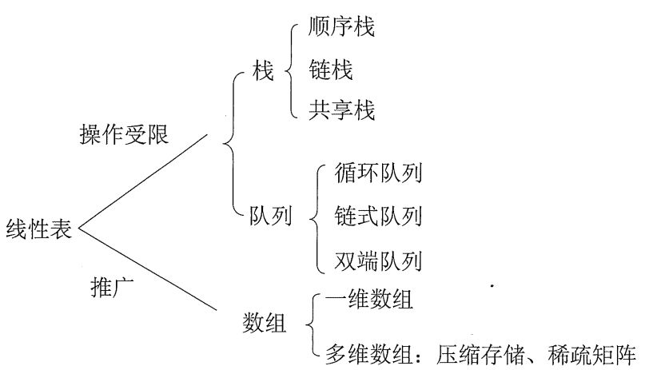

## 栈

栈(Stack)是只允许在一端(栈顶)进行插入或删除操作的线性表。

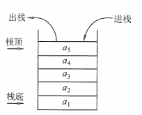

栈的特点是：先进后出FILO。

栈的数学性质：n个元素以某种顺序进栈，并可以在满足FILO的条件下，在任意时刻出栈，可能的出栈序列的个数为$\frac{1}{n+1} C^n _{2n}$，称为Catalan数。

### 栈的顺序存储结构

栈顶指针：`top = -1;`

进栈：栈不满时，`stack[++top] = value;`

出栈：栈非空时，`value = stack[top]; top--; return value;`

判空：`top == -1;`

判满：`top == maxSize -1;`

栈长：`top+1;`

Java实现：

```java
class ArrayStack {
    private int maxSize;
    private int top = -1;
    private int[] stack;

    public ArrayStack(int maxSize) {
        this.maxSize = maxSize;
        stack = new int[maxSize];
    }

    //栈空
    public boolean isEmpty() {
        return top == -1;
    }

    //栈满
    public boolean isFull() {
        return top == maxSize - 1;
    }

    //入栈
    public void push(int value) {
        if (isFull()) System.out.println("error: the stack is full.");
        stack[++top] = value;
    }

    //出栈
    public int pop() {
        if (isEmpty()) throw new RuntimeException("栈空");
        int value = stack[top];
        top--;
        return value;
    }
    
    //获取栈顶元素
    public int getTopElement(){
        return stack[top];
    }

    //遍历：从栈顶到栈底
    public void printAll() {
        for (int i = top; i >= 0; i--) {
            System.out.println(stack[i]);
        }
    }
}
```

#### 共享栈

利用栈底位置相对不变的特性，可让两个顺序栈共享一个一维数组空间，将两个栈的栈底分设在数组的两端，两个栈顶向中间延伸。如下图所示：

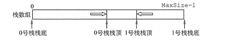

判空：top0=-1时0号栈为空，top1=maxSize时1号栈为空。

判满：top1- top0 = 1;

进栈：0号栈进栈`stack0[++top0]=value;`，1号栈进栈`stack1[--top1]=value;`

出栈：0号栈出栈`int value=stack0[top0];top0--;`，1号栈出栈`int value=stack1[top1];top1++;`

### 栈的链式存储结构

一般用单链表实现，称为链栈。链栈不存在栈满的情况。

一般规定进栈出栈都在链表的表头进行。

### 带头结点的链栈

栈空：`head.next ==null;`

进栈：只能头插法。`Node p = new Node(); p.data = value; p.next = head.next; head.next = p;`

出栈：`Node p = head.next; int x = p.data; head.next = p.next; return x;`

### Java Collection中的栈

Stack，ArrayList, LinkedList

#### 类继承树:


由继承树看出，三者都是Collection的间接实现类。
ArrayDeque实现Deque接口，Stack继承于Vector，LinkedList实现Deque与List接口。

#### 区别

底层数据存储方式

|            | 存储方式       |
| ---------- | -------------- |
| Stack      | 长度为10的数组 |
| ArrayDeque | 长度为16的数组 |
| LinkedList | 链表           |

方法参照表

| Stack   | ArrayDeque                | LinkedList                |
| ------- | ------------------------- | ------------------------- |
| push(e) | addFirst(e)/offerFirst(e) | addFirst(e)/offerFirst(e) |
| pop()   | removeFirst()/pollFirst() | removeFirst()/pollFirst() |
| peek()  | getFirst()/peekFirst()    | getFirst()/peekFirst()    |

线程安全

|            | 线程安全   |
| ---------- | ---------- |
| Stack      | 线程同步   |
| ArrayDeque | 线程不同步 |
| LinkedList | 线程不同步 |

#### 选择：

通常情况下，不推荐使用Vector以及其子类Stack

1.需要线程同步：使用Collections工具类中synchronizedXxx()将线程不同步的ArrayDeque以及LinkedList转换成线程同步。

2.频繁的插入、删除操作：LinkedList

3.频繁的随机访问操作：ArrayDeque

4.未知的初始数据量：LinkedList

## 队列

队列(Queue)是只允许在表的一端进行插入，在另一端进行删除的受限线性表。

队列的特点是：先进先出FIFO。

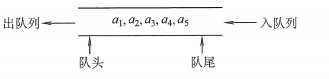

队首一般称Front，队尾一般称Rear。

栈和队列都是操作受限的线性表，不是所有对线性表的操作都适用于栈和队列，比如：不能随便读取栈和队列中间的某个数据。

### 队列的顺序存储结构


maxSize：是该队列的最大容量。

front：队首指针，队首用于出队

rear：队尾指针，队尾用于入队

初始状态：`front=-1;rear=-1;`

判满：`rear == maxSize - 1;`

判空：`front == rear;`

进队：队不满时，`queue[++rear] = value;`

出队：队不空时，`return queue[++front];`

Java代码实现：

```java
public class ArrayQueue {
    private int maxSize;//数组队列的最大容量
    private int front;//队首指针，头部用于输出
    private int rear;//队尾指针，尾部用于插入
    private int[] arr;//模拟队列的数组

    //创建队列构造器
    public ArrayQueue(int maxSize) {
        this.maxSize = maxSize;
        arr = new int[maxSize];
        this.front = -1;
        this.rear = -1;
    }

    //isFull: rear == maxSize - 1
    public boolean isFull() {
        return rear == maxSize - 1;
    }

    //isEmpty:front == rear
    public boolean isEmpty() {
        return rear == front;
    }


    //enqueue: 先判满
    public void enQueue(int x) {
        if (isFull()) {
            System.out.println("队列已满，添加失败！");
            return;
        }
        arr[++rear] = x;
    }

    //dequeue:先判空
    public int deQueue() {
        if (isEmpty()) {
            //若队空，抛出异常，比return -1好
            throw new RuntimeException("队列已空，出队失败！");
        }
        return arr[++front];
    }

    //print all elements in the queue
    public void printAll() {
        if (isEmpty()) {
            System.out.println("队列为空！");
            return;
        }
        for (int i = front + 1; i <= rear; i++) {
            System.out.printf("arr[%d]=%d\n", i, arr[i]);
        }
    }

    public int getFirst() {
        if (isEmpty()) {
            throw new RuntimeException("队列已空！");
        }
        return arr[front + 1];
    }
}
```

### 循环队列

初始版本的数组队列不能复用，可以改进为循环队列(通过取模实现)

实现：

```rst
front指向第一个元素位置，rear指向最后一个元素的后一个位置
初始化：front= 0，rear = 0 队列有效长度只有maxSize - 1
判空：rear == front
判满：(rear + 1)%maxSize == front
出队：先判空，{int x = arr[front]; front = (front+1) % maxSize; return x;}
入队：先判满，{arr[rear] = x; rear = (rear + 1) % maxSize;}
实际长度: int size = (rear - front + maxSize)% maxSize;
遍历：for(i = front; i < front + size;i++){System.out.println(arr[i%maxSize]);}
```

> 其他实现形式：
>
> 增设一个size来表示元素个数，则size=0时队空，size=maxsize时队满，这两者情况下都有rear==front.
>

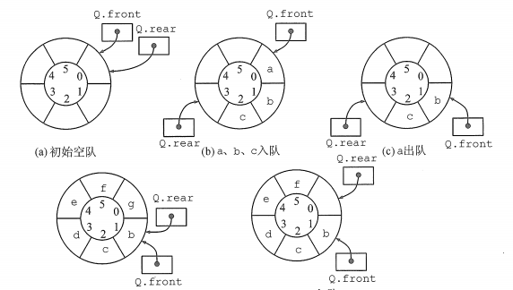

代码实现：

```java
public class CircularArrayQueue {
    private int maxSize;//数组队列的最大容量
    private int front;//队首指针，头部用于输出
    private int rear;//队尾指针，尾部用于插入
    private int[] arr;//模拟队列的数组

    //创建队列构造器
    public CircularArrayQueue(int maxSize) {
        this.maxSize = maxSize;
        arr = new int[maxSize];
        this.front = 0;
        this.rear = 0;
    }

    //isFull: (rear+1)%maxSize == front
    public boolean isFull() {
        return (rear + 1) % maxSize == front;
    }

    //isEmpty:front == rear
    public boolean isEmpty() {
        return rear == front;
    }


    //enqueue: 先判满
    public void enQueue(int x) {
        if (isFull()) {
            System.out.println("队列已满，添加失败！");
            return;
        }
        arr[rear] = x;
        rear = (rear + 1) % maxSize;
    }

    //dequeue:先判空
    public int deQueue() {
        if (isEmpty()) {
            //若队空，抛出异常，比return -1好
            throw new RuntimeException("队列已空，出队失败！");
        }
        int x = arr[front];
        front = (front + 1) % maxSize;
        return x;
    }

    //print all elements in the queue
    public void printAll() {
        if (isEmpty()) {
            System.out.println("队列为空！");
            return;
        }
        int size = (rear - front + maxSize) % maxSize;
        for (int i = front; i < front + size; i++) {
            System.out.printf("arr[%d]=%d\n", i % maxSize, arr[i % maxSize]);
        }
    }

    public int getFirst() {
        if (isEmpty()) {
            throw new RuntimeException("队列已空！");
        }
        return arr[front];
    }
}
```

### 队列的链式存储结构

链式队列是带有头指针和尾指针的单链表。

链式队列不存在队满的情况。

链式队列适用于数据元素变动较大的情形。

#### 不带头结点的链式队列：

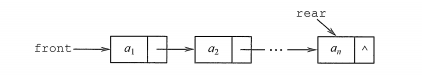

队空：`front==null && rear==null;`

出队：若队列非空，取出队头元素，front指向后一个结点，若取出的是最后一个结点，令front和rear都为null。

入队：建立一个新结点，尾插到链表中，rear指向新结点，若原队列为空，则令front也指向该结点。

> 不带头结点的链式队列在操作上往往很麻烦，可使用带头结点的链式队列来统一插入和删除操作。
>

#### 带头结点的链式队列：

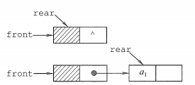

初始化：`front=rear=new Node();front.next=null;`

队空：`front==rear;`或`front==null;`或`rear==null;`

入队：只能尾插。`Node p=new Node(); p.data=value; p.next=null; rear.next=p; rear=p;`

出队：若队非空，`Node p = front.next; int x = p.data; front.next = p.next; if(rear == p) rear = front; return x;`

链队与链栈的唯一区别：链队添加元素必须尾插，链栈添加元素必须头插。

### 双端队列

允许两端都可以进行入队和出队操作的队列。队列的两端分别称为前端和后端。

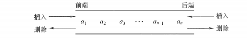

## 栈和队列的应用

### 栈的应用场景

#### 子程序的调用

在跳往子程序前，会先将下个指令的地址存到堆栈中，直到子程序执行完毕后再将地址取出，以回到原来的程序中。

#### 递归调用

若在一个函数、过程或数据结构的定义中又应用了它自身，则这个函数、过程或数据结构称为是递归定义的，简称递归。

递归模型必须满足两个条件：递归表达式和边界条件。

递归的精髓在于能否将原始问题转化为属性相同但规模较小的问题。

典型的递归实例：斐波那契数列

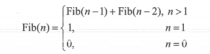

Java代码实现：

```java
public int Fib(int n){
    if(n==0||n==1) return 1;
    else return Fib(n-1)+Fib(n-2);
}
```

在递归调用的过程中，系统为每一层的返回点、局部变量、传入实参等开辟了递归工作栈来进行数据数据存储，递归次数过多容易造成栈溢出。

递归常常把一个大型的复杂问题层层转化为一个与原问题相似的规模较小的问题来求解，递归策略只需少量代码就可以描述出解题过程所需要的多次重复计算，大大减少了程序的代码量，也便于理解。但正是由于包含了很多重复的计算，在通常情况下，它的效率并不是太高。

> 可以将递归算法转换为非递归算法，通常需要借助栈来实现这种转换。
>

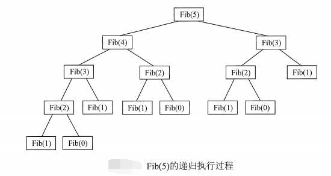

递归的应用：迷宫、八皇后。

#### 表达式转换与求值

表达式求值是程序设计语言编译中一个最基本的问题，它的实现是栈应用的一个典型范例。

中缀表达式不仅依赖运算符的优先级，还要处理括号。

后缀表达式中没有括号，只有操作数和运算符，运算符在操作数的后面，后缀表达式已经考虑了运算符的优先级。

中缀表达式对人来说好理解，但计算机不容易处理。

如：中缀表达式$A+B*(C-D)-E/F$所对应的后缀表达式为$ABCD-*+EF/-$。

后缀表达式是中缀表达式的表达式树的后序遍历：

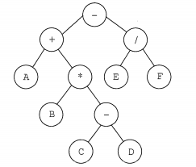

**中缀表达式转后缀表达式步骤：**

1. 初始化两个栈：运算符栈`s1`和存储中间结果的栈`s2`；
2. 从左至右扫描中缀表达式：
   1.    1. 遇到操作数，将其压入`s2`。
   2. 2. 遇到运算符：
      1.       1. 若`s1`为空，或栈顶运算符为`(`，则直接入栈。
      2.       2. 否则，若当前运算符优先级高于栈顶运算符的优先级，直接入栈；
      3.       3. 否则，将`s1`栈顶运算符弹出并压入`s2`，跳转到2.2。
   3. 3. 遇到括号：
      1.       1. 若为`(`，则直接压入`s1`；
      2.       2. 若为`)`，连续弹出`s1`栈顶元素，直到遇到`(`，舍弃这对括号。
3. 表达式扫描完毕后，将`s1`中剩余运算符依次弹出并压入到`s2`；
4. `s2`从栈底到栈顶的顺序即为后缀表达式。

**用栈计算前缀表达式**：从右至左扫描表达式，遇到数字时，将数字压入栈中，遇到运算符`op`时，栈连续出栈两个数字`X`和`Y`，计算`X op Y`并压回栈中。重复上述操作直到表达式最左端，最后得到的值即为表达式的结果。如中缀表达式`(3+4)*5-6`的前缀表达式为`-*+3456`

**用栈计算中缀表达式(不带括号)的过程：**

1. 获取表达式字符串并转为字符数组。
2. 使用索引遍历表达式字符数组。对于每一个字符：
   1.    1. 若为数字，存入一个缓存字符串，判断下一个字符是否为操作符，是则将缓存字符串转换格式后入数栈，并将缓存字符串置空；
   2.    2. 若为操作符，设为`op1`，若符号栈非空，且栈顶符号`op`优先级高于`op1`，则`op`出栈，数栈连续出栈两个操作数`Y`和`X`，计算`X op Y`，并将结果压入数栈。然后`op1`入符号栈；其他情况`op1`直接入栈。
3. 表达式扫描完毕后，若符号栈非空，则循环执行：
      ​    从符号栈出栈一个符号`op`，从数栈出栈两个操作数`Y`和`X`，并将`X op Y`的结果压回数栈。
      直到符号栈为空。若表达式合法，则数栈剩下最后一个数，也即表达式的结果。

代码实现：见应用

**用栈计算后缀表达式的过程：**

从左到右顺序扫描表达式的每一项：若该项为操作数，则压入栈中；若该项为操作符`op`，则从栈中连续出栈两个操作数`Y`和`X`，计算`X op Y`，将结果压入栈中。当表达式的所有项都扫描并处理完毕，栈顶存放的便是后缀表达式的计算结果。

Java实现：只实现了整数运算。见应用

#### 括号匹配

1. 初始化一个空栈，顺序读入括号。
2. 若是左括号，则压入栈中，期待与之匹配的右括号的出现。
3. 若是右括号，若栈顶是与之匹配的左括号，左括号出栈，否则，括号序列不匹配，退出程序。
4. 算法结束时，栈应为空，否则括号序列不匹配。

#### 二叉树的遍历

#### 图的DFS

### 队列的应用

#### 二叉树的层次遍历

1. 根节点入队
2. 若队空(所有结点都已处理完毕)，则结束遍历；否则重复③。
3. 队列中对一个结点出队，并访问该节点。若该节点有左孩子，左孩子入队，若该节点还有右孩子，右孩子入队，返回②。

示例：

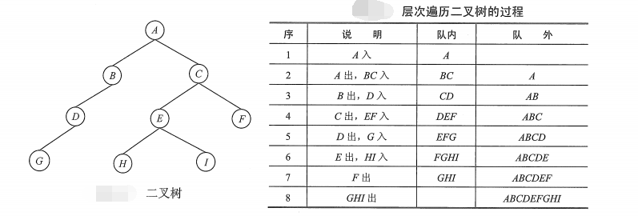

#### 队列在计算机系统中的应用

- 引入打印缓冲区解决打印机和主机之间速度不匹配的问题：打印机打印速度远远跟不上主机输出数据的速度，两者直连的话会丢失数据。引入一个缓冲区后，主机将数据写满缓冲区，然后转去做其他事，打印机开始读取缓冲区的数据并打印，缓冲区为空后，主机再次向缓冲区写数据。
- 多用户形成一个访问CPU资源的请求队列，每次系统把CPU分配给队首的用户，当相应的程序运行结束或用完规定的时间片后，该用户出队，系统又把CPU资源分配给新的队首用户使用。这样既能满足每个用户的请求，又能使CPU正常运行。

## 特殊矩阵的压缩存储

数组是由n(n≥1)个相同类型的数据元素构成的有限序列，每个数据元素称为一个数组元素，每个元素在n个线性关系中的序号称为该元素的下标，下标的取值范围称为数组的维界。

数组与线性表的关系：数组是线性表的推广。一维数组可以视为一个线性表。二维数组可以视为元素为定长线性表的线性表，以此类推。

数组一旦被定义，其维数和维界就不再改变。一个数组的所有元素在内存中占用一段连续的存储空间。

常见的特殊矩阵：

- 对称矩阵：$a_{ij} = a_{ji}$
- 三角矩阵
- 三对角矩阵
- 稀疏矩阵

### 稀疏矩阵

当矩阵中大部分元素为0或其他相同值，而值不同的元素的个数远小于矩阵元素的总个数时，该矩阵称为稀疏矩阵。

对于稀疏矩阵，只需存储非零元素(或其他非相同值元素)的信息。常常采用(行标，列标，值)构成的三元组进行存储。稀疏矩阵压缩后便失去了随机存取的特性。

稀疏数组的处理方法是:

1. 记录数组一共有几行几列， 有多少个不同的值
2. 把具有不同值的元素的行列及值记录在一个小规模的数组中， 从而缩小程序的规模

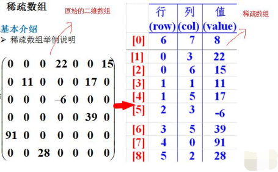

> 还可以用十字链表法存储稀疏矩阵的三元组。
>

应用举例：用数组存储稀疏矩阵，实现存盘、恢复功能

思路：


代码实现：见应用