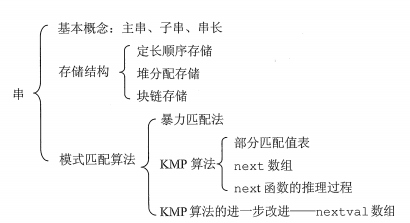

C语言中串可以看作是限定了元素为字符的线性表，即字符数组。在Java中，字符串与字符数组并不相同，但提供了相互转换的方法。

## 串的模式匹配

子串的定位操作通常称为串的模式匹配，即求字串(模式串)在主串中的位置。

### 暴力匹配

```java
public int indexOfSubString(String str, String subStr){
        int i = 0, j = 0;
        while(i< str.length() && j < subStr.length()){
            if(str.charAt(i) == subStr.charAt(j)){
                i++;
                j++;
            }else{//匹配失败，i后移一位，j回到开头
                i = i - j + 1;
                j = 0;
            }

        }
        if(j==subStr.length())return i - j;//退出循环时，若j已到子串尾，说明匹配成功
        return -1;
    }
```

暴力匹配的最坏时间复杂度为O(nm)，其中n和m分别为主串和模式串的长度。

### KMP算法

KMP算法可以在O(n+m)的时间复杂度上完成串的模式匹配操作，大大提高了匹配效率。

### 改进的KMP算法