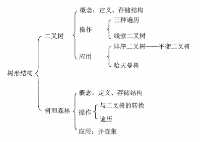

## 树的基本概念

树是n(n≥0)个结点的有限集。当n = 0 时成为空树。在任意一棵非空树中应满足：

- 有且仅有一个根结点
- 当n>1时，其余结点可分为m(m>0)个互不相交的有限集T1，T2，...，Tm，其中每个集合本身又是一棵树，并且称为根的子树。

树是一种递归的数据结构。适合于表示具有层次结构的数据。

数据有以下两个特点：

- 树的根结点没有前驱，除此之外的所有结点都有且仅有一个前驱。因此在n个结点的树中有n-1条边。
- 树中的所有结点可以有零个或多个后继。

### 基本术语

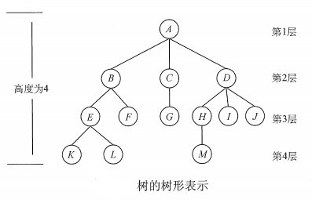

- 考虑结点K。根A到结点K的唯一路径上的任意结点，称为结点K的**祖先**。如结点B是结点K的祖先，而K是B的**子孙**。路径上最接近K的结点E称为K的**父结点**，而K为E的**孩子**。父节点相同的结点称为**兄弟**，如K和L有相同的双亲E ，则K和L为兄弟。
- 树中一个结点的孩子个数称为该**结点的度**，树中结点的最大度数称为**树的度**，如B的度为2，D的度为3，树的度为3。
- 度大于0的结点称为分支结点(亦称非终端结点)；度为0的结点称为**叶子结点**(亦称终端节点)。在分支结点中，每个结点的分支数就是该结点的度。
- **结点的深度**是从根节点开始自顶向下逐层累加的。**结点的高度**是从叶结点开始自底向上逐层累加的。**树的高度**为结点的最大深度或最大高度。
- 路径和路径长度：树中的路径从上向下，两个结点之间的**路径**是由两个结点之间所经过的结点序列构成的，**路径长度**是路径上所经过的边的条数。
- **森林**：森林是m(m≥0)棵互不相交的树的集合。将树的根结点删去就成了森林；给m棵独立的树加一个相同的父结点，则森林就变成了树。

### 树的性质

- 树中的结点数等于所有结点的度数加1。
- 度为m的树中第i层上至多有$m^{i-1}$个结点(i≥1)。
- 高度为h的m叉树至多有$(m^h -1) / (m-1)$个结点。
- 具有n个结点的m叉树的最小高度为$\lceil log_m(n(m-1)+1) \rceil$。

### 树的存储结构

#### 双亲表示法

采用二维数组来存储每个结点。此法可以很快得到一个结点的父结点，但求一个结点的孩子时却要遍历整个结构。

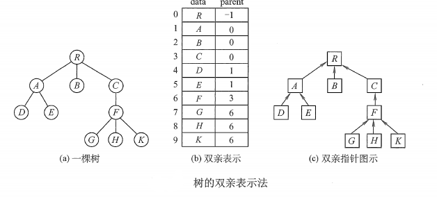

#### 孩子表示法

将每个结点的孩子结点都用单链表连接起来，则n个结点就有n个孩子链表(叶结点的孩子链表为空)。此法寻找一个结点的子女的操作很方便，但寻找一个结点的双亲则需要遍历n个结点中孩子链表指针域指向的n个孩子链表。

#### 孩子兄弟表示法(主流)

又称二叉树表示法，以二叉链表作为树的存储结构。结点结构只需将lchild和rchild换为firstChild和nextSibling。

此法的优点是方便实现树和二叉树的转换，易于查找一个结点的孩子；缺点是从当前结点查找其双亲比较麻烦。(可以为每个结点增设一个parent域来解决)

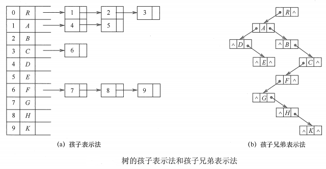

## 二叉树

二叉树是特殊的树形结构。每个结点至多只有两棵子树，即二叉树中不存在度大于2的结点，二叉树的子树有左右之分，次序不能颠倒。

定义如下：二叉树是n(n≥0)个结点的有限集合：或者为空二叉树，即n=0；或者由一个根结点和两个互不相交的左子树和右子树组成。左右子树又分别是一棵二叉树。

### 二叉树的5种基本形态

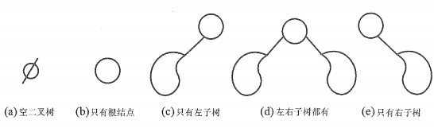

### 二叉树与度为2的树的区别

- 度为2的树至少有3个结点，而二叉树可以为空。
- 度为2的树，一个结点的左右孩子没有次序之分，只有一个孩子时更不用区分左右。二叉树中一个结点的左右孩子有次序之分，即使只有一个孩子，也需明确其为左孩子还是右孩子。

### 几个特殊的二叉树

**满二叉树**：一棵高度为h，结点数为$2^h -1$的二叉树称为满二叉树。即该树的每一层都含有最多的结点。**满二叉树的所有叶结点都在最底层，且除叶结点外的所有结点的度都为2。**

> 可以对满二叉树按层序编号：约定根节点编号为1，自上而下，自左而右，编号依次递增。则对于编号为i的结点，若有双亲，则其双亲的编号为$\lfloor i/2 \rfloor$；若有左孩子，则左孩子为$2i$；若有右孩子，则右孩子为$2i+1$。
>

**完全二叉树**：高度为h，结点数为n的二叉树，当且仅当其每个结点都与高度为h的满二叉树种编号为1~n的结点一一对应时，称为完全二叉树。其特点如下：

- 若$i≤\lfloor n/2 \rfloor$，则结点$i$为分支结点，否则为叶子结点。
- 叶子结点只可能在层次最大的两层上出现。对于最大层次中的叶子结点，都依次排列在该层最左边的位置上。
- 最多只能有一个度为1的结点，若该结点存在，则该结点只有左孩子而无右孩子。
- 若结点$i$为叶子结点或度为1，则编号大于$i$的结点必为叶子结点。
- 若树的结点数n为奇数，则不存在度为1的结点，所有分支结点都有左孩子和右孩子；若n为偶数，则编号为$n/2$的分支结点度为1，只有左孩子，没有右孩子。

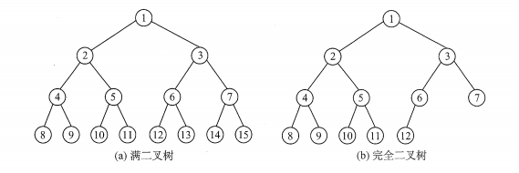

**二叉排序树**：左子树上所有结点的关键字均小于根节点的关键字；右子树上的所有结点的关键字均大于根节点的关键字；左子树和右子树又各是一棵二叉排序树。

**平衡二叉树**：树上**任一结点**的左子树和右子树的深度之差不超过1。

### 二叉树的性质

- 非空二叉树上的叶子结点树等于度为2的节点数加1，即$n_0 = n_2 + 1$。
  >   > 证明：结点总数$n = n_0 + n_1 + n_2$。又结点数为n的树有n-1条边，$n_1$提供一条边，$n_2$提供两条边，则$n-1 = n_1 + 2n_2$。联立两式可得$n_0 = n_2 + 1$。
  >
- 非空二叉树上第k层上至多有$2^{k-1}$个结点(k≥1)。
- 高度为h的二叉树至多有$2^h -1$个结点(h ≥ 1)。
- 完全二叉树按从上到下、从左到右的顺序一次编号为1，2，...，n，则有：
  -   - 当i>1时，结点i的双亲编号为$\lfloor i/2 \rfloor$，即当i为偶数时，其双亲的编号为i/2，它是双亲的左孩子；当i为奇数时，其双亲的编号为(i-1)/2，它是双亲的右孩子。
  -   - 当2i≤n时，结点i的左孩子编号为2i，否则无左孩子。
  -   - 当2i+1≤n时，结点i的右孩子编号为2i+1，否则无右孩子。
  -   - 结点i所在层次(深度)为$\lfloor log_2i \rfloor + 1$。
- 具有n(n>0)个结点的完全二叉树的高度为$\lceil log_2(n+1) \rceil$或$\lfloor log_2n \rfloor +1$。
  >   > 证明：高度为h的完全二叉树满足$2^{h-1} -1 < n ≤ 2^h -1$或$2^{h-1} -1 ≤ n < 2^h$。得$2^{h-1} < n +1 ≤ 2^h$，即$h-1 < log_2(n+1)≤h$，因为h为正整数，所以$h = \lceil log_2(n+1) \rceil$。或得$h-1 ≤ log_2n < h$，所以$h = \lfloor log_2n \rfloor +1$。
  >

### 二叉树的存储结构

#### 顺序存储结构

用一组地址连续的存储单元依次自上而下，自左至右存储完全二叉树上的结点元素，即将完全二叉树上的编号为i的结点元素存储在一组数组下标为i-1的分量中。

顺序存储结构适合存储完全二叉树和满二叉树，树中的节点序号可以唯一地梵音结点之间的逻辑关系，这样既能最大可能地节省存储空间，又能利用数组元素的下标值确定结点在二叉树中的位置，以及节点之间的关系。

但对于一般的二叉树，为了让数组下标能反映二叉树中结点之间的逻辑关系，只能添加一些并不存在的空结点，让其每个结点与完全二叉树上的结点相对照，再存储到一维数组的相应分量中。效率并不高。

#### 链式存储结构

由于顺序存储的空间利用率一般较低，因此二叉树多采用链式存储结构。二叉树结点一般包含3个域：数据域data、左指针域lchild、右指针域rchild。

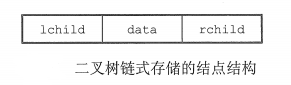

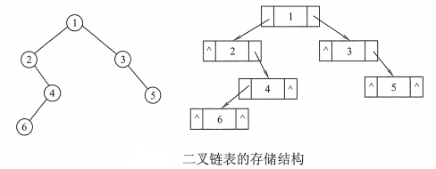

Java实现的结点：

```java
class BinaryTNode<T> {
    T data;
    BinaryTNode lchild;
    BinaryTNode rchild;

    public BinaryTNode() {
        data = null;
        lchild = null;
        rchild = null;
    }
}
```

容易验证，在含有n个结点的二叉链表中，含有n+1个空链域。

## 二叉树的遍历

设根节点为N，左子树为L，右子树为R，则**根据根节点的访问顺序**，二叉树有三种遍历方式：

- 先序遍历(PreOrder)：NLR
- 中序遍历(InOrder)：LNR
- 后序遍历(PostOrder)：LRN

此外，还可以对二叉树进行层次遍历。

### 先序遍历

**递归形式**：

若二叉树为空，则什么也不做，否则：

1. 访问根节点；
2. 先序遍历左子树；
3. 先序遍历右子树；

**非递归形式**：

- ①沿着根的左孩子，依次访问并入栈，直到左孩子为空。
- ②栈顶元素出栈，并进行判断：若其右孩子为空，继续执行②，若右孩子不为空，将右子树转到执行①。
- 循环以上过程，直到所有结点都已入过栈且全部出栈。

### 中序遍历

**递归形式：**

若二叉树为空，则什么也不做，否则：

1. 中序遍历左子树；
2. 访问根节点；
3. 中序遍历右子树；

**非递归形式：**与先序遍历唯一不同是中序遍历在结点出栈时才对其访问，而先序遍历先访问再入栈。

### 后序遍历

**递归形式：**

若二叉树为空，则什么也不做，否则：

1. 后序遍历左子树；
2. 后序遍历右子树；
3. 访问根节点；

**非递归形式：**

- ①沿着根的左孩子，依次入栈，直到左孩子为空。
- ②读栈顶元素(并非出栈)：若其右孩子**非空且未被访问**，则对右子树执行①。否认，栈顶元素出栈并访问。

因此需要一个辅助指针r，指向上一个访问的结点。当栈顶元素A的右孩子B为叶结点时，B先入栈，再出栈并被访问，r指向B，然后A又称为栈顶，再次判断时，A的右孩子B非空但已被访问(r == B)，则A直接出栈。

总结：

三种遍历算法的递归形式唯一区别是根结点的访问顺序不同。

三证遍历算法的非递归形式都要借助栈来实现。

三种遍历算法都满足：

- 每个结点都会且仅会被访问一次，时间复杂度为O(n)。
- 递归遍历中，递归工作栈的栈深恰好为树的深度。
- 在最坏情况下，二叉树是有n个结点的深度为n的单支树，此时遍历算法空间复杂度为O(n)。

### 层次遍历

二叉树的层次遍历借助队列实现。

流程：先将根节点入队，只要队列不空，则执行循环：出队并访问，再对该出队结点执行判断：若存在左子树，左子树根结点入队；若存在右子树，右子树根结点入队。

四种遍历形式的Java代码实现：

```java
public class BinaryTree {
    private class BTNode<T> {
        T data;
        BTNode lchild;
        BTNode rchild;

        public BTNode() {
            data = null;
            lchild = null;
            rchild = null;
        }
    }

    private BTNode root;

    public void preOrder(BTNode btree) {
        if (btree != null) {
            visit(btree);
            preOrder(btree.lchild);
            preOrder(btree.rchild);
        }
    }

    public void preOrderNoRecursion(BTNode btree) {
        Stack<BTNode> stack = new Stack<>();
        BTNode p = btree;
        while (p != null || !stack.empty()) {  //只有当所有结点都入栈并出栈才会退出循环
            if (p != null) {  //一路向左
                visit(p);
                stack.push(p);
                p = p.lchild;
            } else {  //已走到底，出栈并访问，转到右孩子
                p = stack.pop();
                p = p.rchild;
            }
        }
    }

    public void inOrder(BTNode btree) {
        if (btree != null) {
            inOrder(btree.lchild);
            visit(btree);
            inOrder(btree.rchild);
        }
    }

    public void inOrderNoRecursion(BTNode btree) {
        Stack<BTNode> stack = new Stack<>();
        BTNode p = btree;
        while (p != null || !stack.empty()) {  //只有当所有结点都入栈并出栈才会退出循环
            if (p != null) {  //一路向左
                stack.push(p);
                p = p.lchild;
            } else {  //已走到底，出栈并访问，转到右孩子
                p = stack.pop();
                visit(p);
                p = p.rchild;
            }
        }
    }

    public void postOrder(BTNode btree) {
        if (btree != null) {
            postOrder(btree.lchild);
            postOrder(btree.rchild);
            visit(btree);
        }
    }

    public void postOrderNoRecursion(BTNode btree) {
        Stack<BTNode> stack = new Stack<>();
        BTNode p = btree;
        BTNode r = null;
        while (p != null || !stack.empty()) {
            if (p != null) {
                stack.push(p);
                p = p.lchild;
            } else {
                p = stack.peek();  //获取栈顶元素而不出栈
                if (p.rchild != null && r != p.rchild) { //若右子树存在且未被访问
                    p = p.rchild;
                    stack.push(p);
                    p = p.lchild;
                } else {
                    r = stack.pop();  //记录最近一次出栈并被访问的元素
                    visit(r);
                    p = null;  //每次出栈说明以栈顶元素为根的树已经被访问完了，将p置空
                }
            }
        }
    }

    public void levelOrder(BTNode btree) {
        Queue<BTNode> queue = new LinkedList<>();
        BTNode p = btree;
        queue.add(p);
        while (!queue.isEmpty()) {
            p = queue.remove();
            visit(p);
            if (p.lchild != null) queue.add(p.lchild);
            if (p.rchild != null) queue.add(p.rchild);
        }
    }

    private void visit(BTNode btree) {
        //具体实现略
    }
}
```

### 由遍历序列构造二叉树

由二叉树的先序序列和中序序列可以唯一确定一棵二叉树。

> 先序序列的首结点必为二叉树的根结点，再中序序列中，该根结点将中序序列分为左右子序列。左右子序列在先序序列中的对应序列的首个结点，又分别是各子树的根结点。依次类推，就可唯一确定这棵树。
>

由二叉树的后序序列和中序序列也可以唯一确定一棵二叉树。

由二叉树的层序序列和中序序列也可以唯一确定一棵二叉树。

示例：由先序序列(ABCDEFGHI)和中序序列(BCAEDGHFI)确定二叉树。

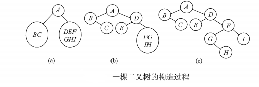

## 线索二叉树

一棵含有n个结点的二叉树含有n+1个空指针(总共2n个指针，一个非空指针表示一条边，即n-1个，所以空指针为2n-(n-1) = n+1个)。这些空指针可以用来存放指向其前驱或后继，这样就可以像遍历单链表一样遍历二叉树，即加快查找结点前驱和后继的速度。

线索二叉树的规定：若一个结点的左子树为空，则lchild指向前驱结点，若右子树为空，则rchile指向后继，还需添加两个标签域来标识指针域是指向左孩子还是前驱，指向右孩子还是后继。

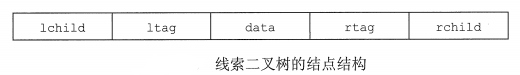

**二叉树的线索化**：将二叉链表中的空指针改为指向前驱或后继的线索，前驱或后继只有在遍历时才能得到，因此线索化的实质就是遍历一次二叉树。二叉树线索化时需要两个辅助指针：pre和p，pre指向p的前驱，在遍历的过程中，若p的左指针为空，则将其指向pre；若pre的右指针为空，则将其指向p。当p将要离开一个访问过的结点时，令pre指向p，当p来到新结点时，pre正好是p的前驱。

### 中序线索二叉树的构造

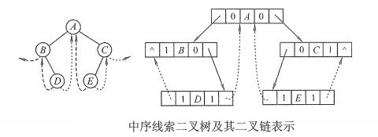

Java代码实现：

```java
public class ThreadBinaryTree {
    private class ThreadNode {
        int data;
        ThreadNode lchild, rchild;
        int ltag, rtag;  //tag =1 表示存的是前驱和后继
    }

    //通过根结点的中序遍历建立中序线索二叉树的主程序
    public void createInThread(ThreadNode root) {
        ThreadNode pre = null;
        if (root != null) {
            inThread(root, pre);
            pre.rchild = null;  //对最后一个结点的操作
            pre.rtag = 1;
        }
    }

    //中序遍历对二叉树线索化的递归算法
    private void inThread(ThreadNode p, ThreadNode pre) {
        if (p != null) {
            inThread(p.lchild, pre);
            if (p.lchild == null) {
                p.lchild = pre;
                p.ltag = 1;
            }
            if (pre != null && pre.rchild == null) {
                pre.rchild = p;
                pre.rtag = 1;
            }
            pre = p;  //当p将要离开一个访问过的结点时，令pre指向p，当p来到新结点时，pre正好是p的前驱
            inThread(p.rchild, pre);
        }
    }
}
```

### 中序线索二叉树的遍历

中序线索二叉树的遍历不再需要借助栈。

求以root为根的中序线索二叉树中，中序序列的第一个结点的算法：

```java
public ThreadNode getFirst(ThreadNode root){
    while (root.ltag!=1)root = root.lchild;  //最左下结点(不一定是叶结点)
    return root;
}
```

求中序线索二叉树中结点p的后继结点的算法：

```java
public ThreadNode getNext(ThreadNode p){
    if(p.rtag == 1) return p.rchild;  //右指针域存的就是后继结点，直接返回
    return getFirst(p.rchild);  //rtag==0表示有右孩子，寻找右孩子的中序遍历的第一个结点
}
```

同理可得中序线索二叉树的中序序列最后一个结点的算法和求结点p的前驱结点的算法：

```java
public ThreadNode getLast(ThreadNode root){
    while(root.rtag==0)root =root.rchild;
    return root;
}
public ThreadNode getPrior(ThreadNode p){
    if(p.ltag == 1)return p.lchild;
    return getLast(p.lchild);
}
```

则有遍历中序线索二叉树的算法为：

```java
public void visitInThread(ThreadNode root){
    for(ThreadNode p = getFirst(root); p!=null; p = getNext(p)){
        visit(p);
    }
}
```

### 二叉树的先序线索化和后序线索化

```java
public void preThread(ThreadNode p, ThreadNode pre) {
    if (p != null) {
        connectPreAndP(p, pre);
        preThread(p.lchild, pre);
        preThread(p.rchild, pre);
    }
}

public void postThread(ThreadNode p, ThreadNode pre) {
    if (p != null) {
        postThread(p.lchild, pre);
        postThread(p.rchild, pre);
        connectPreAndP(p, pre);
    }
}

private void connectPreAndP(ThreadNode p, ThreadNode pre) {
    if (p.lchild == null) {
        p.lchild = pre;
        p.ltag = 1;
    }
    if (pre != null && pre.rchild == null) {
        pre.rchild = p;
        pre.rtag = 1;
    }
    pre = p;  //当p将要离开一个访问过的结点时，令pre指向p，当p来到新结点时，pre正好是p的前驱
}
```

## 树、森林与二叉树的转换

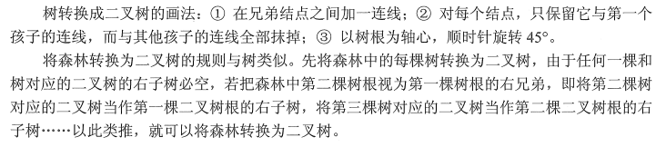

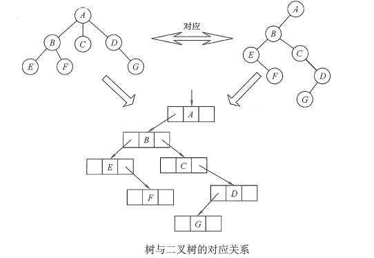

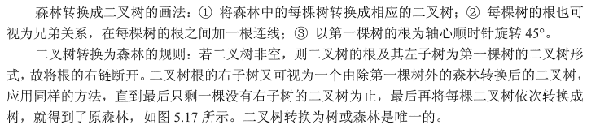

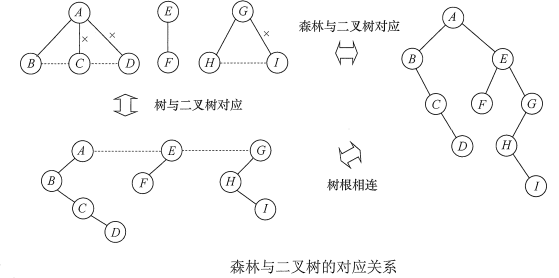

## 树和森林的遍历

树的遍历主要方式主要有三种：

- 先根遍历：若树非空，先访问根结点，再依次遍历根结点的每棵子树，遍历子树时仍遵循先根后子树的规则。其遍历序列与这棵树对应的二叉树的**先序序列**相同。
- 后根遍历：若树非空，先依次遍历根结点的每棵子树，再访问根结点，遍历子树时仍遵循先子树后根的规则。其遍历序列与这棵树对应的二叉树的**中序序列**相同。
- 层次遍历：与二叉树的层次遍历思想基本相同，即按层序依次访问各结点。

森林的遍历方式分为先序遍历森林、中序遍历森林，分别于对应的二叉树的先序遍历和中序遍历相同。

## 树的应用：并查集

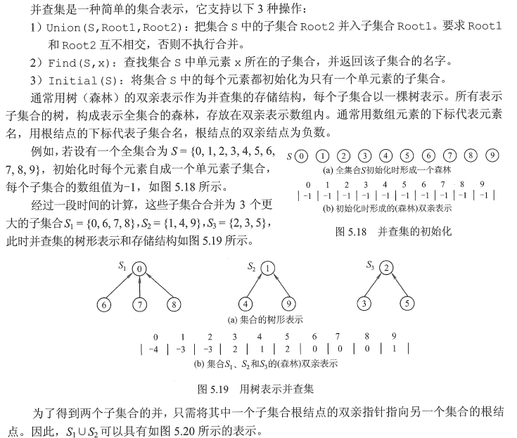

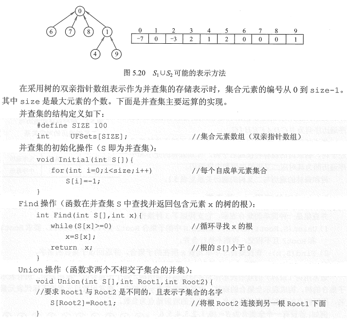

## 树与二叉树的引用

### 二叉排序树(BST)

#### 二叉排序树的定义

二叉排序树(也称二叉查找树)或者是一棵空树，或者是具有下列特性的二叉树：

- ①若左子树非空，则左子树上所有结点的值均小于根结点的值。
- ②若右子树非空，则右子树上的所有结点的值均小于根结点的值。
- ③左右子树又分别是一棵二叉排序树。

对二叉排序树进行中序遍历，可以得到一个递增的有序序列。

#### 二叉排序树的查找

若二叉树非空，先将给定值与根结点的关键字比较，若相等，则查找成功；若不等，如果小于根结点的关键字，则在根结点的左子树上查找，否则在根结点的右子树上查找。这显然是一个递归的过程。

二叉排序树的递归查找算法：

```java
public BTNode BST(int key, BTNode T){
    if(key == T.data || T == null) return T;
    else if(Key < T.data) return BST(key, T.lchild);
    else return BST(key, T.rchild);
}
```

二叉排序树的非递归查找算法：

```java
public BTNode BST(int key, BTNode T){
    while(key != T.data || T != null){
        if(key < T.data) T = T.lchild;
        else T = T.rchild;
    }
    return T;
}
```

#### 二叉排序树的插入

二叉排序树作为一种动态树表，其特点是树的结构通常不是一次生成的，而是在查找过程中，当树中不存在关键字值等于给定值的结点时再进行插入的。

插入结点的过程为：若原二叉排序树为空，则直接插入结点；否则，若关键字k小于根结点值，则插入到左子树，若关键字k大于根结点值，则插入到右子树。插入的结点一定是一个新添加的叶结点，切实查找失败时的查找路径上访问的最后一个结点的左孩子或右孩子。如下图：在一个二叉树中依次插入结点28和结点58，虚线表示的边是其查找的路径。

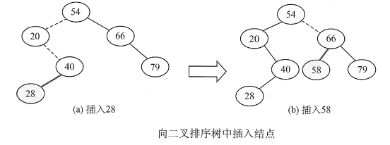

二叉排序树插入操作的递归算法实现：

```java
public boolean BSTInsert(int k, BTNode T){
    if(T == null){
        T = new BTNode();
        T.data = k;
        return true;
    }else if(T.data == k) return false; //已存在则插入失败
    else if(T.data < k) return BSTInsert(k, T.lchild);
    else return BSTInsert(k, T.rchild);
}
```

#### 二叉排序树的构造

从一棵空树出发，依次输入元素，将他们插入到二叉排序树中的合适位置。设输入序列为{45,24,53,45,12,24}，则生成的二叉排序树如下图所示：


算法实现如下：

```java
public void createBST(BTNode T, int[] sequence){
    T = null;  //初始化为空树
    for(int i = 0; i < sequence.length; i++){
        BSTInsert(sequence[i], T);
    }
}
```

#### 二叉排序树的删除

- ①若被删除结点z是叶结点，则直接删除，不会破坏二叉排序树的性质。
- ②若结点z只有一棵左子树或右子树，则让z的子树成为z父节点的子树，替代z的位置。
- ③若结点z的左右子树都存在，则令z的中序直接后继(或直接前驱)替代z，然后从二叉排序树中删去这个直接后继(或直接前驱)，这样就转化成了第一或第二种情况。

示例：依次删除树中的45, 78, 78结点

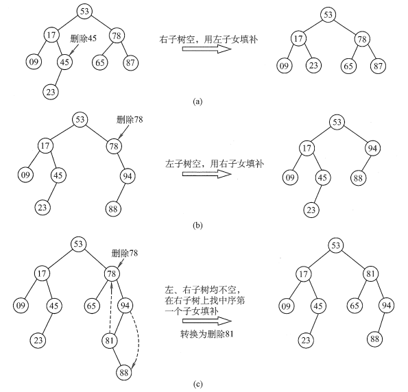

#### 二叉排序树的查找效率分析

二叉排序树的查找效率主要取决于树的高度。平衡二叉树的平均查找长度为$O(log_2n)$。最坏情况下，若二叉排序树是一个只有左孩子或右孩子的单支树，则其平均查找长度为$O(n)$。

示例：平均查找长度的计算：

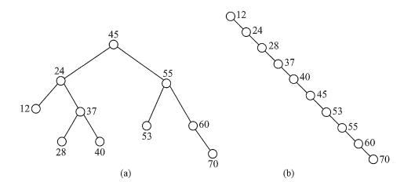

$ASL_a = (1+2×2 + 3×4 + 4×3) /10 = 2.9$

$ASL_b = (1+2+3+4+5+6+7+8+9+10)/10 = 5.5$

#### 二叉排序树和二分查找的异同

从查找过程看，二叉排序树与二分查找相似。就平均时间性能而言，二叉排序树上的查找和二分查找差不多。但**二分查找的判定树唯一，而二叉排序树的查找不唯一**，相同的关键字，若插入顺序不同，可能生成不同的二叉排序树。

从维护表的有序性看，二叉排序树无序移动结点，只需修改指针即可完成插入和删除操作，平均执行时间为$O(log_2n)$。二分查找的对象是有序顺序表，若又插入和删除结点的操作，所化的代价是$O(n)$。当有序表是静态查找表时，宜用顺序表作为其存储结构，而采用二分查找实现其查找操作；若有序表是动态查找表，则应选择二叉排序树作为其逻辑结构。

### 平衡二叉树

平衡二叉树(Balanced Binary Tree)或者是一棵空树，或者是一棵在任意结点的左右子树**高度差**的绝对值不超过1的二叉树。平衡二叉树又称为AVL树。

> 注意是高度差而不是结点数差。
>

平衡二叉树是改进的二叉排序树。

一个结点的左子树与右子树的高度差称为该结点的平衡因子，则平衡二叉树的平衡因子只能是-1,0,1。

#### 平衡二叉树的插入

每当在二叉排序树中插入(或删除)一个结点时，首先检查其插入路径上的结点是否因为此次操作而导致了不平衡。若导致了不平衡，**则先找到插入路径上离插入节点最近的平衡因子的绝对值大于1的结点A**，再对以A为根的子树，在保持二叉排序树特性的前提下，调整各结点的位置关系，使之重新达到平衡。

> 即每次调整的对象都是最小不平衡子树。
>

需要调整的情况可以分为4种：

- LL平衡旋转，也称为右单旋转。即在结点A的左孩子的左孩子上插入新结点导致的不平衡，需要向右旋转一次：将A的左孩子B向右上旋转，代替A称为根结点，A向右下旋转后成为B右孩子，B之前的右孩子则作为A的左孩子。
    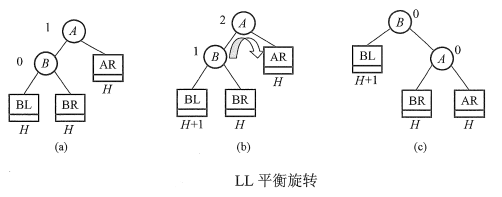
- RR平衡旋转，也成为左单旋转。即在结点A的右孩子的右孩子上插入新结点导致的不平衡，需要向左旋转一次：将A的右孩子B向左上旋转，代替A称为根结点，A向左下旋转后成为B左孩子，B之前的左孩子则作为A的右孩子。
    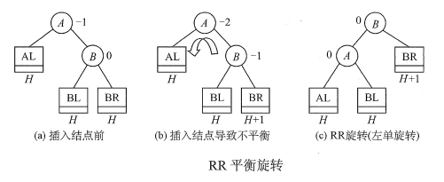
- LR平衡旋转，也成为先左后右双旋转。即在结点A的左孩子的右孩子上插入新结点导致的不平衡，需要先左旋转再右旋转：先将A的左孩子B的右孩子C向左上旋转代替B，再向右上旋转代替A。
    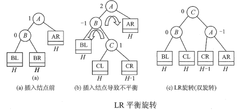
- RL平衡旋转，也成为先右后左双旋转。即在结点A的右孩子的左孩子插入新节点导致的不平衡，需要先右旋转再左旋转：先将A的右孩子B的左孩子C向右上旋转代替B，再向左上旋转代替A。
    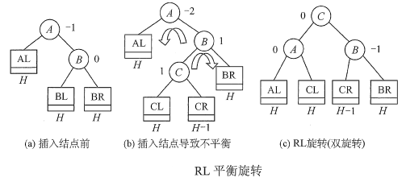

> LR和RL旋转时，新节点究竟是插入C的左子树还是右子树不影响旋转过程，示例图中以插入C的左子树为例。
>

示例：空树中插入序列{15,3,7,10,9,8}生成平衡二叉树的过程

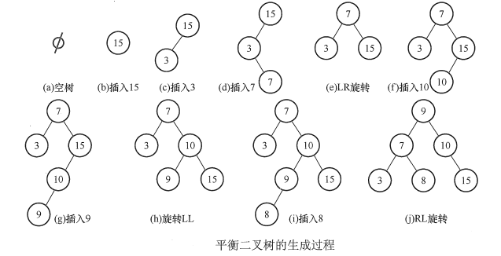

#### 平衡二叉树的查找

在平衡二叉树上进行查找的过程与二叉排序树相同。含有n个结点的平衡二叉树的最大深度为$O(log_2n)$，因此平衡二叉树的平均查找长度为$O(log_2n)$。

### 哈夫曼树与哈夫曼编码

#### 哈夫曼树的定义

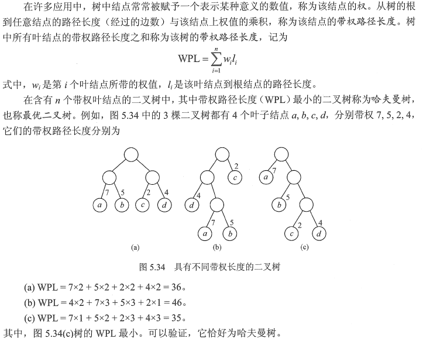

#### 哈夫曼树的构造

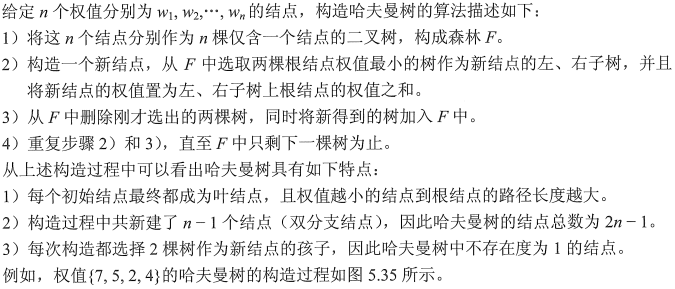

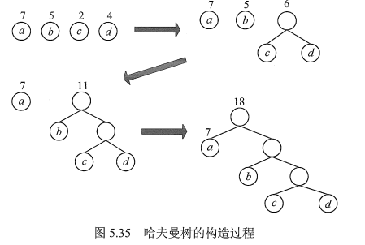

#### 哈夫曼编码

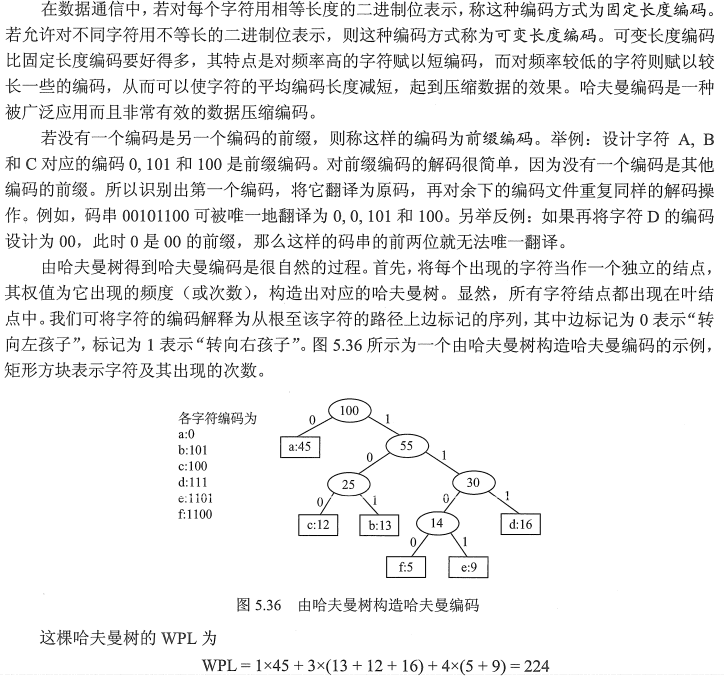

此处的WPL可以视为最终编码得到的二进制编码的长度，共224为。若采用3位固定长度编码，则得到的二进制编码长度位300位，因此哈夫曼编码共压缩了25%的数据。**利用哈夫曼树可以设计出总长度最短的二进制前缀编码。**

> 0和1究竟表示左子树还是右子树没有明确规定。左右孩子结点的顺序是任意的，所以构造出的哈夫曼树并不唯一，但各哈夫曼树的带权路径长度WPL相同且为最优。此外，若有若干权值相同的结点，则构造出的哈夫曼树更可能不同，但WPL必然相同且是最有的。
>