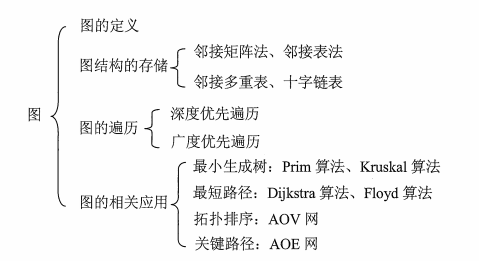

## 图的基本概念

### 图的定义

图G由顶点集V和边集E组成，记为G=(V,E)，其中V(G)表示图G中顶点的有限非空集；E(G)表示图G中顶点之间的关系(边)的集合。若V = {v1, v2, ... , vn}，则用|V|表示图G中顶点的个数，也称图G的阶；E = {(u,v)| u∈V, v∈V}，用|E|表示图G中边的条数。

> 线性表可以是空表，树可以是空树，但图不能是空图。最小的图由一个点构成。即点集不能为空，边集可以为空。
>

#### 有向图与无向图

有向图：边集由有向边组成的有限集合称为有向图。有向边也称为弧，记为<v,w>，由v指向w。

无向图：边集由无向边组成的有限集合称为无向图。记为(v,w)或(w,v)。

#### 简单图与多重图

简单图：满足以下两点的图：①不存在重复边；②不存在顶点到自身的边。数据结构只讨论简单图。

多重图：与简单图定义相对，即若一个图存在重复边或存在顶点到自身的边，则称为多重图。

#### 完全图(简单完全图)

- 对于无向图，|E|的取值范围是0到n(n-1)/2。则含有n(n-1)/2条边的无向图称为无向完全图。此时任意两个顶点之间都存在边。
- 对于有向图，|E|的取值范围是0到n(n-1)。则含有n(n-1)条弧的有向图称为有向完全图。此时任意两个顶点之间都存在两条方向相反的弧。

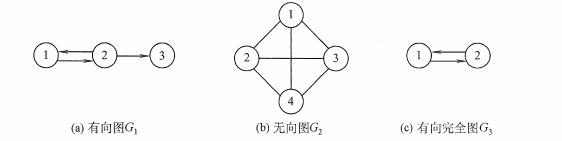

#### 子图

子图：设有两个图G=(V,E)和G' = (V',E')，若V‘是V的子集，且E'是E的子集，则称G'是G的子图。

- 生成子图：若图G的子图G'满足V(G') = V(G)，则称G'是G的生成子图。

> 并非V和E的任何子集都能构成G的子图，因为这样的子集可能不是图，即E的子集中的某些边关联的结点可能不在这个V的子集中。
>

#### 连通、连通图、连通分量

连通：在**无向图**中，若顶点v到顶点w有路径存在，则称v和w是连通的。若图G中任意两个顶点都是连通的，则称图G为连通图，否则称为非连通图。无向图中的**极大连通子图**称为改图的连通分量。如下图(a)中，无向图G4有3个连通分量。

> 连通、连通图、连通分量都是对无向图而言的；对于有向图，讨论强连通、强连通图和强连通分量。
>
> 含有n个顶点的图，若边数小于n-1，则该图一定不是连通图。
>
> 极大连通子图要求该连通子图含有其所有的边；极小连通子图则是在保持图连通的同时又要使得边数最少。
>

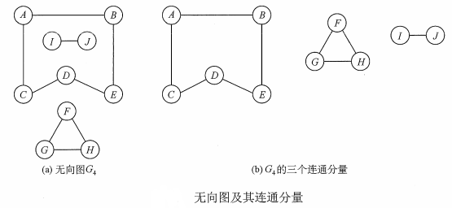

#### 强连通图、强连通分量

在**有向图**中，若从顶点v到顶点w和从顶点w到顶点v之间都有路径，则称这两个顶点是强连通的。若图中任何一对顶点都是强连通的，则称此图为强连通图。有向图的极大强连通子图称为该图的强连通分量。

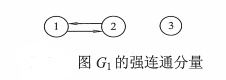

#### 生成树与生成森林

连通图的生成树是包含图中全部顶点的一个极小连通子图。若图中顶点数为n，则它的生成树含有n-1条边。对生成树而言，若砍去它的一条边，则会变成非连通图，若加上一条边则会形成一个回路。在非连通图中，连通分量的生成树构成了非连通图的生成森林。

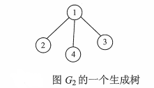

> 包含无向图中全部顶点的极小连通子图，只有生成树满足条件，因为砍去生成树的任一条边，图将不再连通。
>

#### 顶点的度、入度和出度

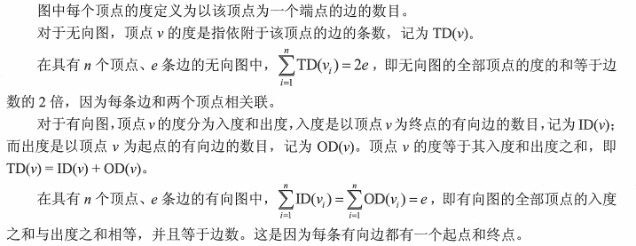

#### 边的权值和网

在一个图中，每条边都可以标上具有某种含义的数值，该数值称为该边的权值。这种边上带有权值的图称为带权图，也称为网。

#### 路径、路径长度和回路

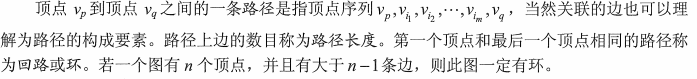

在路径序列中，顶点不重复出现的路径称为**简单路径**。除第一个顶点和最后一个顶点外，其余顶点不重复出现的回路称为**简单回路**。

从顶点u出发到顶点v的路径若存在，则最短那条路径的长度称为从u到v的距离。若从u到v的路径不存在，则记该距离为∞。

## 图的存储及基本操作

图的存储要完整、准确地反应顶点集和边集的信息。根据不同图的结构和算法，采用不同的存储方式。

### 邻接矩阵法

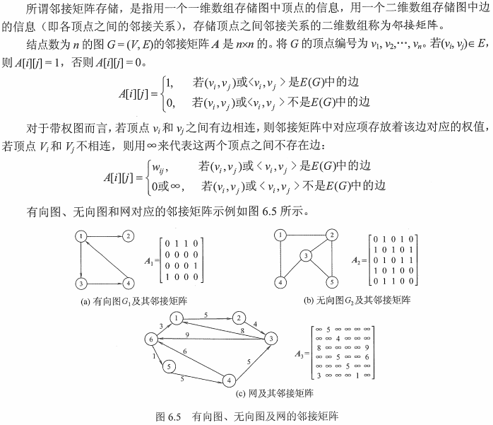

图的邻接矩阵存储结构的定义如下：

```java
public class MGraph{
    private int[] V;
    private int[][] E;
    public MGraph(int maxVertexNum){
        V = new int[maxVertexNum];
        E = new int[maxVertexNum][maxVertexNum];
    }
}
```

> ① 在简单应用中，可直接用二维数组作为图的邻接矩阵(顶点信息等均可省略)。
>
> ② 无向图的邻接矩阵是对称矩阵，对规模较大的邻接矩阵可以采用压缩存储。
>
> 邻接矩阵表示法的空间复杂度为$O(n^2)$，其中$n$为图的顶点数$|V|$。
>

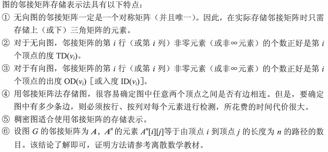

### 邻接表法

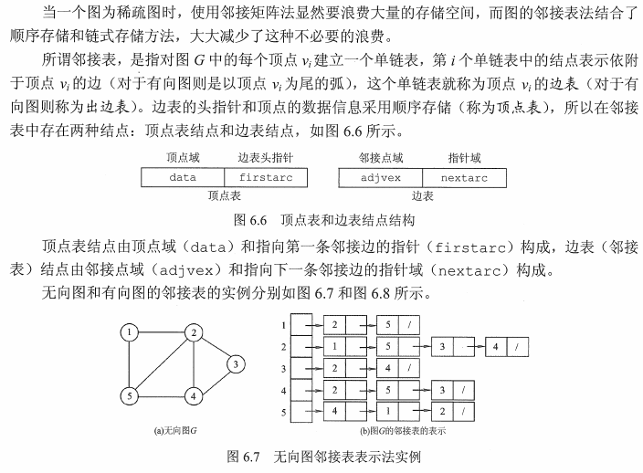

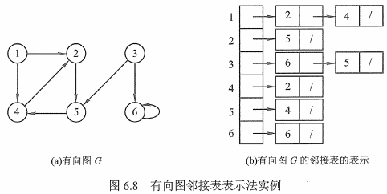

图的邻接表存储结构的定义如下：

```java
public class ALGraph{
    private class ArcNode{
        int vex;  //顶点编号
        ArcNode next;  //下一个结点
    }
    private class VNode{
        String data;  //顶点存储的信息
        ArcNode first;  //指向第一条边
    }
    VNode[] adjList;
    int VexNum;
    int ArcNum;
    
    public ALGraph(int v){
        this.VexNum = v;
        this.ArcNum = 0;
        adjList = new VNode[v];
    }
}
```

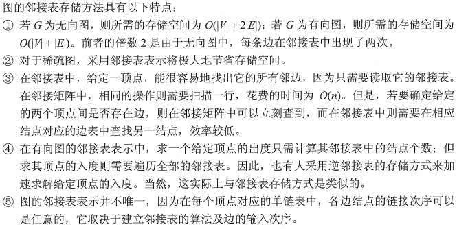

### 十字链表

十字链表是**有向图**的一种链式存储结构。在十字链表中，对应于有向图中的每条弧有一个结点，对应于每个顶点也有一个结点。这些结点的结构如下图所示。

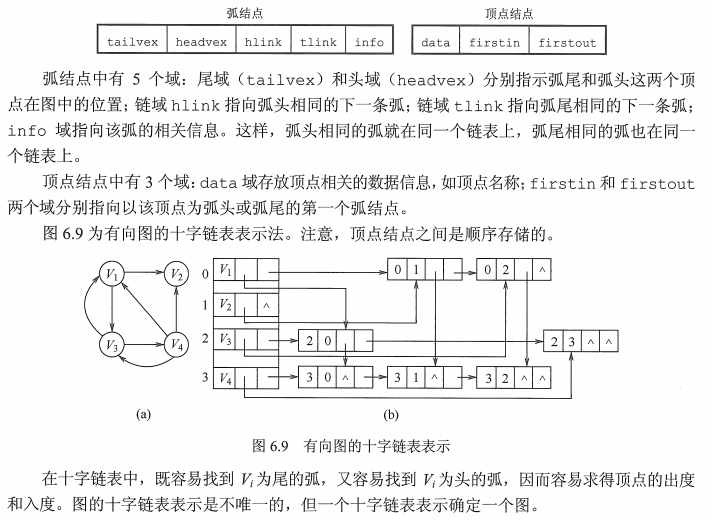

### 邻接多重表

邻接多重表是**无向图**的另一种链式存储结构。

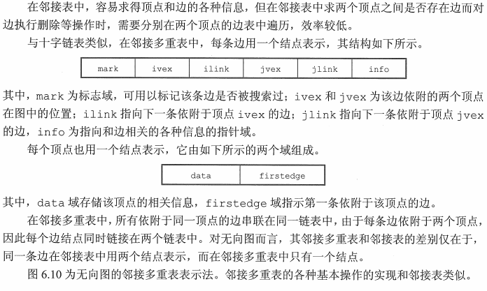

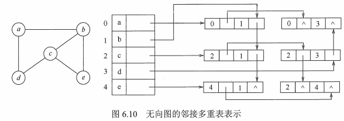

### 图的基本操作

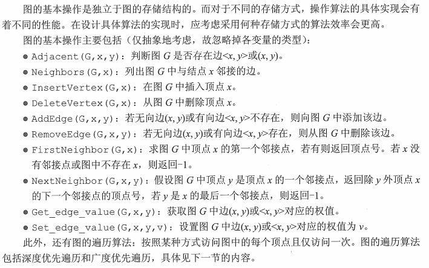

## 图的遍历

图的遍历是指从图中的某一顶点出发，按照某种搜索方法沿着图中的边对图中的所有顶点访问一次且只访问一次。图的遍历算法是求解图的连通性问题、拓扑排序和求关键路径等算法的基础。

在遍历图的过程中，必须记下每个已访问过的顶点，为此可以设一个辅助数组visited来标记顶点是否被访问过。

图的遍历算法主要有两种：广度优先搜索和深度优先搜索。

### 广度优先搜索(BFS)

BFS(Breadth-First-Search)类似于树的层序遍历算法。基本思想是：首先访问起始顶点v，接着由v出发，依次访问v的各个为访问过的邻接顶点$w_1,w_2,...,w_i$，然后依次访问$w_1,w_2,...,w_i$的所有未被访问过的邻接顶点；再从这些访问过的顶点出发，访问他们所有未被访问过的邻接顶点，直至图中所有顶点都被访问过为止。若此时图中尚有顶点未被访问，则另选图中一个未曾被访问的顶点作为始点，重复上述过程，直至图中所有顶点都被访问到为止。

> Dijkstra单元最短路径算法和Prim最小生成树算法也应用了类似的思想。
>

BFS是一种分层查找的过程，为了实现逐层访问，需要借助一个辅助队列，以记忆正在访问的顶点的下一层顶点。算法执行过程如下：

- ① 任取图中一个顶点访问，入队，并将这个顶点标记为一访问；
- ② 当队列不空时，循环执行：出队，依次检查出队顶点的所有邻接顶点，若未被访问过，则访问并入队；
- ③ 当队列为空时跳出循环，广度优先搜索完成。

以邻接表为存储结构的BFS算法伪代码如下：

```java
public void BFS(ALGraph G){
    boolean[] visited = new boolean[G.vexNum];
    for(int v = 0; v < G.vexNum; v++){
        if(!visited[v]) bfs(G,v, visited);
    }
}
private void bfs(ALGraph G, int v, boolean[] visited){
    Queue<Integer> queue = new Queue<>();
    visit(v);  //访问v
    visited[v] = true;
    queue.enqueue(v);  //入队
    ArcNode p; //用于遍历的指针
    while(!queue.isEmpty()){
        int w = queue.dequeue();  //出队
        p = G.adjList[w].first;
        while(p!=null){
            if(!visited[p]){
                visit(p.vex);
                visited[p.vex] = true;
                queue.enqueue(p.vex);
            }
            p = p.next;
        }
    }
}
```

> 对于连通图，调用一次bfs()就可以将整个图的所有结点遍历，对于非连通图，需要多次调用bfs()。
>

示例：

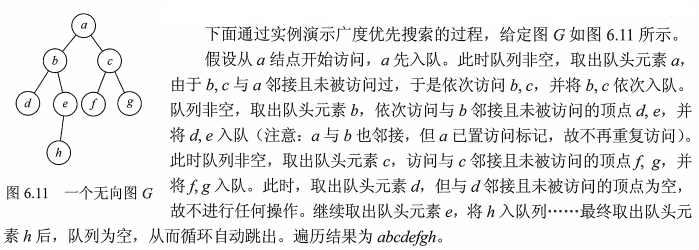

#### BFS算法的性能分析

无论是邻接表还是邻接矩阵的存储方式，BFS算法都需要借助一个辅助队列Q，n个顶点均需入队一次，在最坏的情况下，空间复杂度为$O(|V|)$。

采用邻接表存储方式时，每个顶点均需搜索一次(或入队一次)，故时间复杂度为$O(|V|)$，在搜索任一顶点的邻接点时，每条边至少访问一次，故时间复杂度为$O(|E|)$，算法总的时间复杂度为$O(|V|+|E|)$。采用邻接矩阵存储方式时，查找每个顶点的邻接点所需的时间为$O(|V|)$，故算法总的时间复杂度为$O(|V|^2)$。

#### BFS算法求解非带权图单源最短路径问题

若图G=（V,E)为非带权图，定义从顶点u到顶点v的最短路径d(u,v)为从u到v的任何路径中最少的边数；若从u到v没有通路，则d(u,v) = ∞。

算法实现：

```java
private void minDistance(ALGraph G, int u){
    Queue<Integer> queue = new Queue<>();
    boolean[] visited = new boolean[G.vexNum];
    int[] dist = new int[G.vexNum];
    for(int i = 0; i < dist.length; i++){
        d[i] = ∞; //伪代码。初始化路径长度
    }
    d[u] = 0; //visit(u)的实际操作
    visited[u] = true;
    queue.enqueue(u);  //入队
    ArcNode p; //用于遍历的指针
    while(!queue.isEmpty()){
        int w = queue.dequeue();  //出队
        p = G.adjList[w].first;
        while(p!=null){
            if(!visited[p]){
                d[p.vex] = d[w] + 1;  //visit(p.vex)
                visited[p.vex] = true;
                queue.enqueue(p.vex);
            }
            p = p.next;
        }
    }
}
```

#### 广度优先生成树

在广度优先遍历的过程中，我们可以得到一棵遍历树，称为广度优先生成树。

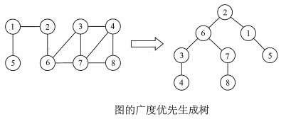

### 深度优先搜索(DFS)

DFS(Depth-First-Search)类似于树的先序遍历。这种搜索算法所遵循的策略是尽可能深地搜索一个图。其基本思想是：首先访问图中某一起始顶点v，然后由v出发，访问与v邻接且未被访问的任一顶点$w_1$，在访问与$w_1$邻接且未被访问的任一顶点$w_2$……重复上述过程。当不能再继续向下访问时，依次退回到最近被访问的顶点，若它还有邻接顶点未被访问过，则从该点开始继续上述搜索过程，直至图中所有顶点均被访问过为止。

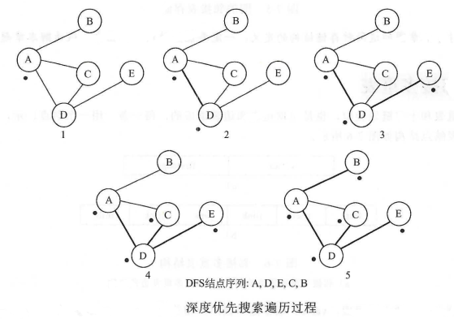

以邻接表为存储结构的DFS算法伪代码如下：

```java
public void DFS(ALGraph G){
    boolean[] visited = new boolean[G.vexNum];
    for(int v = 0; v < G.vexNum; v++){
        if(!visited[v]) dfs(G, v, visited);
    }
}
private void dfs(ALGraph G, int v, boolean[] visited){
    visit(v);
    visited[v] = true;
    ArcNode p = G.adjList[v].first;
    while(p!=null){
        if(!visited(p.vex)) dfs(G,p.vex,visited);  //递归
        p = p.next;
    }
}
```

> - 对于连通图，调用一次dfs()就可以将整个图的所有结点遍历，对于非连通图，需要多次调用dfs()。
> - 对于同样一个图，基于邻接矩阵的遍历所得到的DFS序列和BFS序列是唯一的，基于邻接表的遍历所得到的DFS序列和BFS序列都是不唯一的。
>

#### DFS算法的性能分析

DFS算法是一个递归算法，需要借助一个递归工作栈，故其空间复杂度为$O(|V|)$。

遍历图的过程实质上是对每个顶点查找其邻接点的过程，其耗费的时间取决于所用的存储结构。以邻接矩阵表示时，查找每个顶点的邻接点所需的时间为$O(|V|)$，故总的时间复杂度为$O(|V|^2)$；以邻接表表示时，查找所有顶点的邻接点所需的时间为$O(|E|)$，访问顶点所需的时间为$O(|V|)$，此时，总的时间复杂度为$O(|V|+|E|)$。

#### 深度优先遍历的生成树和生成森林

DFS对于连通图得到生成树，对于非连通图得到生成森林。

与BFS类似，基于邻接表存储的深度优先生成树是不唯一的。

## 图的应用

### 最小(代价)生成树

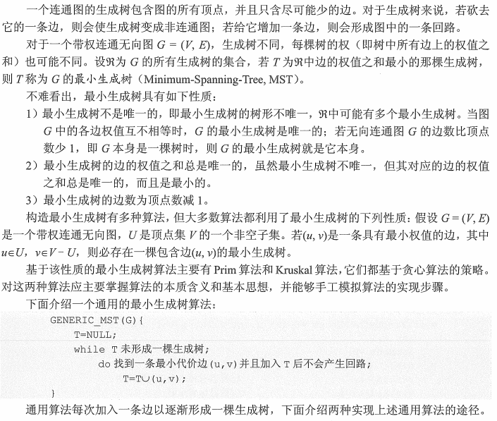

#### Prim算法

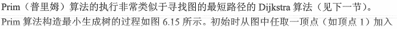

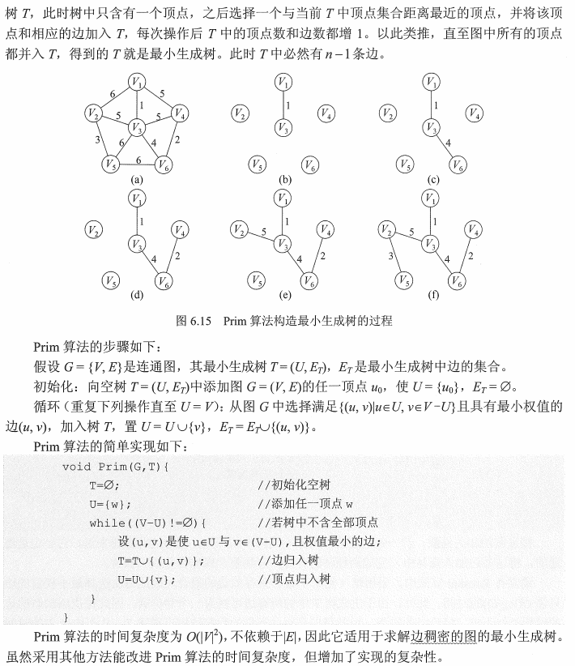

#### Kruskal算法

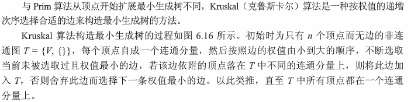

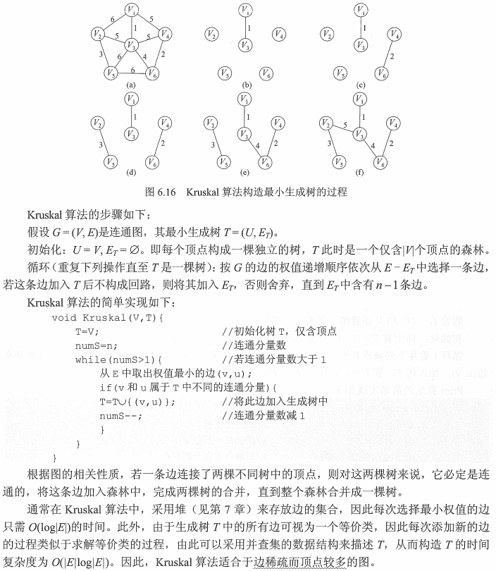

### 最短路径

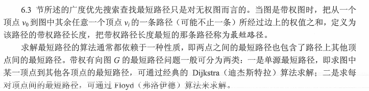

#### Dijkstra算法求单源最短路径问题

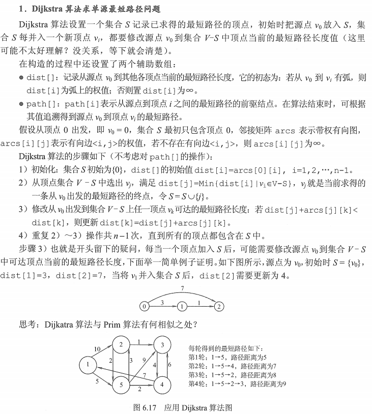

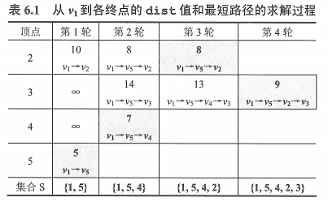

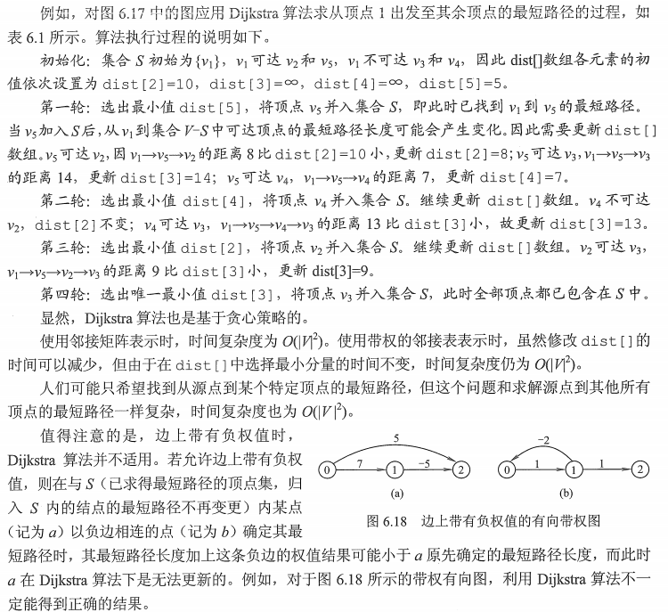

#### Floyd算法求各顶点之间最短路径问题

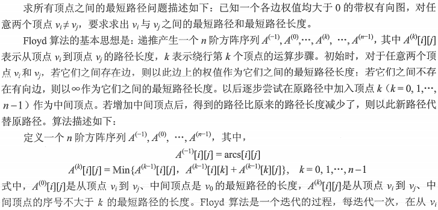

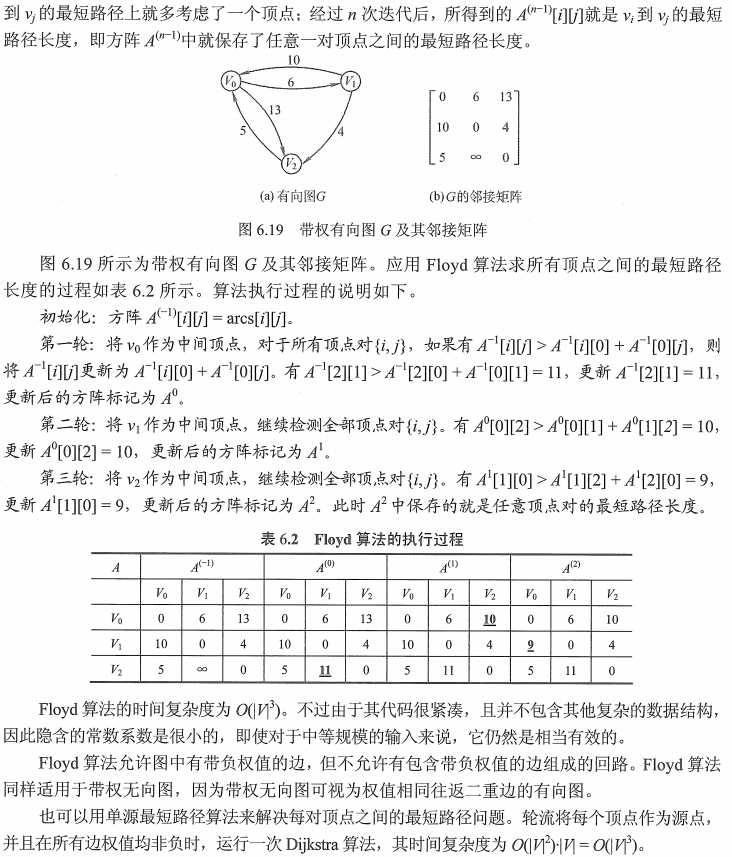

### 有向无环图描述表达式


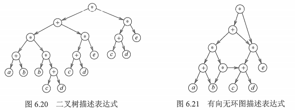

### 拓扑排序

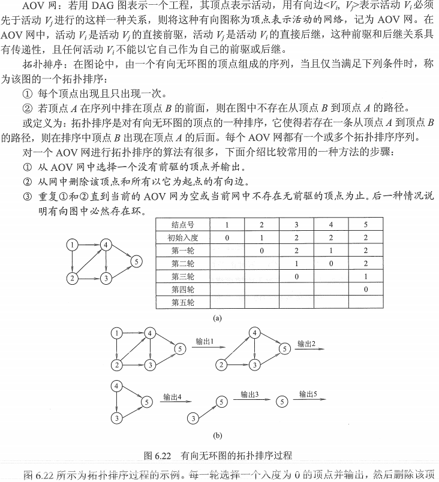

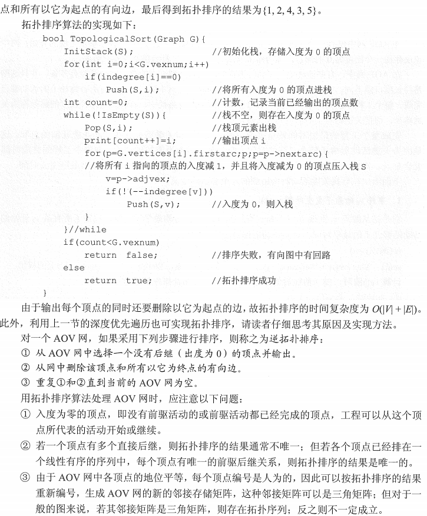

### 关键路径

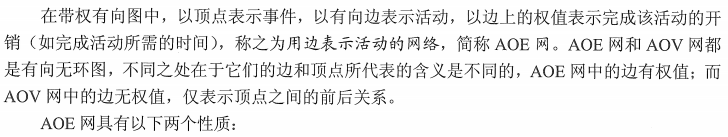

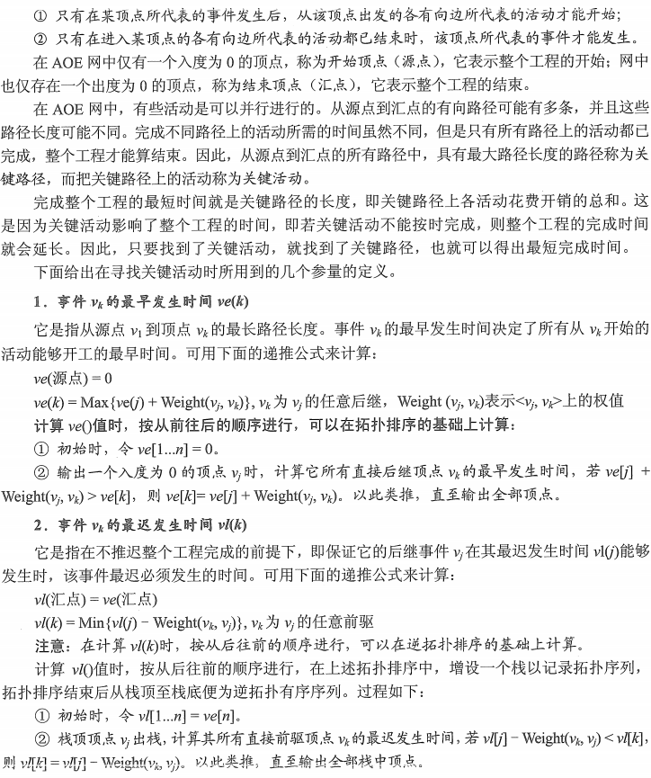

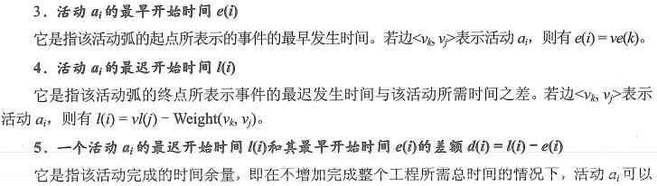

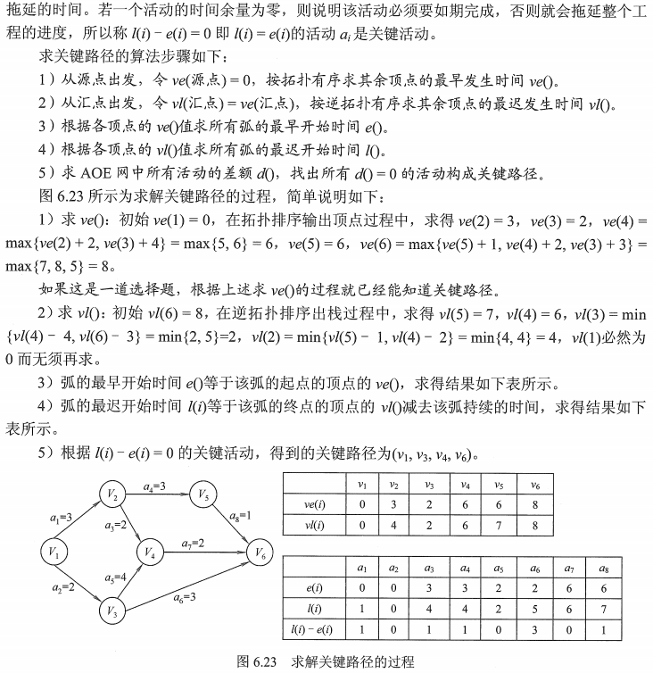

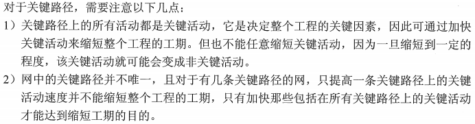