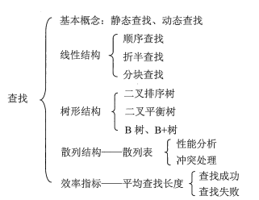

## 查找的基本概念

查找表：用于查找的数据集合称为查找表，它有同一类型的数据元素组成，可能是一个数组或链表等数据类型。

静态查找表：查询某个特定的元素是否在查找表中，而无须动态地修改查找表，此类查找表称为静态查找表。适合静态查找表的查找方法又顺序查找、折半查找、散列查找等。

动态查找表：需要动态地插入或删除的查找表称为动态查找表。适合动态查找表的查找方法又二叉排序树的查找‘散列查找等。

关键字：数据元素中唯一标识该元素的某个数据项的值，使用基于关键字的查找，查找结果应该是唯一的。如：学生元素的“学号”数据项唯一地标识一名学生。

**平均查找长度**：在查找过程中，一次查找的长度是指需要比较的关键字次数，而平均查找长度则是所有查找过程中进行关键字的比较次数的平均值，其数学定义为：$ASL = \sum\limits_{n=1}^nP_iC_i$。

> 式中，n是查找表的长度，$P_i$是查找第$i$个元素的概率，一般认为每个数据元素的的查找概率相等，即$P_i = 1/n$；$C_i$是找到第$i$个数据元素所需进行的比较次数。
>
> **平均查找长度是衡量查找算法效率的最主要的指标。**
>

## 顺序查找

顺序查找又称为线性查找，主要用于在线性表中进行查找。

顺序查找通常分为对一般的无序线性表的顺序查找和对按关键字有序的顺序表的顺序查找。

### 无序线性表的顺序查找

从线性表的一端开始，逐个检查各元素的关键字是否满足给定的条件。若查找到满足条件的元素，则查找成功，返回该元素在线性表中的位置；若查找完所有元素仍未发现满足条件的元素，则返回查找失败信息。

```java
public int search(int[] a, int key){
    for(int i = 0; i < a.length; i++){
        if(a[i] == key) return i;
    }
    return -1;
}
```

查找长度分析：

- 查找成功：设a[i] == key,则查找成功一共经过i次比较。$ASL = \sum\limits_{i=1}^n \frac{i}{n} = \frac{1}{n}×\frac{n(1+n)}{2} = \frac{n+1}{2}$
- 查找失败：n次查找全部失败，则$ASL = n$

查找成功和查找失败的时间复杂度都是$O(n)$。

### 有序线性表的顺序查找

有序表的顺序查找，查找成功的查找长度同无序表；查找失败时，可以优化：不用查找到最后一个元素才停下，如在升序表中查找某个元素，当`a[i]>key`时仍未找到满足的元素，就可以停止了。

## 折半查找

折半查找又称为二分查找，仅适用于**有序**的**顺序表**。【有序的链表仍只能用顺序查找】

思想：首先将`a[mid]`与`key`进行比较，若相等，则查找成功，返回mid；若不等，则查找范围缩小到`[left, mid-1`或`[mid+1, right]`。循环以上过程，直到找到符合条件的mid或到达终止条件：`left>right`。

```java
public static int binarySearch(int[] a, int key) {
    int left = 0, right = a.length - 1;
    int mid;
    while (left <= right) {
        mid = (left + right) / 2;
        if (a[mid] == key) return mid;
        else if (a[mid] < key) left = mid + 1;
        else right = mid - 1;
    }
    return -1;
}
```

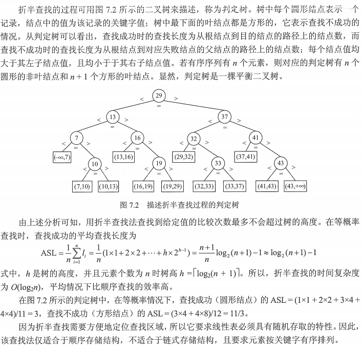

## 分块查找

分块查找又称为索引顺序查找，它吸取了顺序查找和折半查找各自的优点，既有动态结构，又适于快速查找。

分块查找的基本思想：将查找表分为若干子块。块内的元素可以无序，但块之间是有序的，即第一个块中的最大关键字小于第二个块中的所有记录的关键字，第二个块中的最大关键字小于第三个块中的所有记录的关键字，以此类推。再建立一个索引表，索引表中的每个元素含有各块的最大关键字和各块中的第一个元素的地址，索引表按关键字有序排列。

查找过程：①在索引表中确定待查记录所在的块，可以通过顺序查找或折半查找②在块中进行顺序查找。

例如：关键码集合为`{88,24,72,61,21,6,32,11,8,31,22,83,78,54}`，按照关键码值24,54,78,88分为4个块和索引表。如下图所示：

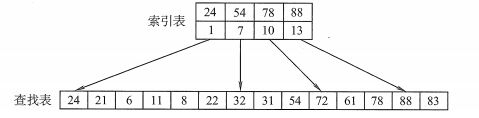

分块查找的平均查找长度为索引查找和块内查找的平均长度之和。设索引查找和块内查找的平均查找长度分别为$L_1$和$L_2$，则$ASL = L_1 + L_2$。

## B树和B+树

B树又称为多路平衡查找树，B树中所有结点的孩子个数的最大值称为B树的阶，通常用m表示，一棵m阶B树或为空树，或为满足如下特性的m叉树：

- ①树中每个结点至多有m棵子树，即至多含有m-1个关键字。
- ②若根结点非空，则至少有2棵子树。
- ③除根结点外的所有非叶结点至少含有$\lceil m/2 \rceil$棵子树，即至少含有$\lceil m/2 \rceil - 1$个关键字。
- ④所有非叶结点的结构如下：
    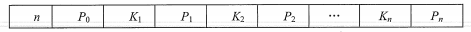
    其中，$K_i(i=1,2,...,n)$为结点的关键字，且满足$K_1<K_2<...<K_n$；$P_i(i=0,1,...n)$为指向子树根结点的指针，且指针$P_{i-1}$所指子树中所有结点的关键字均小于$K_i$，$P_i$所指子树中所有结点的关键字均大于$K_i$，$n(\lceil m/2 \rceil - 1 ≤ n ≤ m - 1)$为结点中关键字的个数。
- ⑤所有的叶结点都出现在同一层次上，并且不带信息(空结点)

B树是所有结点的平衡因子均等于0的多路平衡查找树。

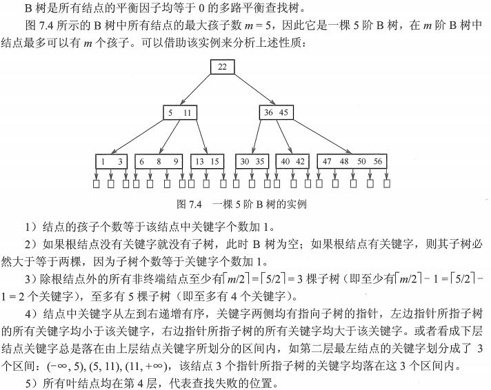

### B树的高度(磁盘存取次数)

B树中的大部分操作所需的磁盘存取次数与B树的高度成正比。

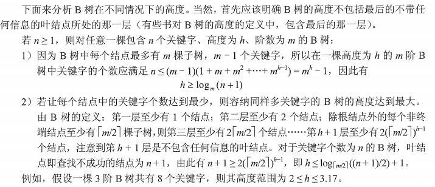

### B树的查找

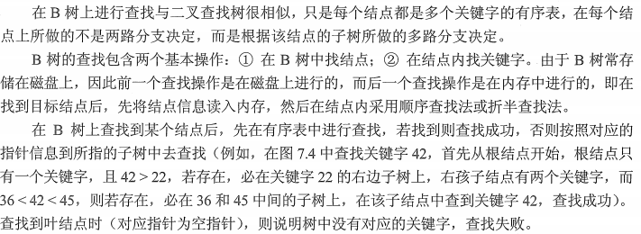

### B树的插入

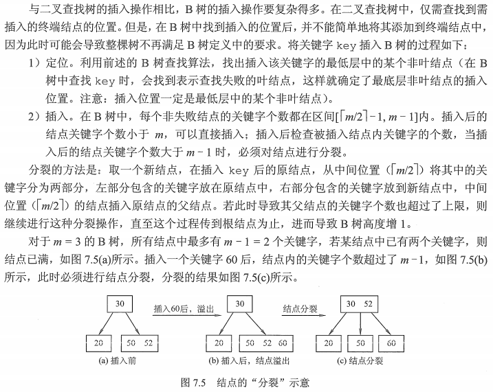

### B树的删除

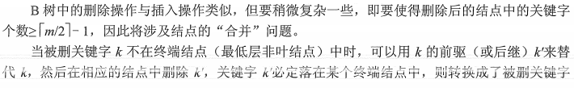

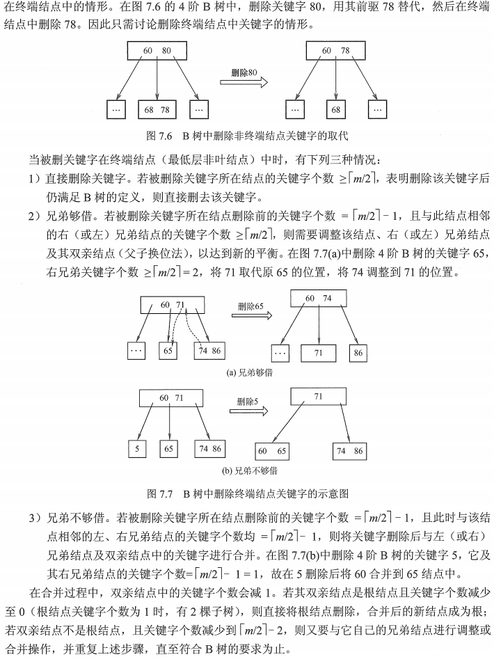

### B+树

B+树是应数据库所需而出现的一种B树的变形树。

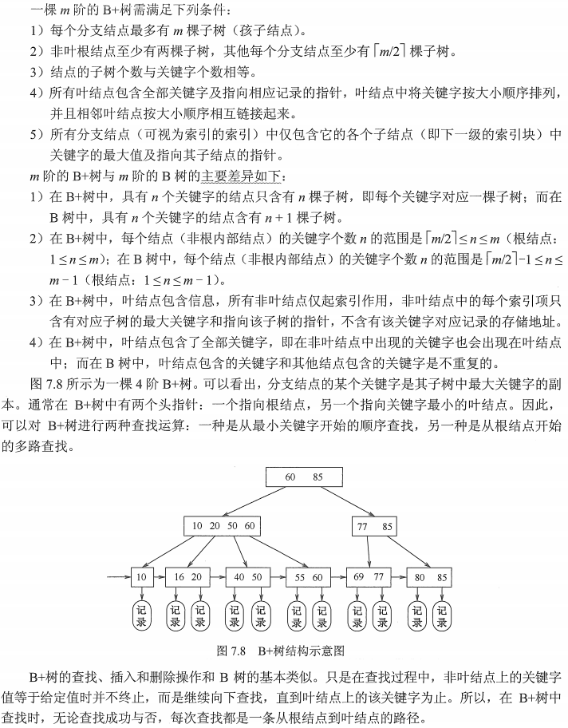

## 散列表