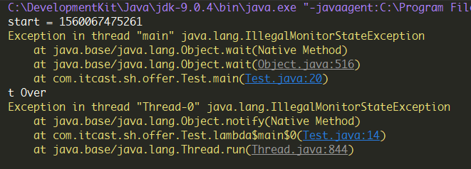
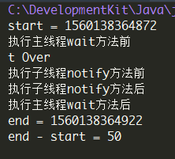

## while循环

对于“主线程如何获取子线程总运行时间”的问题，最开始想到的是使用while循环进行轮询：

```
Thread t = new Thread(() -> {
    //子线程进行字符串连接操作
    int num = 1000;
    String s = "";
    for (int i = 0; i < num; i++) {
        s += "Java";
    }
    System.out.println("t Over");
});
//开始计时
long start = System.currentTimeMillis();
System.out.println("start = " + start);
t.start();
long end = 0;
while(t.isAlive() == true){//t.getState() != State.TERMINATED这两种判断方式都可以
    end = System.currentTimeMillis();
}
System.out.println("end = " + end);
System.out.println("end - start = " + (end - start));
```

但是这样太消耗CPU，所以我在while循环里加入了暂停：

```
while(t.isAlive() == true){
    end = System.currentTimeMillis();
    try {
        Thread.sleep(10);
    }catch (InterruptedException e){
        e.printStackTrace();
    }
}
```

这样做的结果虽然cpu消耗减少，但是数据不准确了

---

## Thread的join()方法

接着我又找到了第二种方法：

```
long start = System.currentTimeMillis();
System.out.println("start = " + start);
t1.start();
try {
    t.join();//注意这里
} catch (InterruptedException e) {
    e.printStackTrace();
}
long end = System.currentTimeMillis();
System.out.println("end = " + end);
System.out.println("end - Start:" + (end - start));
```

使用join()方法，join()方法的作用，是等待这个线程结束；（t.join()方法阻塞调用此方法的线程(calling thread)，直到线程t完成，此线程再继续，这里贴个说的[挺清楚的博客](https://www.cnblogs.com/techyc/p/3286678.html)）

---

## synchronized的等待唤醒机制

第二种方法的确实现了计时，接着我又想到了多线程的等待唤醒机制，思路是：子线程启动后主线程等待，子线程结束后唤醒主线程。于是有了下面的代码：

```
Object lock = new Object();
Thread t = new Thread(() -> {  
    int num = 1000;
    String s = "";
    for (int i = 0; i < num; i++) {
        s += "Java";
    }
    System.out.println("t Over");
    lock.notify();//子线程唤醒
});
//计时
long start = System.currentTimeMillis();
System.out.println("start = " + start);
//启动子线程
t.start();
try {
    lock.wait();//主线程等待
} catch (InterruptedException e) {
    e.printStackTrace();
}
long end = System.currentTimeMillis();
System.out.println("end = " + end);
System.out.println("end - start = " + (end - start));
```

但是这样会抛出两个异常：



由于对wait()和notify()的理解并不是很深刻，所以我最开始并不清楚为什么会出现这样的结果，因为从报错顺序来看子线程并没有提前唤醒，于是我在[segmentfault](https://segmentfault.com/q/1010000019423597?_ea=12604746)和[CSDN](https://bbs.csdn.net/topics/392692225)都发出了提问，同时也询问了我一个很厉害的朋友，最后得出的结论是调用wait()方法时需要获取该对象的锁，[Object文档](https://docs.oracle.com/javase/8/docs/api/java/lang/Object.html#wait--)里是这么说的：

> The current thread must own this object's monitor.
>
> IllegalMonitorStateException - if the current thread is not the owner of the object's monitor.
>

所以上面的代码需要改成这样：

```
Thread t = new Thread(() -> {
    int num = 1000;
    String s = "";
    for (int i = 0; i < num; i++) {
        s += "Java";
    }
    System.out.println("t Over");
    synchronized (lock) {//获取对象锁
        lock.notify();//子线程唤醒
    }
});
//计时
long start = System.currentTimeMillis();
System.out.println("start = " + start);
//启动子线程
t.start();
try {
    synchronized (lock) {//这里也是一样
        lock.wait();//主线程等待
    }
} catch (InterruptedException e) {
    e.printStackTrace();
}
long end = System.currentTimeMillis();
System.out.println("end = " + end);
System.out.println("end - start = " + (end - start));
```

这样的确得出了结果，但是我想知道两个线程的执行顺序，于是在wait和nitify前后分别加了一个输出，最后得出的运行结果是：



可以看出主线程先wait子线程再notify，也就是说，如果子线程在主线程wati前调用了nitify，会导致主线程无限等待，所以这个思路还是有一定的漏洞的。

关于wait和notify这里贴个[挺清楚的博客](https://www.cnblogs.com/techyc/p/3272321.html)

---

## CountDownLatch

第四种方式可以等待多个线程结束，就是使用java.util.concurrent包下的CountDownLatch类（关于CountDownLatch的用法可以参考这篇[简洁的博客](https://www.cnblogs.com/will-shun/p/7392619.html)）

简单来说，CountDownLatch类是一个计数器，可以设置初始线程数（设置后不能改变），在子线程结束时调用countDown()方法可以使线程数减一，最终为0的时候，调用CountDownLatch的成员方法wait()的线程就会取消BLOKED阻塞状态，进入RUNNABLE从而继续执行。下面上代码：

```
int threadNumber = 1;
final CountDownLatch cdl = new CountDownLatch(threadNumber);//参数为线程个数
Thread t = new Thread(() -> {
    int num = 1000;
    String s = "";
    for (int i = 0; i < num; i++) {
        s += "Java";
    }
    System.out.println("t Over");
    cdl.countDown();//此方法是CountDownLatch的线程数-1
});
long start = System.currentTimeMillis();
System.out.println("start = " + start);
t.start();
//线程启动后调用countDownLatch方法
try {
    cdl.await();//需要捕获异常，当其中线程数为0时这里才会继续运行
}catch (InterruptedException e){
    e.printStackTrace();
}
long end = System.currentTimeMillis();
System.out.println("end = " + end);
System.out.println("end - start = " + (end - start));
```

---

## Future

又想到刚学习了线程池，线程池的submit()的返回对象Future接口有一个get()方法也可以阻塞当前线程（其实该方法主要用途是获取子线程的返回值），所以第五种方法也出来了：

```
ExecutorService executorService = Executors.newFixedThreadPool(1);
Thread t = new Thread(() -> {
    int num = 1000;
    String s = "";
    for (int i = 0; i < num; i++) {
        s += "Java";
    }
    System.out.println("t Over");
});
long start = System.currentTimeMillis();
System.out.println("start = " + start);
Future future = executorService.submit(t);//子线程启动
try {
    future.get();//需要捕获两种异常
}catch (InterruptedException e){
    e.printStackTrace();
}catch (ExecutionException e){
    e.printStackTrace();
}
long end = System.currentTimeMillis();
System.out.println("end = " + end);
System.out.println("end - start = " + (end - start));
executorService.shutdown();
```

> 这里, ThreadPoolExecutor 是实现了 ExecutorService的方法, sumbit的过程就是把一个Runnable接口对象包装成一个 Callable接口对象, 然后放到 workQueue里等待调度执行. 当然, 执行的启动也是调用了thread的start来做到的, 只不过这里被包装掉了. 另外, 这里的thread是会被重复利用的, 所以这里要退出主线程, 需要执行以下shutdown方法以示退出使用线程池. 扯远了.
>
> 这种方法是得益于Callable接口和Future模式, 调用future接口的get方法, 会同步等待该future执行结束, 然后获取到结果. Callbale接口的接口方法是 V call(); 是可以有返回结果的, 而Runnable的 void run(), 是没有返回结果的. 所以, 这里即使被包装成Callbale接口, future.get返回的结果也是null的.如果需要得到返回结果, 建议使用Callable接口.
>
> 参见[这篇博客](https://www.cnblogs.com/zhaoxinshanwei/p/5850812.html)
>

*看到这个Callable突然想到之前看C#多线程的时候有说到回调的问题，因此先开个坑，下篇博文说说Java的Callable与callback问题，先贴个Callable的[简单讲解](https://www.cnblogs.com/baizhanshi/p/6425209.html)*

---

## BlockingQueue

同时，在concurrent包中，还提供了BlockingQueue（队列）来操作线程，BlockingQueue的主要的用法是在线程间安全有效的传递数据，具体用法可以参见[这篇博客](https://wsmajunfeng.iteye.com/blog/1629354)，对于BlockingQueue说的非常详细。因此，第六种方法也出来了：

```
BlockingQueue queue = new ArrayBlockingQueue(1);//数组型队列，长度为1
Thread t = new Thread(() -> {
    int num = 1000;
    String s = "";
    for (int i = 0; i < num; i++) {
        s += "Java";
    }
    System.out.println("t Over");
    try {
        queue.put("OK");//在队列中加入数据
    } catch (InterruptedException e) {
        e.printStackTrace();
    }
});
long start = System.currentTimeMillis();
System.out.println("start = " + start);
t.start();
try {
    queue.take();//主线程在队列中获取数据，take()方法会阻塞队列，ps还有不会阻塞的方法
} catch (InterruptedException e) {
    e.printStackTrace();
}
long end = System.currentTimeMillis();
System.out.println("end = " + end);
System.out.println("end - start = " + (end - start));
```

---

## CyclicBarrier

那么，有没有第七种方式呢？当然有啦~，还是concurrent包，只不过这次试用CyclicBarrier类：

> CyclicBarrier字面意思回环栅栏，通过它可以实现让一组线程等待至某个状态之后再全部同时执行。叫做回环是因为当所有等待线程都被释放以后，CyclicBarrier可以被重用。
>

```
CyclicBarrier barrier = new CyclicBarrier(2);//参数为线程数
Thread t = new Thread(() -> {
    int num = 1000;
    String s = "";
    for (int i = 0; i < num; i++) {
        s += "Java";
    }
    System.out.println("t Over");
    try {
        barrier.await();//阻塞
    } catch (InterruptedException e) {
        e.printStackTrace();
    } catch (BrokenBarrierException e) {
        e.printStackTrace();
    }
});
long start = System.currentTimeMillis();
System.out.println("start = " + start);
t.start();
try {
    barrier.await();//也阻塞,并且当阻塞数量达到指定数目时同时释放
} catch (InterruptedException e) {
    e.printStackTrace();
} catch (BrokenBarrierException e) {
    e.printStackTrace();
}
long end = System.currentTimeMillis();
System.out.println("end = " + end);
System.out.println("end - start = " + (end - start));
```

实际是上面这种方法是不太严谨的，因为在子线程阻塞之后如果还有代码是会继续执行的，当然本例中后面是没有代码可执行了，可以近似理解为是子线程的运行时间。

这里贴个[CountDownLatch、CyclicBarrier和Semaphore](https://www.cnblogs.com/dolphin0520/p/3920397.html)的讲解博客

---

## 小结

至此，集齐了七颗龙珠，得出小结：

1. while循环进行轮询
2. Thread类的join方法
3. synchronized锁
4. CountDownLatch
5. Future
6. BlockingQueue
7. CyclicBarrier