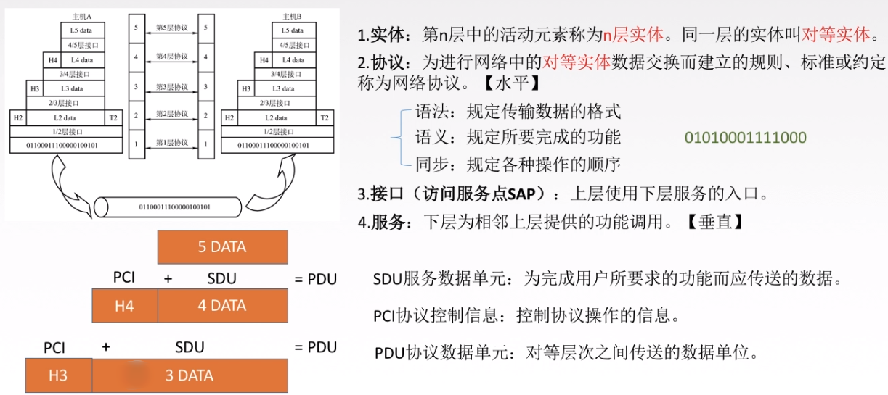
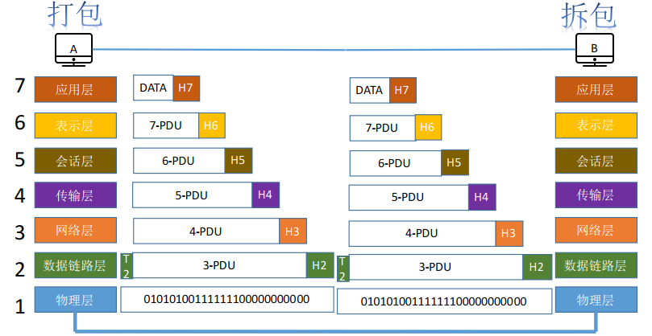
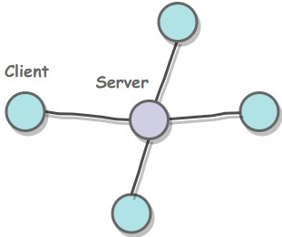
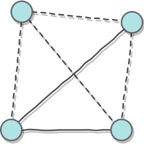

## 概念、功能、组成、分类

### 概念

计算机网络是**互连的** 、**自治的** 计算机的集合。

### 功能

**数据通信** 、**资源共享** 、分布式处理、提高可靠性、负载均衡。

### 组成

根据工作方式：

* 边缘部分(主机)：用户直接使用
* 核心部分(网络+路由器)：为边缘部分服务

根据功能：

* 通信子网：实现数据通信
* 资源子网：实现资源共享

### 分类

* **按分布范围** ：广域网WAN(交换技术)、城域网MAN、局域网WAN、个人区域网PAN
* 按使用者分：公用网、专用网
* 按交换技术分：电路交换、报文交换、分组交换
* 按拓扑结构分：总线型、星型、环型、网状型(常用于广域网)
* 按传播技术分：广播式网络(共享公共通信信道)、点对点网络(使用**分组存储转发** 和**路由选择** 机制)

## 性能指标(了解)

①速度指标：速率、带宽、吞吐量

②时间指标：时延、时延带宽积、往返时间

③利用率

### 速率

速率即数据率或称比特率。速率是计算机网络中最重要的性能指标。

单位：b/s, kb/s, Mb/s, Gb/s, Tb/s

### 带宽

计算机网络中带宽指单位时间内从网络中某一点到另一点所能通过的最高数据率，即理想最高速率。

单位：b/s, kb/s, Mb/s, Gb/s, Tb/s

有时也可以指网络设备能支持的最高速率。如某路由器的带宽为200M。

### 吞吐量

单位时间内通过某个网络(或信道、接口)的数据量。

单位：b/s, kb/s, Mb/s, Gb/s, Tb/s

> 速率就是某个设备的网速，带宽是理论最高网速，吞吐量是当前信道中的总速率

### 时延

指数据(报文/分组/比特流)从网络(或链路)的一端传送到另一端所需的时间。

单位是s。

发送时延=数据长度/信道带宽

传播时延=信道长度/电磁波在信道上的传播速率

### 时延带宽积

时延带宽积=传播时延×带宽

即某段链路上能容纳的比特数

### 往返时间RTT

从发送方发送数据开始，到发送方收到接收方的确认(接收方收到数据后立即发送确认)，总共经历的时延。

RTT=传播时延×2+末端处理时间(一般可忽略)

### 利用率

信道利用率=有数据通过的时间/总时间

网络利用率=信道利用率的加权平均

## OSI和TCP/IP参考模型(▲)

学习计算机网络时我们一般采用折中的办法，也就是中和 OSI 和 TCP/IP 的优点，采用一种只有五层协议的体系结构，这样既简洁又能将概念阐述清楚。

结合互联网的情况，自上而下地，非常简要的介绍一下各层的作用。

传输层及以上是**进程之间**的通信，传输层以下是**主机之间**的通信。

### 为什么要分层

1. 解耦：各层之间相互独立，各自负责自己的功能，上层不需要知道底层的细节，只需要通过接口获取下层的服务
2. 灵活：只要功能和接口不变，某一层内部细节的变化对其他层不产生影响
3. 易于实现和标准化：把一个大问题分割成多个小问题，分而治之，利于实现

### 五层协议各层的作用

#### 1.1 应用层

应用层(application-layer）用于**具体网络应用**之间的通信。应用层协议定义的是网络应用间的通信和交互的规则。**对于不同的网络应用需要不同的应用层协议**。

在互联网中应用层协议很多，如：

- 用于域名和ip地址相互映射的**域名系统 DNS**
- 用于网页的**超文本传输协议** **HTTP**
- **简单邮件传输协议** **SMTP**

应用层交互的数据单元称为**报文**。

#### 1.2 传输层

传输层(transport layer)主要负责提供两台主机**进程之间**(即端到端)的**通用**的数据传输服务。应用进程利用该服务传送应用层报文。

- “通用”是指并**不针对某一个特定的网络应用**，而是多种应用可以使用同一个运输层服务。
- 由于一台主机可同时运行多个线程，因此传输层有**复用和分用**的功能。复用是指多个应用层进程可同时使用下面传输层的服务，分用则是传输层把收到的信息分别交付给应用层中的不同进程。

传输层主要使用以下两种协议:

- **传输控制协议**(Transmission Control Protocol, **TCP**)：提供**面向连接**的，**可靠的**数据传输服务。
- **用户数据报协议(**User Datagram Protocol, **UDP**)：提供**无连接**的，尽最大努力的数据传输服务（**不保证数据传输的可靠性**）。

#### 1.3 网络层

互联网是由大量的异构(heterogeneous)网络通过路由器(router)相互连接起来的。**网络层的任务是实现异构网络的互联、路由选择和分组转发，以及分组的拥塞控制确保数据及时传送。**

网络层把传输层的报文段或用户数据报封装成**IP数据报**，由于链路层**最大传输单元MTU**的限制，IP数据报切分为**分片**(分组)进行传送。

网络层协议：无连接的**网际协议**(Internet Protocol)和许多**路由选择协议(RIP/OSPF)**。

#### 1.4 数据链路层

数据链路层(data link layer)**给网络层的IP 数据报添加首部和尾部，组装成帧**，并保证帧在相邻节点间的可靠传输。每一帧包括数据和必要的**控制信息**（如同步信息，地址信息，差错控制(包括检错和纠错)等）。

#### 1.5 物理层

物理层(physical layer)用于实现网络节点之间**比特流的透明传输**，尽可能屏蔽掉具体传输介质和物理设备的差异。在物理层上所传送的数据单位是比特。

### 实体、协议、服务、接口

### 通信过程是一个打包拆包的过程

网络层及以上，每一层都要对上一层发送的数据进行处理（加个头部）

数据链路层不仅需要加头部，还需要加尾部

物理层什么都不加，只管发送数据（比特流）

## 分层网络协议(▲)

**网络协议之间的关系图如下：**

## 主机之间的通信方式

客户-服务器（C/S）：客户是服务的请求方，服务器是服务的提供方。

对等（P2P）：不区分客户和服务器。

## 电路交换、报文交换与分组交换

### 电路交换：打电话

特点：独占资源

阶段：建立连接、数据传输、连接释放

优点：

* 通信时延小
* 有序传输
* 没有冲突
* 实时性强

缺点：

* 建立连接时间长
* 线路独占，使用效率低
* 灵活性差
* 无差错控制

### 分组交换

**每个分组(Packet)都有首部和尾部，包含了源地址和目的地址等控制信息，分组交换不需要独占传输线路。**

**特点：存储转发**

**优点：**

* 无需建立连接
* 存储转发，动态分配线路
* 线路可靠性高
* 线路利用率高

缺点：

* 有存储转发时延
* 需要传输额外的信息量(源地址、目的地址、分组编号等)
* 分组可能乱序到达，需要额外排序重组