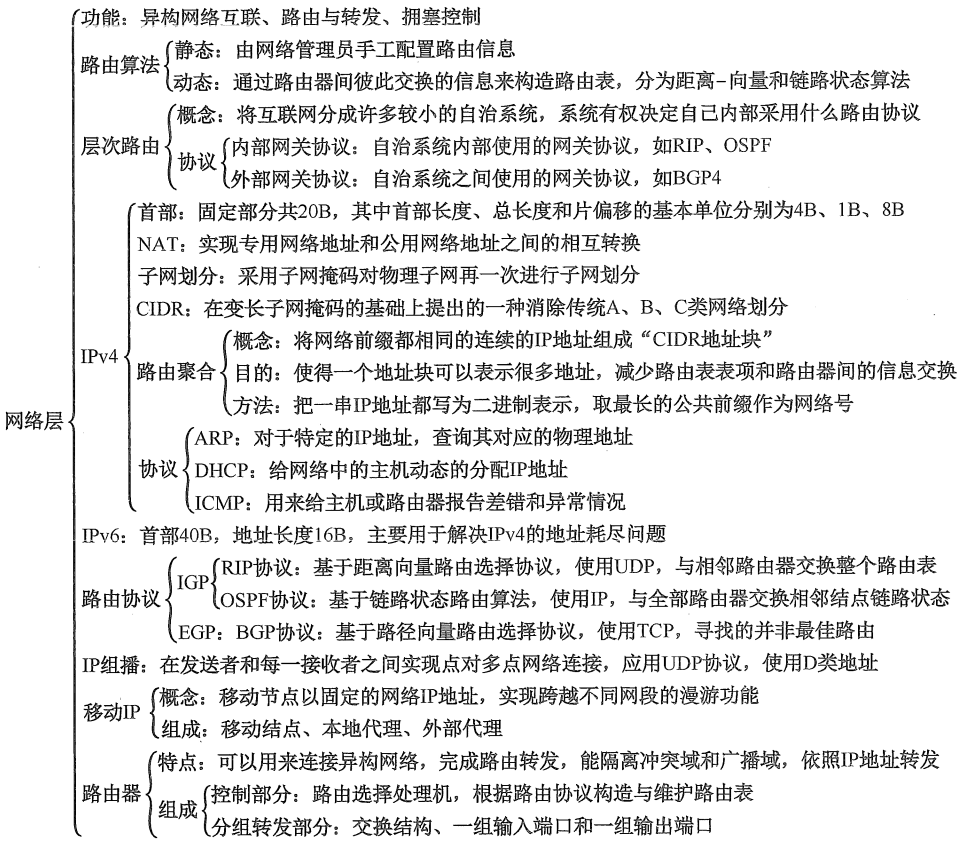
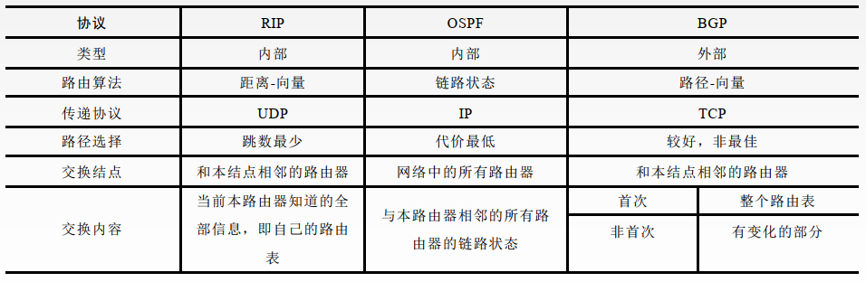
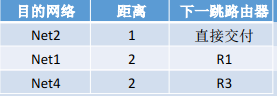
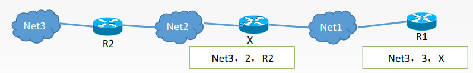
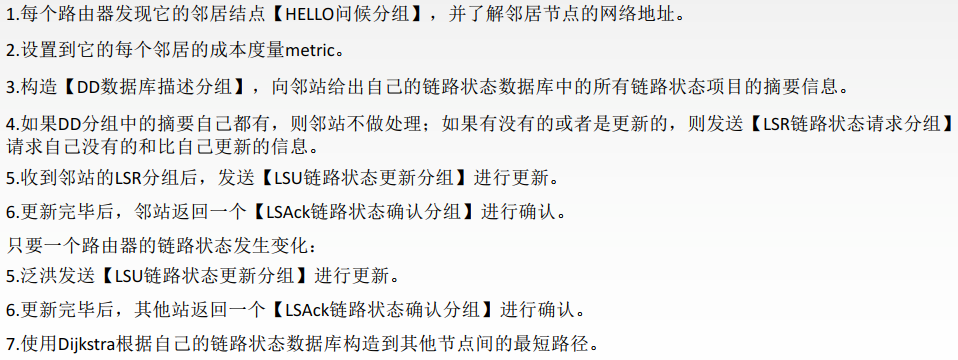
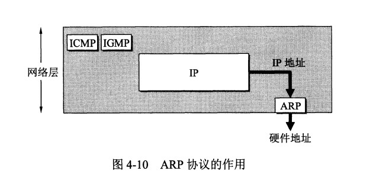

网络层的传输单位是**IP数据报**。

分组和数据报：数据报是一段比较长的数据，将其切割成段之后就得到分组。

# 1.网络层的功能

### 异构网络互联

网络互联是通过一种或多种**中继系统**相互连接，构成更大的网络系统。

常见的中继系统有：

- 物理层：中继器、集线器(hub)
- 数据链路层：网桥、交换机
- 网络层：路由器
- 网络层以上：网关

### 路由选择与分组转发

路由器主要完成两个功能：**路由选择**(确定路径)和**分组转发**

- 路由选择：根据特定的路由选择协议构造出路由表，并经常或定期地和相邻路由器交换路由信息而不断地对路由表进行更新和维护。
- 分组转发：根据由路由表得到的转发表将用户的IP数据包从合适的端口转发出去。

### 拥塞控制

在通信子网中，由于出现过量的分组而引起网络性能下降的现象称为**拥塞**。

发生拥塞时：链路带宽打满，乍一看是好事，因为链路带宽被充分利用，但是由于路由器端口的缓冲区有限，有大量的分组被丢弃，导致整个网络的吞吐量骤降，源与目的地之间的平均时延会变得几近于无穷大。

拥塞控制主要解决的问题是如何获取网络中发生拥塞的信息，从而利用这些信息进行控制，使得子网能够承载所到达的流量，以避免由于拥塞而出现分组的丢失以及严重拥塞而产生严重死锁(网络负载急剧增大，而吞吐量下降到零)的现象。

流量控制和拥塞控制的区别：

- 流量控制是对发送端和接收端之间的点对点通信量的控制，即抑制发送端的发送速率，以便接收端来得及接收；
- 拥塞控制是确保通信子网能够传送待传输的数据，是一个全局性问题，涉及网络中所有的主机、路由器以及路由器内部的转发处理过程等。

拥塞控制的方法：

- 开环控制：设计网络时事先周到考虑有关发生拥塞的因素，力求网络在正式工作时不发生拥塞，网络运转起来后不再修改，属于**静态**预防方法。
- 闭环控制：基于反馈电路，**动态**监测网络拥塞信息并进行调整。

# 2.路由算法及路由协议

## 路由算法分类

## 动态路由算法

## 层次路由

网络规模扩大时，路由器的路由表成比例地增大，必须对路由进行分层。

整个互联网可以被划分为许多较小的**自治系统(AS)**，一个自治系统中包含很多局域网，每个自治系统有权自主地决定本系统内应采用何种路由选择协议。

可以把路由选择协议划分为两大类：

- 自治系统**内部网关协议(Interior Gateway Protocol, IGP)**：RIP 和 OSPF
- 自治系统**外部网关协议(****External Gateway Protocol, EGP****)**：BGP

# 3.路由协议

三种路由协议的比较：

## 1. RIP(Routing Information Protocol)

RIP 是一种基于距离向量的路由选择协议。距离是指跳数(Hop Count)，直接相连的路由器跳数为 1。跳数最多为 15，16表示不可达。

RIP 按**固定的时隔**(30s)仅和**相邻路由器**交换自己的**完整路由表。**经过若干次交换之后，所有路由器最终会知道到达本自治系统中任何一个网络的最短距离和下一跳路由器地址。

RIP协议是**应用层协议**，使用**UDP**传送数据。

RIP协议选择的路径不一定是时间最短的，但一定是具有最少路由器的路径。

RIP 协议的优缺点：

优点：实现简单，开销小。

缺点：

- 能使用的最大距离为 15，限制了网络的规模。
- 路由器之间交换的是该路由器中的完整路由表，开销随着网络规模增大而增大。
- **慢收敛**：当网络出现故障时，要经过比较长的时间才能将此消息传送到所有路由器。

RIP协议的路由表：<目的网络N，距离d，下一跳路由器X>

距离向量算法：

①对地址为 X 的相邻路由器发来R1的 RIP 报文，先修改报文中的**所有项目**，把下一跳字段中的地址改为 X，并把所有的距离字段加 1；

②对修改后的 RIP 报文中的每一个项目，进行以下步骤：

- 若R1的路由表中没有Net3，则把该项目添加到R1路由表中；
- 若R1的路由表中有Net3，则查看旧项目的下一跳地址：
- - 若下一跳是 X，则用新项目替换旧项目；
  -   - 若下一跳不是X，且新项目中的距离d比旧项目小(从X走比原路径更近)，则更新，否则什么也不做。
- 若 **3 分钟**还没有收到相邻路由器的更新路由表，则把该相邻路由器标为**不可达**，即把距离置为 16。

## 2. OSPF(Open Shortest Path First)

OSPF是使用分布式链路状态路由算法的典型代表。

> 开放表示 OSPF 不受某一家厂商控制，而是公开发表的；最短路径优先表示使用了 Dijkstra 提出的最短路径算法 SPF。
>

OSPF 相比于 RIP 具有以下特点：

- 向本自治系统中的**所有**路由器发送信息，这种方法是**洪泛法**。
- 发送的信息只是与其相邻路由器的链路状态，是该路由器所知的**部分信息。**(链路状态包括与哪些路由器相连，以及链路的度量：费用、距离、时延、带宽等)。开销不会因网络规模变大而增大。
- 只有当链路状态发生变化时，路由器才会发送信息，并且收敛过程很快，不会出现RIP协议的“坏消息传得慢”的问题。
- OSPF是**网络层协议**，直接使用**IP数据报**传送。
- 所有路由器都能建立一个**链路状态数据库**，即**全网的拓扑结构图**，在全网范围内是一致的。
- 如果到同一个目的网络有多条相同代价的路径，那么可以将通信量分配给这几条路径以实现**负载均衡**。

链路状态路由算法(了解)

## 3. BGP(Border Gateway Protocol)

AS 之间的路由选择很困难，主要是由于：

- 互联网规模很大；
- 各个 AS 内部使用不同的路由选择协议，无法准确定义路径的度量；
- AS 之间的路由选择必须考虑有关的策略，比如有些 AS 不愿意让其它 AS 经过。

BGP 只能寻找一条**比较好**的路由，而不是最佳路由。

每个 AS 都必须配置 **BGP 发言人**，通过在两个相邻 BGP 发言人之间建立 **TCP** 连接来交换路由信息。

# IPv4

# IP 数据报格式

- **版本**  : 有 4（IPv4）和 6（IPv6）两个值；
- **首部长度**  : 占 4 位，因此最大值为 15。值为 1 表示的是 1 个 32 位字的长度，也就是 4 字节。因为固定部分长度为 20 字节，因此该值最小为 5。如果可选字段的长度不是 4 字节的整数倍，就用尾部的填充部分来填充。
- **区分服务**  : 用来获得更好的服务，一般情况下不使用。
- **总长度**  : 包括首部长度和数据部分长度。
- **生存时间**  ：TTL，它的存在是为了防止无法交付的数据报在互联网中不断兜圈子。以路由器跳数为单位，当 TTL 为 0 时就丢弃数据报。
- **协议**  ：指出携带的数据应该上交给哪个协议进行处理，例如 ICMP、TCP、UDP 等。
- **首部检验和**  ：因为数据报每经过一个路由器，都要重新计算检验和，因此检验和不包含数据部分可以减少计算的工作量。
- **标识**  : 在数据报长度过长从而发生分片的情况下，相同数据报的不同分片具有相同的标识符。
- **片偏移**  : 和标识符一起，用于发生分片的情况。片偏移的单位为 8 字节。

# IP 地址编址方式

IP 地址的编址方式经历了三个历史阶段：

- 分类
- 子网划分
- 无分类

## 1. 分类

由两部分组成，网络号和主机号，其中不同分类具有不同的网络号长度，并且是固定的。

IP 地址 ::= {< 网络号 >, < 主机号 >}

## 2. 子网划分

通过在主机号字段中拿一部分作为子网号，把两级 IP 地址划分为三级 IP 地址。

IP 地址 ::= {< 网络号 >, < 子网号 >, < 主机号 >}

要使用子网，必须配置子网掩码。一个 B 类地址的默认子网掩码为 255.255.0.0，如果 B 类地址的子网占两个比特，那么子网掩码为 11111111 11111111 11000000 00000000，也就是 255.255.192.0。

注意，外部网络看不到子网的存在。

## 3. 无分类

无分类编址 CIDR 消除了传统 A 类、B 类和 C 类地址以及划分子网的概念，使用网络前缀和主机号来对 IP 地址进行编码，网络前缀的长度可以根据需要变化。

IP 地址 ::= {< 网络前缀号 >, < 主机号 >}

CIDR 的记法上采用在 IP 地址后面加上网络前缀长度的方法，例如 128.14.35.7/20 表示前 20 位为网络前缀。

CIDR 的地址掩码可以继续称为子网掩码，子网掩码首 1 长度为网络前缀的长度。

一个 CIDR 地址块中有很多地址，一个 CIDR 表示的网络就可以表示原来的很多个网络，并且在路由表中只需要一个路由就可以代替原来的多个路由，减少了路由表项的数量。把这种通过使用网络前缀来减少路由表项的方式称为路由聚合，也称为  **构成超网**  。

在路由表中的项目由“网络前缀”和“下一跳地址”组成，在查找时可能会得到不止一个匹配结果，应当采用最长前缀匹配来确定应该匹配哪一个。

# 地址解析协议 ARP

网络层实现主机之间的通信，而链路层实现具体每段链路之间的通信。因此在通信过程中，IP 数据报的源地址和目的地址始终不变，而 MAC 地址随着链路的改变而改变。

ARP 实现由 IP 地址得到 MAC 地址。

每个主机都有一个 ARP 高速缓存，里面有本局域网上的各主机和路由器的 IP 地址到 MAC 地址的映射表。

如果主机 A 知道主机 B 的 IP 地址，但是 ARP 高速缓存中没有该 IP 地址到 MAC 地址的映射，此时主机 A 通过广播的方式发送 ARP 请求分组，主机 B 收到该请求后会发送 ARP 响应分组给主机 A 告知其 MAC 地址，随后主机 A 向其高速缓存中写入主机 B 的 IP 地址到 MAC 地址的映射。

# 网际控制报文协议 ICMP

ICMP 是为了更有效地转发 IP 数据报和提高交付成功的机会。它封装在 IP 数据报中，但是不属于高层协议。

ICMP 报文分为差错报告报文和询问报文。

## 1. Ping

Ping 是 ICMP 的一个重要应用，主要用来测试两台主机之间的连通性。

Ping 的原理是通过向目的主机发送 ICMP Echo 请求报文，目的主机收到之后会发送 Echo 回答报文。Ping 会根据时间和成功响应的次数估算出数据包往返时间以及丢包率。

## 2. Traceroute

Traceroute 是 ICMP 的另一个应用，用来跟踪一个分组从源点到终点的路径。

Traceroute 发送的 IP 数据报封装的是无法交付的 UDP 用户数据报，并由目的主机发送终点不可达差错报告报文。

- 源主机向目的主机发送一连串的 IP 数据报。第一个数据报 P1 的生存时间 TTL 设置为 1，当 P1 到达路径上的第一个路由器 R1 时，R1 收下它并把 TTL 减 1，此时 TTL 等于 0，R1 就把 P1 丢弃，并向源主机发送一个 ICMP 时间超过差错报告报文；
- 源主机接着发送第二个数据报 P2，并把 TTL 设置为 2。P2 先到达 R1，R1 收下后把 TTL 减 1 再转发给 R2，R2 收下后也把 TTL 减 1，由于此时 TTL 等于 0，R2 就丢弃 P2，并向源主机发送一个 ICMP 时间超过差错报文。
- 不断执行这样的步骤，直到最后一个数据报刚刚到达目的主机，主机不转发数据报，也不把 TTL 值减 1。但是因为数据报封装的是无法交付的 UDP，因此目的主机要向源主机发送 ICMP 终点不可达差错报告报文。
- 之后源主机知道了到达目的主机所经过的路由器 IP 地址以及到达每个路由器的往返时间。

# 虚拟专用网 VPN

由于 IP 地址的紧缺，一个机构能申请到的 IP 地址数往往远小于本机构所拥有的主机数。并且一个机构并不需要把所有的主机接入到外部的互联网中，机构内的计算机可以使用仅在本机构有效的 IP 地址（专用地址）。

有三个专用地址块：

- 10.0.0.0 ~ 10.255.255.255
- 172.16.0.0 ~ 172.31.255.255
- 192.168.0.0 ~ 192.168.255.255

VPN 使用公用的互联网作为本机构各专用网之间的通信载体。专用指机构内的主机只与本机构内的其它主机通信；虚拟指好像是，而实际上并不是，它有经过公用的互联网。

下图中，场所 A 和 B 的通信经过互联网，如果场所 A 的主机 X 要和另一个场所 B 的主机 Y 通信，IP 数据报的源地址是 10.1.0.1，目的地址是 10.2.0.3。数据报先发送到与互联网相连的路由器 R1，R1 对内部数据进行加密，然后重新加上数据报的首部，源地址是路由器 R1 的全球地址 125.1.2.3，目的地址是路由器 R2 的全球地址 194.4.5.6。路由器 R2 收到数据报后将数据部分进行解密，恢复原来的数据报，此时目的地址为 10.2.0.3，就交付给 Y。

# 网络地址转换 NAT

专用网内部的主机使用本地 IP 地址又想和互联网上的主机通信时，可以使用 NAT 来将本地 IP 转换为全球 IP。

在以前，NAT 将本地 IP 和全球 IP 一一对应，这种方式下拥有 n 个全球 IP 地址的专用网内最多只可以同时有 n 台主机接入互联网。为了更有效地利用全球 IP 地址，现在常用的 NAT 转换表把传输层的端口号也用上了，使得多个专用网内部的主机共用一个全球 IP 地址。使用端口号的 NAT 也叫做网络地址与端口转换 NAPT。

# 路由器的结构

路由器从功能上可以划分为：路由选择和分组转发。

分组转发结构由三个部分组成：交换结构、一组输入端口和一组输出端口。

# 路由器分组转发流程

- 从数据报的首部提取目的主机的 IP 地址 D，得到目的网络地址 N。
- 若 N 就是与此路由器直接相连的某个网络地址，则进行直接交付；
- 若路由表中有目的地址为 D 的特定主机路由，则把数据报传送给表中所指明的下一跳路由器；
- 若路由表中有到达网络 N 的路由，则把数据报传送给路由表中所指明的下一跳路由器；
- 若路由表中有一个默认路由，则把数据报传送给路由表中所指明的默认路由器；
- 报告转发分组出错。

