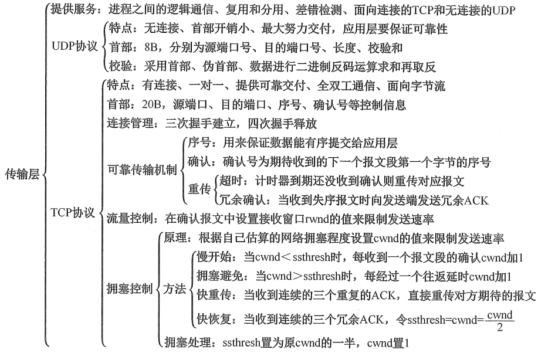
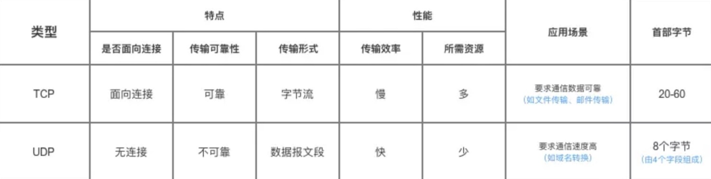
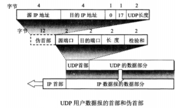
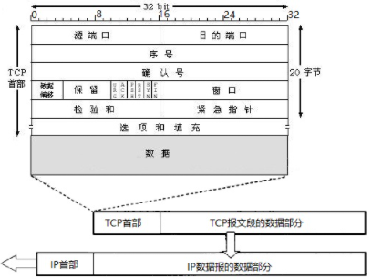
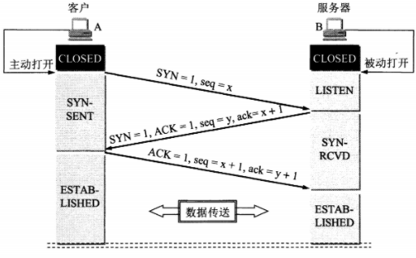
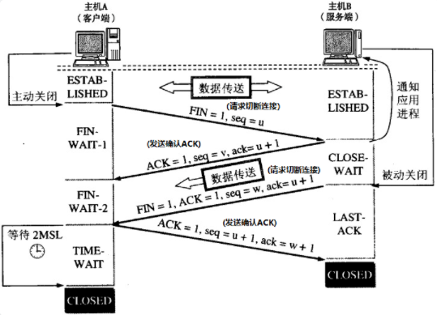

## 传输层的作用

- 提供**进程之间**的逻辑通信，即端到端，而网络层是主机之间的逻辑通信。
- **复用和分用**。复用：发送方不同应用进程可以使用同一个的传输层协议传输数据；分用：接收方在传输层将收到的报文剥离首部后正确地交付给目的进程。
- 对报文首部和数据进行差错检测。
- 提供两种不同的传输协议：面向连接的TCP和无连接的UDP。并向上屏蔽了底层网络核心的细节，如网络拓扑、路由协议等。

## 端口和套接字

端口是传输层为应用层服务的**服务访问点(SAP)**，作用类似IP地址之于网络层和MAC地址之于数据链路层。只不过端口标识的是进程，IP地址和MAC地址标识的是主机。

端口号的长度为16bit，能够表示65536个不同的端口号。一般分为：

- **服务器端口号**：又细分为**熟知端口号**(`0~1023`)和**登记端口号**(`1024~49151`)
- - 熟知端口号由IANA(互联网地址指派机构)固定分配给一些重要应用程序，如HTTP 80，FTP 21，DNS 53
  -   - 不属于熟知端口号的应用程序，需要在IANA登记，以避免重复
- **客户端端口号**：范围为49152~65535，在客户进程运行时进程动态分配，使用完成后可以分配给其他客户进程。

套接字(Socket)是IP地址和端口号的组合，用来唯一标识网络中一个主机上使用某个端口的一个应用进程，即通信端点。

## 传输层协议

- 用户数据报协议 UDP（User Datagram Protocol）：提供了传输层的最基本功能，在IP层之上只提供两个附加服务：复用分用和差错检测，无连接，尽最大努力交付，面向报文，**将对可靠性的需求和实现交由用户**。
- 传输控制协议 TCP（Transmission Control Protocol）：面向连接，提供可靠交付，有流量控制，拥塞控制，提供全双工通信，面向字节流。

TCP与UDP的区别：

- 可靠性：TCP面向连接，可靠(无差错，不丢失，不重复，按序到达)；UDP无连接，不可靠
- 传输形式：TCP**面向字节流**，UDP**面向报文**。面下字节流即将应用层的报文看成无结构的字节流，而面向报文即对应用层的报文不合并也不拆分，只是添加UDP首部；
- 性能：TCP为了可靠性需要更多额外开销(连接的创建、维护和拆除、超时重传、拥塞控制、流量控制)和系统资源，吞吐量、实时性都不如UDP
- 首部：TCP首部20~60字节，UDP则是8字节，TCP需要更多的数据开销
- 连接形式：TCP是一对一的，UDP则支持一对多，多对一和多对多的通信
- 应用场景：TCP用于需要通信数据可靠的场景：HTTP/FTP/SMTP等；UDP用于对实时性要求高，而对可靠性要求不高的场景：DNS、视频流、语音通话、竞技游戏

### UDP用户数据报

UDP数据报由首部和数据组成，首部 **8 个字节**，由4部分组成：源端口、目的端口、数据报总长、校验和。

在计算校验和时，需要在UDP数据报之前临时添加12 字节的**伪首部**，用这个临时的UDP数据报计算校验和，可以同时对UDP数据报、IP数据报的源地址和目的地址进行检验。校验和的计算方法：首部、伪首部、数据进行二进制反码运算求和再取反。

UDP数据包的校验将首部和数据都进行了检验，而IP数据报的校验只检验IP数据报的首部。

### TCP报文段

TCP报文段包括首部和数据两部分，首部有**20个字节的固定长度**，根据需要可长达60字节。

TCP报文段既可以用来运载数据，也可以用来建立连接、释放连接和应答。

下面是报文段首部各个字段的含义：

1. **源端口以及目的端口**：各占2个字节。
2. **序号**：seq，4字节。TCP是面向字节流的，即TCP连接会为传输数据流中的每一个字节编号，序号的值是**当前报文段的首字节的序号**。(如序号为301，携带数据一共100字节，则当前报文段的最后一个字节的序号为400，下一个报文段的序号值为401)。
3. **确认号**：ack，4字节。期望收到对方的下一个报文段的首字节序号。只有ACK标记位为1时，确认序号字段才有效，因此，确认序号应该是上次已经成功收到数据字节序号加1，即 `ack=seq + 1`。
4. **数据偏移**：4位，数据的起始偏移，也即TCP首部长度，单位为4字节，即当值为15时，达到TCP首部的最大长度60字节。
5. **保留字段**：6位，值全为0。
6. **标志位**：1为有效，0为无效

- - URG(紧急)：urgent，URG=1时表明紧急指针字段有效，即此报文中有紧急数据，应优先交付，配合紧急指针字段使用。
  -   - ACK(确认)：acknowledgement，ACK=1时此报文为确认报文
  -   - PSH(推送)：push，PSH=1时，接收方应**尽快向上交付**，不等到整个缓存填满
  -   - RST(复位)：reset，RST=1时表明TCP连接出现故障，必须重建连接
  -   - SYN(同步)：synchronize，SYN=1时表示连接请求报文
  -   - FIN(终止)：finish，FIN=1时为连接释放报文

1. **窗口**：2字节，接收窗口，即接收方允许接收的最大数据量，接收方通过动态调整接收窗口大小，避免缓冲区溢出。(如接收方发送给接收方的报文，确认号701，窗口值1000，则表示还能接收1000字节的数据，即701~1700)
2. **校验和**：2字节，范围包括首部和数据两部分，计算校验和时也需要加12字节的伪首部。
3. 紧急指针：2字节，表示本报文段有多少字节的紧急数据，紧急数据在报文段数据的最前面。
4. 选项：可选，默认没有，TCP最初只规定了一种选项，即最大报文段长度(Maximum Segment Size, MSS)。
5. 填充：可选，用于保证整个首部的长度为4字节的整数倍。

### TCP的连接管理

#### TCP 的三次握手

- 客户端向服务端发送不带数据的连接请求报文，其报文首部标志位SYN=1，序号为随机产生的客户端初始序号seq=x。
- 服务端收到请求后，若同意连接，则回复一个不带数据的确认报文，其首部标志位ACK=1，SYN=1，确认号为ack=x+1，表示收到了序号为x的字节，期待下一个报文段数据的起始序号为x+1，序号为随机产生的服务端初始序号seq=y。
- 客户端收到确认报文后，还需要向服务器回复确认报文，其首部标志位为ACK=1，确认号ack=y+1，序号seq=x+1。这个确认报文可以携带数据(如果不携带数据则不消耗序号，前两部不携带数据但需消耗一个序号)。
- 服务器收到客户端的确认报文后，连接建立完成。

> 早期版本，服务器在收到连接请求后便为本次TCP连接分配缓冲区等资源，客户端则是在收到服务器的确认报文后分配资源，服务器易遭受SYN洪泛攻击。后来采用了SYN cookie方式，服务器在握手完成时才分配资源。
>

**为什么不采用两次握手？**

首要目的是通信双方互相确认序号，以此才能实现可靠传输。

> TCP报文中有序号和确认号， 序号表示自己此次报文中数据部分的起始字节的序号，确认号表示期待对方发来的下一个报文的序号，也表示该序号之前的数据已经确认收到。 **三次握手的过程即是通信双方相互告知序号起始值， 并确认对方已经收到了序号起始值的必经步骤**；如果只是两次握手， 只有客户端的起始序号能被确认收到， 服务器的起始序号则得不到确认。
>

有说是防止两次握手情况下，已经失效的连接请求报文段突然又传到服务端，而浪费资源。私以为不对。

> 在老版本的TCP连接中，即使是三次握手，服务器在收到请求报文后就分配资源，在客户端无响应的一分钟后会释放资源，相比于两次握手，何来避免资源浪费的作用；新版本的TCP连接，服务器需要在建立连接后才分配资源，主要是为了防范洪泛攻击。
>

#### TCP 的四次挥手

**由于TCP连接是全双工的，因此每个方向都必须单独进行关闭**。当一方完成它的数据发送任务后就发送一个FIN来终止这个方向的连接。**TCP的一端收到一个FIN只意味着不会再收到另一端的数据，但仍能发送数据。**

1. 客户端向服务端发送一个连接释放报文段，该报文段首部的标志位FIN=1，序号字段seq=u，u为客户端已发送的最后一个字节序号加1，此时客户端不再向服务器发送消息。
2. 服务端收到连接释放报文段之后，立即回复确认报文段，首部的标志位ACK=1，确认号为ack=u+1，而其自己的序号为seq=v，即其之前发送的最后一个字节序号加1，此时，TCP连接处于半关闭状态，服务器还可以继续给客户端发送数据。
3. 服务器不再需要发送数据后，会向客户端发送FIN=1，ACK=1的连接释放报文段，序号seq=w，确认号ack=u+1。
4. 客户端收到连接释放报文后，向客户端回复确认ACK=1的报文段，确认号为ack=w+1，序号为seq=u+1。此时客户端进入TIME_WAIT状态，而服务端收到确认报文段后便进入了关闭状态，客户端需要等待2MSL(Maximum Segment Lifetime最大报文生存时间，超时的报文会被丢弃)才关闭。

**四次挥手的原因**

服务器收到了客户端的连接释放报文后，可能还需要继续向客户端发送数据，所以只能先回一个确认报文，传送完毕之后，服务器才发送连接释放报文。

**为什么客户端等待2MSL才关闭？**

- 确保服务器收到确认报文。如果 B 没收到 A 发送的确认报文，那么B就会重新发送连接释放报文，A收到后重发确认报文，然后刷新2MSL的等待时间。
- 还可以让本连接持续时间内所产生的所有报文失效，使得下一个新的连接不会出现旧的连接请求报文。

**客户端突然挂掉了怎么办？**

正常连接时，客户端突然挂掉了，如果没有措施处理这种情况，那么就会出现客户端和服务器端出现长时期的空闲。解决办法是在服务器端设置**保活计时器**，每当服务器收到客户端的消息，就将计时器复位。超时时间通常设置为2小时。若服务器超过2小时没收到客户的信息，他就发送**探测报文段**。若发送了10个探测报文段，每一个相隔75秒，客户端还没有响应，就认为客户端出了故障，因而终止该连接。

### TCP 可靠传输

可靠性一般包括无差错，不丢失，不重复，不乱序这几个语义。

1. **校验和**： 对报文的伪首部、首部和数据进行二进制反码运算求和再取反，然后与首部内的校验和比对。校验和有误的报文会被丢弃。
2. **序号和确认号**：TCP面向字节流，会为每一个字节编号，序号是当前报文的数据中首字节的序号，确认号是期待对方发来的下一个报文的首字节序号。TCP的两端都有缓冲区，会将收到的报文整理有序后发给应用层，收到重复的报文会将其丢弃，而收到乱序数据会缓存起来，并重传期待收到的序号，即冗余ACK。序列号和确认号已经实现了基本的可靠性。
3. **超时重传**：发送方为每一个发送的报文段设置一个计时器，计时器设置的重传时间到期后，未收到接收方的确认，会重传该报文段。超时重传时间略大于加权平均往返时间。
4. **快重传**：每当接收方收到比期望序号大的报文时，会将其缓存起来，并重发上次的确认报文，即**冗余ACK**；当发送方收到对同一个报文段的3个冗余ACK时，就会认为之前发送的报文已经丢失，重传丢失报文。快重传指不需要等到超时就重传，还用于拥塞控制中。
5. **流量控制**： 流量控制是**接收方主动避免缓冲区溢出**，通过**滑动窗口**机制实现。TCP 连接双方都有固定大小的缓冲区，接收方用一个可动态调整的**接收窗口**(rwnd)表示当前缓冲区能接收的最大字节数，从而限制发送方的发送速率，避免缓冲区溢出而丢失数据。窗口大小值记录在报文首部的窗口字段中。
6. **拥塞控制**： 拥塞控制是**发送方主动监测网络变化控制拥塞窗口(cwnd)大小**，避免过多数据注入网络中，造成网络拥堵。拥塞控制是一个**全局性**的过程，涉及到所有的主机、路由器等节点。TCP的拥塞控制采用了四种算法，即 **慢开始** 、 **拥塞避免** 、**快重传** 和 **快恢复**。
   1.    1. 慢开始和拥塞避免：基于超时重传时间，先使用慢开始，初始时令cwnd=1MSS(最大报文长度)，每收到一个确认报文，将cwnd翻倍，超过**慢开始阈值**(ssthresh)后，使用拥塞避免算法，每收到一个确认报文，cwnd+1MSS(线性增长)，无论是在慢开始阶段还是拥塞避免阶段，若遇到超时，令ssthresh=cwnd/2，cwnd=1MSS，再次慢开始到拥塞避免的过程。
   2.    2. **快重传与快恢复**：**基于冗余ACK机制**，当发送方连续收到三个冗余ACK，直接重传对方尚未收到的报文段，并令ssthresh=cwnd/2，cwnd=ssthresh，而非令cwnd=1MSS，因此叫快恢复。

**发送方的发送窗口为**`min(cwnd, rwnd)`。