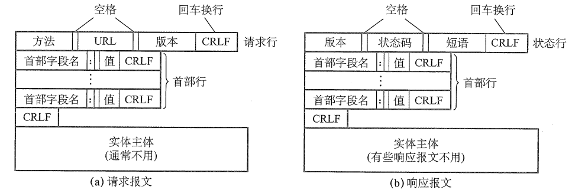
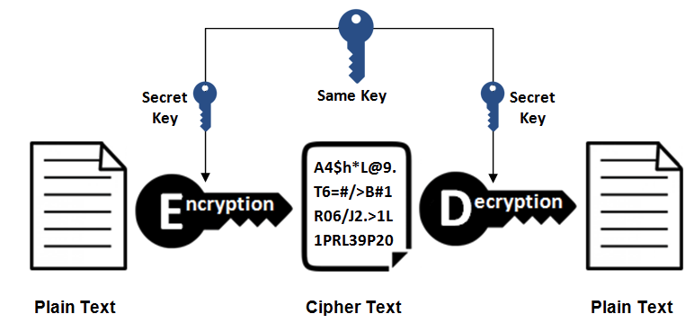
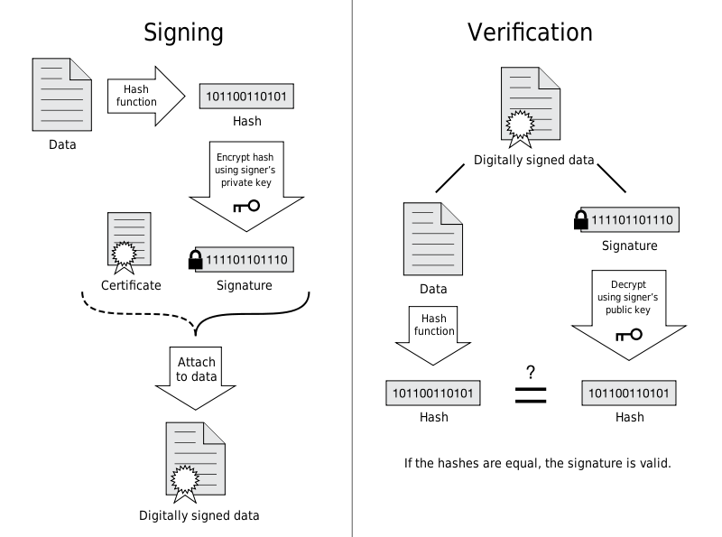
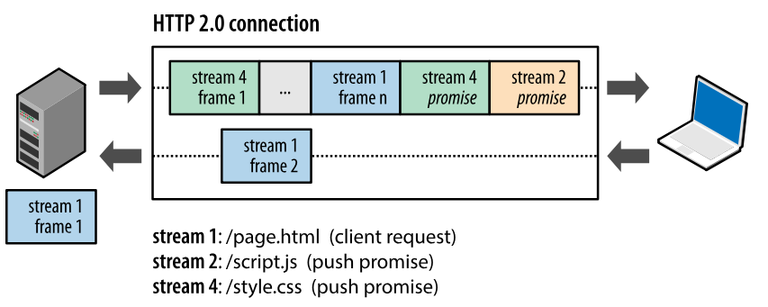

HTTP(HyperText Transfer Protocol)，超文本传输协议，规定了浏览器和服务器之间交互的规则。

HTTP采用TCP作为传输层协议，但HTTP本身是无连接的，即通信双方不需要建立所谓的HTTP连接。

## 一 、基础概念

URI：Uniform Resource Identifier，包含 URL 和 URN。

- URL：Uniform Resource Locator，格式：<协议>://<主机>:<端口>/<路径>，如http://localhost:8080/1.txt，其中端口和路径可以省略，如或http://www.baidu.com
- URN：Uniform Resource Name，如：urn:isbn:0451450523

HTML:HyperText Markup Language，超文本标记语言。用于对网页的标记，对页面上的文字、声音、图像、视频等资源进行描述。

Cookie

Socket

## 在浏览器中输入url到显示网页的过程(面试常客)

总体来说分为以下几个过程:

1. 浏览器查找域名对应的ip地址：浏览器缓存--> hosts --> 路由器缓存 --> DNS解析
2. 浏览器与服务器通过三次握手建立TCP连接，默认使用80端口
3. 浏览器发出HTTP请求：GET /index.htm
4. 服务器处理请求并返回HTTP响应报文
5. 如果不需要keep-alive维持长连接，双方通过四次挥手释放连接
6. 浏览器解析并渲染页面

期间用到的协议：DNS、HTTP、TCP、IP、OSPF(路由选择协议)、ARP(ip地址转换为MAC地址)

具体可以参考下面这篇文章：

- https://segmentfault.com/a/1190000006879700

## 二、HTTP报文结构

### 请求报文和响应报文

HTTP是面向文本的，在报文中的每个字段都是一些ASCII码串。有两类HTTP报文：

- 请求报文：由浏览器发送给服务器。
- 响应报文：由服务器发送为浏览器。



请求报文和响应报文都由三部分组成：

- **开始行**：用来区分请求报文和响应报文，在请求报文中称为**请求行**，在响应报文中称为**状态行**。
- **首部行**：用来说明浏览器、服务器或报文主体的一些信息。首部行一般由好几行，也可以没有，首部行和实体主体之间由空行隔开。
- **实体主体**：请求或响应报文的主体部分，在请求报文中一般没有，而有些响应报文中也可以没有。

具体实例：


### HTTP 方法

请求报文第一行为请求行，由**方法、URL和HTTP版本**组成，其中常见的方法如下：

| 方法     | 含义                                                                             |
| -------- | -------------------------------------------------------------------------------- |
| OPTION   | 获取URL支持的方法，返回 `Allow: GET, POST, HEAD, OPTIONS` 这样的内容             |
| **GET**  | 获取URL指定的资源                                                                |
| HEAD     | 获取URL指定资源的首部，不含主体实体，主要用于确认URL的有效性以及资源更新的时间等 |
| **POST** | 向服务器传输数据                                                                 |
| PUT      | 上传文件，自身不带验证机制，存在安全问题，一般不使用                             |
| DELETE   | 删除文件，也不带验证机制，一般不使用                                             |
| TRACE    | 返回通信的路径，易受到XST(cross site tracing)攻击，一般不使用                    |
| CONNECT  | 要求在与代理服务器通信时建立隧道，使用 SSL/TSL协议把通信内容加密后经网络隧道传输 |

### GET和POST的区别

- get从服务器获取数据，post向服务器传输数据
- get请求直接在url中可以查看到，post请求则放在请求体中，不会被url劫持，更安全
- get提交数据一般不超过1024kb，post则没有限制
- 请求缓存：post可以，get不可以，因为get是url请求，没有请求体，无法缓存
- 收藏书签：get可以，post可以，post是方法体，无法收藏

### HTTP 状态码

响应报文第一行为状态行，由**版本、状态码和解释状态码的短语**组成。状态码总共5大类，33种，如下：

| 状态码 | 含义                                    |
| ------ | --------------------------------------- |
| 1XX    | Informational通知，如请求收到或正在处理 |
| 2XX    | Success成功，如请求成功，已创建，已完成 |
| 3XX    | Redirection重定向                       |
| 4XX    | Client Error客户端错误                  |
| 5XX    | Server Error服务器错误                  |

常见状态码：

- **100 Continue**：表明到目前为止都很正常，客户端可以继续发送请求或者忽略这个响应。
- **200 OK**：请求成功
- **301 Moved Permanently**：永久性重定向，以后访问新网址
- **302 Found**：临时性重定向，以后仍需要访问旧网址
- **303 See Other**：和 302 有着相同的功能，但是 303 明确要求客户端应该采用 GET 方法获取资源
- - 注：虽然 HTTP 协议规定 301、302 状态下重定向时不允许把 POST 方法改成 GET 方法，但是大多数浏览器都会在 301/302/303 状态下的重定向把 POST 方法改成 GET 方法
- **307 Temporary Redirect**：临时重定向，与 302 的含义类似，但是 307 要求浏览器不会把重定向请求的 POST 方法改成 GET 方法
- **400 Bad Request**：请求报文中存在语法错误
- **401 Unauthorized**：未授权，需要认证。如果之前已进行过一次请求，则表示用户认证失败
- **403 Forbidden**：请求被拒绝
- **404 Not Found**：请求的资源未找到
- **500 Internal Server Error**：服务器正在执行请求时发生错误
- **503 Service Unavailable**：服务器暂时处于超负载或正在进行停机维护，现在无法处理请求

## 三、短连接与长连接


短连接：浏览器每请求网页上的一个资源就新建一个 TCP 连接，请求完成后连接断开，开销很大。

长连接：只需要建立一次 TCP 连接就能进行多次 HTTP 通信。

**HTTP协议的长连接和短连接，实质上是TCP协议的长连接和短连接。

**

**keep-alive不会永久保持连接，它有一个保持时间**，可以在不同的服务器软件（如Apache）中设定这个时间。实现长连接需要客户端和服务端都支持长连接。

从 HTTP/1.1 开始默认是长连接的，之前默认是短连接的，需要使用长连接 `Connection: Keep-Alive`。

长连接又分为**非流水线**和**流水线**，HTTP/1.1开始**默认使用流水线方式**。

非流水线：客户端在收到一个响应后才能发出下一个请求。延迟较高。

流水线：在同一条长连接上连续发出请求，而不用等待响应返回，这样可以减少延迟。

## 四、Cookie

HTTP 协议是无状态的，主要是为了让 HTTP 协议尽可能简单，使得它能够处理大量事务。HTTP/1.1 引入 Cookie 来保存状态信息。

Cookie 是服务器发送到用户浏览器并保存在本地的一小块数据，它会在浏览器之后向同一服务器再次发起请求时被携带上，用于告知服务端两个请求是否来自同一浏览器。由于之后每次请求都会需要携带 Cookie 数据，因此会带来额外的性能开销（尤其是在移动环境下）。

Cookie 曾一度用于客户端数据的存储，因为当时并没有其它合适的存储办法而作为唯一的存储手段，但现在随着现代浏览器开始支持各种各样的存储方式，Cookie 渐渐被淘汰。新的浏览器 API 已经允许开发者直接将数据存储到本地，如使用 Web storage API（本地存储和会话存储）或 IndexedDB。

### 1. 用途

- 会话状态管理（如用户登录状态、购物车、游戏分数或其它需要记录的信息）
- 个性化设置（如用户自定义设置、主题等）
- 浏览器行为跟踪（如跟踪分析用户行为等）

### 2. 创建过程

服务器发送的响应报文包含 Set-Cookie 首部字段，客户端得到响应报文后把 Cookie 内容保存到浏览器中。

```
HTTP/1.0 200 OK
Content-type: text/html
Set-Cookie: yummy_cookie=choco
Set-Cookie: tasty_cookie=strawberry

[page content]
```

客户端之后对同一个服务器发送请求时，会从浏览器中取出 Cookie 信息并通过 Cookie 请求首部字段发送给服务器。

```
GET /sample_page.html HTTP/1.1
Host: www.example.org
Cookie: yummy_cookie=choco; tasty_cookie=strawberry
```

### 3. 分类

- 会话期 Cookie：浏览器关闭之后它会被自动删除，也就是说它仅在会话期内有效。
- 持久性 Cookie：指定过期时间（Expires）或有效期（max-age）之后就成为了持久性的 Cookie。

```
Set-Cookie: id=a3fWa; Expires=Wed, 21 Oct 2015 07:28:00 GMT;
```

### 4. 作用域

Domain 标识指定了哪些主机可以接受 Cookie。如果不指定，默认为当前文档的主机（不包含子域名）。如果指定了 Domain，则一般包含子域名。例如，如果设置 Domain=mozilla.org，则 Cookie 也包含在子域名中（如 developer.mozilla.org）。

Path 标识指定了主机下的哪些路径可以接受 Cookie（该 URL 路径必须存在于请求 URL 中）。以字符 %x2F ("/") 作为路径分隔符，子路径也会被匹配。例如，设置 Path=/docs，则以下地址都会匹配：

- /docs
- /docs/Web/
- /docs/Web/HTTP

### 5. JavaScript

浏览器通过 `document.cookie` 属性可创建新的 Cookie，也可通过该属性访问非 HttpOnly 标记的 Cookie。

```
document.cookie = "yummy_cookie=choco";
document.cookie = "tasty_cookie=strawberry";
console.log(document.cookie);
```

### 6. HttpOnly

标记为 HttpOnly 的 Cookie 不能被 JavaScript 脚本调用。跨站脚本攻击 (XSS) 常常使用 JavaScript 的 `document.cookie` API 窃取用户的 Cookie 信息，因此使用 HttpOnly 标记可以在一定程度上避免 XSS 攻击。

```
Set-Cookie: id=a3fWa; Expires=Wed, 21 Oct 2015 07:28:00 GMT; Secure; HttpOnly
```

### 7. Secure

标记为 Secure 的 Cookie 只能通过被 HTTPS 协议加密过的请求发送给服务端。但即便设置了 Secure 标记，敏感信息也不应该通过 Cookie 传输，因为 Cookie 有其固有的不安全性，Secure 标记也无法提供确实的安全保障。

### 8. Session

除了可以将用户信息通过 Cookie 存储在用户浏览器中，也可以利用 Session 存储在服务器端，存储在服务器端的信息更加安全。

Session 可以存储在服务器上的文件、数据库或者内存中。也可以将 Session 存储在 Redis 这种内存型数据库中，效率会更高。

使用 Session 维护用户登录状态的过程如下：

- 用户进行登录时，用户提交包含用户名和密码的表单，放入 HTTP 请求报文中；
- 服务器验证该用户名和密码，如果正确则把用户信息存储到 Redis 中，它在 Redis 中的 Key 称为 Session ID；
- 服务器返回的响应报文的 Set-Cookie 首部字段包含了这个 Session ID，客户端收到响应报文之后将该 Cookie 值存入浏览器中；
- 客户端之后对同一个服务器进行请求时会包含该 Cookie 值，服务器收到之后提取出 Session ID，从 Redis 中取出用户信息，继续之前的业务操作。

应该注意 Session ID 的安全性问题，不能让它被恶意攻击者轻易获取，那么就不能产生一个容易被猜到的 Session ID 值。此外，还需要经常重新生成 Session ID。在对安全性要求极高的场景下，例如转账等操作，除了使用 Session 管理用户状态之外，还需要对用户进行重新验证，比如重新输入密码，或者使用短信验证码等方式。

### 9. 浏览器禁用 Cookie

此时无法使用 Cookie 来保存用户信息，只能使用 Session。除此之外，不能再将 Session ID 存放到 Cookie 中，而是使用 URL 重写技术，将 Session ID 作为 URL 的参数进行传递。

### 10. Cookie 与 Session 选择

- Cookie 只能存储 ASCII 码字符串，而 Session 则可以存储任何类型的数据，因此在考虑数据复杂性时首选 Session；
- Cookie 存储在浏览器中，容易被恶意查看。如果非要将一些隐私数据存在 Cookie 中，可以将 Cookie 值进行加密，然后在服务器进行解密；
- 对于大型网站，如果用户所有的信息都存储在 Session 中，那么开销是非常大的，因此不建议将所有的用户信息都存储到 Session 中。

## 缓存

### 1. 优点

- 缓解服务器压力；
- 降低客户端获取资源的延迟：缓存通常位于内存中，读取缓存的速度更快。并且缓存服务器在地理位置上也有可能比源服务器来得近，例如浏览器缓存。

### 2. 实现方法

- 让代理服务器进行缓存；
- 让客户端浏览器进行缓存。

### 3. Cache-Control

HTTP/1.1 通过 Cache-Control 首部字段来控制缓存。

**3.1 禁止进行缓存**

no-store 指令规定不能对请求或响应的任何一部分进行缓存。

```
Cache-Control: no-store
```

**3.2 强制确认缓存**

no-cache 指令规定缓存服务器需要先向源服务器验证缓存资源的有效性，只有当缓存资源有效时才能使用该缓存对客户端的请求进行响应。

```
Cache-Control: no-cache
```

**3.3 私有缓存和公共缓存**

private 指令规定了将资源作为私有缓存，只能被单独用户使用，一般存储在用户浏览器中。

```
Cache-Control: private
```

public 指令规定了将资源作为公共缓存，可以被多个用户使用，一般存储在代理服务器中。

```
Cache-Control: public
```

**3.4 缓存过期机制**

max-age 指令出现在请求报文，并且缓存资源的缓存时间小于该指令指定的时间，那么就能接受该缓存。

max-age 指令出现在响应报文，表示缓存资源在缓存服务器中保存的时间。

```
Cache-Control: max-age=31536000
```

Expires 首部字段也可以用于告知缓存服务器该资源什么时候会过期。

```
Expires: Wed, 04 Jul 2012 08:26:05 GMT
```

- 在 HTTP/1.1 中，会优先处理 max-age 指令；
- 在 HTTP/1.0 中，max-age 指令会被忽略掉。

### 4. 缓存验证

需要先了解 ETag 首部字段的含义，它是资源的唯一标识。URL 不能唯一表示资源，例如 `http://www.google.com/` 有中文和英文两个资源，只有 ETag 才能对这两个资源进行唯一标识。

```
ETag: "82e22293907ce725faf67773957acd12"
```

可以将缓存资源的 ETag 值放入 If-None-Match 首部，服务器收到该请求后，判断缓存资源的 ETag 值和资源的最新 ETag 值是否一致，如果一致则表示缓存资源有效，返回 304 Not Modified。

```
If-None-Match: "82e22293907ce725faf67773957acd12"
```

Last-Modified 首部字段也可以用于缓存验证，它包含在源服务器发送的响应报文中，指示源服务器对资源的最后修改时间。但是它是一种弱校验器，因为只能精确到一秒，所以它通常作为 ETag 的备用方案。如果响应首部字段里含有这个信息，客户端可以在后续的请求中带上 If-Modified-Since 来验证缓存。服务器只在所请求的资源在给定的日期时间之后对内容进行过修改的情况下才会将资源返回，状态码为 200 OK。如果请求的资源从那时起未经修改，那么返回一个不带有实体主体的 304 Not Modified 响应报文。

```
Last-Modified: Wed, 21 Oct 2015 07:28:00 GMT
```

```
If-Modified-Since: Wed, 21 Oct 2015 07:28:00 GMT
```

## 通信数据转发

### 1. 代理

代理服务器接受客户端的请求，并且转发给其它服务器。

使用代理的主要目的是：

- 缓存
- 负载均衡
- 网络访问控制
- 访问日志记录

代理服务器分为正向代理和反向代理两种：

- 用户察觉得到正向代理的存在。


- 而反向代理一般位于内部网络中，用户察觉不到。


### 2. 网关

与代理服务器不同的是，网关服务器会将 HTTP 转化为其它协议进行通信，从而请求其它非 HTTP 服务器的服务。

### 3. 隧道

使用 SSL 等加密手段，在客户端和服务器之间建立一条安全的通信线路。

## 六、HTTPS

HTTP 有以下安全性问题：

- 使用明文进行通信，内容可能会被窃听；
- 不验证通信方的身份，通信方的身份有可能遭遇伪装；
- 无法证明报文的完整性，报文有可能遭篡改。

HTTPS 并不是新协议，而是让 HTTP 先和 SSL（Secure Sockets Layer）通信，再由 SSL 和 TCP 通信，也就是说 HTTPS 使用了隧道进行通信。

通过使用 SSL，HTTPS 具有了加密（防窃听）、认证（防伪装）和完整性保护（防篡改）。


## 加密

### 1. 对称密钥加密

对称密钥加密（Symmetric-Key Encryption），加密和解密使用同一密钥。

- 优点：运算速度快；
- 缺点：无法安全地将密钥传输给通信方。



### 2.非对称密钥加密

非对称密钥加密，又称公开密钥加密（Public-Key Encryption），加密和解密使用不同的密钥。

公开密钥所有人都可以获得，通信发送方获得接收方的公开密钥之后，就可以使用公开密钥进行加密，接收方收到通信内容后使用私有密钥解密。

非对称密钥除了用来加密，还可以用来进行签名。因为私有密钥无法被其他人获取，因此通信发送方使用其私有密钥进行签名，通信接收方使用发送方的公开密钥对签名进行解密，就能判断这个签名是否正确。

- 优点：可以更安全地将公开密钥传输给通信发送方；
- 缺点：运算速度慢。


### 3. HTTPS 采用的加密方式

上面提到对称密钥加密方式的传输效率更高，但是无法安全地将密钥 Secret Key 传输给通信方。而非对称密钥加密方式可以保证传输的安全性，因此我们可以利用非对称密钥加密方式将 Secret Key  传输给通信方。HTTPS 采用混合的加密机制，正是利用了上面提到的方案：

- 使用非对称密钥加密方式，传输对称密钥加密方式所需要的 Secret Key，从而保证安全性;
- 获取到 Secret Key 后，再使用对称密钥加密方式进行通信，从而保证效率。（下图中的 Session Key 就是 Secret Key）


## 认证

通常使用**证书**来对通信方进行认证。

数字证书认证机构（CA，Certificate Authority）是客户端与服务器双方都可信赖的第三方机构。

服务器的运营人员向 CA 提出公开密钥的申请，CA 在判明提出申请者的身份之后，会对已申请的公开密钥做数字签名，然后分配这个已签名的公开密钥，并将该公开密钥放入公开密钥证书后绑定在一起。

进行 HTTPS 通信时，服务器会把证书发送给客户端。客户端取得其中的公开密钥之后，先使用数字签名进行验证，如果验证通过，就可以开始通信了。



## 完整性保护

SSL 提供报文摘要功能来进行完整性保护。

HTTP 也提供了 MD5 报文摘要功能，但不是安全的。例如报文内容被篡改之后，同时重新计算 MD5 的值，通信接收方是无法意识到发生了篡改。

HTTPS 的报文摘要功能之所以安全，是因为它结合了加密和认证这两个操作。试想一下，加密之后的报文，遭到篡改之后，也很难重新计算报文摘要，因为无法轻易获取明文。

## HTTPS 的缺点

- 因为需要进行加密解密等过程，因此速度会更慢；
- 需要支付证书授权的高额费用。

## 七、HTTP版本

## HTTP/1.1 新特性

详细内容请见上文

- 默认是长连接
- 支持流水线
- 支持同时打开多个 TCP 连接
- 支持虚拟主机
- 新增状态码 100
- 支持分块传输编码
- 新增缓存处理指令 max-age

## HTTP/2.0

## HTTP/1.x 缺陷

HTTP/1.x 实现简单是以牺牲性能为代价的：

- 客户端需要使用多个连接才能实现并发和缩短延迟；
- 不会压缩请求和响应首部，从而导致不必要的网络流量；
- 不支持有效的资源优先级，致使底层 TCP 连接的利用率低下。

## 二进制分帧层

HTTP/2.0 将报文分成 HEADERS 帧和 DATA 帧，它们都是二进制格式的。


在通信过程中，只会有一个 TCP 连接存在，它承载了任意数量的双向数据流（Stream）。

- 一个数据流（Stream）都有一个唯一标识符和可选的优先级信息，用于承载双向信息。
- 消息（Message）是与逻辑请求或响应对应的完整的一系列帧。
- 帧（Frame）是最小的通信单位，来自不同数据流的帧可以交错发送，然后再根据每个帧头的数据流标识符重新组装。


## 服务端推送

HTTP/2.0 在客户端请求一个资源时，会把相关的资源一起发送给客户端，客户端就不需要再次发起请求了。例如客户端请求 page.html 页面，服务端就把 script.js 和 style.css 等与之相关的资源一起发给客户端。



## 首部压缩

HTTP/1.1 的首部带有大量信息，而且每次都要重复发送。

HTTP/2.0 要求客户端和服务器同时维护和更新一个包含之前见过的首部字段表，从而避免了重复传输。

不仅如此，HTTP/2.0 也使用 Huffman 编码对首部字段进行压缩。

