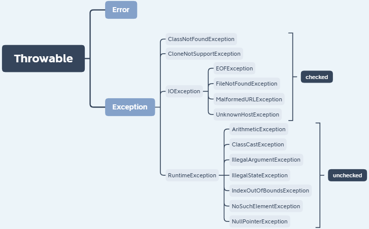

## JVM/JRE/JDK的比较

**JDK:** Java Development Kit

**JRE:** Java Runtime Environment

**JVM:** Java Virtual Machine

JVM+Java核心类库(IO, lang, util, Math等)=JRE

JRE+Java开发工具(javac.exe, java.exe, javadoc.exe等)=JDK

## Java字节码的好处

Java字节码即JVM 可以理解的代码 `.class` 的⽂件。字节码可跨平台，使得Java 程序⽆须重新编译便可在不同操作系统上运⾏。Java 语⾔通过字节码的⽅式，在⼀定程度上解决了传统解释型语⾔执⾏效率低的问题，同时又保留了解释型语⾔可移植的特点。

## 面向对象和面向过程的区别

- **面向过程** ：**面向过程性能比面向对象高。** 因为类调用时需要实例化，开销比较大，比较消耗资源，所以当性能是最重要的考量因素的时候，比如单片机、嵌入式开发、Linux/Unix等一般采用面向过程开发。但是，**面向过程没有面向对象易维护、易复用、易扩展。**
- **面向对象** ：**面向对象易维护、易复用、易扩展。** 因为面向对象有封装、继承、多态性的特性，所以可以设计出低耦合的系统，使系统更加灵活、更加易于维护。但是，**面向对象性能比面向过程低**。

## Java有几种基本数据类型

八种


## 基本类型和引用类型的区别

除了8中基本数据类型都是引用类型， 为了面向对象操作的一致性，每种数据类型都有对应的包装类。

**不同点**：

* 赋值方法不同，基本类型直接赋值，引用类型通过 new 创建对象，然后再把对象赋予相应的变量。
* 比较方面的不同，== 号的比较：引用类型比较的是引用地址，基本类型比较的是值
* 在数据做为参数传递的时候，基本数据类型是值传递，而引用数据类型是引用传递（地址传递）。
* **分别放在 JVM 的哪里？**

基本数据类型在被创建时，在栈上给其划分一块内存，将数值直接存储在栈上（也不完全一定）。

而引用数据类型在被创建时，首先要在栈上给其引用（句柄）分配一块内存，而对象的具体信息都存储在堆内存上，然后由栈上面的引用指向堆中对象的地址。

**引用类型的创建过程：**

现在为其创建一个对象MyDate d1 = new MyDate(8,8,2008);

在内存中的具体创建过程是：

1）首先在栈内存中位其d1分配一块空间；

2）然后在堆内存中为MyDate对象分配一块空间，并为其三个属性设初值0，0，0；

3）根据类MyDate中对属性的定义，为该对象的三个属性进行赋值操作；

4）调用构造方法，为三个属性赋值为8，8，2008；（注意这个时候d1与MyDate对象之间还没有建立联系）

5）将MyDate对象在堆内存中的地址，赋值给栈中的d1;通过句柄d1可以找到堆中对象的具体信息。

## 重载和重写的区别

#### 重载

发生在同一个类中，重载方法之间方法名必须相同，参数类型不同、个数不同、顺序不同，方法返回值和访问修饰符可以不同。调用该方法时，根据传入的参数选用不同的重载方法。

#### 重写

重写是子类对父类的允许访问的方法的实现过程进行重新编写。

重写的原则：

- 方法名、参数列表必须相同
- 返回值范围小于等于父类，抛出的异常范围小于等于父类
- 访问修饰符范围大于等于父类。

另外，子类不能重写父类的private/final/static方法。

## 面向对象三大特性: 封装 继承 多态

封装：把描述一个对象的属性私有化，对外只提供一些需要暴露的接口。

继承：子类继承父类的特征和行为。子类可以访问父类非私有的方法，属性。子类也可以对父类进行扩展，也可以重写父类的方法。缺点是代码之间的耦合性较高。

多态：程序中定义的引用变量所指向的具体类型和通过该引用变量发出的方法调用**在编译期并不确定**，而是在程序运行期间才确定(比如：向上转型，只有运行才能确定其对象属性)。Java中可以通过继承父类或实现接口来实现多态。

## final 在 java 中有什么作用？

- final 修饰的类叫最终类，该类不能被继承。
- final 修饰的方法不能被重写。
- final 修饰的变量不可更改，**其不可更改指的是其引用不可修改，对于引用类型值还是可能改变的，举个列子：String 内部对于 value 的定义；而对于基本类型来说就叫做常量了。**

**final、finally、finalize 有什么区别？**

- final可以修饰类、变量、方法，修饰类表示该类不能被继承、修饰方法表示该方法不能被重写、修饰变量表示该变量是一个常量不能被重新赋值。
- finally一般作用在try-catch代码块中，在处理异常的时候，通常我们将一定要执行的代码方法finally代码块中，表示不管是否出现异常，该代码块都会执行，一般用来存放一些关闭资源的代码。
- finalize是一个方法，属于Object类的一个方法，而Object类是所有类的父类，该方法一般由垃圾回收器来调用，当我们调用System的gc()方法的时候，由垃圾回收器调用finalize(),回收垃圾。

## String StringBuffer 和 StringBuilder 的区别是什么?

StringBuffer和StringBuilder继承自AbstractStringBuilder，StringBuffer和StringBuiler的方法基本相同，但是StringBuffer在一些方法前加了synchronized修饰，实现线程安全。但也牺牲了一些执行的效率。

三者底层都有一个字符数组，但是String多了一个final修饰，表示数组不可变。对String对象的修改会生成一个新的对象，而对StringBuffer和StringBuilder的修改作用到其自身。

总的来说，StringBuffer和StringBuilder为可变字符串，StringBuffer线程安全，StringBuiler线程不安全，StringBuffer效率不如StringBuilder。而String由于不可变，天生线程安全，当然由于每次都生成一个新对象，效率不如可变字符串高。

## String 为什么设置为不可变？

* 为了实现字符串常量池(只有当字符是不可变的，字符串常量池才有可能实现)
* 为了线程安全(字符串自己便是线程安全的)
* 为了保证同一个对象调用 hashCode() 都产生相同的值，String 设置为不可变可以对这个条件有很好的支持，这也是 Map 类的 key 使用 String 的原因。

## 自动装箱和拆箱

- 装箱：将基本数据类型转化为对应的包装类
- 拆箱：将包装类转换为对应的基本数据类型

```java
Integer x = 2;     // 装箱 底层Integer x = Integer.valueOf(2)
int y = x;         // 拆箱 底层int y = x.intValue()
```

### 在Java中定义一个不做事的空参构造函数的作用

Java程序在执行子类的构造方法之前，需要先调用父类的构造方法，如果没有显式调用父类的有参构造方法，会默认调用父类的无参构造方法，此时若父类没有定义无参构造方法，会报错。

### Exception、Error、运行时异常与一般异常有何异同

**所有的异常都是从Throwable继承而来的**

**Error**：程序本身无法解决的严重问题

**Exception**：程序自身可以解决的问题，分为编译时异常和运行时异常



## 接口和抽象类的区别

1. 接口的方法默认是 public，所有方法在接口中不能有实现(Java 8 开始接口方法可以有默认实现），而抽象类可以有非抽象的方法。
2. 接口中除了static、final变量，不能有其他变量，而抽象类中则不一定。
3. 一个类可以实现多个接口，但只能实现一个抽象类。接口自己本身可以通过extends关键字扩展多个接口。
4. 接口方法默认修饰符是public，抽象方法可以有public、protected和default这些修饰符
5. 从设计层面来说，抽象是对类的抽象，是一种模板设计，而接口是对行为的抽象，是一种行为的规范。

## Object类有哪些常用的方法？

equals 方法，hashCode 方法，toString 方法，wait 和 notify 系列的几个， getclass

### == 和 equals 的区别

`==` 用于比较两个变量是否完全相同，对于基本类型来说是变量值，对于引用类型来说是引用地址；equals()是Object类的一个方法，默认作用同 `==`，一般会根据需要将`equals()`重写，用来比较两个变量的值是否相等。如String、Integer。

## hashCode 与 equals (重要)

### hashCode()介绍

hashCode() 是一个native方法，定义在Object类中，作用是获取对象的哈希码，哈希码是一个 int 整数。这个哈希码的作用是确定该对象在哈希表中的索引位置。

### 为什么要有 hashCode

hashCode()通过散列码快速确定元素在哈希表中的位置，需要判断两个元素是否相等时，可以先用hashCode()判断，无法判断时再调用equals方法，这样我们就大大减少了 equals 的次数，相应就大大提高了执行速度。

### hashCode()与equals()的相关规定

1. 如果两个对象相等，则hashcode一定也是相同的，反之不成立。
2. 两个对象相等，对两个对象分别调用equals方法都返回true
3. **因此，重写equals()必须同时重写hashCode()**

重写hashCode()方法的原则：

- 对同一元素多次调用hashCode()方法，结果应相同。
- 若两个元素通过equals()方法返回true，两者的hashCode()值首先应相同。
- 对象中用作equals()方法比较的Field，都应用来计算hashCode值。

问题：Eclipse/IDEA中，重写hashCode()，都有31这个数字，为什么？

- 选择系数的时候要选择尽量大的系数。因为如果计算出来的hash地址范围越大，所谓的 “冲突”就越少，查找起来效率也会提高。（减少冲突）
- 31只占用5bits,相乘造成数据溢出的概率较小。
- i*31可以由 (i<<5)-i来表示,现在很多虚拟机里面都有做相关优化。（提高扩容效率）
- 31是一个素数，计算结果只能被素数本身和被乘数还有1来整除！(减少冲突)

## Java序列化中如果有些字段不想进行序列化，怎么办？

被transient修饰的属性，不会被序列化。当对象被反序列化时，该属性不会被恢复。transient只能修饰变量，不能修饰类和方法。

ArrayList 中存储数据的数组 elementData 是用 transient 修饰的，因为这个数组是动态扩展的，并不是所有的空间都被使用，因此就不需要所有的内容都被序列化。通过重写序列化和反序列化方法，使得可以只序列化数组中有内容的那部分数据。

## 缓存池和字符串常量池

### 缓存池

基本类型的valueOf() 方法会调用缓存池比较值的大小：

```java
public static Integer valueOf(int i) {
    if (i >= IntegerCache.low && i <= IntegerCache.high)
        return IntegerCache.cache[i + (-IntegerCache.low)];
    return new Integer(i);
}
```

判断值是否在缓存池中，如果在的话就直接返回缓存池的内容，不在就新建一个。
Integer 缓存池的大小默认为 -128~127。
编译器会在自动装箱过程调用 valueOf() 方法，因此多个值相同且值在缓存池范围内的 Integer 实例使用自动装箱来创建，那么就会引用相同的对象。

```java
Integer m = 123;
Integer n = 123;
System.out.println(m == n); // true
```

基本类型对应的缓冲池如下：
boolean values true and false
all byte values
short values between -128 and 127
int values between -128 and 127
char in the range \u0000 to \u007F
在 jdk 1.8 所有的数值类缓冲池中，Integer 的缓冲池 IntegerCache 很特殊，这个缓冲池的下界是 - 128，上界默认是 127，但是这个上界是可调的，在启动 jvm 的时候，通过 -XX:AutoBoxCacheMax=<size> 来指定这个缓冲池的大小，该选项在 JVM 初始化的时候会设定一个名为 java.lang.IntegerCache.high 系统属性，然后 IntegerCache 初始化的时候就会读取该系统属性来决定上界。

### 字符串常量池

**字符串常量池 String Pool**
保存着所有字符串字面量（literal strings），这些字面量在编译时期就确定。不仅如此，还可以使用 String 的 intern() 方法在运行过程将字符串添加到 String Pool 中。
当一个字符串调用 intern() 方法时，如果 String Pool 中已经存在一个字符串和该字符串值相等（使用 equals() 方法进行确定），那么就会返回 String Pool 中字符串的引用；否则，就会在 String Pool 中添加一个新的字符串，并返回这个新字符串的引用。
如果是采用 "bbb" 这种字面量的形式创建字符串，会自动地将字符串放入 String Pool 中。

String s1 = new String("abc");方式创建对象，在内存中创建了几个对象？

将创建 1 或 2 个字符串。如果池中已存在字符串常量“abc”，则只会在堆空间创建一个字符串常量“abc”。如果池中没有字符串常量“abc”，那么它将首先在池中创建，然后在堆空间中创建，因此将创建总共 2 个字符串对象。

## **BIO,NIO,AIO 有什么区别?**

- **BIO (Blocking I/O):** 同步阻塞 I/O 模式，数据的读取写入必须阻塞在一个线程内等待其完成。在活动连接数不是特别高（小于单机 1000）的情况下，这种模型是比较不错的，可以让每一个连接专注于自己的 I/O 并且编程模型简单，也不用过多考虑系统的过载、限流等问题。线程池本身就是一个天然的漏斗，可以缓冲一些系统处理不了的连接或请求。但是，当面对十万甚至百万级连接的时候，传统的 BIO 模型是无能为力的。因此，我们需要一种更高效的 I/O 处理模型来应对更高的并发量。
- **NIO (Non-blocking/New I/O):** NIO 是一种同步非阻塞的 I/O 模型，在 Java 1.4 中引入了 NIO 框架，对应 java.nio 包，提供了 Channel , Selector，Buffer 等抽象。NIO 中的 N 可以理解为 Non-blocking，不单纯是 New。它支持面向缓冲的，基于通道的 I/O 操作方法。 NIO 提供了与传统 BIO 模型中的 `Socket` 和 `ServerSocket` 相对应的 `SocketChannel` 和 `ServerSocketChannel` 两种不同的套接字通道实现,两种通道都支持阻塞和非阻塞两种模式。阻塞模式使用就像传统中的支持一样，比较简单，但是性能和可靠性都不好；非阻塞模式正好与之相反。对于低负载、低并发的应用程序，可以使用同步阻塞 I/O 来提升开发速率和更好的维护性；对于高负载、高并发的（网络）应用，应使用 NIO 的非阻塞模式来开发
- **AIO (Asynchronous I/O):** AIO 也就是 NIO 2。在 Java 7 中引入了 NIO 的改进版 NIO 2,它是异步非阻塞的 IO 模型。异步 IO 是基于事件和回调机制实现的，也就是应用操作之后会直接返回，不会堵塞在那里，当后台处理完成，操作系统会通知相应的线程进行后续的操作。AIO 是异步 IO 的缩写，虽然 NIO 在网络操作中，提供了非阻塞的方法，但是 NIO 的 IO 行为还是同步的。对于 NIO 来说，我们的业务线程是在 IO 操作准备好时，得到通知，接着就由这个线程自行进行 IO 操作，IO 操作本身是同步的。查阅网上相关资料，我发现就目前来说 AIO 的应用还不是很广泛，Netty 之前也尝试使用过 AIO，不过又放弃了。