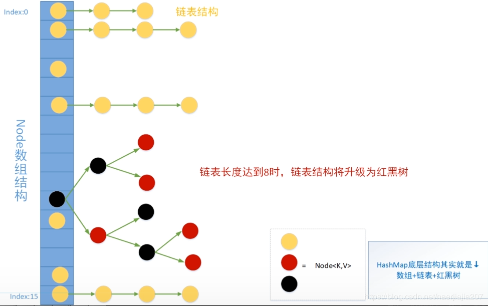
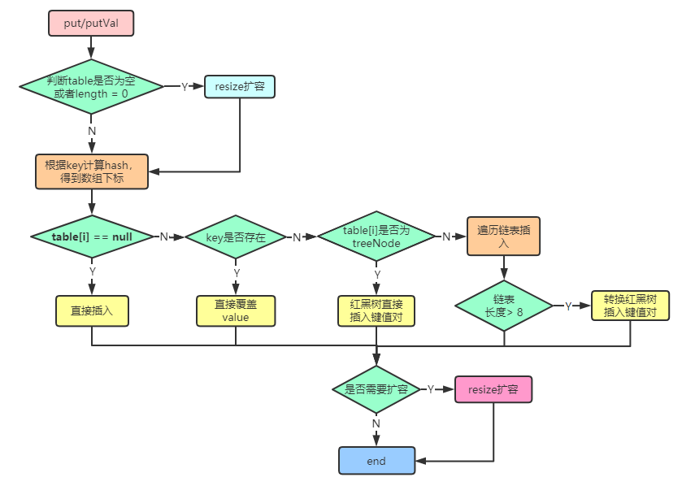
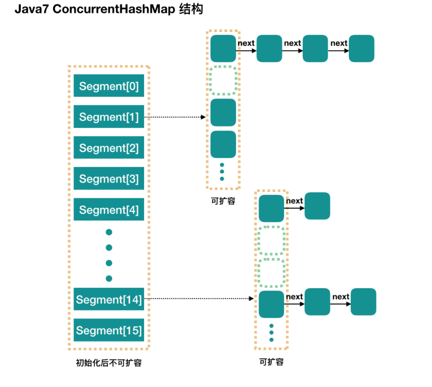

## ArrayList

### 1.定义

```java
public class ArrayList<E> extends AbstractList<E>
        implements List<E>, RandomAccess, Cloneable, java.io.Serializable
```

ArrayList 是基于数组实现的，所以支持快速随机访问。 继承了AbstractList，实现了List。它是一个数组队列，提供了相关的添加、删除、修改、遍历等功能。

**RandomAccess** 接口标识着该类支持快速随机访问（只是一个定义了类型的接口，无作用）。  **Cloneable 接口**，即覆盖了函数 clone()，**能被克隆**。  **java.io.Serializable 接口**，这意味着ArrayList**支持序列化**，**能通过序列化去传输**。

数组的默认大小为 10。

### 2.扩容机制

**核心方法：**

```java
private void grow(int minCapacity) {
    // overflow-conscious code
    int oldCapacity = elementData.length;
    int newCapacity = oldCapacity + (oldCapacity >> 1);
    if (newCapacity - minCapacity < 0)
        newCapacity = minCapacity;
    if (newCapacity - MAX_ARRAY_SIZE > 0)
        newCapacity = hugeCapacity(minCapacity);
    // minCapacity is usually close to size, so this is a win:
    elementData = Arrays.copyOf(elementData, newCapacity);
}
```

整个流程就是对旧数组位移运算得到新数组，然后把旧数组整个复制到新数组上，操作代价很高，新容量的大小为 `oldCapacity + (oldCapacity >> 1)`，也就是旧容量的 1.5 倍。

补充：

**移位运算符简介**：移位运算符就是在二进制的基础上对数字进行平移。按照平移的方向和填充数字的规则分为三种:<<(左移)、>>(带符号右移)和>>>(无符号右移)。**作用**：**对于大数据的2进制运算,位移运算符比那些普通运算符的运算要快很多,因为程序仅仅移动一下而已,不去计算,这样提高了效率,节省了资源**  。

### 3.添加和删除

**在末尾添加元素：**

```java
public boolean add(E e) {
        ensureCapacityInternal(size + 1);  // Increments modCount!!
        elementData[size++] = e;
        return true;
    }
```

这里看到ArrayList在末尾添加元素的实质就相当于为数组赋值。

**在指定位置添加元素：**

```java
public void add(int index, E element) {  
    rangeCheckForAdd(index);   
    ensureCapacityInternal(size + 1);  // Increments modCount!! 
    System.arraycopy(elementData, index, elementData, index + 1,
                     size - index);  
    elementData[index] = element;    size++;}
```

让数组自己复制自己实现让index开始之后的所有成员后移一个位置。

**删除指定元素：**

```java
public E remove(int index) {
    rangeCheck(index);
    modCount++;
    E oldValue = elementData(index);
    int numMoved = size - index - 1;
    if (numMoved > 0)
        System.arraycopy(elementData, index+1, elementData, index, numMoved);
    elementData[--size] = null; // clear to let GC do its work
    return oldValue;
}
```

流程是把需要删除的元素右边的元素向左移动一位，覆盖了需要删除的元素。调用了arraycopy，所以操作代价也很高。

## CopyOnWriteArrayList

concurrent 并发包下的类，是ArrayList的线程安全解决方案， 通过ReentrantLock获取对象锁的方式来实现线程安全。

**读写分离的特点**

读：

```java
@SuppressWarnings("unchecked")
private E get(Object[] a, int index) {
    return (E) a[index];
}
```

写：

```java
public boolean add(E e) {
    final ReentrantLock lock = this.lock;
    lock.lock();
    try {
        Object[] elements = getArray();
        int len = elements.length;
        Object[] newElements = Arrays.copyOf(elements, len + 1);
        newElements[len] = e;
        setArray(newElements);
        return true;
    } finally {
        lock.unlock();
    }
}

final void setArray(Object[] a) {
    array = a;
}
```

写的操作需要加锁，防止并发写入导致数据丢失，不直接操作原数组，先copy一个数组进行操作，写完后把数组引用指向新数组。

CopyOnWriteArrayList 允许并发读写，大大提高了读操作的性能，因此很适合读多写少的应用场景。

缺点：

* 内存占用：在写操作时需要复制一个新的数组，使得内存占用为原来的两倍左右；
* 数据不一致：读操作不能读取实时性的数据，因为部分写操作的数据还未同步到读数组中。

所以 CopyOnWriteArrayList 不适合内存敏感以及对实时性要求很高的场景。

## HashMap

### 1.整体原理分析

内部的Node类：实现了Map.Entry接口，本质是就是一个键值对。

```java
static class Node<K,V> implements Map.Entry<K,V> {
        final int hash;
        final K key;
        V value;
        Node<K,V> next; 

        Node(int hash, K key, V value, Node<K,V> next) {
            this.hash = hash;
            this.key = key;
            this.value = value;
            this.next = next;
        }
```

hash:hashcode经过**扰动函数**得到的值， 然后通过 `(n - 1) & hash` 判断当前元素存放的位置，如果当前

位置存在hash和key值不相同的元素就使用拉链法解决冲突。

**拉链法**：将链表和数组相结合。也就是说创建一个链表数组，数组中每一格就是一个链表。若遇到哈希冲突，则将冲突的值加到链表中即可。

底层存储结构：



### 2.put方法分析

简述：通过hash函数获得key的hash值，通过(n-1)&hash找到当前元素的存放位置，如果该位置上已存在元素，通过拉链法解决冲突，过长的链会转化为红黑树。

详细过程：

```plaintext
1. 首先计算key的hash值，然后调用putVal方法
2. 是否首次添加元素，首次则创建一个长度为16的Node数组。
3. 不是首次，则根据hash值和数组长度找到得到应该插入的位置：(n-1)&hash
    若该位置上为空，则直接插入；
    若不为空，先判断头结点的key与插入key相同，是则直接覆盖，否则判断节点类型是链表还是红黑树：
	若为红黑树则将新节点放入树中；
	若为链表，则与链表上的每个结点依次比较，先比较hash值，hash值相同再调用equals方法，若为true，说明key相等，则用新value替换旧value，比较到链尾也没有发现重复key，则在链表尾部添加该键值对。添加完成还需要判断是否需要树化。
4. 添加完成后判断是否需要扩容。
```

下面上源码：

```java
public V put(K key, V value) {
    return putVal(hash(key), key, value, false, true);
}

final V putVal(int hash, K key, V value, boolean onlyIfAbsent,
                   boolean evict) {
    //tab: 引用当前hashMap的散列表
	//p: 表示当前散列表的元素
	//n: 表示散列表数组的长度
	//i: 表示路由寻址结果
    Node<K,V>[] tab; Node<K,V> p; int n, i;
    // table未初始化或者长度为0，进行扩容（采用了延时初始化，第一次put才会初始化散列表。）
    if ((tab = table) == null || (n = tab.length) == 0)
        n = (tab = resize()).length;
    // 寻址找到的桶位为null
    //(n - 1) & hash 确定元素存放在哪个桶中，桶为空，新生成结点放入桶中(此时，这个结点是放在数组中)
    if ((p = tab[i = (n - 1) & hash]) == null)
        tab[i] = newNode(hash, key, value, null);
    // 寻址找到的桶位已经存在元素
    else {
        Node<K,V> e; K k;
        // 比较桶中第一个元素(数组中的结点)的hash值相等，key相等，也就是判断是否是重复的值。
        if (p.hash == hash &&
            ((k = p.key) == key || (key != null && key.equals(k))))
                // 完全一致
            	//e:找到的一个与当前要插入的元素一致的元素
                e = p;
        // hash值不相等，即key不相等；且为红黑树结点
        else if (p instanceof TreeNode)
            // 放入树中
            e = ((TreeNode<K,V>)p).putTreeVal(this, tab, hash, key, value);
        // 为链表结点
        else {
            // 在链表最末插入结点
            for (int binCount = 0; ; ++binCount) {
                // 到达链表的尾部
                if ((e = p.next) == null) {
                    // 在尾部插入新结点
                    p.next = newNode(hash, key, value, null);
                    // 结点数量达到阈值，转化为红黑树
                    if (binCount >= TREEIFY_THRESHOLD - 1) // -1 for 1st
                        treeifyBin(tab, hash);
                    break;
                }
                // 判断链表中结点的key值与插入的元素的key值是否相等
                if (e.hash == hash &&
                    ((k = e.key) == key || (key != null && key.equals(k))))
                    // 相等，跳出循环
                    break;
                // 用于遍历桶中的链表，与前面的e = p.next组合，可以遍历链表
                p = e;
            }
        }
        // 表示在桶中找到key值、hash值与插入元素相等的结点
        if (e != null) { 
            // 记录e的value
            V oldValue = e.value;
            // onlyIfAbsent为false或者旧值为null
            if (!onlyIfAbsent || oldValue == null)
                //替换
                e.value = value;
            afterNodeAccess(e);
            return oldValue;
        }
    }
    // 结构性修改
    ++modCount;
    // 实际大小大于阈值则扩容
    if (++size > threshold)
        resize();
    // 插入后回调
    afterNodeInsertion(evict);
    return null;
} 
```

综上put的方法流程图为：



### 3.resize方法扩容

扩容伴随着一次重新hash分配，并且会遍历hash表中所有的元素，是非常耗时的。在编写程序中，要尽量避免resize。

```java
final Node<K,V>[] resize() {
    Node<K,V>[] oldTab = table;
    int oldCap = (oldTab == null) ? 0 : oldTab.length;
    int oldThr = threshold;
    int newCap, newThr = 0;
    //散列表已经被初始化了，是一次正常扩容
    if (oldCap > 0) {
        // 超过最大值就不再扩充了
        if (oldCap >= MAXIMUM_CAPACITY) {
            threshold = Integer.MAX_VALUE;
            return oldTab;
        }
        // 没超过最大值，就扩充为原来的2倍
        else if ((newCap = oldCap << 1) < MAXIMUM_CAPACITY && oldCap >= DEFAULT_INITIAL_CAPACITY)
            newThr = oldThr << 1; // double threshold：翻倍
    }
     //散列表没有被初始化
    else if (oldThr > 0) // 初始化的容量是已经指定了的
        newCap = oldThr;
    else { 
        // 默认初始化容量
        newCap = DEFAULT_INITIAL_CAPACITY;//16
        newThr = (int)(DEFAULT_LOAD_FACTOR * DEFAULT_INITIAL_CAPACITY);//12
    }
    // 计算新的resize上限
    if (newThr == 0) {
        float ft = (float)newCap * loadFactor;
        newThr = (newCap < MAXIMUM_CAPACITY && ft < (float)MAXIMUM_CAPACITY ? (int)ft : Integer.MAX_VALUE);
    }
    threshold = newThr;
    @SuppressWarnings({"rawtypes","unchecked"})
        Node<K,V>[] newTab = (Node<K,V>[])new Node[newCap];
    table = newTab;
    if (oldTab != null) {
        // 把每个bucket都移动到新的buckets中
        for (int j = 0; j < oldCap; ++j) {
            Node<K,V> e;
            //当前桶位有数据，但不清楚是什么数据。
            if ((e = oldTab[j]) != null) {
                //方便 GC
                oldTab[j] = null;
                //如果是单个元素
                if (e.next == null)
                    newTab[e.hash & (newCap - 1)] = e;
                //如果是红黑树
                else if (e instanceof TreeNode)
                    ((TreeNode<K,V>)e).split(this, newTab, j, oldCap);
                else { //桶位已经形成链表
                    Node<K,V> loHead = null, loTail = null;//低位链表
                    Node<K,V> hiHead = null, hiTail = null;//高位链表
                    Node<K,V> next;
                    do {
                        next = e.next;
                        // 原索引，给低位链表赋值
                        if ((e.hash & oldCap) == 0) {
                            if (loTail == null)
                                loHead = e;
                            else
                                loTail.next = e;
                            loTail = e;
                        }
                        // 原索引+oldCap，给高位链表赋值
                        else {
                            if (hiTail == null)
                                hiHead = e;
                            else
                                hiTail.next = e;
                            hiTail = e;
                        }
                    } while ((e = next) != null);
                    // 原索引放到桶里
                    if (loTail != null) {
                        loTail.next = null;
                        newTab[j] = loHead;
                    }
                    // 原索引+oldCap放到桶里
                    if (hiTail != null) {
                        hiTail.next = null;
                        newTab[j + oldCap] = hiHead;
                    }
                }
            }
        }
    }
    return newTab;
}
```

在扩容时看原hash值新增的那个bit位是1还是0就好了，是0的话索引没有变，是1的话索引变成“原索引+oldCap（旧数组大小）”，下图为resize()方法示意图：


## ConcurrentHashMap

**JDK1.7**：底层是一个**分段锁(Segment)数组**，每个`Segment`维护着一个**HashEntry数组**，每一个`HashEntry`是一个链表。一个线程想对某个HashEntry数组的数据进行修改操作时，必须先获得对应的Segment锁。

Segment 继承自`ReentrantLock`，是一种可重入锁，多个线程对同一个Segment下数据的修改必须互斥进行，但多个线程可以同时修改不同Segment上的数据。分段锁的好处是既解决了线程安全问题，又通过分段锁提升了并发度(并发度就是 Segment 的个数，默认为16)。

结构如图：



**JDK1.8**：取消了Segment分段锁，底层数据结构与HashMap相同，即`数组+链表+红黑树`，**通过CAS和synchronized保证线程安全**。首先尝试CAS，在 CAS 操作失败时使用内置锁 synchronized。**synchronized只锁定当前链表或红黑树的首结点**，这样只要hash不冲突，就可以并发执行，效率又提升N倍。

## LinkedHashMap

### LinkedHashMap 实现LRU（least recently used）

- 设定最大缓存空间 MAX_ENTRIES 为 3；
- 使用 LinkedHashMap 的构造函数将 accessOrder 设置为 true，开启 LRU 顺序；
- 覆盖 removeEldestEntry() 方法，节点多于 MAX_ENTRIES 就会将最近最久未用的数据移除。

```java
class LRUCache<K, V> extends LinkedHashMap<K, V> {
    private static final int MAX_ENTRIES = 3;

    LRUCache() {
        super(MAX_ENTRIES, 0.75f, true);
    }

    protected boolean removeEldestEntry(Map.Entry eldest) {
        return size() > MAX_ENTRIES;
    }
}
public static void main(String[] args) {
    LRUCache<Integer, String> cache = new LRUCache<>();
    cache.put(1, "a");
    cache.put(2, "b");
    cache.put(3, "c");
    cache.get(1);
    cache.put(4, "d");
    System.out.println(cache.keySet());
}
```