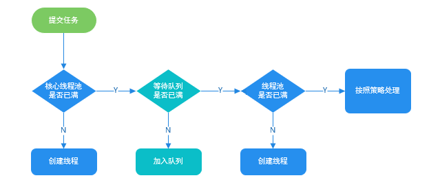

## 线程基础

### 并发编程的三个重要特性

原子性 ：一个或多个操作整体，要么全部成功，要么都不执行。synchronized或原子类
可见性 ：一个线程对主内存的修改可以及时地被其他线程看到。（synchronized,volatile）
有序性 ：代码执行的先后顺序，不会因指令重排而打乱。volatile可以禁止指令进行重排序优化

### 如何尽可能提高多线程并发性能？

尽量减少临界区范围、使用ThreadLocal、减少线程切换、使用读写锁或CopyOnWrite机制

### 创建线程有哪几种方式，如何实现？

①继承Thread类，重写run()方法

②实现Runnable接口，重写run()方法，传入Thread类的构造器中

③实现Callable接口，重写call()方法，借助FutureTask类传入Thread类的构造器中，可获得返回值

④通过线程池创建线程

### runnable 和 callable 有什么区别

- Runnable接口中的run()方法的返回值是void，它做的事情只是纯粹地去执行run()方法中的代码而已；
- Callable接口中的call()方法是有返回值的，需要借助FutureTask

### sleep和wait的区别⭐

- 两者都会让出CPU，主要区别是：wait()会释放锁，而sleep不会
- wait属于Object类，sleep属于Thread类
- wait需要在同步块中使用，sleep可以在任何地方使用
- sleep需要捕获异常、wait不需要
- 不带参数的wait()需要等待其他使用同一把锁的线程调用notify()/notifyAll()才能唤醒，而sleep(long)超时后自动唤醒。

### notify()和 notifyAll()有什么区别

notify只会随机选取一个处于等待池中的线程进入锁池去竞争获取锁的机会。

notifyAll会让所有处于等待池的线程全部进入锁池去竞争获取锁的机会

**锁池EntryList** ：在等待池被唤醒的线程，或试图获取正在被占用的锁的线程，需要在一个地方等待锁释放，这个地方就是锁池。（准备抢锁的池子）

**等待池WaitSet** ：调用了wait方法的线程会释放锁并进入等待池，在等待池的线程不会竞争锁。（休息的池子）

### run()和 start()的区别，可否直接调用 run() ？

new 一个 Thread，线程进入了新建状态。调用 start() 方法，会启动一个线程并使线程进入了就绪状态，当分配到时间片后就可以开始运行了。 start() 会执行线程的相应准备工作，然后自动执行 run() 方法的内容，这是真正的多线程工作。 而直接执行 run() 方法，会把 run 方法当成一个 main 线程下的普通方法去执行，并不会在某个线程中执行它，所以这并不是多线程工作。

**总结： 调用 start 方法方可启动线程并使线程进入就绪状态，而 run 方法只是 thread 的一个普通方法调用，还是在主线程里执行。**

## 线程池相关

### 常见线程池

```java
Executors.newCachedThreadPool()：创建一个线程数量可变线程池，底层SynchronousQueue
Executors.newFixedThreadPool(n)： 创建一个固定线程数的线程池，底层LinkedBlockingQueue
Executors.newSingleThreadExecutor()：创建一个单线程的线程池，底层LinkedBlockingQueue
Executors.newScheduledThreadPool(n)：创建一个线程池，它可安排在给定延迟后运行命令或者定期地执行
```

### 线程池核心参数⭐

| 参数            | 意义                       |
| --------------- | -------------------------- |
| corePoolSize    | 线程池常驻核心线程数       |
| maximumPoolSize | 能够容纳的最大线程数       |
| keepAliveTime   | 空闲线程存活时间           |
| unit            | 存活时间单位               |
| workQueue       | 存放提交但未执行任务的队列 |
| threadFactory   | 创建线程的工厂类           |
| handler         | 等待队列满后的拒绝策略     |

**理解**：线程池的创建参数，就像一个**银行**。

`corePoolSize`就像银行的“**当值窗口**“，比如今天有**2位柜员**在受理**客户请求**（任务）。如果超过2个客户，那么新的客户就会在**等候区**（等待队列`workQueue`）等待。当**等候区**也满了，这个时候就要开启“**加班窗口**”，让其它3位柜员来加班，此时达到**最大窗口**`maximumPoolSize`，为5个。如果开启了所有窗口，等候区依然满员，此时就应该启动”**拒绝策略**“`handler`，告诉不断涌入的客户，叫他们不要进入，已经爆满了。由于不再涌入新客户，办完事的客户增多，窗口开始空闲，这个时候就通过`keepAlivetTime`将多余的3个”加班窗口“取消，恢复到2个”当值窗口“。

### 线程池的拒绝策略⭐

1. ThreadPoolExecutor.AbortPolicy：丢弃任务并抛出RejectedExecutionException异常。
2. ThreadPoolExecutor.DiscardPolicy：丢弃任务，但是不抛出异常。
3. ThreadPoolExecutor.DiscardOldestPolicy：丢弃队列最前面的任务，然后重新提交被拒绝的任务
4. ThreadPoolExecutor.CallerRunsPolicy：由提交任务的线程直接处理该任务

### execute()和submit()的区别

1. **execute()方法用于提交不需要返回值的任务，所以无法判断任务是否被线程池执行成功与否；**
2. **submit()方法用于提交需要返回值的任务。线程池会返回一个 Future 类型的对象，通过这个 Future 对象可以了解任务执行情况**，并且可以通过 Future 的 get() 方法来获取返回值，还可以取消任务执行。底层也是通过 execute() 执行的。

### 为什么要使用线程池⭐

1. 减少创建和销毁线程的次数，每个工作线程都可以被重复利用，可执行多个任务。
2. 可以根据系统的承受能力，调整线程池中工作线程的数目，放置因为消耗过多的内存，而把服务器累趴下

### 线程池满了，往线程池里提交任务会发生什么情况

- 如果你使用的**LinkedBlockingQueue（阻塞队列）**，也就是**无界队列**的话，没关系，**继续添加任务**到阻塞队列中等待执行，因为LinkedBlockingQueue可以近乎认为是一个**无穷大的队列，可以无限存放任务**；如果你使用的是**有界队列**比方说**ArrayBlockingQueue**的话，任务首先会被添加到ArrayBlockingQueue中，**ArrayBlockingQueue满了**，则会使用**拒绝策略RejectedExecutionHandler**处理满了的任务，默认是**AbortPolicy**。
- 线程池的饱和策略：当阻塞队列满了，且没有空闲的工作线程，如果继续提交任务，必须采取一种策略处理该任务，线程池提供了**4种策略**

### ThreadPoolexecutor工作流程



### 线程池的线程数量怎么确定

1. 一般来说，如果是CPU密集型应用，则线程池大小设置为N+1。
2. 一般来说，如果是IO密集型应用，则线程池大小设置为2N+1。
3. 在IO优化中，线程等待时间所占比例越高，需要越多线程，线程CPU时间所占比例越高，需要越少线程。这样的估算公式可能更适合：最佳线程数目 = ((线程等待时间+线程CPU时间)/线程CPU时间 )* CPU数目